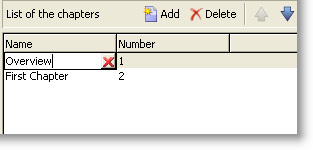

# Inmatningsformulär{#input-forms}

Nedan följer några allmänna principer för användning av indataformulär i Adobe Campaign.

Formulär beskrivs i [det här avsnittet](../../configuration/using/identifying-a-form.md).

## Formulärstruktur {#form-structure}

XML-dokumentet i ett indataformulär måste innehålla **`<form>`** rotelementet med attributen **name** och **namespace** för att fylla i formulärnamnet och dess namnutrymme.

```
<form name="form_name" namespace="name_space">
...
</form>
```

Som standard är ett formulär associerat med dataschemat som har samma namn och namnutrymme. Om du vill associera ett formulär med ett annat namn anger du schematangenten i **elementets attribut för** entitet/schema **`<form>`** .

För att illustrera strukturen för ett indataformulär beskriver vi ett gränssnitt baserat på vårt exempelschema&quot;cus:book&quot;:


Det här är motsvarande indataformulär:

```
<form name="book" namespace="cus" type="contentForm">
  <input xpath="@name"/>
  <input xpath="@date"/>
  <input xpath="@language"/>
</form>
```

Beskrivningen av redigeringselementen börjar med **`<form>`** rotelementet.

En redigeringskontroll anges i ett **`<input>`** -element med **xpath** -attributet som innehåller sökvägen för fältet i dess schema.

**Påminnelse gällande XPath-syntax:**

XPath-språket används i Adobe Campaign för att referera till ett element eller attribut som tillhör ett dataschema.

XPath är en syntax som gör att du kan hitta en nod i trädet i ett XML-dokument.

Elementen anges med sitt namn och attributen anges med namnet före tecknet&quot;@&quot;.

Exempel:

* **@date**: markerar attributet med namnet &quot;date&quot;
* **kapitel/@titel**: markerar &quot;title&quot;-attributet under `<chapter>` elementet
* **../@datum**: väljer datumet från det överordnade elementet för det aktuella elementet

Redigeringskontrollen anpassas automatiskt till motsvarande datatyp och använder den etikett som definierats i schemat.

Som standard visas varje fält på en rad och tar upp allt tillgängligt utrymme, beroende på datatypen.

>[!CAUTION]
>
>Indataformuläret måste referera till ett **type=&quot;contentForm&quot;** -attribut i **`<form>`** -elementet för att automatiskt lägga till den ram som krävs för att innehållet ska kunna matas in.

## Formatering {#formatting}

Ordningen på kontrollerna i förhållande till varandra ser ut som den ordning som används i HTML-tabeller, med möjlighet att dela upp en kontroll i flera kolumner, sammanflätade element eller att ange hur tillgängligt utrymme ska användas. Tänk dock på att formatering endast tillåter fördelning av proportioner. Du kan inte ange fasta dimensioner för ett objekt.

Mer information finns i [det här avsnittet](../../configuration/using/form-structure.md#formatting).

## Kontroller för listtyp {#list-type-controls}

Om du vill redigera ett samlingselement måste du använda en listtypskontroll.

### Kolumnlista {#column-list}

Den här kontrollen visar en redigerbar kolumnlista med ett verktygsfält som innehåller knapparna Lägg till och Ta bort.


```
<input xpath="chapter" type="list">
  <input xpath="@name"/>
  <input xpath="@number"/>
</input>
```

Listkontrollen måste fyllas i med attributet **type=&quot;list&quot;** och sökvägen till listan måste referera till mängdelementet.

Kolumnerna deklareras av de underordnade **`<input>`** elementen i listan.

>[!NOTE]
>
>Uppåt- och nedåtpilarna läggs till automatiskt när attributet **ordered=&quot;true&quot;** har slutförts för samlingselementet i dataschemat.

Som standard justeras verktygsfältsknapparna lodrätt. De kan också justeras vågrätt:



```
<input nolabel="true" toolbarCaption="List of chapters" type="list" xpath="chapter">
  <input xpath="@name"/>
  <input xpath="@number"/>
</input>
```

Attributet **toolbarCaption** tvingar fram vågrät justering av verktygsfältet och fyller i titeln ovanför listan.

>[!NOTE]
>
>Lägg till attributet **nolabel=&quot;true&quot;** för att samlingselementets etikett inte ska visas till vänster om kontrollen.

#### Zooma in en lista {#zoom-in-a-list}

Du kan infoga och redigera listdata i ett separat redigeringsformulär.

Redigera formulär i listor används i följande fall:

* För att underlätta inmatningen av information
* Förekomst av flerradskontroll,
* Kolumnerna i listan innehåller bara huvudfälten och formuläret visar alla fält i samlingselementet.


```
<input nolabel="true" toolbarCaption="List of chapters" type="list" xpath="chapter" zoom="true" zoomOnAdd="true">
  <input xpath="@name"/>
  <input xpath="@number"/>

  <form colcount="2" label="Editing a chapter">
    <input xpath="@name"/>
    <input xpath="@number"/>
    <input colspan="2" xpath="page"/>
  </form>
</input>
```

Definitionen för redigeringsformuläret anges via elementet **`<form>`** under listelementet. Dess struktur är identisk med strukturen för ett indataformulär.

En **[!UICONTROL Detail]** knapp läggs automatiskt till när attributet **zoom=&quot;true&quot;** anges i listdefinitionen. Då kan du öppna redigeringsformuläret på den markerade raden.

>[!NOTE]
>
>Om du lägger till attributet **zoomOnAdd=&quot;true&quot;** anropas redigeringsformuläret när ett element i listan infogas.

### Fliklista {#tab-list}

I den här listan visas redigeringen av samlingselement i form av flikar.


```
<container toolbarCaption="List of chapters" type="notebooklist" xpath="chapter" xpath-label="@name">
  <container colcount="2">
    <input xpath="@name"/>
    <input xpath="@number"/>
    <input colspan="2" xpath="page"/>
  </container>
</container>
```

Listkontrollen måste fyllas i med attributet **type=&quot;notebooklist&quot;** , och listans sökväg måste referera till mängdelementet.

Flikens rubrik innehåller värdet på de data som anges via attributet **xpath-label** .

Redigeringskontrollerna måste deklareras under ett **`<container>`** element som är underordnat listkontrollen.

Använd verktygsfältsknapparna för att lägga till eller ta bort listelement.

>[!NOTE]
>
>Vänster- och högerpilarna läggs till automatiskt när attributet **ordered=&quot;true&quot;** fylls i för samlingselementet i dataschemat.

## Behållare {#containers}

Med behållare kan du gruppera en uppsättning kontroller. De finns via **`<container>`** elementet . De har redan använts för att formatera kontroller i flera kolumner och för att styra tabblistan.

Mer information om behållare och hur du använder dem i indataformulär finns i [det här avsnittet](../../configuration/using/form-structure.md#containers).

## Redigera formulär {#editing-forms}

I redigeringszonen kan du ange XML-innehållet i indataformuläret:


På fliken **[!UICONTROL Preview]** kan du visa indataformuläret:


