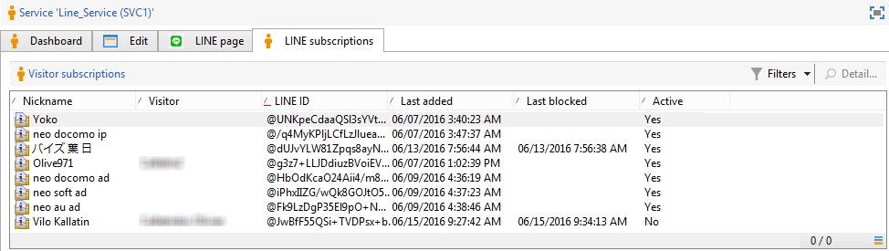
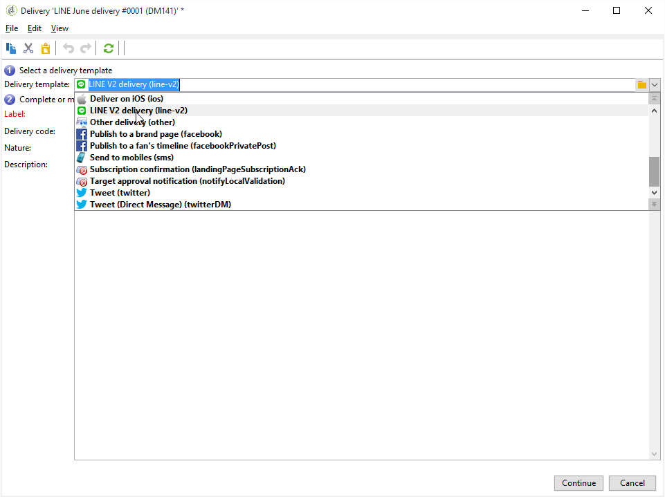
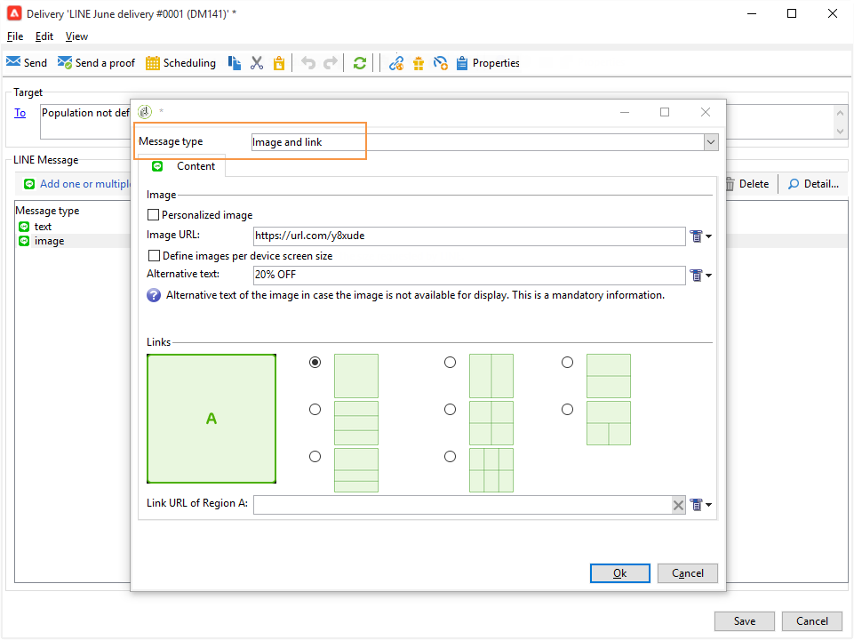

# LINE-kanal{#line-channel}

LINE är ett program för kostnadsfria snabbmeddelanden, röst- och videosamtal som finns på alla smarttelefoner (iPhone, Android, Windows Phone, Blackberry, Nokia) och på datorn. Med Adobe Campaign kan ni skicka LINE-meddelanden.

LINE är endast tillgängligt för installation av lokala eller hanterade tjänster.

LINE kan också kombineras med transaktionsmeddelandemodulen för att skicka realtidsmeddelanden på LINE-appen som är installerad på konsumentmobilenheter. Mer information finns på den här [sidan](../../message-center/using/transactional-messaging-architecture.md#transactional-messaging-and-line).

Avsnitten nedan innehåller information som är specifik för LINE-kanalen. Global information om hur du skapar en leverans finns i[det här avsnittet](../../delivery/using/steps-about-delivery-creation-steps.md).

Stegen för LINE-kanalen är:

1. Skapa en leverans
1. Konfigurera meddelandeinnehållet
1. Välja målpopulation
1. Skicka meddelanden
1. Övervaka leveransen (spårning, karantän, rapporter osv.).

## Konfigurera LINE-kanal {#setting-up-line-channel}

### Skapa ett LINE-konto och ett externt konto {#creating-a-line-account-and-an-external-account-}

>[!NOTE]
>
>Innan du skapar ett LINE-konto och ett externt konto måste du först installera LINE-paketet på din instans. Mer information finns i avsnittet [LINE](../../installation/using/installing-campaign-standard-packages.md#line-package) i installationshandboken.

Du måste först skapa ett LINE-konto så att du sedan kan länka det till Adobe Campaign. Sedan kan du skicka LINE-meddelanden till de användare som har lagt till ditt LINE-konto i mobilprogrammet. Externa konton och LINE-konton kan bara hanteras av plattformens funktionsadministratör.

Information om hur du skapar och konfigurerar ett LINE-konto finns i [https://developers.line.me/](https://developers.line.me/).

Mer information om hur du skapar och konfigurerar en LINE-tjänst finns i [Hantera prenumerationer](../../delivery/using/managing-subscriptions.md).

Slutligen, om du vill skapa ett externt konto på Adobe Campaign:

1. Klicka på fliken **Externa konton** i trädstrukturen **Administration** > **Plattform** .
1. Klicka sedan på ikonen **Nytt** .

   

1. Fyll i fälten **Etikett** och **Internt namn** .
1. I **[!UICONTROL Type]** fältet väljer du Routning och sedan LINE i fältet **Kanal** .
1. Klicka **[!UICONTROL Save]** för att skapa ett externt LINE-konto.
1. Ett **LINE** -anpassningsfält visas sedan under ikonen **Allmänt** och fyller i följande fält:

   

   * **Kanalalias**: visas via ditt LINE-konto på fliken **[!UICONTROL Channels]** > **[!UICONTROL Technical configuration]** .
   * **Kanal-ID**: visas via ditt LINE-konto på fliken **Kanaler** > panelen **** Grundläggande information.
   * **Kanalhemlig nyckel**: visas via ditt LINE-konto på fliken **Kanaler** > panelen **** Grundläggande information.
   * **Åtkomsttoken**: visas via ditt LINE-konto i utvecklarportalen eller genom att klicka på **[!UICONTROL Get access token]** knappen.
   * **Utgångsdatum** för åtkomsttoken: gör att du kan ange förfallodatum för åtkomsttoken.
   * **Prenumerationstjänst**: gör att du kan ange vilka tjänster som användarna ska prenumerera på.

>[!NOTE]
>
>Du måste verifiera att arbetsflödena **[!UICONTROL LINE access token update (updateLineAccessToken)]** och **[!UICONTROL Delete blocked LINE users (deleteBlockedLineUsers)]** arbetsflödena har startats. Klicka i Utforskaren **[!UICONTROL Administration > Production > Technical workflows > LINE workflows]** för att kontrollera arbetsflödenas status.

## Skapa leveransen {#creating-the-delivery}

Så här skapar du en **LINE** -leverans:

>[!NOTE]
>
>Globala koncept för leveransskapande beskrivs i [det här avsnittet](../../delivery/using/steps-about-delivery-creation-steps.md).

1. Markera på **[!UICONTROL Campaigns]** fliken **[!UICONTROL Deliveries]** och klicka sedan på **[!UICONTROL Create]** knappen.
1. I det fönster som visas väljer du **[!UICONTROL LINE V2 delivery]** leveransmall.

   

1. Identifiera leveransen med en etikett, kod och beskrivning. Mer information finns i [det här avsnittet](../../delivery/using/steps-create-and-identify-the-delivery.md#identifying-the-delivery).
1. Klicka **[!UICONTROL Continue]** för att skapa leveransen.

## Definiera innehållet {#defining-the-content}

Om du vill definiera innehållet i en LINE-leverans måste du först lägga till meddelandetypen till leveransen. Varje LINE-leverans kan innehålla upp till 5 meddelanden.

Du kan välja mellan två meddelandetyper:

* Textmeddelande
* Bild och länk

### Konfigurera leverans av textmeddelande {#configuring-a-text-message-delivery}

Ett **textmeddelande** (LINE delivery) är ett meddelande som skickas till mottagarna i textformuläret.

Konfigurationen för den här meddelandetypen liknar konfigurationen för **texten** i ett e-postmeddelande. Mer information finns på den här [sidan](../../delivery/using/defining-the-email-content.md#message-content).

### Konfigurera en bild- och länkleverans {#configuring-an-image-and-link-delivery}

En **bild- och länkleverans** är ett meddelande som skickas till mottagarna i form av en bild som kan innehålla en eller flera URL:er.

Du kan använda:

* en **personaliserad bild**,

   >[!NOTE]
   >
   >Du kan använda variabeln **%SIZE%** : Med den här variabeln kan du optimera bildvisningen enligt skärmstorleken för mottagarens mobila enhet.

   

* en **bild-URL**,

   

   Med bild-URL:erna kan du använda olika bildupplösningar för att optimera synligheten för leverans på mobila enheter. Endast bilder med samma höjd och bredd stöds.

   Bilder kan definieras enligt skärmstorleken:

   * 1040px
   * 700px
   * 460px
   * 300px
   * 240px
   >[!NOTE]
   >
   >Storleken 1 040 × 1 040 px är obligatorisk för varje LINE-bild med länk.

   Sedan måste du lägga till alternativ text som visas på mottagarens mobila enhet.

* och **[!UICONTROL Links]**.

   

   I det här avsnittet kan du välja mellan olika layouter som delar upp bilden i flera klickbara områden. **[!UICONTROL Links]** Sedan kan du tilldela var och en av dem en dedikerad länk.

>[!NOTE]
>
>Med syntaxen &lt;%@ include option=&#39;NmsServer_URL&#39; %>/webApp/APP3?id=&lt;%=escapeUrl(cryptString(visitor.id)%> kan du inkludera en länk till ett webbprogram i ett LINE-meddelande.

### Rekommendationer {#recommendations}

* När du skickar en LINE-leverans till en ny mottagare för första gången måste du lägga till det officiella LINE-meddelandet om användningsvillkoren och samtycke i leveransen. Det officiella meddelandet finns på följande länk: [https://terms.line.me/OA_privacy/](https://terms.line.me/OA_privacy/sp?lang=fr).

## Välja målpopulation {#selecting-the-target-population}

Att välja mottagare för en LINE-leverans liknar att definiera mottagare för e-postleverans. Mer information finns i [Identifiera målpopulationer](../../delivery/using/steps-defining-the-target-population.md).

Målgruppsanpassning utförs på **besökare**.

## Skicka meddelanden {#sending-messages}

När leveransen har skapats och konfigurerats på rätt sätt kan du skicka den till det mål som definierades tidigare.

Att skicka radleveranser liknar att skicka e-postmeddelanden. Mer information om hur du skickar meddelanden finns i [Skicka meddelanden](../../delivery/using/sending-messages.md).

## Åtkomst till rapporter {#accessing-reports}

Du kan visa rapporter om LINE-tjänsten genom att klicka **[!UICONTROL Profiles and Targets > Services and Subscriptions > LINE]** i Utforskaren. Klicka sedan på **[!UICONTROL Reports]** ikonen i LINE-tjänsten.

Om du vill visa rapporter om radleveranser klickar du på **[!UICONTROL Campaign Management > Deliveries]** och väljer önskad leverans. Spårningsrapporterna visar klickfrekvensen. LINE tar inte hänsyn till den öppna tariffen.

## Exempel: skapa och skicka ett personligt LINE-meddelande {#example--create-and-send-a-personalized-line-message}

I det här exemplet ska vi skapa och konfigurera ett textmeddelande och en bild som innehåller data som ska anpassas efter mottagaren.

1. Skapa LINE-leveransen genom att klicka på **[!UICONTROL Create]** knappen på **[!UICONTROL Campaign]** fliken.

   

1. Välj **[!UICONTROL LINE V2 delivery]** leveransmall och ge leveransen ett namn.

   

1. Välj målpopulation i konfigurationsfönstret för leveransen.

   

1. Klicka **[!UICONTROL Add]** för att skapa meddelandet och markera **[!UICONTROL Message type]**.

   Här vill vi först skapa ett textmeddelande.

   

1. Placera markören på den plats där du vill infoga den anpassade texten och klicka sedan på listruteikonen **[!UICONTROL Visitor > First name]**.

   

1. Följ samma procedur för att lägga till en bild och välja **[!UICONTROL Image and links]** i **[!UICONTROL Message type]** listrutan.

   Lägg till din bild-URL.

   

1. I **[!UICONTROL Links]** avsnittet väljer du den layout som ska dela upp bilden i flera klickbara områden.
1. Tilldela en URL till varje område i bilden.

   

1. Spara leveransen och klicka sedan på **[!UICONTROL Send]** för att analysera och skicka den till målet.

   Leveransen skickas till målet.

   
