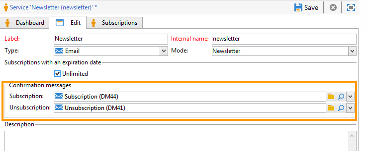

# Hantera prenumerationer{#managing-subscriptions}

## Om informationstjänster {#about-information-services}

En informationstjänst omfattar

* Registrering och prenumeration (deltagande),
* Avregistrering, frivillig avregistrering (avanmälan) eller automatisk avprenumeration (tidsbegränsad tjänst, t.ex. ett proverbjudande).
* Bekräftelsemekanismer för prenumeration och avprenumeration (enkla mekanismer med bekräftelse, dubbel anmälan osv.),
* Spårning av prenumerationshistorik.

Som standard innehåller dessa tjänster särskilda statistiska rapporter: abonnemangsspårning, lojalitetsnivå, trender för avanmälan osv.

För e-postmeddelanden genereras de obligatoriska länkarna för att avsluta prenumerationen automatiskt, och hela processen för att anmäla sig/avanmäla sig är helt automatiserad, med historikspårning för att garantera att gällande regler följs fullt ut.

Det finns tre olika sätt att prenumerera på/ta bort abonnemang:

1. manuell
1. genom import (endast prenumeration),
1. via ett webbformulär

>[!NOTE]
>
>Ett exempel på hur du skapar ett prenumerationsformulär med dubbel anmälan finns i [det här avsnittet](../../web/using/use-cases--web-forms.md#create-a-subscription--form-with-double-opt-in).

## Skapa en informationstjänst {#creating-an-information-service}

Du kan skapa och hantera prenumerationer på informationstjänster med tillhörande bekräftelsemeddelanden eller automatiska leveranser till prenumeranter.

Om du vill få åtkomst till informationstjänstkartan öppnar du **[!UICONTROL Profiles and Targets]** och klicka på **[!UICONTROL Services and Subscriptions]** länk.

Om du vill redigera en befintlig tjänst klickar du på dess namn. Om du vill skapa en tjänst klickar du på **[!UICONTROL Create]** ovanför listan.

* Ange namnet på tjänsten i **[!UICONTROL Label]** och välj leveranskanal: e-post, mobilappar, Facebook, Twitter och mobilappar.

   >[!NOTE]
   >
   >Prenumerationer på facebook och Twitter beskrivs i [det här avsnittet](../../social/using/about-social-marketing.md). Prenumerationer på mobilapplikationer beskrivs i [Om mobilappskanal](about-mobile-app-channel.md).

* För en tjänst av typen E-post väljer du **Leveransläge**. Möjliga lägen är: **[!UICONTROL Newsletter]** eller **[!UICONTROL Viral]**.
* Du kan skicka **bekräftelsemeddelanden** för en prenumeration eller en prenumeration. Välj de leveransmallar som ska användas för att skapa motsvarande leveranser från **[!UICONTROL Subscription]** och **[!UICONTROL Unsubscription]** fält. Dessa mallar måste konfigureras med en **[!UICONTROL Subscription]** målmappning för typ, utan ett definierat mål. Se avsnitt [Om e-postkanal](about-email-channel.md).
* Som standard är prenumerationerna obegränsade. Du kan avmarkera **[!UICONTROL Unlimited]** för att definiera tjänstens giltighetsperiod. Längden kan anges i dagar (**[!UICONTROL d]** ) eller månader (**[!UICONTROL m]** ).

När tjänsten har sparats läggs den till i listan Tjänster och prenumerationer: Klicka på namnet för att redigera det. Flera flikar är tillgängliga. The **[!UICONTROL Subscriptions]** kan du titta i listan över prenumeranter på informationstjänsten (**[!UICONTROL Active subscriptions]** eller prenumerations-/prenumerationshistorik (**[!UICONTROL History]** -fliken). Du kan också lägga till och ta bort prenumeranter på den här fliken. Se [Lägga till och ta bort prenumeranter](#adding-and-deleting-subscribers).

The **[!UICONTROL Detail...]** kan du använda för att kontrollera prenumerationsegenskaperna för den valda mottagaren.

Du kan ändra prenumerationsegenskaperna för en mottagare.

På kontrollpanelen klickar du på **[!UICONTROL Reports]** för att spåra prenumerationer: förändringar i abonnemangsnivåer, totalt antal abonnenter osv. På den här fliken kan du arkivera rapporter och se historik.

## Lägga till och ta bort prenumeranter {#adding-and-deleting-subscribers}

Från **[!UICONTROL Subscriptions]** klicka på en informationstjänsts flik **[!UICONTROL Add]** för att lägga till prenumeranter. Du kan också högerklicka på listan med prenumeranter och välja **[!UICONTROL Add]**. Markera i vilken mapp profilerna som ska prenumereras finns, markera profilerna som ska prenumereras och klicka sedan på **[!UICONTROL OK]** att validera.

Om du vill ta bort prenumeranter markerar du dem och klickar på **[!UICONTROL Delete]**. Du kan även högerklicka på prenumerantlistan och välja **[!UICONTROL Delete]**.

I båda fallen kan du skicka ett bekräftelsemeddelande till de berörda användarna om en leveransmall för att säga upp prenumerationen har bifogats till tjänsten (se [Skapa en informationstjänst](#creating-an-information-service)). Med en varning kan du validera leveransen eller inte:

Se [Prenumerations- och avprenumerationsfunktioner](#subscription-and-unsubscription-mechanisms).

## Leverera till abonnenterna av en tjänst {#delivering-to-the-subscribers-of-a-service}

Om du vill leverera till abonnenterna av en informationstjänst kan du rikta abonnenterna till den berörda informationstjänsten, som i följande exempel:

>[!CAUTION]
>
>Målmappningen måste vara **[!UICONTROL Subscriptions]**.

Markera **[!UICONTROL Subscribers of an information service]** och klicka på **[!UICONTROL Next]**.

Välj målinformationstjänsten och klicka på **[!UICONTROL Finish]**.

The **[!UICONTROL Preview]** kan du visa en lista över prenumeranter på den valda informationstjänsten.

## Prenumerations- och avprenumerationsfunktioner {#subscription-and-unsubscription-mechanisms}

Du kan ställa in prenumerations- och avprenumerationsmekanismer för att automatisera processerna och prenumerationshanteringen.

>[!NOTE]
>
>Du kan skicka ett bekräftelsemeddelande till nya prenumeranter.\
>Innehållet i det här meddelandet definieras i informationstjänstkonfigurationen via **[!UICONTROL Subscription]** eller **[!UICONTROL Unsubscription]** fält.
>
>Bekräftelsemeddelandena skapas med de leveransmallar som anges i dessa fält. Dessa målmappningar måste vara **[!UICONTROL Subscriptions]**.

### Prenumerera på en tjänst {#subscribing-a-recipient-to-a-service}

Om du vill registrera mottagare för en informationstjänst kan du:

* Lägg till tjänsten manuellt: för att göra detta, från **[!UICONTROL Subscriptions]** flik i deras profil, klicka på **[!UICONTROL Add]** och välja ut den berörda informationstjänsten.

   Mer information finns i avsnittet om profilredigering i [det här avsnittet](../../platform/using/editing-a-profile.md).

* Prenumerera automatiskt på en uppsättning mottagare för den här tjänsten. Listan med mottagare kan komma från en filtreringsåtgärd, en grupp, en mapp, en import eller en direktmarkering med hjälp av musen. Om du vill prenumerera på dessa mottagare markerar du profilerna och högerklickar. Välj **[!UICONTROL Actions > Subscribe selection to a service...]**, välj den berörda tjänsten och starta åtgärden.
* Importera mottagare och prenumerera automatiskt på en informationstjänst. Det gör du genom att välja den berörda tjänsten i det sista steget i importguiden.

   Mer information om detta finns i [det här avsnittet](../../platform/using/executing-import-jobs.md).

* Använd ett webbformulär så att mottagarna kan prenumerera på en tjänst.

   Mer information om detta finns i [det här avsnittet](../../web/using/about-web-applications.md).

* Skapa ett målarbetsflöde och använda en **[!UICONTROL Subscription service]** box.

   

   Arbetsflöden och hur de används beskrivs i [det här avsnittet](../../workflow/using/about-workflows.md).

### Avbeställa en mottagares prenumeration på en tjänst {#unsubscribing-a-recipient-from-a-service}

#### Manuellt avabonnemang {#manual-unsubscribing}

e-postleveranser måste innehålla en länk för att avsluta prenumerationen enligt lag. Mottagarna kan klicka på den här länken för att uppdatera sin profil och uteslutas från målen för framtida leveranser.

Standardlänken för att avbryta prenumerationen infogas via den sista knappen i verktygsfältet i innehållsredigeraren som finns i leveransguiden (se [Om personalisering](about-personalization.md)). När mottagaren klickar på den här länken läggs profilen till i blockeringslista (avanmälan), vilket innebär att mottagaren inte längre kommer att omfattas av någon leveransåtgärd.

Mottagarna kan dock välja att avbryta prenumerationen på en tjänst utan att avbryta prenumerationen på alla tjänster. Om du vill tillåta detta kan du använda ett webbformulär (se [det här avsnittet](../../web/using/adding-fields-to-a-web-form.md#subscription-checkboxes)) eller infoga en personlig länk för avprenumeration (se [Personaliseringsblock](personalization-blocks.md)).

Du kan också avbeställa en mottagares prenumeration manuellt från mottagarprofilen. Om du vill göra det klickar du på **[!UICONTROL Subscriptions]** Välj den eller de berörda informationstjänsterna och klicka på **[!UICONTROL Delete]**.

Slutligen kan du avbeställa en eller flera mottagare via den aktuella informationstjänsten. Om du vill göra det klickar du på **[!UICONTROL Subscriptions]** välj de berörda mottagarna och klicka på **[!UICONTROL Delete]**.

#### Automatisk avprenumeration {#automatic-unsubscription}

En informationstjänst kan ha en begränsad varaktighet. Mottagarna kommer att avbeställa prenumerationen automatiskt när giltighetsperioden har gått ut. Den här perioden anges i **[!UICONTROL Edit]** -fliken i tjänstegenskaperna. Den uttrycks i dagar.

Du kan också skapa ett avabonnemangsarbetsflöde för en population. Om du vill göra det följer du samma procedur som för ett prenumerationsarbetsflöde, men väljer **[!UICONTROL Unsubscription]** alternativ. Se [Prenumerera på en tjänst](#subscribing-a-recipient-to-a-service).

### Prenumerationsspårning {#subscriber-tracking}

Du kan spåra ändringar i prenumerationer på informationstjänster med hjälp av **[!UICONTROL Reports]** på kontrollpanelen.

