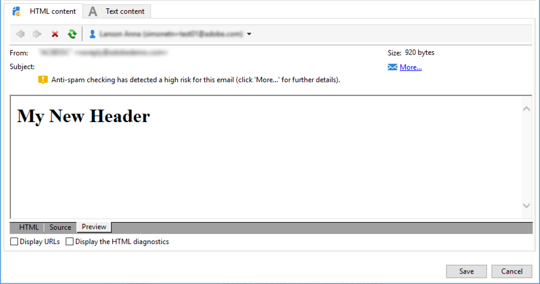

# Personaliseringsblock{#personalization-blocks}

Personaliseringsblock är dynamiska, personaliserade och innehåller en specifik rendering som du kan infoga i leveranserna. Du kan till exempel lägga till en logotyp, ett gratulationsmeddelande eller en länk till en spegelsida. Se [Infoga personaliseringsblock](#inserting-personalization-blocks).

>[!NOTE]
>
>Personaliseringsblock finns också tillgängliga från **[!UICONTROL Digital Content Editor (DCE)]** . Mer information finns på [den här sidan](../../web/using/editing-content.md#inserting-a-personalization-block).

Personaliseringsblock nås via noden **[!UICONTROL Resources > Campaign Management > Personalization blocks]** i Adobe Campaign Explorer. Flera block är tillgängliga som standard (se [Inkörda anpassningsblock](#out-of-the-box-personalization-blocks)).

Ni kan definiera nya block som gör att ni kan optimera er leveranspersonalisering. Mer information finns i [Definiera anpassade personaliseringsblock](#defining-custom-personalization-blocks).

## Infoga personaliseringsblock {#inserting-personalization-blocks}

Följ stegen nedan om du vill infoga ett anpassningsblock i ett meddelande:

1. I innehållsredigeraren i leveransguiden klickar du på ikonen för det anpassade fältet och väljer **[!UICONTROL Include]** menyn.
1. Välj ett anpassningsblock i listan (listan visar de 10 senast använda blocken) eller klicka på **[!UICONTROL Other...]** -menyn för att komma åt den fullständiga listan.

   

1. Menyn **[!UICONTROL Other...]** ger åtkomst till alla färdiga och anpassade anpassningsblock (se [Körklara personaliseringsblock](#out-of-the-box-personalization-blocks) och [Definiera anpassade personaliseringsblock](#defining-custom-personalization-blocks)).

   

1. Personaliseringsblocket infogas sedan som ett skript. Den anpassas automatiskt till mottagarprofilen när personalisering genereras.

   

1. Klicka på **[!UICONTROL Preview]** fliken och välj en mottagare för att visa personaliseringen.

   

Du kan inkludera källkoden för ett personaliseringsblock i leveransinnehållet. Om du vill göra det markerar du **[!UICONTROL Include the HTML source code of the block]** den.


HTML-källkoden infogas i leveransinnehållet. Personaliseringsblocket visas till exempel **[!UICONTROL Greetings]** nedan:


## Exempel på personaliseringsblock {#personalization-blocks-example}

I det här exemplet skapar vi ett e-postmeddelande där vi använder personaliseringsblock för att göra det möjligt för mottagaren att visa spegelsidan, dela nyhetsbrevet i sociala nätverk och avbryta prenumerationen på framtida leveranser.

För att göra detta måste vi infoga följande personaliseringsblock:

* **[!UICONTROL Link to mirror page]** .
* **[!UICONTROL Social network sharing links]** .
* **[!UICONTROL Unsubscription link]** .

>[!NOTE]
>
>Mer information om generering av spegelsidor finns i [Generera spegelsidan](../../delivery/using/sending-messages.md#generating-the-mirror-page).

1. Skapa en ny leverans eller öppna en befintlig e-posttypsleverans.
1. I leveransguiden klickar du **[!UICONTROL Subject]** för att redigera meddelandets ämne och ange ett ämne.
1. Infoga personaliseringsblocken i meddelandetexten. Det gör du genom att klicka i meddelandeinnehållet, klicka på ikonen för anpassat fält och välja **[!UICONTROL Include]** menyn.
1. Markera det första blocket som ska infogas. Förnya proceduren och inkludera de två andra blocken.

   

1. Klicka på **[!UICONTROL Preview]** fliken för att visa personaliseringsresultatet. Du måste välja en mottagare för att kunna visa mottagarens meddelande.

   

1. Bekräfta att blockinnehållet visas korrekt.

## Körklara personaliseringsblock {#out-of-the-box-personalization-blocks}

En lista med personaliseringsblock är som standard tillgänglig för att hjälpa dig att anpassa innehållet i meddelandet.

>[!NOTE]
>
>Listan med personaliseringsblock beror på vilka moduler och alternativ som har installerats på din instans.


* **[!UICONTROL Greetings]** : infogar hälsningar med mottagarens namn. Exempel: &quot;Hej John Doe.&quot;
* **[!UICONTROL Insert logo]** : infogar en logotyp som inte finns i rutan och som har definierats när instansen konfigureras.
* **[!UICONTROL Powered by Adobe Campaign]** : infogar logotypen&quot;Powered by Adobe Campaign&quot;.
* **[!UICONTROL Mirror page URL]** : infogar spegelsidans URL, vilket gör att leveransdesigners kan kontrollera länken.

   >[!NOTE]
   >
   >Mer information om generering av spegelsidor finns i [Generera spegelsidan](../../delivery/using/sending-messages.md#generating-the-mirror-page).

* **[!UICONTROL Link to mirror page]** : infogar en länk till spegelsidan: &quot;Om du inte kan visa det här meddelandet korrekt klickar du här&quot;.
* **[!UICONTROL Unsubscription link]** : infogar en länk som gör det möjligt att avbryta prenumerationen på alla leveranser (svartlista).
* **[!UICONTROL Formatting function for proper nouns]** : genererar funktionen **[!UICONTROL toSmartCase]** JavaScript, som ändrar den första bokstaven i varje ord till versaler. Det här blocket måste infogas i källkoden för leveransen, i **`<script>...</script>`** -taggar.

   I exemplet nedan används funktionen för att ersätta elementet&quot;Min rubrik&quot; med&quot;Min nya rubrik&quot; med versaler vid varje ord:

   ```
   <h1 id="sample">My header</h1>
   <script><%@ include view='toSmartCase'%>;
   document.getElementById("sample").innerHTML = toSmartCase("My new header");
   </script>
   ```

   

* **[!UICONTROL Registration page URL]** : infogar en prenumerations-URL (se [Om tjänster och prenumerationer](../../delivery/using/about-services-and-subscriptions.md)).
* **[!UICONTROL Registration link]** : infogar en prenumerationslänk. som har definierats när instansen konfigureras.
* **[!UICONTROL Registration link (with referrer)]** : infogar en prenumerationslänk som gör det möjligt att identifiera besökaren och leveransen. Länken har definierats när instansen konfigureras.

   >[!NOTE]
   >
   >Det här blocket kan bara användas för leveranser till besökare.

* **[!UICONTROL Registration confirmation]** : infogar en länk som bekräftar prenumerationen.
* **[!UICONTROL Social network sharing links]** : infogar knappar som gör att mottagaren kan dela en länk till det spegelvända sidinnehållet med e-postklienten, Facebook, Twitter, Google + och LinkedIn (se [Viral marketing: till en vän](../../delivery/using/viral-and-social-marketing.md#viral-marketing--forward-to-a-friend)).
* **[!UICONTROL Style of content emails]** och **[!UICONTROL Notification style]** : generera kod som formaterar ett e-postmeddelande med fördefinierade HTML-format. Dessa block måste infogas i källkoden för leveransen, i avsnittet **[!UICONTROL ...]** , i **`<style>...</style>`** -taggar.
* **[!UICONTROL Offer acceptance URL in unitary mode]** : infogar en URL som gör det möjligt att ange ett interaktionserbjudande till **[!UICONTROL Accepted]** (se [det här avsnittet](../../interaction/using/offer-analysis-report.md)).

## Definiera anpassade personaliseringsblock {#defining-custom-personalization-blocks}

Du kan definiera nya anpassningsfält som ska infogas från den anpassade fältikonen via **[!UICONTROL Include...]** menyn. Dessa fält definieras i personaliseringsblock.

Om du vill skapa ett personaliseringsblock går du till Utforskaren och utför följande steg:

1. Klicka på **[!UICONTROL Resources > Campaign Management > Personalization blocks]** noden.
1. Högerklicka på listan med block och välj **[!UICONTROL New]** .
1. Fyll i inställningarna för anpassningsblocket:

   

   * Ange blockets etikett. Den här etiketten visas i fönstret för infogning av anpassningsfält.
   * Välj **[!UICONTROL Visible in the customization menus]** att göra det här blocket tillgängligt från ikonen för infogning av anpassningsfält.
   * Om det behövs väljer du **[!UICONTROL The content of the personalization block depends upon the format]** att definiera två separata block för e-post i HTML-format och för e-post i textformat.

      Två flikar visas sedan i det nedre avsnittet av redigeraren (HTML-innehåll och textinnehåll) för att definiera motsvarande innehåll.

      

   * Ange innehållet (i HTML, text, JavaScript osv.) av anpassningsblocken och klicka på **[!UICONTROL Save]** .
