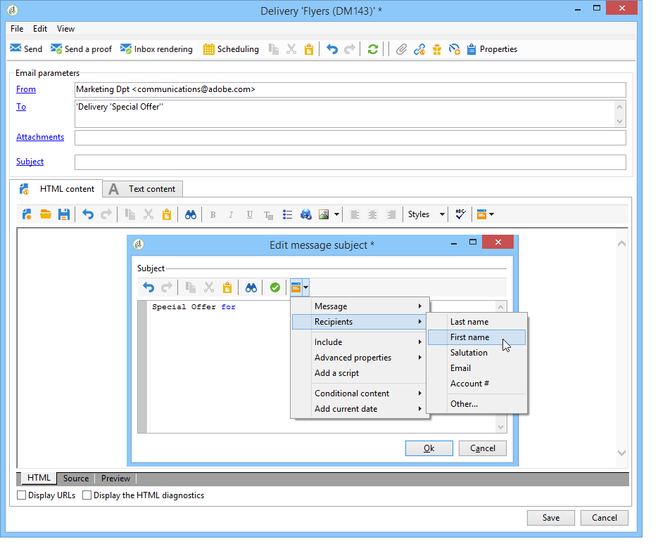

# Anpassningsfält{#personalization-fields}

Anpassningsfält används för personalisering på första nivån av innehållet i levererade meddelanden. Fälten som du infogar i ett huvudinnehåll visar var data från den valda datakällan ska infogas.

I anpassningsfältet med syntaxen **&lt;%= mottagare.LastName %>** anges till exempel att namnet på mottagaren ska infogas i databasen (mottagartabellen).

>[!NOTE]
>
>Innehållet i anpassningsfält får inte vara längre än 1 024 tecken.

## Datakällor {#data-sources}

Anpassningsfält kan komma från två typer av datakällor, beroende på valt leveranssätt:

* Adobe Campaign-databasen är datakällan. Detta är det vanligaste fallet, till exempel&quot;fält för mottagaranpassning&quot;. Det här är alla fält som definieras i mottagartabellen, oavsett om det är standardfält (vanligtvis: efternamn, förnamn, adress, ort, födelsedatum osv.) eller användardefinierade fält.
* En extern fil är datakällan. Detta är alla fält som definieras i kolumnerna i filen som presenteras som indata vid en leverans med hjälp av data som hittas i en extern fil.

>[!NOTE]
>
>En Adobe Campaign-personaliseringstagg har alltid följande format **&lt;%=table.field%>**.

## Infoga ett anpassningsfält {#inserting-a-personalization-field}

Om du vill infoga anpassningsfält klickar du på listruteikonen som är tillgänglig från redigeringsfält för rubrik, ämne eller meddelandetext.

När du har valt en datakälla (mottagarfält eller filfält), kommer infogningen att ha formen av ett kommando som tolkas av Adobe Campaign och ersätts av fältvärdet för en viss mottagare. Den fysiska ersättningen kan sedan visas på **[!UICONTROL Preview]** fliken.

## Exempel på anpassningsfält {#personalization-fields-example}

Vi skapar ett e-postmeddelande där vi först infogar namnet på mottagaren och sedan lägger till datumet då profilen skapades i meddelandets brödtext. Så här gör du:

1. Skapa en ny leverans eller öppna en befintlig e-posttypsleverans.
1. I leveransguiden klickar du **[!UICONTROL Subject]** för att redigera meddelandets ämne och ange ett ämne.
1. Skriv &quot; **[!UICONTROL Special offer for]** &quot; och använd knappen i verktygsfältet för att infoga ett anpassningsfält. Välj **[!UICONTROL Recipients>Title]**.

   

1. Upprepa åtgärden för att infoga namnet på mottagaren. Infoga mellanslag mellan alla anpassningsfält.
1. Klicka **[!UICONTROL OK]** för att validera.
1. Infoga personaliseringen i meddelandetexten. Det gör du genom att klicka i meddelandeinnehållet och klicka på fältinfogningsknappen.
1. Välj **[!UICONTROL Recipient>Other...]**.

   

1. Markera fältet med den information som ska visas och klicka på **[!UICONTROL OK]**.

   

1. Klicka på **[!UICONTROL Preview]** fliken för att visa personaliseringsresultatet. Du måste välja en mottagare för att kunna visa mottagarens meddelande.

   

   >[!NOTE]
   >
   >När en leverans ingår i ett arbetsflöde kan du använda data från den tillfälliga arbetsflödestabellen. Dessa data grupperas på **[!UICONTROL Target extension]** menyn. For more on this, refer to [this section](../../workflow/using/data-life-cycle.md#target-data).

## Optimera personalisering {#optimizing-personalization}

Ni kan optimera personaliseringen med ett dedikerat alternativ: **[!UICONTROL Prepare the personalization data with a workflow]**, som finns på fliken **[!UICONTROL Analysis]** i leveransegenskaperna. Mer information om hur du analyserar leveransen finns i [det här avsnittet](../../delivery/using/steps-validating-the-delivery.md#analyzing-the-delivery).

Under leveransanalysen skapar och kör det här alternativet automatiskt ett arbetsflöde som lagrar alla data som är länkade till målet i en tillfällig tabell, inklusive data från tabeller som är länkade i FDA.

Om du markerar det här alternativet kan leveransanalysens prestanda förbättras avsevärt när mycket data bearbetas, särskilt om personaliseringsdata kommer från en extern tabell via FDA. Mer information finns i [Åtkomst till en extern databas (FDA)](../../platform/using/additional-options.md#optimizing-email-personalization-with-external-data).

Om du till exempel får prestandaproblem när du levererar till ett stort antal mottagare och använder många personaliseringsfält och/eller personaliseringsblock i innehållet i dina meddelanden, kan det här alternativet snabba upp hanteringen av personaliseringen och därmed leveransen av dina meddelanden.

Följ stegen nedan om du vill använda det här alternativet:

1. Skapa en kampanj. For more on this, refer to [this section](../../campaign/using/setting-up-marketing-campaigns.md#creating-a-campaign).
1. Lägg till en **[!UICONTROL Targeting and workflows]** Query **-aktivitet i arbetsflödet på fliken** i kampanjen. Mer information om hur du använder den här aktiviteten finns i [det här avsnittet](../../workflow/using/query.md).
1. Lägg till en **[!UICONTROL Email delivery]** aktivitet i arbetsflödet och öppna den. Mer information om hur du använder den här aktiviteten finns i [det här avsnittet](../../workflow/using/delivery.md).
1. Gå till fliken **[!UICONTROL Analysis]** i **[!UICONTROL Delivery properties]** och välj **[!UICONTROL Prepare the personalization data with a workflow]** alternativet.

   

1. Konfigurera leveransen och starta arbetsflödet för att starta analysen.

När analysen är klar lagras personaliseringsdata i ett temporärt register via ett tillfälligt tekniskt arbetsflöde som skapas direkt under analysen.

Det här arbetsflödet visas inte i Adobe Campaign-gränssnittet. Det är bara tänkt att vara ett tekniskt sätt att snabbt lagra och hantera personaliseringsdata.

När analysen är klar går du till arbetsflödet **[!UICONTROL Properties]** och väljer **[!UICONTROL Variables]** fliken. Där ser du namnet på den temporära tabellen som du kan använda för att göra ett SQL-anrop för att visa de ID som den innehåller.

## Tidsgränsen för personalisering har uppnåtts {#timing-out-personalization}

Om du vill förbättra leveransskyddet kan du ange en tidsgräns för personaliseringsfasen.

Välj ett maximalt värde i sekunder på fliken **[!UICONTROL Delivery]** i **[!UICONTROL Delivery properties]** dialogrutan för **[!UICONTROL Maximum personalization run time]** alternativet.

Om personaliseringsfasen överskrider den maximala tiden som du anger i det här fältet avbryts processen under förhandsgranskningen eller sändningen och ett felmeddelande visas och leveransen misslyckas.

Standardvärdet är 5 sekunder.

Om du ställer in det här alternativet på 0 kommer det inte att finnas någon tidsgräns för personaliseringsfasen.