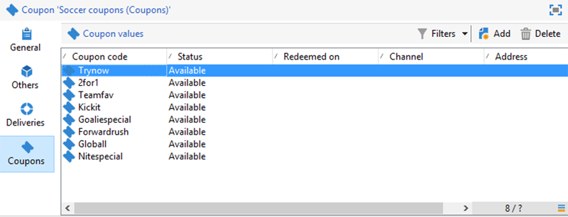
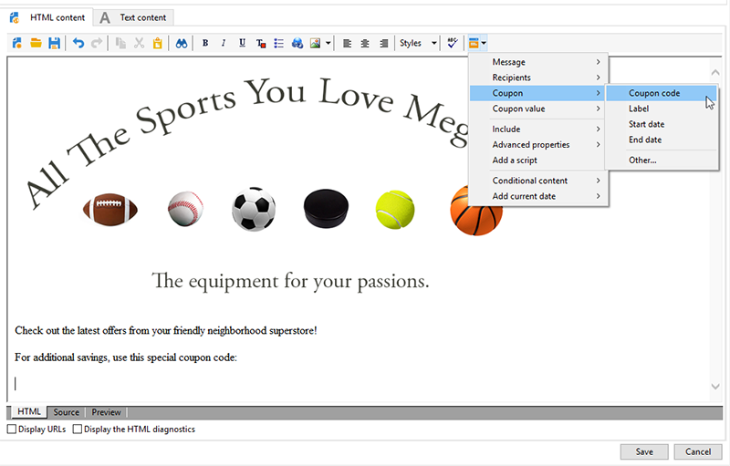

# Personaliserade kuponger{#personalized-coupons}

Genom att lägga till kuponger i leveranserna kan mottagarna få bättre värde för produkter och tjänster. Du kan använda Campaign-kupongmodulen för att skapa en uppsättning kuponger som du förväntar dig ska läggas till kommande marknadsföringserbjudanden. När du är redo att skapa en leverans tilldelar du tillämpliga kuponger. Eftersom kuponger är giltiga för en viss period är en tilldelad kupong unikt kopplad till leveransmeddelandet. Dessutom bekräftar Campaign att det finns tillräckligt många kuponger för antalet meddelanden innan leveransen skickas.

>[!NOTE]
>
>Kuponghantering är ett paket som måste installeras. Kontrollera att du har kuponghantering genom att markera **[!UICONTROL Administration > Configuration > Package management > Installed packages.]**
>
>Kupongdata kan importeras och exporteras med CSV- och XML-format. Mer information om import och export finns i [det här avsnittet](../../platform/using/generic-imports-and-exports.md).

## Skapa en kupong {#creating-a-coupon}

Med kupongmodulen får du två alternativ när du skapar kuponger:

* **Anonym**: En allmän kupong för valda mottagare eller listor med mottagare.
* **Enskilt**: En anpassad kupong för utvalda mottagare.

Innan du följer stegen nedan bör du kontrollera vilken typ av kupong du vill skapa.

1. Gå till Campaign-trädet **[!UICONTROL Resources > Campaign management > Coupons]**.

   

1. Klicka på **[!UICONTROL New]** knappen.
1. Ange namnet på kupongen i **[!UICONTROL Label]** fältet. En unik kod har angetts automatiskt i **[!UICONTROL Coupon code]**. Du kan behålla koden eller ange en ny.

   

1. Välj **[!UICONTROL Start date]** och **[!UICONTROL End date]** ange den period då kupongen är giltig.
1. I **[!UICONTROL Coupon type]** väljer du Anonym eller Individuell.

   **[!UICONTROL Anonymous coupons]** : En anonym kupong är identisk för alla mottagare. Bekräfta att Anonym är valt på **kupongtypmenyn** och klicka på **Spara** för att generera kupongen.

   **[!UICONTROL Individual coupons]** : En enskild kupong kan anpassas ytterligare med ytterligare kupongkoder. Till exempel skapas en individuell kupong för försäljning i en sportutrustningsbutik. Listan över mottagare är dock lång och de delar inte samma entusiasm för en enda sport. Du kan lägga till kodnamn för den enskilda kupongen baserat på en sport (t.ex. fotboll, fotboll, baseboll osv.) och skicka varje kod till rätt mottagare.

   1. När du väljer Individual visas en ny flik, Kuponger, längst ned till vänster. Gå till **[!UICONTROL Coupons]** fliken och klicka på **[!UICONTROL Add]**.
   1. Ange en unik kod för den enskilda kupongen när du uppmanas till det i popup-fönstret.
   1. Klicka **[!UICONTROL Save]** för att generera kupongen.
   Mer information om fliken Kuponger finns i [Konfigurera enskilda kuponger](#configuring-individual-coupons).

   >[!NOTE]
   >
   >Enskilda kuponger kan importeras i grupp. Mer information om import och export finns i [det här avsnittet](../../platform/using/generic-imports-and-exports.md).

### Konfigurera enskilda kuponger {#configuring-individual-coupons}

Fliken Kuponger är bara tillgänglig med enskilda kuponger. När en kupong har associerats med en leverans visas följande information på fliken Kuponger:

* **[!UICONTROL Status]** : Kupongtillgänglighet.
* **[!UICONTROL Redeemed on]** : Datumet då kupongen löses in.
* **[!UICONTROL Channel]** : Kanalen som användes för att skicka kupongen.
* **[!UICONTROL Address]** : Mottagarnas e-postadresser.

Värden för **[!UICONTROL status]**, **[!UICONTROL channel]** och **[!UICONTROL address]** slutförs automatiskt. Värdena för **[!UICONTROL redeemed on]** återställs dock inte av Campaign. De kan slutföras genom att en fil som innehåller information om kuponginlösen importeras.

## Infoga en kupong i en e-postleverans {#inserting-a-coupon-into-an-email-delivery}

I exemplet nedan skapas leveransen från hemsidan. Detaljerade instruktioner om hur du skapar en leverans finns i [det här avsnittet](../../delivery/using/about-email-channel.md). Du kan också lägga till en kupong i en leverans i ett arbetsflöde.

1. Gå till **[!UICONTROL Campaigns]** och välj **[!UICONTROL Deliveries]**.
1. Klicka **[!UICONTROL Create]**.

   

1. Ange ett namn i **[!UICONTROL Label]** och klicka på **[!UICONTROL Continue]**.
1. Klicka **[!UICONTROL To]** för att lägga till mottagare.
1. Klicka **[!UICONTROL Add]** för att välja mottagare för leveransen. När du har valt mottagare klickar du för **[!UICONTROL Ok]** att återgå till leveransen.

   

1. Ange ett ämne och lägg till innehåll i meddelandet.

   

1. Klicka på **[!UICONTROL Properties]** och välj **[!UICONTROL Advanced]** fliken i verktygsfältet.
1. Klicka på mappikonen för **[!UICONTROL Coupon management]**.

   

1. Välj kupongen och klicka på **[!UICONTROL Ok]**. Klicka **[!UICONTROL Ok]** igen.

   

1. Klicka på meddelandet och välj var du vill placera kupongen.

   

1. Klicka på personaliseringsikonen och välj något av följande baserat på kupongtyp:

   * Anonym kupong: **[!UICONTROL Coupon > Coupon code]**

      

   * Enskild kupong: **[!UICONTROL Coupon value > Coupon code]**

      

      Kupongen infogas i meddelandet som kod i stället för det namn du tilldelade. Koden används i Campaigns standarddatamodell.
   

1. Kör ett test för att bekräfta namnet som du tilldelade kupongen. Gå till **[!UICONTROL Preview]** fliken och klicka på **[!UICONTROL Test personalization]**. Välj en mottagare för testet.

   

   Efter testet ska kupongen visas som det tilldelade namnet i stället för koden.

   

1. Klicka på **[!UICONTROL Send]** (uppe till vänster) i verktygsfältet och välj hur du vill skicka leveransen.

   

1. Klicka **[!UICONTROL Analyze]**. Om analysloggen bekräftar att det finns tillräckligt med kuponger för alla mottagare klickar du på **[!UICONTROL Confirm delivery]** för att skicka den.

   

>[!NOTE]
>
>Instruktioner om hur du hanterar otillräckliga kuponger för en leverans finns i [Hantera otillräckliga kuponger](#managing-insufficient-coupons)

Så här bekräftar du att leveransen lyckades:

1. Gå till **[!UICONTROL Explorer > Resources > Campaign management > Coupons]**.
1. Klicka på **[!UICONTROL Deliveries]** fliken.

   

   Statusen blir lika **[!UICONTROL Finished]** bra som för en leverans som slutförs.

>[!NOTE]
>
>Som standard använder kuponghanteringsmodulen tabellen **nms:mottagare** . Instruktioner om hur du använder andra tabeller finns i [Redigera scheman](../../configuration/using/data-schemas.md).

## Hantera otillräckliga kuponger {#managing-insufficient-coupons}

Leveransanalysen avbryts om det finns färre kuponger än meddelanden. I så fall kan du importera fler kuponger eller begränsa antalet meddelanden. Följ instruktionerna nedan om du vill begränsa antalet meddelanden.

1. Gå till e-postleveransfönstret.
1. Klicka **[!UICONTROL To]**.
1. Gå **[!UICONTROL Select target]** till **[!UICONTROL Exclusions]** fliken.

   

1. Klicka på i avsnittet för uteslutningsinställningar **[!UICONTROL Edit]**.
1. Ange antalet meddelanden som du vill skicka in **[!UICONTROL Limit delivery to...messages]** och klicka på **[!UICONTROL Ok]**. Du kan skicka leveransen.

   

>[!NOTE]
>
>När du hanterar ett begränsat antal kuponger kan du med ett leveransarbetsflöde dela upp leveransen baserat på dina kriterier. Det är ett bra alternativ om du vill skicka kuponger till en utvald population utan att begränsa målet.
