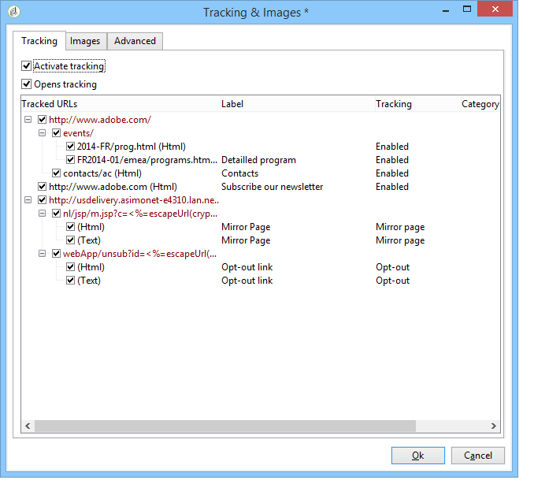

# Konfigurera alternativ för URL-spårning{#personalizing-url-tracking}

Avancerade inställningar för meddelandespårning är tillgängliga via **[!UICONTROL Tracking & Images]** i verktygsfältet i leveransguiden.

>[!NOTE]
>
>Hanteringen av bilder i e-postmeddelanden är också konfigurerad i det här fönstret. Se [Lägg till bilder](defining-the-email-content.md#adding-images).

Du kan konfigurera spårningsalternativen:

* Aktivera/inaktivera URL-spårning för alla meddelanden.

   >[!CAUTION]
   >
   >När spårning inte är aktiverat för en leverans (dvs. **[!UICONTROL Activate tracking]** inte valt) är rapporter och data för spårning inte tillgängliga: Öppnar, snabbklickningar och spårade URL:er visar inga data, och **[!UICONTROL Tracking logs]** flikar visas inte för den här leveransen.

* Aktivera/inaktivera spårning för meddelande öppnas.

De spårade URL:erna visas i det centrala fönstret i trädform.

Du kan aktivera eller inaktivera spårning individuellt för varje URL för meddelandet. Mer information om detta finns i [det här avsnittet](how-to-configure-tracked-links.md).

The **[!UICONTROL Advanced]** kan du anpassa beräkningsformlerna för de spårade URL:erna och den inledande URL:en.

>[!CAUTION]
>
>Inställningarna på den här fliken kan bara ändras av expertanvändare.
