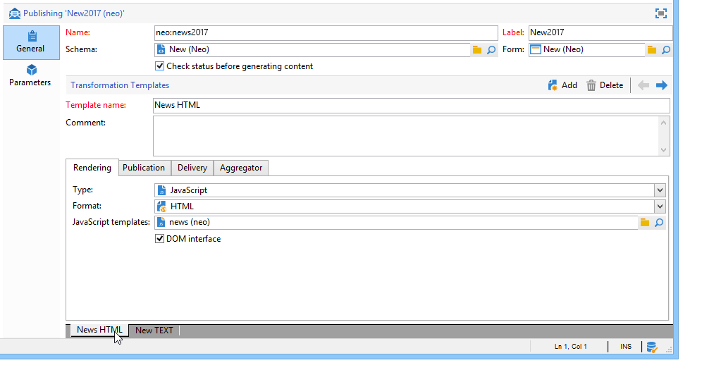
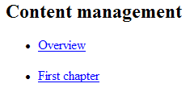

# Publikationsmallar{#publication-templates}

## Om publiceringsmallar {#about-publication-templates}

Publikationsmallen är identitetskortet för innehållet som ska publiceras. Det refererar till de resurser som används i publiceringsprocessen, dvs.:

* dataschemat,
* Inmatningsformuläret.
* omformningsmallarna för varje utdatadokument.

## Identifiering av en publiceringsmall {#identification-of-a-publication-template}

En publikationsmall identifieras av sitt namn och namnutrymme.

Identifieringsnyckeln för en formatmall är en sträng som består av namnutrymmet och namnet avgränsat med kolon. till exempel: **cus:nyhetsbrev**.

>[!NOTE]
>
>I praktiken rekommenderar vi att du använder samma nyckel för schemat, formuläret och publiceringsmallen.

## Skapa och konfigurera mallen {#creating-and-configuring-the-template}

Publikationsmallar lagras som standard i **[!UICONTROL Administration > Configuration > Publication templates]** noden. Om du vill skapa en ny mall klickar du på **[!UICONTROL New]** knappen ovanför listan med mallar.

Om du vill konfigurera publiceringsmallen fyller du i mallens namn (dvs. identifieringsnyckeln som består av namnet och namnutrymmet), etiketten, dataschemat och det indataformulär som den är länkad till.



>[!NOTE]
>
>Etiketten visas när innehåll skapas baserat på den här publiceringsmallen.

Med alternativet **Kontrollera status för att validera innehållsgenerering** kontrolleras statusen &quot;Validerad&quot; för innehållsinstanserna för att auktorisera filgenerering. Mer information finns i [Publication](#publication).

En omformningsmall måste läggas till för varje utdatadokument. Du kan skapa så många omformningsmallar som behövs.

Fältet **[!UICONTROL Name of template]** är en kostnadsfri etikett som beskriver återgivningstypen vid utdata. Publikationsinställningarna är tillgängliga på flikarna för varje omformningsmall.

### Återgivning {#rendering}

Välj **[!UICONTROL Rendering]** fliken:

* vilken typ av återgivning som används för att projicera utdatadokumentet: XSL-formatmall eller JavaScript-mall,
* utdatadokumentets format: HTML, text, XML eller RTF,
* den mall som innehåller konstruktionsdata, dvs. den formatmall eller JavaScript-mall som ska användas.

### Publicering {#publication}

Publiceringen innebär att utdatadokumentet genereras i form av en fil, om den valda typen är **[!UICONTROL File]**.


Följande publiceringsalternativ är tillgängliga:

* Teckenuppsättningen för kodning av utdatafil kan framtvingas via **[!UICONTROL Encoding]** fältet. Teckenuppsättningen Latin 1 (1252) används som standard.
* Med det här **[!UICONTROL Multi-file generation]** alternativet aktiveras ett särskilt dokumentpubliceringsläge. Det här alternativet innebär att en partitioneringstagg fylls i i början av varje sida i utdatadokumentet. När du genererar innehållet skapas en fil för varje ifylld partitionstagg. Det här läget används för att generera miniwebbplatser från ett innehållsblock. Mer information finns i [Skapa](#multi-file-generation)flera filer.
* Fältet innehåller namnet på **[!UICONTROL Location]** utdatafilen. Namnet kan bestå av variabler för att generera ett automatiskt filnamn.

   En variabel har följande format: **`$(<xpath>)`, där `<xpath>` är sökvägen till ett fält i publiceringsmallens dataschema.

   Namnet på en fil kan bestå av ett datumtypsfält. Om du vill formatera det här fältet korrekt använder du funktionen **$date-format** med sökvägen till fältet och utdataformatet som parametrar.

   Som standard används variablerna i fälten &quot;@name&quot; och &quot;@date&quot; för filnamnets konstruktionsformat:

   ```
   ct_$(@name)_$date-format(@date,'%4Y%2M%2D').htm
   ```

   Det genererade filnamnet ser ut så här: ct_news12_20110901.htm.

   >[!NOTE]
   >
   >Mer information om generering av innehåll finns i [Skapa en innehållsinstans](../../delivery/using/using-a-content-template.md#creating-a-content-instance).

### Leverans {#delivery}

På den här fliken kan du välja ett scenario för att starta en leverans direkt i innehållet. Innehållet i e-postmeddelandet fylls i automatiskt baserat på utdataformatet (HTML eller Text).


>[!NOTE]
>
>Ett exempel på leveransskapande baserat på ett innehåll finns i [Leverera en innehållsinstans](../../delivery/using/using-a-content-template.md#delivering-a-content-instance).

### Aggregator {#aggregator}

Genom att samla data från ett skript eller en frågelista kan du utöka XML-dokumentet med innehållsdata. Syftet är att komplettera viss information som länkar refererar till eller att lägga till element från databasen.

### Skapa flera filer samtidigt {#multi-file-generation}

Om du vill aktivera flera filgenereringar väljer du **[!UICONTROL Multi-file generation]** alternativet i publikationsmodellen. Med det här alternativet kan du ange partitioneringstaggar i formatmallen för början av varje sida i utdatadokumentet. När innehållet genereras skapas en fil för varje partitioneringstagg som påträffas.

Partitionstaggen som ska integreras i formatmallen är följande:

**`<xsl:comment> #nl:output_replace(<name_of_file>) </xsl:comment>`** där **`<name_of_file>`** är filnamnet på sidan som ska genereras.

**Exempel:**Skapa flera filer med hjälp av&quot;cus:book&quot;-schemat.

Principen är att skapa en huvudsida som listar kapitlen, med möjlighet att visa kapiteldetaljer på en extern sida.



Motsvarande formatmall (&quot;cus:book.xsl&quot;) är:

```
<?xml version="1.0" encoding="ISO-8859-1" ?>
<xsl:stylesheet xmlns:xsl="http://www.w3.org/1999/XSL/Transform" version="1.0">
  <xsl:output encoding="ISO-8859-1" method="html"/>

  <!-- Style sheet entry point -->
  <xsl:template match="/book">
    <html>
      <body>
        <h1><xsl:value-of select="@name"/></h1>
        <lu>
          <xsl:for-each select="chapter">
            <li><a target="_blank" href="chapter{@id}.htm"><xsl:value-of select="@name"/></a></li>  
          </xsl:for-each>
       </lu>
      </body>
    </html>
   </xsl:template>
</xsl:stylesheet>
```

En andra formatmall (&quot;cus:chapter.xsl&quot;) krävs för att generera detaljer i kapitlen:

```
<?xml version="1.0" encoding="ISO-8859-1" ?>
<xsl:stylesheet xmlns:xsl="http://www.w3.org/1999/XSL/Transform" version="1.0">
  <xsl:output encoding="ISO-8859-1" method="html"/>

  <!-- Detail of a chapter -->
  <xsl:template match="chapter">
    <!-- Cut tag -->   
    <xsl:comment> #nl:output_replace($(path)/chapter<xsl:value-of select="@id"/>.htm)</xsl:comment>
    
    <html>
      <body>
        <h1><xsl:value-of select="@name"/></h1>
        <xsl:value-of select="page" disable-output-escaping="yes"/>
      </body>
    </html>
  </xsl:template>

  <!-- Style sheet entry point -->
  <xsl:template match="/book">
    <xsl:apply-templates/>
   </xsl:template>
</xsl:stylesheet>
```

Partitionstaggen fylls i i början av sidan som ska inkluderas i filen som ska genereras.

```
<xsl:comment> #nl:output_replace($(path)/<xsl:value-of select="@id"/>.htm)</xsl:comment>
```

Filnamnet skapas med variabeln **$(path)** som innehåller publikationssökvägen och **`<xsl:value-of select="@id" />`** som matchar identifieraren för kapitlet i indatadokumentet.

Publikationsmodellen måste vara ifylld med de två formatmallarna &quot;cus:book.xsl&quot; och &quot;cus:chapter.xsl&quot;.

Alternativet **[!UICONTROL Multi-file generation]** måste vara aktivt i kapitelomformningsmodellen:


Fältet används inte för att generera flera filer, men du måste ändå fylla i det här fältet för att undvika ett fel vid publicering. **[!UICONTROL Location]**
