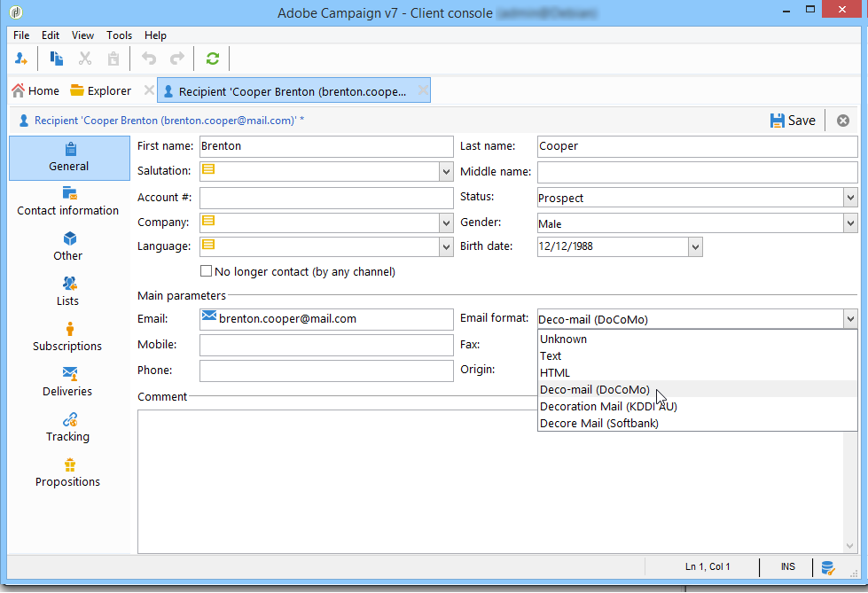

# Skicka e-post till japanska mobiler {#sending-emails-on-japanese-mobiles}

## E-postformat för japanska mobiler {#email-formats-for-japanese-mobiles}

Adobe Campaign hanterar tre specifika japanska format för e-post på mobiler: **Deco-mail** (DoCoMo-mobiler), **Avböj e-post** (Softbank mobiles) och **Dekoration Mail** (KDDI AU-mobiler). Dessa format medför särskilda begränsningar för kodning, struktur och storlek. Läs mer om begränsningar och rekommendationer i [det här avsnittet](#limitations-and-recommendations).

För att mottagaren ska kunna ta emot meddelanden i något av dessa format rekommenderar vi att du väljer **[!UICONTROL Deco-mail (DoCoMo)]**, **[!UICONTROL Decore Mail (Softbank)]** eller **[!UICONTROL Decoration Mail (KDDI AU)]** i motsvarande profil:

Om du lämnar **[!UICONTROL Email format]** option as **[!UICONTROL Unknown]**, **[!UICONTROL HTML]** eller **[!UICONTROL Text]** identifierar Adobe Campaign automatiskt (när du skickar e-postmeddelandet) det japanska format som ska användas så att meddelandet visas korrekt.

Det här automatiska identifieringssystemet baseras på listan med fördefinierade domäner som definieras i **[!UICONTROL Management of Email Formats]** e-postregeluppsättning. Mer information om hur du hanterar e-postformat finns i [den här sidan](../../installation/using/email-deliverability.md#managing-email-formats).

## Begränsningar och rekommendationer {#limitations-and-recommendations}

Ett visst antal begränsningar gäller för att skicka e-postmeddelanden som ska läsas på en mobil som drivs av en japansk leverantör (Softbank, DoCoMo, KDDI AU).

Därför måste du:

* Använd endast bilder i JPEG eller GIF
* Skapa en leverans med text och HTML-avsnitt som är strikt mindre än 10 000 byte (för KDDI AU och DoCoMo)
* Använd bilder med en total storlek (före kodning) som är mindre än 100 kB
* Använd inte fler än 20 bilder per meddelande
* Använd ett format med reducerad storlek för HTML (ett begränsat antal taggar finns för varje operator)

>[!NOTE]
>
>Begränsningar som är specifika för varje operator måste beaktas när du skapar meddelandet. Läs produktdokumentationen.

## Testa e-postinnehållet {#testing-the-email-content}

### Förhandsgranska meddelandet {#previewing-the-message}

Med Adobe Campaign kan du kontrollera att meddelandeformatet är anpassat för att skickas till en japansk mobiltelefon.

När du har definierat innehållet och angett ämnet för e-postmeddelandet kan du kontrollera visningen och formateringen när meddelandet skapas.

I **[!UICONTROL Preview]** fliken i innehållsredigeringsfönstret, klicka **[!UICONTROL More... > Deco-mail diagnostic]** gör att du kan:

* Kontrollera att innehållstaggarna för HTML följer de japanska formatbegränsningarna
* Kontrollera att antalet bilder i meddelandet inte överstiger gränsen för formatet (20 bilder)
* Kontrollera den totala meddelandestorleken (mindre än 100 kB)

   

### Kör typologiregel {#running-typology-rule}

Förutom förhandsgranskningsdiagnosen utförs en andra kontroll när du skickar ett bevis eller en leverans: en specifik typologiregel, **[!UICONTROL Deco-mail check]**, startas under analysen.

>[!IMPORTANT]
>
>Den här typologiregeln körs bara om minst en av mottagarna har konfigurerats att ta emot e-post i **[!UICONTROL Deco-mail (DoCoMo)]**, **[!UICONTROL Decore Mail (Softbank)]** eller **[!UICONTROL Decoration Mail (KDDI AU)]** format.

Med den här typologiregeln kan du se till att leveransen respekterar [formatbegränsningar](#limitations-and-recommendations) definieras av de japanska operatorerna, särskilt i förhållande till den totala storleken på e-postmeddelandet, storleken på HTML och textavsnitten, antalet bilder i meddelandena samt taggarna i HTML-innehållet.

### Skicka korrektur {#sending-proofs}

Du kan skicka korrektur för att testa leveransen. När du skickar korrekturet anger du adresser som motsvarar e-postformatet för den profil som används, om du använder ersättningsadresser.

Du kan till exempel ersätta en profils adress med test@softbank.ne.jp om e-postformatet för profilen har definierats i förväg **[!UICONTROL Decore Mail (Softbank)]**.

## Skicka meddelanden {#sending-messages}

Om du vill skicka ett e-postmeddelande till mottagare med japanska e-postformat med Campaign kan du välja mellan två alternativ:

* Skapa två leveranser: en endast för japanska mottagare och en annan för andra mottagare - se [det här avsnittet](#designing-a-specific-delivery-for-japanese-formats).
* Skapa en enstaka leverans så känner Adobe Campaign automatiskt av vilket format som används - se [det här avsnittet](#designing-a-delivery-for-all-formats).

### Designa en specifik leverans för japanska format {#designing-a-specific-delivery-for-japanese-formats}

Du kan skapa ett arbetsflöde som innehåller två leveranser: en som ska läsas på japanska mobiler och en annan för mottagare med ett standardformat för e-post.

Om du vill göra det använder du **[!UICONTROL Split]** i arbetsflödet och definiera de japanska e-postformaten (Deco-mail, Decoration Mail och Decore Mail) som filtreringsvillkor.

### Designa en leverans för alla format {#designing-a-delivery-for-all-formats}

När Adobe Campaign dynamiskt hanterar formaten enligt domänen (profiler med e-postformat definierade som **[!UICONTROL Unknown]**, **[!UICONTROL HTML]** eller **[!UICONTROL Text]** ) kan du skicka samma leverans till alla mottagare.

Meddelandekontakten visas korrekt för användare på japanska mobiler, precis som för standardmottagare.

>[!IMPORTANT]
>
>Se till att du respekterar de specialfunktioner som är associerade med alla japanska e-postformat (Deco-mail, Decoration Mail och Decore Mail). Mer information om begränsningar finns i [det här avsnittet](#limitations-and-recommendations).
