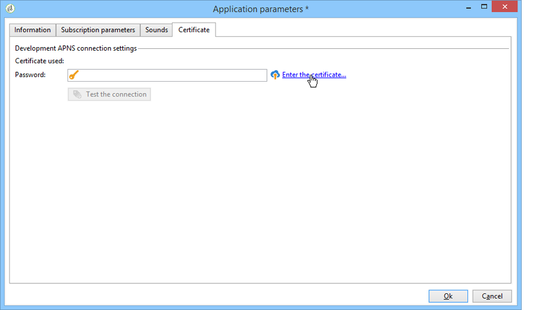

# Konfigurera mobilappskanal{#setting-up-mobile-app-channel}

## Introduktion {#introduction}

>[!CAUTION]
>
>Implementering av mobilappskanaler måste utföras av expertanvändare. Kontakta er kontoansvarige på Adobe eller er partner för Professional-tjänster om ni behöver hjälp.

Du kan skapa flera versioner av ditt mobilprogram (iOS, Android): Med alternativet för mobilappskanalen kan du skicka meddelanden till terminaler som programmet är installerat på.

För att kunna använda funktionerna i Adobe Campaign Mobile App Channel måste ni ändra/anpassa mobilappen för att integrera den i Adobe Campaign-plattformen.

Det finns två Campaign Classic SDK:er, en för Android och en för iOS, som gör det enkelt att integrera mobilapplikationen med Adobe Campaign. Det krävs djupgående tekniska kunskaper om Java och mål C. En detaljerad beskrivning av Campaign SDK finns i [Integrera Campaign SDK i mobilappen](#integrating-campaign-sdk-into-the-mobile-application).

>[!NOTE]
>
>Bibliotek från Adobe Campaign är utformade för att användas med Xcode (iOS) och Android Studio (Android).

## Kopplingar {#connectors}

### iOS-anslutningar {#ios-connectors}

För iOS finns två anslutningar:

* Den binära iOS-kopplingen skickar meddelanden på den gamla binära APNS-servern.
* iOS HTTP/2-kopplingen skickar meddelanden till HTTP/2 APNS.

Så här väljer du vilken koppling du vill använda:

1. Gå till **[!UICONTROL Administration > Platform > External accounts]**.
1. Välj det externa kontot för iOS-routning.
1. På **[!UICONTROL Connector]** fliken fyller du i **[!UICONTROL Access URL of the connector]** fältet:

   För binära iOS: https://localhost:8080/nms/jsp/ios.jsp

   För iOS HTTP2: http://localhost:8080/nms/jsp/iosHTTP2.jsp

   

### Android-anslutningar {#android-connectors}

För Android finns två anslutningar:

* V1-anslutningen som tillåter en anslutning per underordnad MTA.
* V2-anslutningen som tillåter samtidiga anslutningar till FCM-servern för att förbättra genomströmningen.

Så här väljer du vilken koppling du vill använda:

1. Gå till **[!UICONTROL Administration > Platform > External accounts]**.
1. Välj det **[!UICONTROL Android routing]** externa kontot.
1. På **[!UICONTROL Connector]** fliken fyller du i **[!UICONTROL JavaScript used in the connector]** fältet:

   För Android V1: https://localhost:8080/nms/jsp/androidPushConnector.js

   För Android V2: https://localhost:8080/nms/jsp/androidPushConnectorV2.js

   

1. För Android V2 finns ytterligare en parameter i konfigurationsfilen för Adobe Server (serverConf.xml):

   * **maxGCMConnectPerChild**: Maximal gräns för parallella HTTP-begäranden till FCM som initieras av varje underordnad server (8 som standard).

## Konfigurationssteg {#configuration-steps}

### Skapa programmet {#creating-the-application}

Om du inte har något mobilprogram (program) måste programutvecklaren skapa det och integrera SDK:n. Om mobilappen finns måste utvecklaren anpassa den genom att integrera Adobe Campaign SDK och lägga till inställningarna som är specifika för tjänsten. En beskrivning av SDK finns i [Integrera Campaign SDK i mobilappen](#integrating-campaign-sdk-into-the-mobile-application).

>[!CAUTION]
>
>Programmet måste ha konfigurerats för push-åtgärder INNAN du integrerar med Adobe Campaign SDK.
>
>Om så inte är fallet, se [den här sidan](https://developer.apple.com/library/archive/documentation/NetworkingInternet/Conceptual/RemoteNotificationsPG/).

### Samlar in information {#collecting-information-}

För att konfigurera programmet måste ni samla in de tekniska specifikationer som definierar parameteruppsättningen som gör det möjligt för Adobe Campaign och mobilprogrammet att kommunicera. Dessa parametrar är:

* **integreringsnyckeln**: varje program har en unik nyckel. Med den här nyckeln kan du länka Adobe Campaign-tjänsten och mobilappen. Se [Allmän information](#general-information).
* **variablerna**: Definiera programmets beteende när du aktiverar meddelandet. Se [Allmän information](#general-information).
* **prenumerationsinställningarna**: Som standard återställer Adobe Campaign fältet **@userKey** som gör att du kan koppla ihop mobila enheter med mottagarna i databasen. Om du vill samla in ytterligare data (till exempel en komplex avstämningsnyckel) kan du definiera prenumerationsinställningar. Se [Prenumerationsinställningar](#subscription-settings).
* **ljuden** (endast iOS): Om det valda ljudet inte är ett systemljud måste ljudfilen bäddas in i mobilprogrammet. Se [Programljud](#application-sounds).
* **Marknadsföringsserverns och spårningsserverns** URL: Adobe Campaign-administratören måste förse programutvecklaren med URL:erna för marknadsföringsservern och URL:erna för spårningsservern. Mer information finns i: Integrera [Campaign SDK i mobilapplikationen](#integrating-campaign-sdk-into-the-mobile-application).

### Skapar tjänsten {#creating-the-service}

Adobe Campaign-administratören måste skapa och konfigurera en tjänst som är länkad till mobilprogrammet. Mer information finns i [Konfigurera mobilprogrammet i Adobe Campaign](#configuring-the-mobile-application-in-adobe-campaign).

### Testa programmet {#testing-the-application}

I iOS måste du skapa ett program som använder sandlådeläget för tester och godkännanden. Skapa sedan en ny produktionstypapplikation i samma Adobe Campaign-tjänst och ange relevant certifikat. Mer information finns i dokumentationen för Apple Notification Service.

På Android behöver du bara skapa ett program. Testa den fullständiga prenumerations- och leveransprocessen för programmet innan du publicerar det.

## Datasökväg {#data-path}

I följande scheman beskrivs de steg som gör det möjligt för en mobilapplikation att utbyta data med Adobe Campaign. Denna process inbegriper tre enheter:

* mobilapplikationen
* meddelandetjänsten: APNS (Apple Push Notification Service) för Apple och FCM (Firebase Cloud Messaging) för Android
* Adobe Campaign

De tre huvudstegen i anmälningsprocessen är: registrering av programmet i Adobe Campaign (prenumerationssamling), leveranser och spårning.

### Steg 1: Prenumerationssamling {#step-1--subscription-collection}

Mobilprogrammet hämtas av användaren från App Store eller Google Play. Det här programmet innehåller anslutningsinställningarna (iOS-certifikat och projektnyckel för Android) och integrationsnyckeln. Första gången programmet öppnas (beroende på konfiguration) kan användaren uppmanas att ange registreringsinformation (@userKey: e-post eller kontonummer (till exempel). Samtidigt skickar programmet frågor till meddelandetjänsten för att samla in ett meddelande-ID (push-ID). All den här informationen (anslutningsinställningar, integrationsnyckel, meddelandeidentifierare, userKey) skickas till Adobe Campaign.


### Steg 2:Leverans {#step-2--delivery}

Marknadsförarna riktar sig till programprenumeranter. Leveransprocessen skickar anslutningsinställningarna till meddelandetjänsten (iOS-certifikat och projektnyckel för Android), meddelande-ID:t (push-ID) och meddelandets innehåll. Meddelandetjänsten skickar meddelanden till målterminalerna.

Följande information finns i Adobe Campaign:

* Endast Android: antal enheter som har visat meddelandet (avtryck)
* Android och iOS: antal klick i meddelandet


Adobe Campaign-servern måste kunna kontakta APNS-servern på följande portar:

* 2195 (sändning) och 2186 (feedbacktjänst) för binär iOS-anslutning
* 443 för iOS HTTP/2-anslutning

Använd följande kommandon för att kontrollera att den fungerar som den ska:

* För provningar:

   ```
   telnet gateway.sandbox.push.apple.com
   ```

* I produktion:

   ```
   telnet gateway.push.apple.com
   ```

Om en binär iOS-anslutning används måste MTA- och webbservern kunna kontakta APNS på port 2195 (skicka), arbetsflödesservern måste kunna kontakta APNS på port 2196 (feedback-tjänst).

Om en iOS HTTP/2-anslutning används måste MTA-, webbservern och arbetsflödesservern kunna kontakta APNS på port 443.

## Integrera Campaign SDK i mobilapplikationen {#integrating-campaign-sdk-into-the-mobile-application}

Kampanj-SDK för iOS och Android är en av komponenterna i modulen Mobile App Channel.

>[!NOTE]
>
>Kontakta Adobes kundtjänst om du vill skaffa Campaign SDK (tidigare kallat Neolane SDK).

Målet med SDK är att underlätta integreringen av en mobilapplikation i Adobe Campaign-plattformen.

Mer information om vilka olika Android- och iOS-versioner som stöds finns i [kompatibilitetsmatrisen](https://helpx.adobe.com/campaign/kb/compatibility-matrix.html#MobileSDK) .

### Läser in kampanj-SDK {#loading-campaign-sdk}

* **I Android**: filen **neolane_sdk-release.aar** måste länkas till projektet.

   Följande behörighet ger åtkomst till Adobe Campaign-servern:

   ```
   Neolane.getInstance().setIntegrationKey("your Adobe mobile app integration key");
   Neolane.getInstance().setMarketingHost("https://yourMarketingHost:yourMarketingPort/");
   Neolane.getInstance().setTrackingHost("https://yourTrackingHost:yourTrackingPort/");
   ```

   Med följande tillstånd kan du återställa ett telefons unika ID:

   ```
   <uses-permission android:name="android.permission.READ_PHONE_STATE" /> 
   ```

   Från och med version 1.0.24 av SDK används den här behörigheten endast för versioner som är äldre än Android 6.0.

   Från och med version 1.0.26 av SDK används inte längre den här behörigheten.

* **I iOS**: filerna **libNeolaneSDK.a** och **Neolane_SDK.h** måste länkas till projektet. Från version 1.0.24 av SDK aktiveras alternativet **ENABLE_BITCODE** .

   >[!NOTE]
   >
   >För version 1.0.25 av SDK är de fyra arkitekturerna tillgängliga i filen **Neolane_SDK.h** .

### Deklarera integrationsinställningar {#declaring-integration-settings}

För att integrera Campaign SDK i mobilappen måste den funktionella administratören lämna följande information till utvecklaren:

* **En integreringsnyckel**: för att göra det möjligt för Adobe Campaign-plattformen att identifiera mobilapplikationen.

   >[!NOTE]
   >
   >Integreringsnyckeln anges i Adobe Campaign-konsolen på fliken med tjänster som är dedikerade till mobilprogrammet **[!UICONTROL Information]** . Se [Allmän information](#general-information).

* **En spårnings-URL**: som matchar adressen för Adobe Campaign-spårningsservern.
* **En marknadsförings-URL**: för att aktivera insamling av prenumerationer.

* **I Android**:

   ```
   Neolane.getInstance().setIntegrationKey("your Adobe mobile app integration key");
   Neolane.getInstance().setMarketingHost("https://yourMarketingHost:yourMarketingPort/");
   Neolane.getInstance().setTrackingHost("https://yourTrackingHost:yourTrackingPort/"); 
   ```

* **I iOS**:

   ```
   Neolane_SDK *nl = [Neolane_SDK getInstance];
   [nl setMarketingHost:strMktHost];
   [nl setTrackingHost:strTckHost];
   [nl setIntegrationKey:strIntegrationKey];
   ```

### Registreringsfunktion {#registration-function}

Registreringsfunktionen gör att du kan:

* skicka meddelande-ID eller push-ID (deviceToken för iOS och registrationID för Android) till Adobe Campaign.
* återskapa avstämningsnyckeln eller userKey (till exempel e-post eller kontonummer)

* **I Android**:

   ```
   void registerInNeolane(String registrationId, String userKey, Context context)
   {
    try{
     Neolane.getInstance().registerDevice(registrationToken, userKey, null, context);
    } catch (NeolaneException e){
     //...
    } catch (IOException e){
     //...
    }
   }
   ```

   Om du använder FCM (Firebase Cloud Messaging) rekommenderar vi att du använder funktionen **registerDevice** när du anropar funktionen **onTokenRefresh** för att meddela Adobe Campaign om ändringen i användarens mobilenhetstoken.

   ```
   public class NeoTripFirebaseInstanceIDService extends FirebaseInstanceIdService {
     @Override
     public void onTokenRefresh() {
       String registrationToken = FirebaseInstanceId.getInstance().getToken();
       NeolaneAsyncRunner neolaneAs = new NeolaneAsyncRunner(Neolane.getInstance());
       ...
       ...
       // Neolane Registration
       neolaneAs.registerDevice(registrationToken, userKey, additionnalParam, this, new NeolaneAsyncRunner.RequestListener() {
       public void onComplete(String e, Object state) { ... }
       public void onNeolaneException(NeolaneException e, Object state) { ... }
       public void onIOException(IOException e, Object state) { ... }
       });
       ...
       ...
     }
   }
   ```

* **I iOS**:

   ```
   // Callback called on successful registration to the APNS
   - (void)application:(UIApplication*)application didRegisterForRemoteNotificationsWithDeviceToken:(NSData*)deviceToken
   {
       // Pass the token to Adobe Campaign
       Neolane_SDK *nl = [Neolane_SDK getInstance];
       [nl registerDevice:tokenString:self.userKey:dic];
   }
   ```

### Spårningsfunktion {#tracking-function}

* **I Android**:

   Med spårningsfunktionerna kan du spåra meddelandeaktiveringar (öppnar) och meddelandevisning (skärmbild).

   Följ implementeringen nedan för att spåra hur meddelandet visas (genom att anropa SDK:s **notifyReceive** -funktion). Observera att om du använder FCM (Firebase Cloud Messaging) rekommenderar vi att du använder funktionen **notifyReceive** när funktionen **onMessageReceived** anropas av Android-systemet.

   ```
   package com.android.YourApplication;
   
   import android.content.Context;
   import android.content.SharedPreferences;
   import android.os.Bundle;
   import android.util.Log;
   
   import com.google.firebase.messaging.FirebaseMessagingService;
   import com.google.firebase.messaging.RemoteMessage;
   
   import java.util.Iterator;
   import java.util.Map;
   import java.util.Map.Entry;
   
   public class YourApplicationFirebaseMessagingService extends FirebaseMessagingService {
     private static final String TAG = "MyFirebaseMsgService";
   
     @Override
     public void onMessageReceived(RemoteMessage message) {
       Log.d(TAG, "Receive message from: " + message.getFrom());
       Map<String,String> payloadData = message.getData();
       final Bundle extras = new Bundle();
       final Iterator<Entry<String, String>> iter = payloadData.entrySet().iterator();
       while(iter.hasNext())
       {
         final Entry<String, String>  entry =iter.next();
         extras.putString(entry.getKey(), entry.getValue());
       }
   
       SharedPreferences settings = this.getSharedPreferences(YourApplicationActivity.APPLICATION_PREF_NAME, Context.MODE_PRIVATE);
       String mesg = payloadData.get("_msg");
       String title = payloadData.get("title");
       String url = payloadData.get("url");
       String messageId = payloadData.get("_mId");
       String deliveryId = payloadData.get("_dId");
       YourApplicationActivity.handleNotification(this, mesg, title, url, messageId, deliveryId, extras);
     }
   }
   ```

   ```
   public static void handleNotification(Context context, String message, String title, String url, String messageId, String deliveryId, Bundle extras){
       if( message == null ) message = "No Content";
       if( title == null )   title = "No title";
       if( url == null )     url = "https://www.tripadvisor.fr";
       int iconId = R.drawable.notif_neotrip;
   
       // notify Neolane that a notification just arrived
       NeolaneAsyncRunner nas = new NeolaneAsyncRunner(Neolane.getInstance());
       nas.notifyReceive(Integer.valueOf(messageId), deliveryId, new NeolaneAsyncRunner.RequestListener() {
         public void onNeolaneException(NeolaneException arg0, Object arg1) {}
         public void onIOException(IOException arg0, Object arg1) {}
         public void onComplete(String arg0, Object arg1){}
       });
       if (yourApplication.isActivityVisible())
       {
         Log.i("INFO", "The application has the focus" );
         ...
       }
       else
       {
         // notification creation :
         NotificationManager notificationManager = (NotificationManager) context.getSystemService(Context.NOTIFICATION_SERVICE);
         Notification notification;
   
         // Activity to start :
         Intent notifIntent = new Intent(context.getApplicationContext(), NotificationActivity.class);
         notifIntent.putExtra("notificationText", message);
         notifIntent.putExtra(NotificationActivity.NOTIFICATION_URL_KEYNAME, url);
         notifIntent.putExtra("_dId", deliveryId);
         notifIntent.putExtra("_mId", messageId);
         notifIntent.addFlags(Intent.FLAG_ACTIVITY_NEW_TASK);
         PendingIntent contentIntent = PendingIntent.getActivity(context, 1, notifIntent, PendingIntent.FLAG_UPDATE_CURRENT);
   
         notification = new Notification.Builder(context)
                 .setContentTitle(title)
                 .setContentText(message)
                 .setSmallIcon(iconId)
                 .setContentIntent(contentIntent)
                 .build();
   
         // launch the notification :
         notification.flags |= Notification.FLAG_AUTO_CANCEL;
         notificationManager.notify(Integer.valueOf(messageId), notification);
       }
   }
   ```

   Här är ett implementeringsexempel för att spåra ett meddelande som är öppet (som körs genom anrop av funktionen **notifyOpening** i SDK). Klassen **NotificationActivity** motsvarar den som användes för att skapa **notifIntent** -objektet i föregående exempel.

   ```
   public class NotificationActivity extends Activity {
    public static final String NOTIFICATION_URL_KEYNAME = "NotificationUrl";
    .....
    public void onCreate(Bundle savedBundle) {
     super.onCreate(savedBundle);
     setContentView(R.layout.notification_viewer);  
     .....  
     Bundle extra = getIntent().getExtras();  
     .....  
     //get the messageId and the deliveryId to do the tracking  
     String deliveryId = extra.getString("_dId");
     String messageId = extra.getString("_mId");
     if (deliveryId != null && messageId != null) {
      NeolaneAsyncRunner neolaneAs = new NeolaneAsyncRunner(Neolane.getInstance());
      neolaneAs.notifyOpening(Integer.valueOf(messageId), deliveryId, new NeolaneAsyncRunner.RequestListener() {
       public void onNeolaneException(NeolaneException arg0, Object arg1) {}
       public void onIOException(IOException arg0, Object arg1) {}
       public void onComplete(String arg0, Object arg1) {}
       });
     }
    }
   }
   ```

* **I iOS**:

   Med spårningsfunktionen kan du spåra när meddelanden aktiveras (öppnas).

   ```
   (void)application:(UIApplication *)application didReceiveRemoteNotification:(NSDictionary *)launchOptions
   fetchCompletionHandler:(void (^)(UIBackgroundFetchResult))completionHandler
   {
   if( launchOptions ) { // Retrieve notification parameters here ... // Track application opening Neolane_SDK
   *nl = [Neolane_SDK getInstance]; [nl track:launchOptions:NL_TRACK_CLICK]; } 
   ...  
   completionHandler(UIBackgroundFetchResultNoData);
   }
   ```

   >[!NOTE]
   >
   >När funktionen **application:didReceiveRemoteNotification:fetchCompletionHandler** har implementerats från version 7.0 anropas endast den här funktionen av operativsystemet. Funktionen **application:didReceiveRemoteNotification** anropas därför inte.

### Spårning av tyst meddelande {#silent-notification-tracking}

Med iOS kan du skicka tysta meddelanden, ett meddelande eller data som skickas direkt till ett mobilprogram utan att det visas. Med Adobe Campaign kan ni spåra dem.

Följ exemplet nedan för att spåra ditt tysta meddelande:

```
// AppDelegate.m
...
...
#import "AppDelegate.h"
#import "Neolane_SDK.h"
...
...
// Callback called when the application is already launched (whether the application is running foreground or background)
- (void)application:(UIApplication *)application didReceiveRemoteNotification:(NSDictionary *)launchOptions fetchCompletionHandler:(void (^)(UIBackgroundFetchResult))completionHandler
{
 NSLog(@"IN didReceiveRemoteNotification:fetchCompletionHandler");
 if (launchOptions) NSLog(@"IN launchOptions: %@", [launchOptions description]);
 NSLog(@"Application state: %ld", (long)application.applicationState);

 // Silent Notification (specific case, can use NL_TRACK_RECEIVE as the user doesn't have click/open the notification)
 if ([launchOptions[@"aps"][@"content-available"] intValue] == 1 )
       {
  NSLog(@"Silent Push Notification");
  ...  
  ...
  //Call receive tracking
        Neolane_SDK *nl = [Neolane_SDK getInstance];
  [nl track:launchOptions:NL_TRACK_RECEIVE];

  completionHandler(UIBackgroundFetchResultNoData); //Do not show notification
  return;
 }  
 ...
 ...
        completionHandler(UIBackgroundFetchResultNoData);
}
```

### RegisterDeviceStatus-delegat {#registerdevicestatus-delegate}

>[!NOTE]
>
>Observera att detta endast gäller iOS.

I iOS gör delegatprotokollet att du kan få resultatet av **RegisterDevice** -anropet och använda det för att ta reda på om ett fel uppstod under registreringen.

Prototypen **registerDeviceStatus** är:

```
- (void) registerDeviceStatus: (ACCRegisterDeviceStatus) status:(NSString *) errorReason;
```

**Status** gör att du kan veta om en registrering lyckades eller om ett fel uppstod.

**ErrorReason** ger dig mer information om de fel som uppstod. Mer information om tillgängliga fel och deras beskrivningar finns i tabellen nedan.

<table> 
 <thead>
  <tr>
   <th> Status<br /> </th>
   <th> Beskrivning<br /> </th>
   <th> ErrorReason<br /> </th>
  </tr>
 </thead>
 <tbody>
  <tr>
   <td> ACCRegisterDeviceStatusSuccess <br /> </td>
   <td> Registreringen lyckades<br /> </td>
   <td> TOM<br /> </td>
  </tr>
  <tr> 
   <td> ACCRegisterDeviceStatusFailureMarketingServerHostnameEmpty <br /> </td>
   <td> Värdnamnet för ACC-marknadsföringsservern är tomt eller har inte angetts.<br /> </td>
   <td> TOM<br /> </td>
  </tr>
  <tr> 
   <td> ACCRegisterDeviceStatusFailureIntegrationKeyEmpty <br /> </td>
   <td> Integreringsnyckeln är tom eller inte inställd.<br /> </td>
   <td> TOM<br /> </td>
  </tr>
  <tr> 
   <td> ACCRegisterDeviceStatusFailureConnectionIssue<br /> </td>
   <td> Anslutningsproblem med ACC<br /> </td>
   <td> Mer information (på operativsystemets aktuella språk)<br /> </td>
  </tr>
  <tr> 
   <td> ACCRegisterDeviceStatusFailureUnknownUUID<br /> </td>
   <td> Angivet UUID (integrationsnyckel) är okänt.<br /> </td>
   <td> TOM<br /> </td>
  </tr>
  <tr> 
   <td> ACCRegisterDeviceStatusFailureUnexpectedError<br /> </td>
   <td> Ett oväntat fel returnerades till ACC-servern.<br /> </td>
   <td> Felmeddelandet returnerades till ACC.<br /> </td>
  </tr>
 </tbody>
</table>

**Neolane_SDKDelegate** -protokollet och **registerDeviceStatus** -delegatdefinitionen är följande:

```
//  Neolane_SDK.h
//  Neolane SDK
..
.. 
// Register Device Status Enum
typedef NS_ENUM(NSUInteger, ACCRegisterDeviceStatus) {
 ACCRegisterDeviceStatusSuccess,                               // Resistration Succeed
 ACCRegisterDeviceStatusFailureMarketingServerHostnameEmpty,   // The ACC marketing server hostname is Empty or not set
 ACCRegisterDeviceStatusFailureIntegrationKeyEmpty,            // The integration key is empty or not set
 ACCRegisterDeviceStatusFailureConnectionIssue,                // Connection issue with ACC, more information in errorReason
 ACCRegisterDeviceStatusFailureUnknownUUID,                    // The provided UUID (integration key) is unknown
 ACCRegisterDeviceStatusFailureUnexpectedError                 // Unexpected error returned by ACC server, more information in errorReason
};
// define the protocol for the registerDeviceStatus delegate
@protocol Neolane_SDKDelegate <NSObject>
@optional
- (void) registerDeviceStatus: (ACCRegisterDeviceStatus) status :(NSString *) errorReason;
@end
@interface Neolane_SDK: NSObject {
} 
...
...
// registerDeviceStatus delegate
@property (nonatomic, weak) id <Neolane_SDKDelegate> delegate;
...
...
@end
```

Så här implementerar du **registerDeviceStatus** -delegaten:

1. Implementera **setDelegate** under SDK-initieringen.

   ```
   // AppDelegate.m
   ...
   ... 
   - (BOOL)application:(UIApplication *)application didFinishLaunchingWithOptions:(NSDictionary *)launchOptions
   {
   ...
   ...
    // Get the stored settings
   
    NSUserDefaults *defaults = [NSUserDefaults standardUserDefaults];
    NSString *strMktHost = [defaults objectForKey:@"mktHost"];
    NSString *strTckHost = [defaults objectForKey:@"tckHost"];
    NSString *strIntegrationKey = [defaults objectForKey:@"integrationKey"];
    userKey = [defaults objectForKey:@"userKey"];
   
    // Configure Neolane SDK on first launch
    Neolane_SDK *nl = [Neolane_SDK getInstance];
    [nl setMarketingHost:strMktHost];
    [nl setTrackingHost:strTckHost];
    [nl setIntegrationKey:strIntegrationKey];
    [nl setDelegate:self];    // HERE
   ...
   ...
   }
   ```

1. Lägg till protokollet i **@interface** i klassen.

   ```
   //  AppDelegate.h
   
   #import <UIKit/UIKit.h>
   #import <CoreLocation/CoreLocation.h>
   #import "Neolane_SDK.h"
   
   @class LandingPageViewController;
   
   @interface AppDelegate : UIResponder <UIApplicationDelegate, CLLocationManagerDelegate, Neolane_SDKDelegate> {
       CLLocationManager *locationManager;
       NSString *userKey;
       NSString *mktServerUrl;
       NSString *tckServerUrl;
       NSString *homeURL;
       NSString *strLandingPageUrl;
       NSTimer *timer;
   }
   ```

1. Implementera delegaten i **AppDelegate**.

   ```
   //  AppDelegate.m
   
   #import "AppDelegate.h"
   #import "Neolane_SDK.h"
   #import "LandingPageViewController.h"
   #import "RootViewController.h"
   ...
   ...
   - (void) registerDeviceStatus: (ACCRegisterDeviceStatus) status :(NSString *) errorReason
   {
       NSLog(@"registerStatus: %lu",status);
   
       if ( errorReason != nil )
           NSLog(@"errorReason: %@",errorReason);
   
       if( status == ACCRegisterDeviceStatusSuccess )
       {
           // Registration successful
           ...
           ...
       }
       else { // An error occurred
           NSString *message;
           switch ( status ){
               case ACCRegisterDeviceStatusFailureUnknownUUID:
                   message = @"Unkown IntegrationKey (UUID)";
                   break;
               case ACCRegisterDeviceStatusFailureMarketingServerHostnameEmpty:
                   message = @"Marketing URL not set or Empty";
                   break;
               case ACCRegisterDeviceStatusFailureIntegrationKeyEmpty:
                   message = @"Integration Key not set or empty";
                   break;
               case ACCRegisterDeviceStatusFailureConnectionIssue:
                   message = [NSString stringWithFormat:@"%@ %@",@"Connection issue:",errorReason];
                   break;
               case ACCRegisterDeviceStatusFailureUnexpectedError:
               default:
                   message = [NSString stringWithFormat:@"%@ %@",@"Unexpected Error",errorReason];
                   break;
           }
    ...
    ...
       }
   }
   @end
   ```

### Variabler {#variables}

Med variablerna kan du definiera mobilprogrammets beteende efter att ha tagit emot ett meddelande. Dessa variabler måste definieras i mobilprogramkoden och i Adobe Campaign-konsolen på fliken **[!UICONTROL Variables]** i den dedikerade mobilprogramtjänsten (se [Allmän information](#general-information)). Här är ett exempel på en kod som gör att ett mobilprogram kan samla in tillagda variabler i ett meddelande. I vårt exempel använder vi variabeln&quot;VAR&quot;.

* **I Android**:

   ```
   public void onReceive(Context context, Intent intent) {
        ...
       String event = intent.getStringExtra("VAR");
        ...
   }
   ```

* **I iOS**:

   ```
   - (BOOL)application:(UIApplication *)application didFinishLaunchingWithOptions:(NSDictionary *)launchOptions
   {
       ....
       if( launchOptions )
       {
           // When application is not already launched, the notification data if any are stored in the key 'UIApplicationLaunchOptionsRemoteNotificationKey'
           NSDictionary *localLaunchOptions = [launchOptions objectForKey:@"UIApplicationLaunchOptionsRemoteNotificationKey"];
           if( localLaunchOptions )
           {
            ...
            [localLaunchOptions objectForKey:@"VAR"];
           ...
           }
      }
   }
   
   // Callback called when the application is already launched (whether the application is running foreground or background)
   - (void)application:(UIApplication *)application didReceiveRemoteNotification:(NSDictionary *)launchOptions
   {
       if( launchOptions )
       {
        ...
           [launchOptions objectForKey:@"VAR"];
       }
   }
   ```

>[!CAUTION]
>
>Adobe rekommenderar att du väljer korta variabelnamn eftersom meddelandestorleken är begränsad till 4kB för iOS och Android.

## Konfigurera mobilprogrammet i Adobe Campaign {#configuring-the-mobile-application-in-adobe-campaign}

Nedan finns ett konfigurationsexempel som baseras på ett företag som säljer semesterpaket online. Hans mobilapplikation (Neotrips) finns i två versioner: Neotrips för Android och Neotrips för iOS. Om du vill konfigurera mobilprogrammet i Adobe Campaign måste du:

1. Skapa en **[!UICONTROL Mobile application]** typinformationstjänst [](#creating-the-service-and-collecting-subscriptions) för mobilappen Neotrips.
1. Lägg till iOS- och Android-versionerna av programmet i den här tjänsten.


>[!NOTE]
>
>Gå till fliken **[!UICONTROL Subscriptions]** för tjänsten för att visa en lista över prenumeranter på tjänsten, dvs. alla personer som har installerat programmet på sin mobiltelefon och gått med på att ta emot meddelanden.

### Skapa tjänsten och samla in prenumerationer {#creating-the-service-and-collecting-subscriptions}

1. Gå till **[!UICONTROL Profiles and Targets > Services and subscriptions]** noden och klicka på **[!UICONTROL New]**.

   

1. Definiera en **[!UICONTROL Label]** och en **[!UICONTROL Internal name]**.
1. Gå till **[!UICONTROL Type]** fältet och välj **[!UICONTROL Mobile application]**.

   >[!NOTE]
   >
   >Standardmålmappningen **[!UICONTROL Subscriber applications (nms:appSubscriptionRcp)]** är länkad till mottagartabellen. Om du vill använda en annan målmappning måste du skapa en ny målmappning och ange den i **[!UICONTROL Target mapping]** fältet för tjänsten. Mer information om hur du skapar målmappning finns i [konfigurationsguiden](../../configuration/using/about-custom-recipient-table.md).

1. Klicka sedan på **[!UICONTROL Add]** knappen för att definiera olika versioner av ditt mobilprogram (iOS, Android).

   

Nedan finns en detaljerad presentation av konfigurationsstegen för respektive version.

>[!NOTE]
>
>När du skapar ett iOS-program inbjuder guiden dig att konfigurera programmets utvecklingsversion (sandlåda) och produktionsversionen. De två versionerna av programmet läggs till när de har skapats.

### Allmän information {#general-information}


1. Börja med att ange **[!UICONTROL Label]**.
1. Se till att samma **[!UICONTROL Integration key]** är definierat i Adobe Campaign och i programkoden (via SDK). Mer information finns i: Integrera [Campaign SDK i mobilapplikationen](#integrating-campaign-sdk-into-the-mobile-application). Med den här integrationsnyckeln, som är specifik för varje program, kan du länka mobilprogrammet till Adobe Campaign-plattformen.
1. Om programmet hanterar en programikon (det övre vänstra hörnet av meddelandet) kan du lägga till den här så att förhandsvisningen blir trognare med leveransformatet. Mer information om hur du lägger till en bild i innehållet (ett detaljerat meddelande) finns i avsnittet [Detaljerade meddelanden](#rich-notifications) .

   >[!CAUTION]
   >
   >Den förväntade bildupplösningen är 48 x 48 pixlar för iOS.

1. För Android anger du programmets anslutningsinställningar: Ange den projektnyckel som utvecklaren av mobilprogrammet har angett.
1. Ange sedan programvariablerna.

   

   Med variabler kan du definiera programbeteendet efter att ha tagit emot ett meddelande: Du kan till exempel konfigurera en programspecifik skärm så att den visas när användaren aktiverar meddelandet. Dessa variabler måste definieras i koden för ditt mobilprogram. Klicka på **[!UICONTROL Add]** knappen för att lägga till dem i Adobe Campaign.

   Med leveransguiden kan du definiera värdena för dessa variabler. Se [Skapa meddelanden](../../delivery/using/creating-notifications.md).

### Prenumerationsinställningar {#subscription-settings}

>[!NOTE]
>
>Den här fliken behöver bara konfigureras om du vill samla in ytterligare data.


Som standard sparar Adobe Campaign en nyckel i fältet **[!UICONTROL User identifier]** (@userKey) i **[!UICONTROL Subscriber applications (nms:appSubscriptionRcp)]** tabellen. Med den här nyckeln kan du länka en prenumeration till en mottagare. Om du vill samla in ytterligare data (till exempel en komplex avstämningsnyckel) måste du använda följande konfiguration:

1. Skapa ett tillägg till **[!UICONTROL Subscriber applications (nms:appsubscriptionRcp)]** schemat och definiera de nya fälten.
1. Definiera mappningen på **[!UICONTROL Subscription parameters]** fliken.

   >[!CAUTION]
   >
   >Kontrollera att konfigurationsnamnen på fliken **[!UICONTROL Subscription parameters]** är desamma som de i mobilprogramkoden. Se avsnittet [Integrera Campaign SDK i mobilappen](#integrating-campaign-sdk-into-the-mobile-application) .

### Programljud {#application-sounds}

>[!NOTE]
>
>Den här fliken är bara tillgänglig för iOS-versioner av programmen.


Om iOS-programmet har inbäddade ljud kan du lägga till dem på den här fliken. Du kan sedan använda leveransguiden för att välja ett av ljuden som ska spelas upp när meddelandet tas emot. Mer information finns i [Skicka meddelanden på iOS](../../delivery/using/creating-notifications.md#sending-notifications-on-ios).

>[!NOTE]
>
>Systemljud kan också definieras på den här skärmen.

På **[!UICONTROL Application setting]** skärmen måste **[!UICONTROL Internal name]** fältet innehålla namnet på filen som är inbäddad i programmet eller namnet på systemljudet. Värdet som anges i **[!UICONTROL Label]** fältet visas i den **[!UICONTROL Play a sound]** nedrullningsbara listan i leveransguiden.

### Certifikat {#certificate}

>[!NOTE]
>
>Den här fliken är bara tillgänglig för iOS-versioner av programmen.

Ange anslutningsinställningarna för programmet på den här skärmen.



Klicka på **[!UICONTROL Enter the certificate...]** länken, välj autentiseringscertifikatet och ange lösenordet som angavs av mobilprogramutvecklaren.

>[!NOTE]
>
>Se till att du inte använder samma certifikat för utvecklingsversionen (sandlådan) och produktionsversionen av programmet.

## Detaljerade meddelanden {#rich-notifications}

Med ett omfattande meddelande kan du inkludera andra typer av media i dina meddelanden, som bilder, videor osv.

### Android {#android}

Med Adobe Campaign kan du definiera programvariabler förutom innehåll (se [Skicka meddelanden på Android](../../delivery/using/creating-notifications.md#sending-notifications-on-android)). Dessa variabler kan användas för att ge information som bild-URL:en till mobilprogrammet. Mobilprogrammet kan sedan generera ett anpassat meddelande.

Först måste du skapa ett mobilprogram i Adobe Campaign och definiera programvariablerna för det programmet.

1. Gå till **[!UICONTROL Profiles and Targets]** > **[!UICONTROL Services and Subscriptions]**.
1. Klicka **[!UICONTROL New]** för att skapa en tjänst.
1. På **[!UICONTROL Edit]** fliken väljer du **[!UICONTROL Mobile application]** som **[!UICONTROL Type]** och **[!UICONTROL Subscriber application]** (nms:appSubscriptionRcp) som **[!UICONTROL Target mapping]**.
1. Lägg till ett nytt program i **[!UICONTROL List of mobile applications that use the service]** och välj **[!UICONTROL Create an Android application]**.
1. Klicka **[!UICONTROL Next]**.
1. Ange en etikett på fliken **[!UICONTROL Information]** i guiden.
1. I **[!UICONTROL Application variables]** fältet lägger du till de parametrar som du vill använda för att skicka en stor push-funktion:

   * title
   * sub
   * giltighet
   * imageURL
   * webpageURL

1. Klicka **[!UICONTROL Finish]** och spara tjänsten.

   

Sedan måste du skapa en ny leveransmall och länka den till mobilappen som du skapade.

1. Gå till **[!UICONTROL Resources]** > **[!UICONTROL Templates]** > **[!UICONTROL Delivery templates]**.
1. Duplicera **[!UICONTROL Deliver on Android]** mallen.
1. Ändra etiketten och klicka på **[!UICONTROL Continue]**.
1. Klicka på **[!UICONTROL To]** länken för att ange programmets prenumeranter som mål.
1. Ändra **[!UICONTROL Target mapping]** till **[!UICONTROL Subscriber applications (nms:appSubscriptionRcp)]**.

   

1. Klicka **[!UICONTROL Add]**, markera **[!UICONTROL Subscribers of an Android mobile application]** och klicka **[!UICONTROL Next]**.
1. Ange en etikett, välj den tjänst du skapade och det mobilprogram du skapade i den här tjänsten.

   

1. Klicka **[!UICONTROL Finish]**.

Parametrarna som du skapade i ditt mobilprogram visas i fältet **Programvariabler** .


Skapa slutligen en ny Android-leverans och lägg till de värden du vill ha för parametrarna som du definierade i mobilprogrammet.

1. Gå till **[!UICONTROL Campaign management]** > **[!UICONTROL Deliveries]**.
1. Klicka **[!UICONTROL New]**.
1. Välj den leveransmall som du nyss skapade och klicka på **[!UICONTROL Continue]**.
1. Lägg till de värden du vill för de olika parametrarna i **[!UICONTROL Application variables]** fältet.

   

1. Klicka **[!UICONTROL Save]** och skicka leveransen.

Bilden och webbsidan ska visas i push-meddelandet när de tas emot på prenumerantens mobila Android-enheter.

### iOS {#ios}

I iOS 10 eller senare är det möjligt att generera omfattande meddelanden. Adobe Campaign kan skicka meddelanden med variabler som gör att enheten kan visa ett omfattande meddelande.

>[!NOTE]
>
>Om du vill använda multimediemeddelanden måste du använda iOS HTTP/2-kopplingen. Se avsnittet [Kopplingar](#connectors) .

I Adobe Campaign måste följande parametrar skickas till mobilprogrammet:

* Markera **[!UICONTROL Mutable content]** rutan i fönstret för redigeringsmeddelanden. Detta gör att mobilprogrammet kan hämta medieinnehåll.
* Fältet **[!UICONTROL Category]** måste anges. Värdet måste matcha något av mobilprogrammets innehållstillägg (parametern **UNNotificationExtensionCategory**).
* I programvariablerna lägger du till URL:en för den mediefil som du vill att mobilprogrammet ska hämta och visa.

   

Om du vill implementera avancerade meddelanden i mobilprogrammet måste du lägga till följande tillägg i projektet:

* Meddelandetjänsttillägg
* Innehållstillägg för meddelanden (ett eller flera beroende på implementeringen)

**Meddelandetjänsttillägg**

Mediet måste hämtas på meddelanditjänstens tilläggsnivå.

```
#import "NotificationService.h"

@interface NotificationService ()

@property (nonatomic, strong) void (^contentHandler)(UNNotificationContent *contentToDeliver);
@property (nonatomic, strong) UNMutableNotificationContent *bestAttemptContent;

@end

@implementation NotificationService

- (void)didReceiveNotificationRequest:(UNNotificationRequest *)request withContentHandler:(void (^)(UNNotificationContent * _Nonnull))contentHandler {
    NSDictionary *userInfo = nil;
    NSString *url = nil;

    self.contentHandler = contentHandler;
    self.bestAttemptContent = [request.content mutableCopy];

    userInfo = request.content.userInfo;
    if ( userInfo != nil )
    {
        url = userInfo[@"mediaUrl"];  // Get the url of the media to download (Adobe Campaign additional variable)
    }
    ...
    // Perform the download to local storage
```

**Tillägg för meddelandeinnehåll**

På den här nivån måste du:

* Associera ditt innehållstillägg med den kategori som skickas av Adobe Campaign:

   Om du vill att mobilprogrammet ska visa en bild kan du ange kategorivärdet som&quot;image&quot; i Adobe Campaign och i mobilprogrammet skapar du ett meddelandetillägg med parametern **UNNotificationExtensionCategory** inställd på&quot;image&quot;. När push-meddelandet tas emot på enheten anropas tillägget enligt det definierade kategorivärdet.

* Definiera meddelandelayouten

   Du måste definiera en layout med relevanta widgetar. För en bild heter widgeten **UImageView**.

* Visa dina mediefiler

   Du måste lägga till kod för att mata in mediedata i widgeten. Här är ett exempel på kod för en bild:

   ```
   #import "NotificationViewController.h"
   #import <UserNotifications/UserNotifications.h>
   #import <UserNotificationsUI/UserNotificationsUI.h>
   
   @interface NotificationViewController () <UNNotificationContentExtension>
   
   @property (strong, nonatomic) IBOutlet UIImageView *imageView;
   @property (strong, nonatomic) IBOutlet UILabel *notifContent;
   @property (strong, nonatomic) IBOutlet UILabel *label;
   
   @end
   
   @implementation NotificationViewController
   
   - (void)viewDidLoad {
       [super viewDidLoad];
       // Do any required interface initialization here.
   }
   
   - (void)didReceiveNotification:(UNNotification *)notification {
       self.label.text = notification.request.content.title;
       self.notifContent.text = notification.request.content.body;
       UNNotificationAttachment *attachment = [notification.request.content.attachments objectAtIndex:0];
       if ([attachment.URL startAccessingSecurityScopedResource])
       {
         NSData * imageData = [[NSData alloc] initWithContentsOfURL:attachment.URL];
         self.imageView.image =[UIImage imageWithData: imageData];
         [attachment.URL stopAccessingSecurityScopedResource];
       }
   }
   @end
   ```
