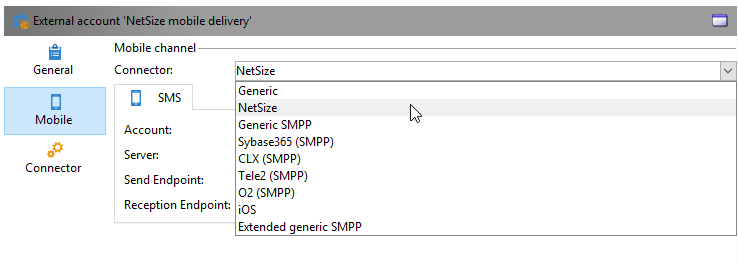

# SMS-kanal{#sms-channel}

Med Adobe Campaign kan ni utföra massanpassade leveranser av SMS-meddelanden. Mottagarprofilerna måste innehålla minst ett mobiltelefonnummer.

>[!NOTE]
>
>Med Adobe Campaign kan ni också skicka meddelanden på mobilterminaler via alternativet **Adobe Campaign Mobile App Channel (NMAC)** .
> 
>Mer information finns i avsnittet [Om mobilappskanaler](../../delivery/using/about-mobile-app-channel.md) .

Avsnitten nedan innehåller information som är specifik för SMS-kanalen. Global information om hur du skapar en leverans finns i[det här avsnittet](../../delivery/using/steps-about-delivery-creation-steps.md).

## Konfigurera SMS-kanal {#setting-up-sms-channel}

Om du vill skicka till en mobiltelefon behöver du:

1. Ett externt konto som anger en koppling och typ av meddelande.

   Tillgängliga anslutningar är: NetSize, Generic SMPP (SMPP version 3.4 med stöd för binärt läge), Sybase365 (SAP SMS 365), CLX Communications, Tele2, O2 och Extended generisk SMPP.

1. En leveransmall där det här externa kontot refereras.

### Aktivera ett externt konto {#activating-an-external-account}

Listan över externa konton finns i noden **[!UICONTROL Platform]** > **[!UICONTROL External accounts]** i Adobe Campaign Explorer-trädet.

* Gå till exempel till standardkontot **[!UICONTROL NetSize mobile delivery]**.
* Markera kryssrutan på **[!UICONTROL General]** fliken **[!UICONTROL Enabled]** .

   

* Kontrollera att **[!UICONTROL Mobile]** alternativet är markerat för **[!UICONTROL Channel]** fältet.
* Välj en koppling i listrutan på **[!UICONTROL Mobile]** fliken: NetSize, Generic SMPP, Sybase365 (SAP SMS 365), CLX Communications, Tele2, O2 eller Extended generisk SMPP. Mer information om den utökade allmänna SMPP-anslutningen finns i avsnittet [Skapa ett externt SMPP-konto](#creating-an-smpp-external-account) .

   

* Konfigurera kontakten enligt informationen från leverantören. I exemplet nedan är operatorn NetSize.

   

* På **[!UICONTROL Connector]** fliken låter du det **[!UICONTROL Call Web Service]** aktiveringsläge som är valt som standard.

   

* Om fliken **[!UICONTROL Connector]** visas anger du anslutningens URL. Adressen måste sluta i **netsize.jsp** om din leverantör är NetSize. För alla andra kopplingar avslutas URL-adressen med **smpp34.jsp**.

### Skapa ett SMPP-externt konto {#creating-an-smpp-external-account}

Om du vill använda SMPP-protokollet kan du även skapa ett nytt externt konto.

Mer information om SMS-protokoll och inställningar finns i den här [tekniska informationen](https://helpx.adobe.com/campaign/kb/sms-connector-protocol-and-settings.html).

Gör så här:

1. Klicka på **[!UICONTROL Platform]** ikonen i noden **[!UICONTROL External accounts]** > **[!UICONTROL New]** i trädet.
1. Definiera kontotypen som **Routning**, kanalen som **mobil (SMS)** och leveransläget som **massleverans**.

   

1. Markera **[!UICONTROL Enabled]** rutan.
1. Välj **[!UICONTROL Mobile]** från **[!UICONTROL Extended generic SMPP]** **[!UICONTROL Connector]** listrutan på fliken.

   

   Med det här **[!UICONTROL Enable verbose SMPP traces in the log file]** alternativet kan du dumpa all SMPP-trafik i loggfiler. Det här alternativet måste vara aktiverat för att felsöka anslutningen och jämföra med den trafik som leverantören ser.

1. Kontakta din SMS-leverantör som förklarar hur du fyller i de olika externa kontofälten på **[!UICONTROL Connection settings]** fliken.

   Kontakta sedan leverantören, beroende på vilken som har valts, som ger dig värdet att ange i **[!UICONTROL SMSC implementation name]** fältet.

   Du kan definiera antalet anslutningar till providern per underordnat MTA-objekt. Som standard är den inställd på 1.

1. Som standard uppfyller antalet tecken i ett SMS GSM-standarden.

   SMS-meddelanden som använder GSM-kodning får innehålla högst 160 tecken eller 153 tecken per SMS för meddelanden som skickas i flera delar.

   >[!NOTE]
   >
   >Vissa tecken räknas som två (klammerparenteser, eurosymbolen osv.).
   >
   >Nedan visas en lista över tillgängliga GSM-tecken.

   Om du vill kan du godkänna teckenomläsning genom att markera motsvarande ruta.

   

   For more on this, refer to [this section](#about-character-transliteration).

1. På **[!UICONTROL Throughput and delays]** fliken kan du ange maximal genomströmning för utgående meddelanden (&quot;MT&quot;, Mobile Terminated) i MT per sekund. Om du anger &quot;0&quot; i motsvarande fält är dataflödet obegränsat.

   Värdena för alla fält som motsvarar varaktighet måste fyllas i i sekunder.

1. På **[!UICONTROL Mapping of encodings]** fliken kan du definiera kodningar.

   For more on this, refer to [this section](#about-text-encodings).

1. Alternativet är som standard inaktiverat på **[!UICONTROL SMSC specificities]** fliken **[!UICONTROL Send full phone number]** . Aktivera det inte om du vill respektera SMPP-protokollet och bara överföra siffror till servern för SMS-providern (SMSC).

   Eftersom vissa leverantörer kräver att&quot;+&quot;-prefixet används, bör du kontakta din leverantör och föreslå att du aktiverar det här alternativet om det behövs.

   Med **[!UICONTROL Enable TLS over SMPP]** kryssrutan kan du kryptera SMPP-trafik. Mer information finns i denna [tekniska anmärkning](https://helpx.adobe.com/campaign/kb/sms-connector-protocol-and-settings.html).

1. Om du konfigurerar en **[!UICONTROL Extended generic SMPP]** koppling kan du ställa in automatiska svar.

   For more on this, refer to [this section](#automatic-reply).

### Om teckenomläsning {#about-character-transliteration}

Teckentranskribering kan ställas in i ett externt SMPP-konto för mobil leverans, under **[!UICONTROL Mobile]** fliken.

Translitterering består i att ersätta ett tecken i ett SMS med ett annat om det tecknet inte beaktas av GSM-standarden.

* Om transkriberingen är **[!UICONTROL authorized]** så ersätts varje tecken som inte beaktas av ett GSM-tecken när meddelandet skickas. Bokstaven&quot;ë&quot; ska till exempel ersättas med&quot;e&quot;. Meddelandet ändras därför något, men teckengränsen är densamma.
* När transkriberingen är **[!UICONTROL not authorized]** klar skickas varje meddelande som innehåller tecken som inte tas med i beräkningen i binärt format (Unicode): alla tecken skickas därför som de är. SMS-meddelanden som använder Unicode är dock begränsade till 70 tecken (eller 67 tecken per SMS för meddelanden som skickas i flera delar). Om det maximala antalet tecken överskrids skickas flera meddelanden, vilket kan medföra extra kostnader.

>[!IMPORTANT]
>
>Om du infogar anpassningsfält i innehållet i SMS-meddelandet kan det medföra tecken som GSM-kodningen inte tar hänsyn till.

Som standard är teckentranslitterering inaktiverat. Om du vill att alla tecken i SMS-meddelanden ska behållas som de är, bör du inte aktivera det här alternativet om du inte vill ändra egennamn.

Om dina SMS-meddelanden innehåller många tecken som genererar Unicode-meddelanden kan du välja att aktivera det här alternativet för att begränsa kostnaderna för att skicka meddelanden.

I följande tabell visas de tecken som GSM-standarden tar hänsyn till. Alla tecken som infogats i meddelandetexten, förutom de som nämns nedan, konverterar hela meddelandet till binärt format (Unicode) och begränsar det därför till 70 tecken.

**Grundläggande tecken**

<table> 
 <tbody> 
  <tr> 
   <td> @ </td> 
   <td>  </td> 
   <td> SP </td> 
   <td> 0 </td> 
   <td> ¡ </td> 
   <td> P </td> 
   <td> ¿ </td> 
   <td> p </td> 
  </tr> 
  <tr> 
   <td> £ </td> 
   <td> _ </td> 
   <td> ! </td> 
   <td> 1 </td> 
   <td> A </td> 
   <td> Q </td> 
   <td> a </td> 
   <td> q </td> 
  </tr> 
  <tr> 
   <td> $ </td> 
   <td>  </td> 
   <td> " </td> 
   <td> 2 </td> 
   <td> B </td> 
   <td> R </td> 
   <td> b </td> 
   <td> r </td> 
  </tr> 
  <tr> 
   <td> ¥ </td> 
   <td>  </td> 
   <td> # </td> 
   <td> 3 </td> 
   <td> C </td> 
   <td> S </td> 
   <td> c </td> 
   <td> s </td> 
  </tr> 
  <tr> 
   <td> É </td> 
   <td>  </td> 
   <td> ¤ </td> 
   <td> 4 </td> 
   <td> D </td> 
   <td> T </td> 
   <td> d </td> 
   <td> t </td> 
  </tr> 
  <tr> 
   <td> é </td> 
   <td>  </td> 
   <td> % </td> 
   <td> 5 </td> 
   <td> E </td> 
   <td> U </td> 
   <td> e </td> 
   <td> u </td> 
  </tr> 
  <tr> 
   <td> ñ </td> 
   <td>  </td> 
   <td> &amp; </td> 
   <td> 6 </td> 
   <td> F </td> 
   <td> V </td> 
   <td> f </td> 
   <td> v </td> 
  </tr> 
  <tr> 
   <td> Maximum </td> 
   <td>  </td> 
   <td> ' </td> 
   <td> 7 </td> 
   <td> G </td> 
   <td> B </td> 
   <td> g </td> 
   <td> w </td> 
  </tr> 
  <tr> 
   <td> systemkrav </td> 
   <td>  </td> 
   <td> ( </td> 
   <td> 8 </td> 
   <td> H </td> 
   <td> X </td> 
   <td> h </td> 
   <td> x </td> 
  </tr> 
  <tr> 
   <td> else </td> 
   <td>  </td> 
   <td> ) </td> 
   <td> 9 </td> 
   <td> I </td> 
   <td> Y </td> 
   <td> i </td> 
   <td> y </td> 
  </tr> 
  <tr> 
   <td> LF </td> 
   <td>  </td> 
   <td> * </td> 
   <td> : </td> 
   <td> J </td> 
   <td> Z </td> 
   <td> j </td> 
   <td> z </td> 
  </tr> 
  <tr> 
   <td> Ø </td> 
   <td> ESC </td> 
   <td> + </td> 
   <td> ; </td> 
   <td> K </td> 
   <td> Ä </td> 
   <td> k </td> 
   <td> ä </td> 
  </tr> 
  <tr> 
   <td> ø </td> 
   <td> AE </td> 
   <td> , </td> 
   <td> &lt; </td> 
   <td> L </td> 
   <td> Ö </td> 
   <td> l </td> 
   <td> ö </td> 
  </tr> 
  <tr> 
   <td> CR </td> 
   <td> æ </td> 
   <td> - </td> 
   <td> = </td> 
   <td> M </td> 
   <td> Ð </td> 
   <td> m </td> 
   <td> ñ </td> 
  </tr> 
  <tr> 
   <td> Å </td> 
   <td> ß </td> 
   <td> . </td> 
   <td> &gt; </td> 
   <td> N </td> 
   <td> Ü </td> 
   <td> n </td> 
   <td> ä </td> 
  </tr> 
  <tr> 
   <td> å </td> 
   <td> É </td> 
   <td> / </td> 
   <td> ? </td> 
   <td> O </td> 
   <td> § </td> 
   <td> o </td> 
   <td> à </td> 
  </tr> 
 </tbody> 
</table>

SP: Blanksteg

ESC: Escape

LF: Radmatning

CR: Radretur

**Avancerade tecken (två gånger)**

^ { } `[ ~ ]` | €

### Om textkodning {#about-text-encodings}

När du skickar ett SMS-meddelande kan Adobe Campaign använda en eller flera textkodningar. Varje kodning har en egen specifik teckenuppsättning och avgör antalet tecken som får plats i ett SMS-meddelande.

När du konfigurerar ett nytt externt SMPP-konto för mobil leverans kan du definiera **[!UICONTROL Mapping of encodings]** på **[!UICONTROL Mobile]** fliken: i **[!UICONTROL data_coding]** fältet kan Adobe Campaign meddela vilken kodning som används för SMSC.

>[!NOTE]
>
>Mappningen mellan **data_coding** -värdet och den kodning som faktiskt används är standardiserad. Vissa SMSC har dock en egen specifik mappning: I det här fallet måste **Adobe Campaign** -administratören deklarera den här mappningen. Kontakta din leverantör för mer information.

Du kan deklarera **data_codings** och tvinga fram kodningen om det behövs: Om du vill göra det anger du en enda kodning i tabellen.

* När ingen mappning av kodningar har definierats får kopplingen ett generiskt beteende:

   * Den försöker använda GSM-kodning som den tilldelar värdet **data_coding = 0**.
   * Om GSM-kodningen misslyckas används **UCS2** -kodning som värdet **data_coding = 8** tilldelas till.

* När du definierar de kodningar som du vill använda samt de länkade **[!UICONTROL data_coding]** fältvärdena, kommer Adobe Campaign att försöka använda den första kodningen i listan och sedan följande, om den första kodningen visar sig vara omöjlig.

>[!IMPORTANT]
>
>Deklarationsordningen är viktig: Vi rekommenderar att du placerar listan i stigande ordning **för kostnader** för att kunna välja kodningar så att du får plats med så många tecken som möjligt i varje SMS.
>
>Deklarera bara de kodningar som du vill använda. Om en del av de kodningar som SMSC tillhandahåller inte stämmer överens med ditt användningsändamål ska de inte tas upp i listan.

### Automatiskt svar {#automatic-reply}

När du konfigurerar en utökad allmän SMPP-anslutning kan du konfigurera automatiska svar.

När en prenumerant svarar på ett SMS-meddelande som skickades till dem via Adobe Campaign och deras meddelande innehåller ett nyckelord som&quot;STOP&quot;, kan du konfigurera meddelanden som automatiskt skickas tillbaka till dem i **[!UICONTROL Automatic reply sent to the MO]** avsnittet.

>[!NOTE]
>
>Nyckelorden är inte skiftlägeskänsliga.

För varje nyckelord anger du en kort kod, vilket är ett nummer som vanligtvis används för att skicka leveranser och som fungerar som avsändarnamn, och anger sedan meddelandet som ska skickas till prenumeranten.

Du kan även länka en åtgärd till ditt automatiska svar: **[!UICONTROL Send to quarantine]** eller **[!UICONTROL Remove from quarantine]**. Om en mottagare t.ex. skickar nyckelordet &quot;STOP&quot; får han/hon automatiskt en bekräftelse på att han/hon inte längre är prenumererad och skickas till karantän.


Om du länkar åtgärden till ett automatiskt svar tas mottagarna som skickar motsvarande nyckelord automatiskt bort från karantänen. **[!UICONTROL Remove from quarantine]**

Mottagarna visas i den **[!UICONTROL Non deliverables and addresses]** tabell som är tillgänglig via **[!UICONTROL Administration]** > **[!UICONTROL Campaign Management]** > **[!UICONTROL Non deliverables Management]** .

* Om du vill skicka samma svar oavsett den korta koden lämnar du kolumnen tom **[!UICONTROL Short code]** .
* Om du vill skicka samma svar oavsett vilket nyckelord du använder lämnar du kolumnen **[!UICONTROL Keyword]** tom.
* Om du vill utföra en åtgärd utan att skicka ett svar lämnar du **[!UICONTROL Response]** kolumnen tom. På så sätt kan du till exempel ta bort en användare som svarar med ett annat meddelande än&quot;STOP&quot; från karantänen.

Om du har flera externa konton som använder den utökade allmänna SMPP-anslutningen med samma leverantörskonto kan följande problem uppstå: när du skickar ett svar till en kort kod kan det tas emot på någon av dina externa kontoanslutningar. Det automatiska svaret som skickas kunde därför inte vara det förväntade meddelandet.
Du undviker detta genom att använda någon av följande lösningar, beroende på vilken leverantör du använder:
* Skapa ett leverantörskonto för varje externt konto.
* Använd **[!UICONTROL System type]** fältet från fliken **[!UICONTROL Mobile]** > **[!UICONTROL Connection settings]** för att skilja på kortkoderna. Fråga leverantören ett annat värde för varje konto.

   

Stegen för att konfigurera ett externt konto med den utökade generiska SMPP-anslutningen beskrivs i avsnittet [Skapa ett externt SMPP-konto](../../delivery/using/sms-channel.md#creating-an-smpp-external-account) .

### Ändra leveransmallen {#changing-the-delivery-template}

Adobe Campaign ger er en mall för att leverera till mobiler. Den här mallen är tillgänglig i **[!UICONTROL Resources > Templates > Delivery templates]** noden. Mer information finns i avsnittet [Om mallar](../../delivery/using/about-templates.md) .

Om du vill leverera via SMS-kanal måste du skapa en mall där kanalkopplingen refereras.

För att behålla den inbyggda leveransmallen rekommenderar vi att du duplicerar den och sedan konfigurerar den.

I exemplet nedan skapar vi en mall för att leverera meddelanden via NetSize-kontot som aktiverats tidigare. Så här gör du:

1. Gå till **[!UICONTROL Delivery templates]** noden.
1. Högerklicka på **[!UICONTROL Send to mobiles]** mallen och välj **[!UICONTROL Duplicate]**.

   

1. Ändra mallens etikett.

   

1. Klicka på **[!UICONTROL Properties]**.
1. På fliken **[!UICONTROL General]** väljer du ett routningsläge som motsvarar ett externt konto som du har konfigurerat, till exempel **[!UICONTROL NetSize mobile delivery]**.

   

1. Klicka **[!UICONTROL Save]** för att skapa mallen.

   

Du har nu ett externt konto och en leveransmall som gör att du kan leverera via SMS.

## Skapa en SMS-leverans {#creating-a-sms-delivery}

### Välja leveranskanal {#selecting-the-delivery-channel}

Följ stegen nedan för att skapa en ny SMS-leverans:

>[!NOTE]
>
>Globala koncept för leveransskapande beskrivs i [det här avsnittet](../../delivery/using/steps-about-delivery-creation-steps.md).

1. Skapa en ny leverans, till exempel från kontrollpanelen Leverans.
1. Välj leveransmallen **[!UICONTROL Send to mobiles (NetSize)]** som du skapade tidigare. Mer information finns i avsnittet [Ändra leveransmall](#changing-the-delivery-template) .

   

1. Identifiera leveransen med en etikett, kod och beskrivning. For more on this, refer to [this section](../../delivery/using/steps-create-and-identify-the-delivery.md#identifying-the-delivery).
1. Klicka **[!UICONTROL Continue]** för att bekräfta informationen och visa meddelandekonfigurationsfönstret.

## Definiera SMS-innehåll {#defining-the-sms-content}

Följ stegen nedan för att skapa innehållet i SMS:et:

1. Ange innehållet i meddelandet i **[!UICONTROL Text content]** avsnittet i guiden. Med verktygsfältsknapparna kan du importera, spara och söka i innehåll. Den sista knappen används för att infoga anpassningsfält.

   

   Användningen av personaliseringsfält beskrivs i avsnittet [Om personalisering](../../delivery/using/about-personalization.md) .

1. Klicka **[!UICONTROL Preview]** längst ned på sidan för att visa återgivningen av meddelandet med dess personalisering. Om du vill starta förhandsgranskningen väljer du en mottagare med hjälp av knappen **[!UICONTROL Test personalization]** i verktygsfältet. Du kan välja en mottagare bland de definierade målen eller en annan mottagare.

   

   Du kan godkänna SMS-meddelandet. Du kan även visa innehållet i SMS-meddelandet på mobiltelefonskärmen till höger om innehållsredigeraren. Klicka på skärmen och använd musen för att bläddra igenom innehållet.

   

1. Klicka på **[!UICONTROL Data loaded]** länken om du vill visa information om mottagaren.

   

   >[!NOTE]
   >
   >SMS-meddelanden är begränsade till en längd på 160 tecken om den latinska 1-teckentabellen (ISO-8859-1) används. Om meddelandet skrivs i Unicode får det inte innehålla fler än 70 tecken. Vissa specialtecken kan påverka meddelandets längd. Mer information om meddelandets längd finns i avsnittet [Om teckenomläsning](#about-character-transliteration) .
   >
   >När det finns anpassningsfält eller fält för villkorligt innehåll varierar meddelandets storlek från en mottagare till en annan. Meddelandets längd måste utvärderas när personalisering har utförts.
   >
   >När du startar analysen kontrolleras meddelandets längd och en varning visas om det skulle uppstå ett spill.

1. Om du använder NetSize-anslutningen eller en SMPP-anslutning kan du anpassa namnet på leveransavsändaren. Mer information finns i avsnittet [Avancerade parametrar](#advanced-parameters) .

## Välja målpopulation {#selecting-the-target-population}

Den detaljerade processen när målpopulationen för en leverans väljs visas i [det här avsnittet](../../delivery/using/steps-defining-the-target-population.md).

Mer information om användningen av personaliseringsfält finns i [Om personalisering](../../delivery/using/about-personalization.md).

Mer information om hur du tar med en startvärdeslista finns i [Om startadresser](../../delivery/using/about-seed-addresses.md).

## Skicka SMS-meddelanden {#sending-sms-messages}

Klicka på **[!UICONTROL Send]** om du vill godkänna meddelandet och skicka det till mottagarna av leveransen som skapas.

Den detaljerade processen för att validera och skicka en leverans presenteras i avsnitten nedan:

* [Verifierar leveransen](../../delivery/using/steps-validating-the-delivery.md)
* [Skicka leveransen](../../delivery/using/steps-sending-the-delivery.md)

### Avancerade parametrar {#advanced-parameters}

Knappen ger åtkomst till den avancerade parametern för leverans. **[!UICONTROL Properties]** Parametrarna som är specifika för SMS-leveranser finns i avsnittet **[!UICONTROL SMS parameters]** på **[!UICONTROL Delivery]** fliken.

Följande alternativ är tillgängliga:

* **Avsändarens adress** (endast för NetSize-anslutningar och SMPP-anslutningar): Med kan du anpassa namnet på avsändaren med en alfanumerisk teckensträng som är begränsad till elva tecken. Fältet får inte uteslutande bestå av siffror. Du kan definiera ett villkor som ska visas, t.ex. med olika namn beroende på mottagarens riktnummer:

   ```
   <% if( String(recipient.mobilePhone).indexOf("+1") == 0){ %>NeoShopUS<%} else %>
   ```

   >[!IMPORTANT]
   >
   >Läs lagen i ditt land om hur du redigerar avsändarnamn. Du bör också fråga din operatör om de erbjuder den här funktionen.

* **Överföringsläge**: meddelandeöverföring via SMS.
* **Prioritet**: prioritetsnivå som tilldelats ett meddelande. **[!UICONTROL Normal]** som standard är prioritet vald. Fråga tjänsteleverantören om kostnaden för SMS som skickas med **[!UICONTROL High]** prioritet.
* **Typ av program**: välj det program som du vill tilldela din SMS-leverans. Alternativet är som standard **[!UICONTROL Direct Marketing]** markerat och det är det vanligaste alternativet.

**Parametrar som är specifika för NetSize-kopplingen**


* **Använd flera SMS för ett enda meddelande**: Detta gör att du kan skicka ett meddelande som är längre än 160 tecken via flera SMS-meddelanden.

**Parametrar som är specifika för en SMPP-anslutning**


* **Högsta antal SMS per meddelande**: Med det här alternativet kan du ange hur många SMS som ska användas för att skicka ett meddelande. Om värdet är 0 kan du skicka meddelandet med ett SMS. Om antalet SMS är inställt på 1 eller 2 och meddelandet överskrider tröskelvärdet skickas det inte.

## Övervaka och spåra SMS-leveranser {#monitoring-and-tracking-sms-deliveries}

När du har skickat meddelanden kan du övervaka och spåra dina leveranser. Mer information finns i följande avsnitt:

* [Övervaka leverans](../../delivery/using/monitoring-a-delivery.md)
* [Om leveransfel](../../delivery/using/understanding-delivery-failures.md)
* [Om meddelandespårning](../../delivery/using/about-message-tracking.md)

## Bearbetar inkommande meddelanden {#processing-inbound-messages}

SMS-modulen **nlserver** frågar SMS-routern med regelbundna intervall. På så sätt kan Adobe Campaign spåra leveransförloppet och hantera statusrapporter och mottagarnas begäran om att avbryta prenumerationen.

* **Statusrapporter**: visa leveransloggar för att kontrollera status för dina meddelanden.

   >[!NOTE]
   >
   >Varje SMS som skickas är länkat till ett externt konto och dess primärnyckel. På det här sättet:
   >
   > * Statusrapporter från ett borttaget externt SMS-konto bearbetas inte korrekt.
   > * Ett SMS-konto kan bara länkas till ett enda externt konto för att säkerställa att statusrapporter tilldelas rätt konto


* **Avbeställ**: Mottagare som inte längre vill ta emot SMS-leveranser kan returnera ett meddelande som innehåller ordet STOP. Om din leverantör tillåter det enligt villkoren i kontraktet kan du hämta meddelanden via arbetsflödesaktiviteten för **inkommande SMS** och sedan skapa en fråga som aktiverar alternativet **Kontakta inte längre den här mottagaren** för de berörda mottagarna.

   Se [Handboken för arbetsflöden](../../workflow/using/executing-a-workflow.md#architecture) .

## InSMS-schema {#insms-schema}

InSMS-schemat innehåller information som är relevant för inkommande SMS. En beskrivning av dessa fält är tillgänglig via attributet desc.

* **meddelande**: det SMS som togs emot.
* **ursprung**: mobilnummer i meddelandets ursprung.
* **providerId**: Identifierare för det meddelande som returneras av SMSC (meddelandecenter).
* **skapad**: datum då inkommande meddelande infogades i Adobe Campaign.
* **TextAccount**: Externt konto för Adobe Campaign.

   >[!IMPORTANT]
   >
   >Följande fält är specifika för NetSize.
   >
   >Om operatorn som används inte är NetSize, betraktas dessa fält som tomma.

* **alias**: alias för inkommande meddelande.
* **avgränsare**: avgränsare mellan aliaset och meddelandets brödtext.
* **messageDate**: meddelandedatum angivet av operator.
* **receiveDate**: Datummeddelande från operatorn togs emot av SMSC (meddelandecenter).
* **deliveryDate**: Datummeddelande från SMSC (meddelandecenter).
* **largeAccount**: kundkontokod länkad till inkommande SMS.
* **countryCode**: landskod för operator.
* **operatorCode**: operatörens nätverkskod.
* **linkedSmsId**: Adobe Campaign-identifieraren (broadlogId) länkad till utgående SMS, där detta SMS är svaret.

## Hantera automatiska svar (amerikansk förordning) {#managing-automatic-replies--american-regulation-}

När prenumeranter besvarar ett SMS-meddelande som skickats till dem via Adobe Campaign och de använder ett nyckelord som STOP, HELP eller YES måste de på den amerikanska marknaden konfigurera meddelanden som returneras automatiskt.

Om mottagarna skickar nyckelordet STOP får de automatiskt ett bekräftelsemeddelande om att de har avbeställt prenumerationen.

Avsändarnamnet för den här meddelandetypen är en kort kod som vanligtvis används för att skicka leveranser.

>[!IMPORTANT]
>
>Följande detaljerade procedur gäller bara för SMPP-anslutningar, utom för den utökade generiska SMPP-anslutningen. Mer information finns i avsnittet [Skapa ett externt SMPP-konto](#creating-an-smpp-external-account) .
>
>Det utgör en del av den certifieringsprocess som utförs av amerikanska aktörer för marknadsföringskampanjer i USA. Dessa svar på SMS-meddelanden som innehåller nyckelordet måste skickas tillbaka till prenumeranten omedelbart efter att ett meddelande har tagits emot.

1. Skapa den här typen av XML-fil:

   ```
   <autoreply>
     <shortcode name="12345">
       <reply keyword="STOP" text="You will not receive SMS anymore" />
       <reply keyword="HELP" text="Powered by Adobe Campaign" />
     </shortcode>
     <shortcode name="43115">
       <reply keyword="STOP" text="Vous ne recevrez plus de SMS" />
       <reply keyword="HELP" text="Service rendu par Adobe Campaign" />
     </shortcode>
     <shortcode name="*">
       <reply keyword="ADOBE" text="This text is replied when you send ADOBE to any short code" />
     </shortcode>
   </autoreply>
   ```

1. För **name** -attributet för **`<shortcode>`** -taggen anger du den korta kod som ska visas i stället för meddelandets avsändarnamn.

   I varje **`<reply>`** tagg anger du **nyckelordsattributet** med ett nyckelord och **textattributet** med det meddelande som du vill skicka för det här nyckelordet.

   >[!NOTE]
   >
   >Varje nyckelord måste skrivas med versaler.

   Om du vill skicka samma meddelande för flera nyckelord duplicerar du motsvarande rad.

   Exempel:

   ```
   <reply keyword="STOP" text="You will not receive SMS anymore" />
   <reply keyword="QUIT" text="You will not receive SMS anymore" />
   ```

1. När du är klar sparar du den här filen under namnet **smsAutoReply.xml**.

   Observera att filens namn är skiftlägeskänsligt i Linux.

1. Kopiera den här filen till **conf** -katalogen i Adobe Campaign, på samma plats som webbservern.

>[!IMPORTANT]
>
>Den här typen av automatiska meddelanden sparar ingen historik. Därför visas de inte på [leveranskontrollpanelen](../../delivery/using/monitoring-a-delivery.md#delivery-dashboard).
>
>Dessa meddelanden anses inte ingå i [reglerna](../../campaign/using/pressure-rules.md)om handelstryck.
