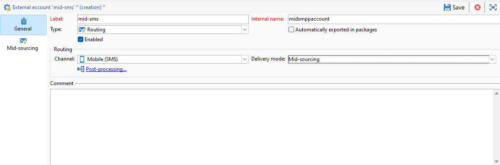

# Konfigurera SMS-kanal på en infrastruktur för mellanleverantörer {#setting-up-sms-channel}

Om du vill skicka till en mobiltelefon med mellanservrar behöver du:

1. En SMS-operator har skapats på Mid-servern som används för det externa SMS-kontot som har skapats på marknadsföringsservern.

1. Ett externt konto på marknadsföringsservern som anger kanalläge och leveranssätt.

1. Ett externt konto på Mid-servern, med information om koppling och meddelandetyp.

1. En leveransmall som refererar till det externa kontot för att effektivisera sändningsprocessen.

>[!NOTE]
>
> För SMS-leveranser bör typologin använda en specifik SMS-tillhörighet som skapats i **en** dedikerad programserverbehållare. [Läs mer](../../installation/using/configure-delivery-settings.md#managing-outbound-smtp-traffic-with-affinities)

## Skapa SMS-operatorn på Mid-servern {#create-sms-operator}

Om du vill starta konfigurationsprocessen måste du skapa en SMS-operator på Mid-servern specifikt för det externa kontot.

>[!IMPORTANT]
>
>Varje SMS-koppling kräver en unik SMS-operator.

1. I **[!UICONTROL Administration]** > **[!UICONTROL Access management]** > **[!UICONTROL Operators node]** trädnod, klicka på **[!UICONTROL New]** -ikon.

   

1. Ange användarens **[!UICONTROL Identification parameters]**, inklusive inloggning, lösenord och namn. Inloggning och lösenord krävs för att operatorn ska kunna logga in på Adobe Campaign på ett säkert sätt.

   Observera att **[!UICONTROL Name (login)]** används senare för att namnge ditt SMPP-externa konto på Mid-servern.

   

1. Välj de behörigheter som tilldelats operatorn i området Operator access rights.

   Om du vill tilldela behörigheter till operatorn klickar du på **[!UICONTROL Add]** ovanför behörighetslistan. Välj sedan en **[!UICONTROL Operator group]** eller **[!UICONTROL Named rights]** i listan med tillgängliga grupper.

   

1. Klicka **[!UICONTROL Save]** för att slutföra skapandet av operatorn. Profilen finns nu med i listan över befintliga operatorer.

## Skapa ett externt SMS-konto på marknadsföringsservern {#create-accound-mkt}

Om du vill skicka ett SMS till en mobiltelefon med mellanservrar måste du först skapa ett externt SMS-konto på marknadsföringsservern.

1. I **[!UICONTROL Platform]** > **[!UICONTROL External accounts]** trädnod, klicka på **[!UICONTROL New]** -ikon.

   

1. Skriv in **[!UICONTROL Label]** och **[!UICONTROL Internal name]**. Observera att det interna namnet ska användas senare för att namnge ditt SMPP-externa konto på Mid-servern.

1. Definiera kontotypen som **[!UICONTROL Routing]**, kanalen **[!UICONTROL Mobile (SMS)]** och leveranssättet som **[!UICONTROL Mid-sourcing]**.

   

1. I **[!UICONTROL Mid-Sourcing]** anger du anslutningsparametrarna för servern med mellankällkod.

   Ange information om [tidigare skapad SMS-koppling](#create-sms-operator) i **[!UICONTROL Account]** och **[!UICONTROL Password]** fält.

   

1. Bekräfta konfigurationen genom att klicka på **[!UICONTROL Test the connection]**.

1. Klicka på **[!UICONTROL Save]**.

## Skapa ett externt SMPP-konto på Mid-servern {#creating-smpp-mid}

>[!IMPORTANT]
>
>Om du använder samma konto och lösenord för flera externa SMS-konton kan det leda till konflikter och överlappning mellan kontona. Se [Felsökningssida för SMS](troubleshooting-sms.md#external-account-conflict).

När du har konfigurerat ditt externa SMS-konto på marknadsföringsservern är nästa steg att skapa ett externt SMPP-konto på Mid-servern.

Mer information om SMS-protokoll och inställningar finns i [page](sms-protocol.md).

Gör så här:

1. I **[!UICONTROL Platform]** > **[!UICONTROL External accounts]** trädnod, klicka på **[!UICONTROL New]** -ikon.

1. Skriv in **[!UICONTROL Label]** och **[!UICONTROL Internal name]**.

   >[!WARNING]
   >
   >När en **[!UICONTROL Internal name]**ska du följa den angivna namnkonventionen:
   >  `SMS Operator Name_Internal Name of the Marketing SMS external account`

   

1. Definiera kontotypen som **Routning**, kanalen **Mobil (SMS)** och leveranssättet som **Massleverans**.

   

1. Kontrollera **[!UICONTROL Enabled]** box.

1. I **[!UICONTROL Mobile]** flik, välja **[!UICONTROL Extended generic SMPP]** från **[!UICONTROL Connector]** listruta.

   

1. The **[!UICONTROL Enable verbose SMPP traces in the log file]** kan du dumpa all SMPP-trafik i loggfiler. Det här alternativet bör bara aktiveras för att felsöka anslutningen och jämföra med den trafik som leverantören ser.

1. Kontakta din SMS-leverantör som förklarar hur du fyller i de olika externa kontofälten från **[!UICONTROL Connection settings]** -fliken.

   Kontakta sedan din leverantör, beroende på vilken som har valts, som ger dig värdet att ange i **[!UICONTROL SMSC implementation name]** fält.

   Du kan definiera antalet anslutningar till providern per underordnat MTA-objekt. Som standard är den inställd på 1.

1. Som standard uppfyller antalet tecken i ett SMS GSM-standarden.

   SMS-meddelanden som använder GSM-kodning kan innehålla högst 160 tecken eller 153 tecken per SMS för meddelanden som skickas i flera delar.

   >[!NOTE]
   >
   >Vissa tecken räknas som två (klammerparenteser, eurosymbolen osv.).
   >
   >En lista över tillgängliga GSM-tecken finns i [det här avsnittet](sms-set-up.md#about-character-transliteration).

   Du kan också godkänna teckentranskriberingen genom att markera motsvarande ruta.

   

1. I **[!UICONTROL Throughput and delays]** kan du ange maximal genomströmning av utgående meddelanden (&quot;MT&quot;, Mobile Terminated) i MT per sekund. Om du anger &quot;0&quot; i motsvarande fält är dataflödet obegränsat.

   Samtliga fältvärden som motsvarar varaktighet måste fyllas i som sekunder.

1. I **[!UICONTROL Mapping of encodings]** kan du definiera kodningar.

   Mer information om detta finns i [det här avsnittet](sms-set-up.md#about-text-encodings).

1. I **[!UICONTROL SMSC specificities]** -fliken, **[!UICONTROL Send full phone number]** är inaktiverat som standard. Aktivera det inte om du vill respektera SMPP-protokollet och bara överföra siffror till servern för SMS-providern (SMSC).

   Eftersom vissa leverantörer kräver att&quot;+&quot;-prefixet används, bör du kontakta din leverantör och föreslå att du aktiverar det här alternativet om det behövs.

   The **[!UICONTROL Enable TLS over SMPP]** kan du kryptera SMPP-trafik. Se denna [sida](sms-protocol.md) för mer information om detta.

1. Om du konfigurerar en **[!UICONTROL Extended generic SMPP]** kan du konfigurera automatiska svar.

   Mer information om detta finns i [det här avsnittet](sms-set-up.md#automatic-reply).

## Ändra leveransmallen {#changing-the-delivery-template}

Adobe Campaign erbjuder en mobil leveransmall som finns i **[!UICONTROL Resources > Templates > Delivery templates]** nod. Mer information finns i [Om mallar](about-templates.md) -avsnitt.

Om du vill skicka meddelanden via SMS-kanalen måste du skapa en mall som innehåller en referens till kanalkopplingen.

Om du vill behålla den inbyggda leveransmallen rekommenderar vi att du duplicerar den och sedan konfigurerar den.

I exemplet nedan genererar vi en mall som gör det lättare att leverera meddelanden via det SMPP-konto som skapats tidigare. Så här gör du:

1. I **[!UICONTROL Resources]** > **[!UICONTROL Templates]** > **[!UICONTROL Delivery templates]** trädnod, högerklicka på **[!UICONTROL Send to mobiles]** mall och välj **[!UICONTROL Duplicate]**.

   

1. Ändra mallens etikett, till exempel **Skickat till mobiler (SMPP)**.

   

1. Klicka på **[!UICONTROL Properties]**.

1. I **[!UICONTROL General]** väljer du ett routningsläge som motsvarar det externa konto som du skapade i avsnittet [Skapa ett externt SMS-konto på marknadsföringsservern](#create-accound-mkt).

   

1. Klicka **[!UICONTROL Save]** för att skapa mallen.

   

Du har nu ett externt konto och en leveransmall som gör att du kan leverera via SMS.

## Relaterade ämnen {#related-topics}

* [SMS-teckentranskribering](sms-set-up.md#about-character-transliteration)
* [Textkodning](sms-set-up.md#about-text-encodings)
* [Automatiskt svar](sms-set-up.md#automatic-reply)
