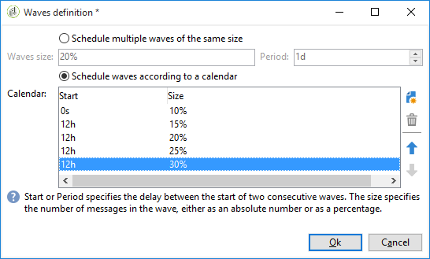

# Konfigurera och skicka leveransen {#configuring-and-sending-the-delivery}

>[!NOTE]
>
>Endast leveransägaren kan påbörja en leverans. För att en annan operator (eller operatörsgrupp) ska kunna starta en leverans måste du lägga till dem som granskare i **[!UICONTROL Delivery start:]** fältet.
>
>Mer information finns i [det här avsnittet](../../campaign/using/marketing-campaign-approval.md#selecting-reviewers) .

## Ytterligare parametrar för leverans {#delivery-additiona-parameters}

Innan du skickar leveransen kan du definiera sändningsparametrarna i leveransegenskaperna via fliken **[!UICONTROL Delivery]** .

* **[!UICONTROL Delivery priority]**: Med det här alternativet kan du påverka utskicksordningen för dina leveranser genom att ange deras prioritetsnivå (normal, hög eller låg). På så sätt kan ni prioritera beställningen av vissa, mer brådskande leveranser jämfört med andra.

* **[!UICONTROL Message batch quantity]**: Med det här alternativet kan du definiera antalet meddelanden som grupperas i samma XML-leveranspaket. Om parametern är inställd på 0 grupperas meddelandena automatiskt. Paketstorleken definieras av beräkningen `<delivery size>/1024`med minst 8 och högst 256 meddelanden per paket.

   >[!CAUTION]
   >
   >När leveransen dupliceras återställs parametern.

* **[!UICONTROL Send using multiple waves]**: Mer information finns i [Skicka med flera vågor](#sending-using-multiple-waves).

* **[!UICONTROL Test SMTP delivery]**: Med det här alternativet kan du testa att skicka en leverans via SMTP. Leveransen behandlas upp till anslutningen till SMTP-servern, men skickas inte.

   >[!NOTE]
   >
   >Du bör inte använda det här alternativet när du installerar med mellanleverantörer för att inte anropa data.
   >
   >Mer information om hur du konfigurerar en SMTP-server finns i [det här avsnittet](../../installation/using/configuring-campaign-server.md#personalizing-delivery-parameters).

* **[!UICONTROL Archive emails]**: Med det här alternativet kan du lagra e-post på ett externt system via BCC genom att helt enkelt lägga till en e-postadress för hemlig kopia till meddelandemålet. Mer information finns i [Arkivera e-post](../../delivery/using/sending-messages.md#archiving-emails).

När leveransen är konfigurerad och klar att skickas kontrollerar du att du har kört [leveransanalysen](../../delivery/using/steps-validating-the-delivery.md#analyzing-the-delivery). När du är klar klickar du **[!UICONTROL Confirm delivery]** för att starta meddelandeleveransen.

Du kan sedan stänga leveransguiden och spåra leveransen från fliken **[!UICONTROL Delivery]** , som du kommer åt via leveransinformationen eller leveranslistan.

När du har skickat meddelanden kan du övervaka och spåra dina leveranser. Mer information finns i följande avsnitt:

* [Övervaka leverans](../../delivery/using/monitoring-a-delivery.md)
* [Om leveransfel](../../delivery/using/understanding-delivery-failures.md)
* [Om meddelandespårning](../../delivery/using/about-message-tracking.md)

## Schemalägga leveransen som skickas {#scheduling-the-delivery-sending}

Du kan skjuta upp leveransen av meddelanden för att schemalägga leveransen eller för att hantera försäljningstrycket och undvika att överbelasta en population.

1. Klicka på **[!UICONTROL Send]** knappen och välj **[!UICONTROL Postpone delivery]** alternativet.

1. Ange ett startdatum i **[!UICONTROL Contact date]** fältet.

1. Du kan sedan starta leveransanalysen och bekräfta leveransen. Leveranssändningen börjar dock inte förrän det datum som anges i **[!UICONTROL Contact date]** fältet.

>[!CAUTION]
>
>När du har startat analysen är det kontaktdatum som du har definierat fixerat. Om du ändrar det här datumet måste du starta om analysen så att dina ändringar beaktas.

Leveransen visas med **[!UICONTROL Pending]** status i leveranslistan.

Schemaläggningen kan också konfigureras direkt via leveransknappen **[!UICONTROL Scheduling]** .

Du kan skjuta upp leveransen till ett senare datum eller spara leveransen i den preliminära kalendern.

* Med det här **[!UICONTROL Schedule delivery (no automatic execution)]** alternativet kan du schemalägga en preliminär analys av leveransen.

   När den här konfigurationen sparas ändras leveransen till **[!UICONTROL Targeting pending]** status. Analysen startas på det angivna datumet.

* Med **[!UICONTROL Schedule delivery (automatic execution on planned date)]** alternativet kan du ange leveransdatum.

   Klicka **[!UICONTROL Send]** och välj **[!UICONTROL Postpone delivery]** sedan Analys och bekräfta leverans. När analysen är klar är leveransmålet klart och meddelanden skickas automatiskt det angivna datumet.

Datum och tider anges i tidszonen för den aktuella operatorn. Med den **[!UICONTROL Time zone]** nedrullningsbara listan under inmatningsfältet för kontaktdatum kan du automatiskt konvertera det angivna datumet och den angivna tiden till den valda tidszonen.

Om du till exempel schemalägger att en leverans ska köras automatiskt vid klockan 8 London, konverteras tiden automatiskt till den valda tidszonen:

## Skicka med flera påfyllnader {#sending-using-multiple-waves}

För att balansera lasten kan du dela upp leveranser i flera satser. Konfigurera antalet batchar och deras proportioner i förhållande till hela leveransen.

>[!NOTE]
>
>Du kan bara definiera storleken och fördröjningen mellan två på varandra följande påfyllnader. Det går inte att konfigurera urvalskriterierna för mottagare för varje påfyllnad.

1. Öppna fönstret för leveransegenskaper och klicka på **[!UICONTROL Delivery]** fliken.
1. Markera **[!UICONTROL Send using multiple waves]** alternativet och klicka på **[!UICONTROL Define waves...]** länken.

   

1. Om du vill konfigurera påfyllnader kan du antingen:

   * Definiera storleken för varje våg. Om du till exempel anger **[!UICONTROL 30%]** i motsvarande fält representerar varje våg 30 % av de meddelanden som ingår i leveransen, förutom det sista, som representerar 10 % av meddelandena.

      I **[!UICONTROL Period]** fältet anger du fördröjningen mellan början av två på varandra följande påfyllnader. Om du till exempel anger **[!UICONTROL 2d]** startar den första vågen omedelbart, den andra om två dagar, den tredje vågen om fyra dagar och så vidare.

      

   * Definiera en kalender för att skicka varje påfyllnad.

      I **[!UICONTROL Start]** kolumnen anger du fördröjningen mellan början av två på varandra följande påfyllnader. Ange ett fast tal eller en procentsats i **[!UICONTROL Size]** kolumnen.

      I exemplet nedan representerar den första vågen 25 % av det totala antalet meddelanden som ingår i leveransen och börjar omedelbart. Nästa två vågor slutför leveransen och är inställda att börja med 6 timmars intervall.

      
   En viss typologiregel **[!UICONTROL Wave scheduling check]** säkerställer att den sista påfyllnaden planeras före leveransens giltighetsgräns. Kampanjtypologier och deras regler, som är konfigurerade på fliken **[!UICONTROL Typology]** i leveransegenskaperna, presenteras i [valideringsprocessen med typologier](../../delivery/using/steps-validating-the-delivery.md#validation-process-with-typologies).

   >[!CAUTION]
   >
   >Kontrollera att de sista vågorna inte överskrider leveransdatumet, som definieras på **[!UICONTROL Validity]** fliken. Annars kanske vissa meddelanden inte skickas.
   >
   >Du måste också ge tillräckligt med tid för att försöka igen när du konfigurerar de sista vågorna. Se [det här avsnittet](../../delivery/using/steps-sending-the-delivery.md#configuring-retries).

1. Gå till leveransloggarna för att övervaka dina utskick. Se [den här sidan](../../delivery/using/monitoring-a-delivery.md#delivery-logs-and-history).

   Du kan se leveranser som redan har skickats i de bearbetade påfyllnaderna (status **[!UICONTROL Sent]** ) och leveranser som ska skickas i de återstående påfyllnaderna (**[!UICONTROL Pending]** status).

De två exemplen nedan är de vanligaste användningsområdena när du använder flera vågor.

* **Under avstämningsprocessen**

   När e-postmeddelanden skickas via en ny plattform, är Internetleverantörer (ISP) misstänkta för IP-adresser som inte känns igen. Om stora mängder e-postmeddelanden plötsligt skickas markerar internetleverantörerna dem ofta som skräppost.

   För att undvika att markeras som skräppost kan du stegvis öka volymen som skickas med vågor. Detta bör säkerställa en smidig utveckling av startfasen och göra det möjligt att minska den totala frekvensen av ogiltiga adresser.

   Använd **[!UICONTROL Schedule waves according to a calendar]** alternativet om du vill göra det. Du kan till exempel ställa in den första vågen på 10 %, den andra på 15 % och så vidare.

   

* **Kampanjer som involverar ett callcenter**

   När ni hanterar en lojalitetskampanj via telefon har er organisation begränsad kapacitet att behandla antalet samtal till kontaktabonnenter.

   Med hjälp av vågor kan du begränsa antalet meddelanden till 20 per dag, vilket är den dagliga bearbetningskapaciteten för ett callcenter.

   Markera **[!UICONTROL Schedule multiple waves of the same size]** alternativet om du vill göra det. Ange **[!UICONTROL 20]** som vågstorlek och **[!UICONTROL 1d]** i **[!UICONTROL Period]** fältet.

   

## Konfigurerar återförsök {#configuring-retries}

Meddelanden som inte har levererats tillfälligt på grund av ett **mjukt** eller **ignorerat** fel kan återförsökas automatiskt. Leveransfeltyperna och orsakerna visas i det här [avsnittet](../../delivery/using/understanding-delivery-failures.md#delivery-failure-types-and-reasons).

I den centrala delen av **[!UICONTROL Delivery]** fliken för leveransparametrar anges hur många försök som ska utföras dagen efter leveransen och den minsta fördröjningen mellan försöken.

Som standard schemaläggs fem återförsök till den första dagen i leveransen med ett minsta intervall på en timme som sprids ut över dygnets 24 timmar. Ett nytt försök per dag programmeras efter detta och fram till leveransdatumet, som definieras på **[!UICONTROL Validity]** fliken (se [Definiera giltighetsperiod](../../delivery/using/steps-sending-the-delivery.md#defining-validity-period)).

>[!NOTE]
>
>Om du har uppgraderat till Förbättrat MTA används inte längre inställningarna för nya försök i leveransen för värdbaserade eller hybridinstallationer i Campaign. Mjuka avhoppsförsök och hur lång tid det tar mellan dem bestäms av den förbättrade MTA-metoden baserat på typ och allvarlighetsgrad för de avhoppssvar som kommer tillbaka från meddelandets e-postdomän.
>
>Alla konsekvenser beskrivs i [Adobe Campaign Enhanced MTA](https://helpx.adobe.com/campaign/kb/campaign-enhanced-mta.html) -dokumentet.

## Definiera giltighetsperiod {#defining-validity-period}

När leveransen har startats kan meddelandena (och eventuella försök) skickas till leveransdatumet. Detta anges i leveransegenskaperna via **[!UICONTROL Validity]** fliken.

* I **[!UICONTROL Delivery duration]** fältet kan du ange gränsen för antal globala leveransförsök. Det innebär att Adobe Campaign skickar meddelanden som börjar på startdatumet, och sedan, för meddelanden som bara returnerar ett fel, utförs regelbundna, konfigurerbara försök tills giltighetsgränsen har nåtts.

   Du kan också välja att ange datum. Välj **[!UICONTROL Explicitly set validity dates]**. I det här fallet kan du även ange datum för leveransdatum och giltighetsgräns. Den aktuella tiden används som standard, men du kan ändra den direkt i indatafältet.

* **Resursernas** giltighetstid: Fältet **[!UICONTROL Validity limit]** används för överförda resurser, huvudsakligen för spegelsidan och bilder. Resurserna på den här sidan är giltiga under en begränsad tid (för att spara diskutrymme).

   Värdena i det här fältet kan uttryckas i de enheter som anges i [det här avsnittet](../../platform/using/adobe-campaign-workspace.md#default-units).

>[!NOTE]
>
>Om du har uppgraderat till Förbättrat MTA för värdbaserade installationer eller hybridinstallationer kommer inställningen i **[!UICONTROL Delivery duration]** kampanjleveranserna endast att användas om den är inställd på **3,5** dagar eller mindre. Om du anger ett värde som är högre än 3,5 dagar kommer det inte att tas med i beräkningen.
>
>Alla konsekvenser beskrivs i [Adobe Campaign Enhanced MTA](https://helpx.adobe.com/campaign/kb/campaign-enhanced-mta.html) -dokumentet.
