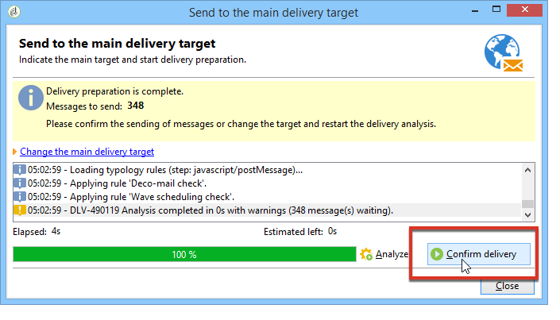
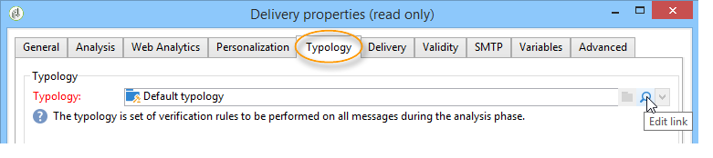

# Verifierar leveransen {#validating-the-delivery}

När en leverans har skapats och konfigurerats måste du validera den innan du skickar den till huvudmålet.

Så här gör du:

1. **Analysera leveransen**: Med det här steget kan du förbereda meddelanden som ska levereras. Se [Analysera leveransen](#analyzing-the-delivery).

   Tillgängliga valideringslägen beskrivs i [Ändra godkännandeläge](../../delivery/using/steps-validating-the-delivery.md#changing-the-approval-mode).

1. **Skicka korrektur**: I det här steget kan du godkänna innehåll, URL:er, anpassningsfält osv. Se [Skicka ett korrektur](../../delivery/using/steps-validating-the-delivery.md#sending-a-proof) och [Definiera ett specifikt korrekturmål](../../delivery/using/steps-defining-the-target-population.md#defining-a-specific-proof-target).

>[!CAUTION]
>
>Båda dessa steg måste nödvändigtvis utföras efter varje ändring av meddelandeinnehållet.

## Analyserar leveransen {#analyzing-the-delivery}

Analysen är den fas då målpopulationen beräknas och leveransinnehållet färdigställs. När leveransen är klar kan den skickas. Klicka på **[!UICONTROL Send]** och välj sedan **[!UICONTROL Deliver as soon as possible]** leveransanalysen för att starta leveransanalysen.

Med **[!UICONTROL Analyze]** knappen kan du starta analysen manuellt. Förloppsindikatorn visar analysförloppet. Analysresultatet visas i fönstrets nedre del. Specialikoner visar varningar.

>[!NOTE]
>
>Valideringsreglerna beskrivs i [Valideringsprocess med typologier](../../delivery/using/steps-validating-the-delivery.md#validation-process-with-typologies).

Du kan när som helst avbryta det här jobbet genom att klicka på **[!UICONTROL Stop]**.

Inga meddelanden skickas under analysfasen. Du kan därför starta eller avbryta det här jobbet utan risk.

>[!CAUTION]
>
>Analysen fryser leveransen (eller beviset) vid tidpunkten för analysen. Eventuella ändringar av leveransen (eller beviset) måste följas av en annan analys innan de blir tillämpliga.

I det sista loggmeddelandet visas eventuella felmeddelanden och antalet fel. En speciell ikon visar feltypen: Om den gula ikonen anger ett icke-kritiskt bearbetningsfel visas ett kritiskt fel som förhindrar att leveransen startar.

Klicka **[!UICONTROL Close]** för att korrigera felen. När du har gjort ändringarna måste du starta om analysen.

Kontrollera resultatet av analysen innan du klickar på **[!UICONTROL Confirm delivery]** för att skicka meddelandet till det angivna målet. Med ett bekräftelsemeddelande kan du starta leveransen.

>[!NOTE]
>
>Klicka på **[!UICONTROL Change the main delivery target]** länken om antalet meddelanden som ska skickas inte matchar din konfiguration. På så sätt kan du ändra definitionen av målpopulationen och starta om analysen.

På **[!UICONTROL Analysis]** fliken Leveransparametrar kan du definiera en uppsättning information om hur meddelanden förbereds under analysfasen.

På den här fliken finns följande alternativ:

* **[!UICONTROL Label and code of the delivery]** : Alternativen för detta avsnitt på skärmen används för att beräkna värdena för dessa fält under leveransanalysfasen. Fältet **[!UICONTROL Calculate the execution folder during the delivery analysis]** beräknar namnet på mappen som kommer att innehålla den här leveransåtgärden under analysfasen.
* **[!UICONTROL Approval mode]** : I det här fältet kan du välja typ av leveransgodkännande. Godkännandelägena visas i [valideringsprocessen med typologier](../../delivery/using/steps-validating-the-delivery.md#validation-process-with-typologies).
* **[!UICONTROL Prepare the personalization data with a workflow]** : Med det här alternativet kan du förbereda personaliseringsdata i leveransen i ett automatiskt arbetsflöde. Det gör det möjligt att avsevärt förbättra resultatet för leveransanalysen när mycket data bearbetas, särskilt om personaliseringsdata kommer från en extern tabell via FDA. Se avsnittet [Åtkomst till en extern databas (FDA)](../../platform/using/accessing-an-external-database.md#optimizing-email-personalization-with-external-data) .
* **[!UICONTROL Start job in a detached process]** : Med det här alternativet kan du påbörja leveransanalysen i en separat process. Analysfunktionen använder Adobe Campaign-programserverprocessen (webbservern) som standard. Om du väljer det här alternativet ser du till att analysen slutförs även om ett programserverfel inträffar.
* **[!UICONTROL Log SQL queries generated during the analysis in the journal]** : Med det här alternativet läggs SQL-frågeloggarna till i leveransjournalen under analysfasen.
* **[!UICONTROL Ignore personalization scripts during sending]** : Med det här alternativet kan du kringgå tolkningen av JavaScript-direktiv som finns i HTML-innehåll. De visas som i det levererade innehållet. Dessa direktiv har introducerats med taggen **&lt;%=** ).

### Konfigurera analysprioriteten {#analysis-priority-}

När leveransen är en del av en kampanj erbjuder fliken **[!UICONTROL Advanced]** ytterligare ett alternativ. På så sätt kan du ordna bearbetningsordningen för leveranser i samma kampanj.

Innan leveransen skickas analyseras varje leverans. Analysens längd beror på leveransens extraheringsfil. Ju större filstorlek, desto längre tid tar analysen och följande leveranser väntar.

Med alternativen för **[!UICONTROL Message preparation by the scheduler]** kampanjen kan ni prioritera leveransanalysen i ett kampanjarbetsflöde.

Om en leverans är för stor är det bättre att tilldela den en låg prioritet för att undvika att analysen av andra arbetsflödesleveranser går långsammare.

>[!NOTE]
>
>Om du vill vara säker på att de större leveransanalyserna inte fördröjer arbetsflödena kan du schemalägga deras körningar genom att trycka på **[!UICONTROL Schedule execution for a time of low activity]**.

## Skicka ett bevis {#sending-a-proof}

För att upptäcka eventuella fel i meddelandekonfigurationen rekommenderar Adobe att du skapar en leveransvalideringscykel. Se till att innehållet godkänns så ofta som det behövs genom att skicka korrektur till testmottagarna. Ett korrektur ska skickas varje gång en ändring görs för att godkänna innehållet.

>[!NOTE]
>
>* Tillgängliga valideringslägen beskrivs i [Ändra godkännandeläge](../../delivery/using/steps-validating-the-delivery.md#changing-the-approval-mode).
>* Korrekturmålets konfiguration förklaras i [Definiera ett specifikt korrekturmål](../../delivery/using/steps-defining-the-target-population.md#defining-a-specific-proof-target).
>

Följ stegen nedan för att skicka ett bevis:

1. Kontrollera att korrekturmålet har konfigurerats enligt beskrivningen i [Definiera ett specifikt korrekturmål](../../delivery/using/steps-defining-the-target-population.md#defining-a-specific-proof-target).
1. Klicka **[!UICONTROL Send a proof]** på det övre fältet i leveransguiden.

   

1. Starta meddelandeanalys. Se [Analysera leveransen](../../delivery/using/steps-validating-the-delivery.md#analyzing-the-delivery).
1. Nu kan du skicka leveransen (se [Skicka leveransen](../../delivery/using/steps-sending-the-delivery.md)).

   När leveransen är skickad visas korrekturet i leveranslistan och skapas och numreras automatiskt. Den kan redigeras om du vill komma åt dess innehåll och egenskaper. Mer information finns på den här [sidan](../../delivery/using/monitoring-a-delivery.md#delivery-dashboard).

   

   >[!NOTE]
   >
   >Om flera format har skapats för leveransen (HTML och Text) kan du välja formatet för de meddelanden som ska skickas till korrekturmottagarna i fönstrets nedre del.

   

Du kanske vill ändra innehållet i leveransen som ett resultat av kommentarer som gjorts av den valideringsgrupp som tar emot korrekturet. När du har gjort ändringarna måste du starta om analysen och sedan skicka ett nytt bevis. Varje nytt korrektur numreras och loggas i leveransjournalen.

När leveransen har analyserats kan du visa de olika korrektur som skickats via loggens **[!UICONTROL Proofs]** underflik (**[!UICONTROL Audit]** flik).

Du måste skicka så många korrektur som behövs tills innehållet i leveransen är klart. Efter det kan du skicka leveransen till huvudmålet och stänga valideringscykeln.

På fliken **[!UICONTROL Advanced]** Leveransegenskaper kan du definiera egenskaperna för korrekturet. Vid behov kan du åsidosätta reglerna för uteslutning av mottagare.

Följande alternativ är tillgängliga:

* Det första alternativet gör att du kan behålla korrekturet dubblerar.
* Med båda av följande alternativ kan du hålla svartlistade mottagare och adresser i karantän. Se beskrivningen av dessa alternativ för huvudmålet i [Anpassa undantagsinställningar](../../delivery/using/steps-defining-the-target-population.md#customizing-exclusion-settings). Till skillnad från målet för en leverans, där dessa adresser exkluderas som standard, behålls de som standard som mål för ett korrektur.
* Med **[!UICONTROL Keep the delivery code for the proof]** det här alternativet kan du ge beviset samma leveranskod som den som är definierad för den leverans som det hör till. Den här koden anges i det första steget i leveransguiden.
* Som standard anges korrekturens ämne med &quot;Korrekturnr&quot;, där # är korrekturets nummer. Du kan ändra det här prefixet i **[!UICONTROL Label prefix]** fältet.

## Valideringsprocess med typologier {#validation-process-with-typologies}

Innan du skickar meddelanden bör du analysera kampanjen för att godkänna dess innehåll och konfiguration. De kontrollregler som tillämpas under analysfasen definieras i en **typologi**. Som standard täcker analysen följande punkter för e-post:

* Godkänna objektet
* Godkänna URL:er och bilder
* Godkänna URL-etiketterna
* Godkänn länken för avprenumeration
* Kontrollera storleken på korrektur
* Kontrollera giltighetsperioden
* Kontrollera schemaläggning av vågor

Den typologi som ska användas för varje leverans väljs på fliken **[!UICONTROL Typologies]** i leveransparametrarna.

Du kan visa och redigera godkännandereglerna, deras innehåll, deras körningsordning och deras fullständiga beskrivning via **[!UICONTROL Administration > Campaign execution > Typology management > Typology rules]** noden.

Du kan skapa nya regler och definiera nya typologier från den här noden. Dessa uppgifter är dock reserverade för expertanvändare som kan JavaScript.

Om du vill redigera den aktuella typologin klickar du på **[!UICONTROL Edit link]** ikonen till höger om **[!UICONTROL Typology]** fältet.

På fliken **[!UICONTROL Rule]** visas en lista med de typologiregler som ska användas. Markera en regel och klicka på **[!UICONTROL Detail...]** -ikonen för att visa dess konfiguration:

>[!NOTE]
>
>**[!UICONTROL Arbitration]** typologier används inom ramen för hantering av försäljningstryck. Mer information finns i [det här avsnittet](../../campaign/using/about-marketing-resource-management.md).

## Ändra godkännandeläge {#changing-the-approval-mode}

På fliken **[!UICONTROL Analysis]** för leveransegenskaper kan du välja valideringsläge. Om varningar genereras under analysen (t.ex. om vissa tecken framhävs i leveransämnet osv.) kan du konfigurera leveransen för att definiera om den fortfarande ska köras eller inte. Som standard måste användaren bekräfta att meddelanden skickas i slutet av analysfasen: detta är **manuell** validering.

Välj ett annat godkännandeläge i listrutan i lämpligt fält.

Följande godkännandelägen är tillgängliga:

* **[!UICONTROL Manual]**: I slutet av analysfasen måste användaren bekräfta leveransen för att kunna börja skicka. Det gör du genom att klicka på **[!UICONTROL Start]** knappen.
* **[!UICONTROL Semi-automatic]**: Skicka börjar automatiskt om analysfasen inte genererar några varningsmeddelanden.
* **[!UICONTROL Automatic]**: Sändningen börjar automatiskt i slutet av analysfasen, oavsett resultatet.
