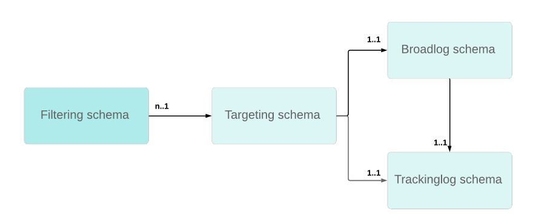

# Felsökning av spårning {#tracking-troubleshooting}

I det här avsnittet hittar du vanliga frågor om spårning av konfiguration och implementering i Adobe Campaign Classic.

## Arbetsflödet för spårning misslyckas {#tracking-workflow-failing}

Mitt arbetsflöde för spårning misslyckas, hur kan jag identifiera skadade rader i spårningsfilen?

>[!NOTE]
>
>Endast för Windows

Den skadade loggfilen för spårning ../nl6/var/&lt;instance_name>Loggen /redir/log/0x0000 kan stoppa arbetsflödet för spårning. Om du enkelt vill identifiera skadade rader och ta bort dem för att återuppta arbetsflödet för spårning kan du använda kommandona nedan.

### Jag vet i vilken fil den skadade raden finns

I så fall kan skadade rader hittas i loggfilen 0x000000000A0000.log, men samma process kan tillämpas på en uppsättning filer - en i taget.

```
$ cd {install directory}/var/{instance name}/redir/log
$ cat 0x00000000000A0000.log | sed -nE '/^[[:alnum:]]{2}x[[:alnum:]]*\t[0-9T:\.-]*\t[0-9a-fA-F]*\t[0-9a-fA-F]*\t[0-9a-fA-F]*\t[[:alnum:]]*\t[[:alnum:]-]*\t[[:print:]]*\t[[:print:]]*\t[[:print:]]*\t([0-9a-fA-F\.:]*|[0-9a-fA-F\.:]*\t[[:print:]]*|[0-9a-fA-F\.:]*,[[:print:]]*)$/!p'
```

Du kan sedan stoppa arbetsflödet för spårning, ta bort skadade rader och starta om arbetsflödet.

### Jag har inte den fil där den skadade raden finns

1. Använd följande kommandorad för att checka in alla spårningsfiler.

   ```
   $ cd {install directory}/var/{instance name}/redir/log
   $ cat *.log | sed -nE '/^[[:alnum:]]{2}x[[:alnum:]]*\t[0-9T:\.-]*\t[0-9a-fA-F]*\t[0-9a-fA-F]*\t[0-9a-fA-F]*\t[[:alnum:]]*\t[[:alnum:]-]*\t[[:print:]]*\t[[:print:]]*\t[[:print:]]*\t([0-9a-fA-F\.:]*|[0-9a-fA-F\.:]*\t[[:print:]]*|[0-9a-fA-F\.:]*,[[:print:]]*)$/!p'
   ```

1. Kommandot visar alla skadade rader. Exempel:

   ```
   50x000000000FD7EC86 2017-06-24T21:00:50.96 1f506d71 1aeab4b6 1af77020 0 e5155671-4ab7-4ce4-a763-3b82dda6d881 h
   Mozilla/5.0 (Macintosh; Intel Mac OS X 10_12_4) AppleWebKit/537.36 (KHTML, like Gecko) Chrome/55.0.2883.95 Safari/537.36 52.46.20.64
   ```

   >[!NOTE]
   >
   >Radretur har lagts till före användaragenten för att ge bättre läsbarhet och inte återge effektiv återgivning.

1. Kör ett grep-kommando för att hitta motsvarande fil.

```
$ grep -Rn <Log Id>
# for example:
$ grep -Rn 50x000000000FD7EC86
```

1. Hitta felloggen med filnamnet och radnumret. Exempel:

   ```
   ./0x000000000FD7E000.log:3207:50x000000000FD7EC86 2017-06-24T21:00:50.96 1f506d71 1aeab4b6 1af77020 0 e5155671-4ab7-4ce4-a763-3b82dda6d881 h
   Mozilla/5.0 (Macintosh; Intel Mac OS X 10_12_4) AppleWebKit/537.36 (KHTML, like Gecko) Chrome/55.0.2883.95 Safari/537.36 52.46.20.64
   ```

   >[!NOTE]
   >
   >En vagnretur har lagts till före användaragenten för att ge bättre läsbarhet och inte återge effektiv återgivning.

Du kan sedan stoppa arbetsflödet för spårning, ta bort skadade rader och starta om arbetsflödet.

## Spårning av länkar misslyckas ibland {#tracking-links-fail-intermittently}

När du försöker komma åt spårningslänkarna visas följande meddelande:

`Requested URL '/r/ id=h787bc0,281a4d8,281a4da&amp;p1=1' cannot be found`

1. Åtkomst &lt;redirection_server>/r/test URL och kontrollera om build-numret och localhost returnerades av begäran.

1. Kontrollera konfigurationen reserveServer i filen serverConf.xml för spårningsservern. Den här konfigurationen bör vara i omdirigeringsläge.

   ```
   <redirection>
      <spareServer _operation="update" enabledIf="$(hostname)!='test-rt1'" id="1"
      url="http://test-rt1:8080"/>
      <spareServer _operation="insert" enabledIf="$(hostname)!='test-rt4'" id="4"
      url="http://test-rt4:8080"/>
      <spareServer _operation="insert" enabledIf="$(hostname)!='test-rt3'" id="3"
      url="http://test-rt3:8080"/>
      <spareServer _operation="insert" enabledIf="$(hostname)!=test-rt2'" id="2"
      url="http://test-rt2:8080"/>
   </redirection>
   ```

1. Kontrollera manuellt om &lt;deliveryid>XML-filen finns på datorn i .../nl6/var/&lt;instance_name>/redir/url/&lt;yyyy> katalog (YYYY representerar leveransår).

1. Kontrollera manuellt om &lt;trackingurlid> finns i &lt;deliveryid>XML-fil.

1. Kontrollera manuellt förekomst av broadcastID i relaterad leverans-ID.

1. Kontrollera &lt;deliveryid>.xml-filbehörigheter i .../nl6/var/&lt;instance_name>/redir/url/year.

   De bör ha minst 644 behörigheter så att Apache kan läsa spårnings-URL:er för att omdirigera begärd länk.

## Vill du uppdatera alternativet NmsTracking_Pointer? {#updating-option}

Följ de här stegen när du uppdaterar alternativet NmsTracking_Pointer:

1. Stoppa arbetsflödet för spårning.

1. Stoppa spårningsloggtjänsten.

1. Uppdatera alternativet NmsTracking_Pointer till önskat värde.

1. Starta om spårningstjänsten.

1. Starta om arbetsflödet för spårning.

## Spårning verkar inte fungera med vissa WebMail {#webmail}

Du kan anpassa uppföljningsformeln för klickningar och ange en anpassad Adobe Analytics-spårningsformel.

Den sortens anpassning måste göras med försiktighet för att undvika att lägga till extra radmatade tecken. Alla länkade tecken som finns utanför JavaScript-uttrycket finns i den slutliga formeln.

Den här typen av extra radbrytningstecken i spårnings-URL:en kommer att leda till problem i vissa webMail-filer (AOL, GMail osv.).

**Exempel:**

* Felaktig syntax

  ```
  <%@ include option='NmsTracking_ClickFormula' %><% // Parameters expected by Adobe Analytics
  var pattern = new RegExp("(nl611\.test15|google\.com)", 'i')
  if( $(urlstring).match(pattern) && delivery.FCP == false )
  {
  %>
  &cid=<%= message.delivery.internalName %>&bid=<%= message.id.toString().toLowerCase() %><% } %>
  ```

* Korrigera syntax

  ```
  <%@ include option='NmsTracking_ClickFormula' %><% // Parameters expected by Adobe Analytics
  var pattern = new RegExp("(nl611\.test15|google\.com)", 'i')
  if( $(urlstring).match(pattern) && delivery.FCP == false )
  {
  %>&cid=<%= message.delivery.internalName %>&bid=<%= message.id.toString().toLowerCase() %><% } %>
  ```

För att förstå var den extra raden finns kan du ersätta JavaScript-uttrycket med en fast sträng STRING.

```
// Incorrect
STRING1
&cid=STRING2&bid=STRING3

// Correct
STRING1&cid=STRING2&bid=STRING3
```

**Andra exemplet**

* Felaktig syntax

  ```
  <%@ include option='NmsTracking_ClickFormula' %>
  <% // Parameters expected by Adobe Analytics
  var pattern = new RegExp("(vistaprint|entryUrl)", 'i')
  if( $(urlstring).match(pattern) && delivery.FCP == false )
  {%>&cid=<%= message.delivery.internalName%>&bid=<%= message.id.toString().toLowerCase()%>&SHPID=<%= message.recipient.factShopper.shopper_id %><% }
  
  %>
  ```

* Korrigera syntax

  ```
  <%@ include option='NmsTracking_ClickFormula' %><% // Parameters expected by Adobe Analytics
  var pattern = new RegExp("(vistaprint|entryUrl)", 'i')
  if( $(urlstring).match(pattern) && delivery.FCP == false )
  {%>&cid=<%= message.delivery.internalName%>&bid=<%= message.id.toString().toLowerCase()%>&SHPID=<%= message.recipient.factShopper.shopper_id %><% }
  
  %>
  ```

För att förstå var den extra raden finns kan du ersätta JavaScript-uttrycket med en fast sträng STRING.

```
// Incorrect
STRING1&cid=STRING2&bid=STRING3&SHPID=STRING4

// Correct
STRING1&cid=STRING2&bid=STRING3&SHPID=STRING4
```

## Hämtningen av spårningsloggar är för långsam {#slow-retrieval}

När instansen inte hämtar loggar för direkt spårning utan från en fjärransluten Adobe Campaign Classic-server, hämtas loggarna via anropet GetTrackingLogs SOAP, som definieras i RemoteTracking-schemat.

Med ett alternativ i filen serverConf.xml kan du ange antalet loggar som hämtas samtidigt med den här metoden: logCountPerRequest.

Standardvärdet för logCountPerRequest är 1000, det kan i vissa fall visa sig vara för litet. Godkända värden måste vara mellan 0 och 10 000.

## Spårningsloggar kunde inte länkas till mottagare {#link-recipients}

I Adobe Campaign Classic ska en målmappning vara unik i termer av mottagarschema jämfört med utsändnings-/spårningsloggscheman.



Det är inte möjligt att använda flera målscheman med samma spårningsloggschema eftersom spårningsarbetsflödet inte kan avstämma data med mål-ID.

Om du inte vill använda den färdiga målmappningen med nms:mottagare rekommenderar vi följande metoder:

* Om du vill använda en anpassad målinriktning-dimension måste du skapa ett anpassat brettLog/trackingLog-schema med nms:broadcast som mall (t.ex. nms:broadLogRcp, nms:broadLogSvc, etc.).

* Om du vill använda OOB trackingLogRcp/broadLogRcp måste måldimensionen vara nms:receive och filtreringsdimensionen kan vara ett anpassat schema.
