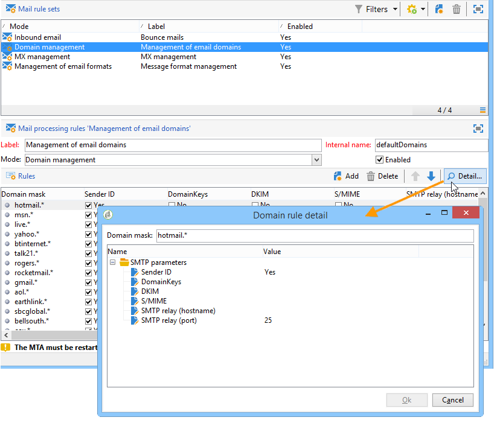

# Om leveransfel{#understanding-delivery-failures}

## Om leveransfel {#about-delivery-failures}

När ett meddelande (e-post, SMS, push-meddelanden) inte kan skickas till en profil skickar fjärrservern automatiskt ett felmeddelande som hämtas av Adobe Campaign-plattformen och kvalificeras för att avgöra om e-postadressen eller telefonnumret ska placeras i karantän eller inte. Se [Studsa e-posthantering](#bounce-mail-management).

>[!NOTE]
>
>E-postfelmeddelanden (eller &quot;bounces&quot;) kvalificeras av inMail-processen. SMS-felmeddelanden (eller SR för Statusrapport) kvalificeras av MTA-processen.

När ett meddelande har skickats kan du i leveransloggarna visa leveransstatus för varje profil och tillhörande feltyp och orsak.

Meddelanden kan också uteslutas under färdigställandet av leveransen om en adress sätts i karantän eller om en profil är svartlistad. Exkluderade meddelanden visas på kontrollpanelen för leverans.

**Relaterade ämnen:**

* [Leveransloggar och historik](../../delivery/using/monitoring-a-delivery.md#delivery-logs-and-history)
* [Misslyckad status](../../delivery/using/monitoring-a-delivery.md#failed-status)
* [Typ av leveransfel och orsaker](#delivery-failure-types-and-reasons)

## Typ av leveransfel och orsaker {#delivery-failure-types-and-reasons}

Det finns tre typer av fel när ett meddelande misslyckas. Varje feltyp avgör om en adress skickas till karantän. Mer information finns i [Villkor för att skicka en adress till karantän](../../delivery/using/understanding-quarantine-management.md#conditions-for-sending-an-address-to-quarantine)

* **Hård**: Ett &quot;hard&quot;-fel indikerar en ogiltig adress. Detta inbegriper ett felmeddelande som uttryckligen anger att adressen är ogiltig, till exempel: &quot;Okänd användare&quot;.
* **Mjuk**: Detta kan vara ett tillfälligt fel eller ett fel som inte gick att kategorisera, till exempel: &quot;Ogiltig domän&quot; eller &quot;Postlådan är full&quot;.
* **Ignorerad**: Det här är ett fel som är tillfälligt, till exempel&quot;Frånvarande&quot;, eller ett tekniskt fel, till exempel om avsändartypen är&quot;postmaster&quot;.

Möjliga orsaker till leveransfel är:

<table> 
 <tbody> 
  <tr> 
   <td> Feletikett </td> 
   <td> Feltyp </td> 
   <td> Tekniskt värde </td> 
   <td> Beskrivning </td> 
  </tr> 
  <tr> 
   <td> Kontot är inaktiverat </td> 
   <td> Mjuk/hård </td> 
   <td> 4 </td> 
   <td> Kontot som är länkat till adressen är inte längre aktivt. När IAP (Internet Access Provider) upptäcker en lång inaktivitetsperiod kan den stänga användarens konto. Det går då inte att skicka till användarens adress. Om kontot är tillfälligt inaktiverat på grund av sex månaders inaktivitet och fortfarande kan aktiveras, tilldelas statusen Med fel och kontot provas igen tills felräknaren når 5. Om felmeddelandet talar om att kontot är permanent inaktiverat ställs det in direkt på Karantän.  </td> 
  </tr> 
  <tr> 
   <td> Adress i karantän </td> 
   <td> Hård </td> 
   <td> 9 </td> 
   <td> Adressen placerades i karantän.  </td> 
  </tr> 
  <tr> 
   <td> Adressen har inte angetts </td> 
   <td> Hård </td> 
   <td> 7 </td> 
   <td> Ingen adress har angetts för mottagaren.  </td> 
  </tr> 
  <tr> 
   <td> Felaktig adress </td> 
   <td> Ignorerad </td> 
   <td> 14 </td> 
   <td> Kvalitetsklassificeringen för den här adressen är för låg.  </td> 
  </tr> 
  <tr> 
   <td> Svartlistad adress </td> 
   <td> Hård </td> 
   <td> 8 </td> 
   <td> Adressen var svartlistad när den skickades. Den här statusen används för att importera data från externa listor och externa system när data importeras till Adobe Campaign-karantänlistan.  </td> 
  </tr> 
  <tr> 
   <td> Kontrolladress </td> 
   <td> Ignorerad </td> 
   <td> 127 </td> 
   <td> Mottagarens adress är en del av kontrollgruppen.  </td> 
  </tr> 
  <tr> 
   <td> Dubbel </td> 
   <td> Ignorerad </td> 
   <td> 10 </td> 
   <td> Mottagarens adress fanns redan i den här leveransen.  </td> 
  </tr> 
  <tr> 
   <td> Felet ignorerades </td> 
   <td> Ignorerad </td> 
   <td> 25 </td> 
   <td> Adressen är vitlistad. Felet ignoreras därför och ett e-postmeddelande skickas.  </td> 
  </tr> 
  <tr> 
   <td> Uteslutet efter skiljedom </td> 
   <td> Ignorerad </td> 
   <td> 12 </td> 
   <td> Mottagaren uteslöts av en kampanjtypologiregel av typen"medling".  </td> 
  </tr> 
  <tr> 
   <td> Exkluderad av en SQL-regel </td> 
   <td> Ignorerad </td> 
   <td> 11 </td> 
   <td> Mottagaren uteslöts av en kampanjtypologiregel av typen SQL.  </td> 
  </tr> 
  <tr> 
   <td> Ogiltig domän </td> 
   <td> Mjuk </td> 
   <td> 2 </td> 
   <td> Domänen för e-postadressen är felaktig eller finns inte längre. Den här profilen används igen tills felantalet är 5. Därefter anges posten till Karantänstatus och inga nya försök följer.  </td> 
  </tr> 
  <tr> 
   <td> Postlådan är full </td> 
   <td> Mjuk </td> 
   <td> 5 </td> 
   <td> Den här användarens postlåda är full och kan inte ta emot fler meddelanden. Den här profilen används igen tills felantalet är 5. Därefter anges posten till Karantänstatus och inga nya försök följer.  Den här typen av fel hanteras av en rensningsprocess. Adressen har en giltig status efter 30 dagar.  Varning: För att adressen ska tas bort automatiskt från listan över adresser i karantän måste det tekniska arbetsflödet för databassorensning startas.  </td> 
  </tr> 
  <tr> 
   <td> Inte ansluten </td> 
   <td> Ignorerad </td> 
   <td> 6 </td> 
   <td> Mottagarens mobiltelefon är avstängd eller inte ansluten till nätverket när meddelandet skickas.  </td> 
  </tr> 
  <tr> 
   <td> Ej definierad </td> 
   <td> Ej definierad </td> 
   <td> 0 </td> 
   <td> Adressen kvalificeras eftersom felet inte har ökats ännu. Den här typen av fel inträffar när ett nytt felmeddelande skickas av servern: det kan vara ett isolerat fel, men om det inträffar igen ökar felräknaren, som varnar de tekniska teamen. De kan sedan utföra meddelandeanalys och kvalificera felet via noden Administration / Kampanjhantering / Hantering av ej slutprodukter i trädstrukturen.  </td> 
  </tr> 
  <tr> 
   <td> Ej berättigade till erbjudandena </td> 
   <td> Ignorerad </td> 
   <td> 16 </td> 
   <td> Mottagaren var inte berättigad till erbjudandena i leveransen.  </td> 
  </tr> 
  <tr> 
   <td> Avvisad </td> 
   <td> Mjuk/hård </td> 
   <td> 20 </td> 
   <td> Adressen har placerats i karantän på grund av säkerhetsfeedback som en skräppostrapport. Enligt felet görs ett nytt försök att ange adressen tills felräknaren når 5 eller skickas direkt till karantän.  </td> 
  </tr> 
  <tr> 
   <td> Målet är begränsat </td> 
   <td> Ignorerad </td> 
   <td> 17 </td> 
   <td> Den maximala leveransstorleken har uppnåtts för mottagaren.  </td> 
  </tr> 
  <tr> 
   <td> Okvalificerad adress </td> 
   <td> Ignorerad </td> 
   <td> 15 </td> 
   <td> Postadressen har inte kvalificerats.  </td> 
  </tr> 
  <tr> 
   <td> Onåbar </td> 
   <td> Mjuk/hård </td> 
   <td> 3 </td> 
   <td> Ett fel har uppstått i meddelandeleveranskedjan. Det kan vara en incident på SMTP-relä, en domän som inte går att nå för tillfället, osv. Enligt felet görs ett nytt försök att ange adressen tills felräknaren når 5 eller skickas direkt till karantän.  </td> 
  </tr> 
  <tr> 
   <td> Okänd användare </td> 
   <td> Hård </td> 
   <td> 1 </td> 
   <td> Adressen finns inte. Inga fler leveransförsök kommer att göras för den här profilen.  </td> 
  </tr> 
 </tbody> 
</table>

## Försök igen efter ett tillfälligt leveransfel {#retries-after-a-delivery-temporary-failure}

Om ett meddelande inte kan skickas på grund av ett tillfälligt fel som **är tillfälligt eller** har ignorerats **** , kommer nya försök att utföras under leveranstiden.

>[!NOTE]
>
>Tillfälligt olevererade meddelanden kan bara relateras till ett **mjukt** eller **ignorerat** fel, men inte till ett **allvarligt** fel (se [Leveransfel och orsaker](#delivery-failure-types-and-reasons)).

Om du vill ändra varaktigheten för en leverans går du till de avancerade parametrarna för leverans- eller leveransmallen och anger önskad varaktighet i motsvarande fält. De avancerade leveransegenskaperna visas i [det här avsnittet](../../delivery/using/steps-sending-the-delivery.md#defining-validity-period).

Standardkonfigurationen tillåter fem försök med en timmes intervall, följt av ett nytt försök per dag i fyra dagar. Antalet försök kan ändras globalt (kontakta Adobes tekniska administratör) eller för varje leverans- eller leveransmall (se [det här avsnittet](../../delivery/using/steps-sending-the-delivery.md#configuring-retries)).

## Synkrona och asynkrona fel {#synchronous-and-asynchronous-errors}

Ett meddelande kan misslyckas omedelbart (synkront fel), eller senare, efter att det har skickats (asynkront fel).

* Synkront fel: Om fjärre-postservern som kontaktades av Adobe Campaign-leveransservern omedelbart returnerade ett felmeddelande får leveransen inte skickas till profilens server. Adobe Campaign kvalificerar varje fel för att avgöra om e-postadresserna i fråga ska placeras i karantän eller inte. Se [Studsa e-postkvalifikationer](#bounce-mail-qualification).
* Asynkront fel: ett studsmeddelande eller en SR skickades senare av den mottagande servern. Det här e-postmeddelandet läses in i en teknisk postlåda som programmet använder för att etikettera meddelanden med ett fel. Asynkrona fel kan uppstå upp till en vecka efter att en leverans har skickats.

   >[!NOTE]
   >
   >Konfiguration av studspostlådan beskrivs i [det här avsnittet](../../installation/using/deploying-an-instance.md#managing-bounced-emails).

   Feedslingan fungerar som studsmeddelanden. När en användare kvalificerar ett e-postmeddelande som skräppost kan du konfigurera e-postregler i Adobe Campaign så att alla leveranser till den här användaren blockeras. Meddelanden som skickas till användare som har kvalificerat ett e-postmeddelande som skräppost omdirigeras automatiskt till en e-postruta som har skapats för detta ändamål. Adresserna till dessa användare är svartlistade även om de inte klickade på länken för att ta bort prenumerationen. Adresser är svartlistade i (**NmsAddress**)-karantäntabellen och inte i mottagartabellen (**NmsRecipient**).

   >[!NOTE]
   >
   >Klagomålshanteringen beskrivs i avsnittet [Leveranshantering](../../delivery/using/about-deliverability.md) .

## E-posthantering {#bounce-mail-management}

Med Adobe Campaign-plattformen kan ni hantera misslyckade e-postleveranser via studsfunktionen. När ett e-postmeddelande inte kan levereras till en mottagare, returnerar fjärrmeddelandeservern automatiskt ett felmeddelande (studsmeddelanden) till en teknisk inkorg som är utformad för detta. Felmeddelanden samlas in av Adobe Campaign-plattformen och kvalificeras av inMail-processen för att utöka listan med regler för e-posthantering

### E-poststudsar {#bounce-mail-qualification}

När leveransen av ett e-postmeddelande misslyckas får Adobe Campaign-leveransservern ett felmeddelande från meddelandeservern eller fjärr-DNS-servern. Listan med fel består av strängar i meddelandet som returneras av fjärrservern. Feltyper och orsaker tilldelas till varje felmeddelande.

Listan är tillgänglig via **[!UICONTROL Administration > Campaign Management > Non deliverables Management > Delivery log qualification]** noden. Det innehåller alla regler som används av Adobe Campaign för att kvalificera leveransfel. Den är inte uttömmande och uppdateras regelbundet av Adobe Campaign och kan även hanteras av användaren.

* Meddelandet som returneras av fjärrservern vid den första förekomsten av den här feltypen visas i **[!UICONTROL First text]** kolumnen i **[!UICONTROL Delivery log qualification]** tabellen. Om den här kolumnen inte visas klickar du på **[!UICONTROL Configure list]** knappen längst ned till höger i listan för att markera den.

Adobe Campaign filtrerar det här meddelandet för att ta bort variabelinnehållet (t.ex. ID:n, datum, e-postadresser, telefonnummer osv.) och visar det filtrerade resultatet i **[!UICONTROL Text]** kolumnen. Variablerna ersätts med **`#xxx#`**, förutom adresser som ersätts med **`*`**.

Med den här processen kan du sammanföra alla fel av samma typ och undvika flera poster för liknande fel i tabellen för leveransloggskvalificering.

>[!NOTE]
>
>I **[!UICONTROL Number of occurrences]** fältet visas antalet förekomster av meddelandet i listan. Den är begränsad till 100 000 förekomster. Du kan redigera fältet om du till exempel vill återställa det.

Studsade e-postmeddelanden kan ha följande kvalificeringsstatus:

* **[!UICONTROL To qualify]** : studsposten inte kunde kvalificeras. Kvalificering måste tilldelas slutkundsteamet för att garantera effektiv plattformsleverans. Så länge den inte är kvalificerad används studentposten inte för att utöka listan över regler för e-posthantering.
* **[!UICONTROL Keep]** : studsmeddelandet har kvalificerats och kommer att användas av arbetsflödet **Uppdatera för leverans** som ska jämföras med befintliga regler för e-posthantering och berika listan.
* **[!UICONTROL Ignore]** : studsmeddelandet ignoreras av Campaign MTA, vilket innebär att den här studsen aldrig kommer att leda till att mottagarens adress sätts i karantän. Den används inte av arbetsflödet **Uppdatera för leverans** och skickas inte till klientinstanser.

>[!NOTE]
>
>För värdbaserade eller hybridinstallationer, om du har uppgraderat till det förbättrade MTA:
>
>* Studskompetensen i **[!UICONTROL Delivery log qualification]** tabellen används inte längre för synkrona felmeddelanden vid leveransfel. Den förbättrade MTA-metoden avgör studstyp och kvalifikationer och skickar tillbaka informationen till Campaign.
   >
   >
* Asynkrona studsar är fortfarande kvalificerade av inMail-processen via **[!UICONTROL Inbound email]** reglerna. Mer information finns i Regler [för](#email-management-rules)e-posthantering.
   >
   >
* För instanser som använder Förbättrat MTA utan **Webhooks/EFS** används även **[!UICONTROL Inbound email]** reglerna för att bearbeta synkrona studsmeddelanden från Förbättrat MTA, med samma e-postadress som för asynkrona studsmeddelanden.
>
>
Mer information om Adobe Campaign Enhanced MTA finns i det här [dokumentet](https://helpx.adobe.com/campaign/kb/campaign-enhanced-mta.html).

### Regler för e-posthantering {#email-management-rules}

E-postregler nås via **[!UICONTROL Administration > Campaign Management > Non deliverables Management > Mail rule sets]** noden. Regler för e-posthantering visas i fönstrets nedre del.

>[!NOTE]
>
>Standardparametrarna för plattformen konfigureras i distributionsguiden. Mer information finns i [det här avsnittet](../../installation/using/deploying-an-instance.md).

Standardreglerna är följande.

>[!IMPORTANT]
>
>* Leveransservern (MTA) måste startas om om om parametrarna har ändrats.
>* Ändringen eller skapandet av hanteringsregler är endast till för expertanvändare.

#### Inkommande e-post {#inbound-email}

Dessa regler innehåller en lista med teckensträngar som kan returneras av fjärrservrar och som gör att du kan kvalificera felet (**Hård**, **Mjuk** eller **Ignorerad**).

När ett e-postmeddelande misslyckas returnerar fjärrservern ett studsmeddelande till den adress som anges i plattformsparametrarna. Adobe Campaign jämför innehållet i varje studentpost med strängarna i listan med regler och tilldelar det sedan en av de tre [feltyperna](#delivery-failure-types-and-reasons).

>[!NOTE]
>
>Användaren kan skapa egna regler. När du importerar ett paket och uppdaterar data via arbetsflödet **Uppdatera för leverans** , skrivs de regler som användaren har skapat över.

Mer information om studentkvalifikationer finns i [det här avsnittet](#bounce-mail-qualification).

>[!IMPORTANT]
>
>Om du har uppgraderat till Förbättrat MTA för hostinginstallationer eller hybridinstallationer, och om din instans har **Webhooks/EFS** -funktioner, används inte längre reglerna för synkrona felmeddelanden om leveransfel **[!UICONTROL Inbound email]** . Mer information finns i [det här avsnittet](#bounce-mail-qualification).
>
>Mer information om Adobe Campaign Enhanced MTA finns i det här [dokumentet](https://helpx.adobe.com/campaign/kb/campaign-enhanced-mta.html).

#### Domänhantering {#domain-management}

Adobe Campaign-meddelandeservern tillämpar en enda **domänhanteringsregel** på alla domäner.

<!---->

* Du kan välja om du vill aktivera vissa identifieringsstandarder och krypteringsnycklar för att kontrollera domännamnet, till exempel **avsändar-ID**, **DomainKeys**, **DKIM** och **S/MIME**.
* Med parametrarna för **SMTP-relä** kan du konfigurera IP-adressen och porten för en reläserver för en viss domän. Mer information finns i [det här avsnittet](../../installation/using/configuring-campaign-server.md#smtp-relay).

Om dina meddelanden visas i Outlook med **[!UICONTROL on behalf of]** avsändaradressen kontrollerar du att du inte signerar dina e-postmeddelanden med **avsändar-ID**, som är den inaktuella autentiseringsstandarden för e-postmeddelanden från Microsoft. Om **[!UICONTROL Sender ID]** alternativet är aktiverat avmarkerar du motsvarande ruta och kontaktar Adobe Campaign-supporten. Leveransen påverkas inte.

>[!IMPORTANT]
>
>Om du har uppgraderat till Förbättrat MTA används inte längre reglerna för värdbaserade eller hybridinstallationer **[!UICONTROL Domain management]** . **DKIM-signering (DomainKeys Identified Mail)** för e-postautentisering görs av den utökade MTA:n för alla meddelanden med alla domäner. Det signerar inte med **avsändar-ID**, **DomainKeys** eller **S/MIME** om inte annat anges på den förbättrade MTA-nivån.
>
>Mer information om Adobe Campaign Enhanced MTA finns i det här [dokumentet](https://helpx.adobe.com/campaign/kb/campaign-enhanced-mta.html).

#### MX-hantering {#mx-management}

* MX-hanteringsreglerna används för att reglera flödet av utgående e-post för en viss domän. De samplar studsmeddelandena och blockerar sändningarna där så är lämpligt.

* Meddelandeservern för Adobe Campaign tillämpar regler som är specifika för domänerna och sedan reglerna för det allmänna fallet som representeras av en asterisk i listan med regler.

* Om du vill konfigurera MX-hanteringsregler anger du bara ett tröskelvärde och väljer vissa SMTP-parametrar. Ett **tröskelvärde** är en gräns som beräknas som ett felprocentvärde över vilket alla meddelanden till en viss domän blockeras. I det allmänna fallet, för minst 300 meddelanden, blockeras sändning av e-postmeddelanden under tre timmar om felprocenten når 90 %.

For more on MX management, refer to [this section](../../installation/using/email-deliverability.md#mx-configuration).

>[!IMPORTANT]
>
>Om du har uppgraderat till Förbättrat MTA används inte längre leveransregler för värdbaserade eller hybridinstallationer. **[!UICONTROL MX management]** Den utökade MTA-servern använder sina egna MX-regler som gör att den kan anpassa din genomströmning efter domän baserat på ditt eget historiska e-postrykte och på realtidsfeedback som kommer från de domäner där du skickar e-post.
>
>Mer information om Adobe Campaign Enhanced MTA finns i det här [dokumentet](https://helpx.adobe.com/campaign/kb/campaign-enhanced-mta.html).
