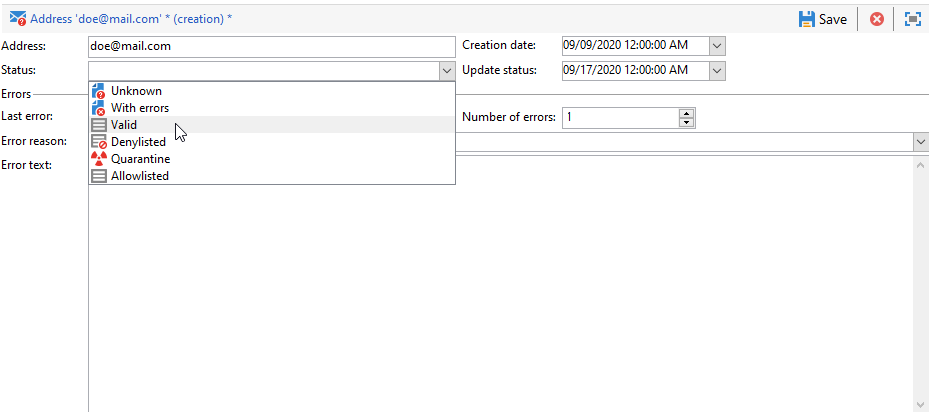
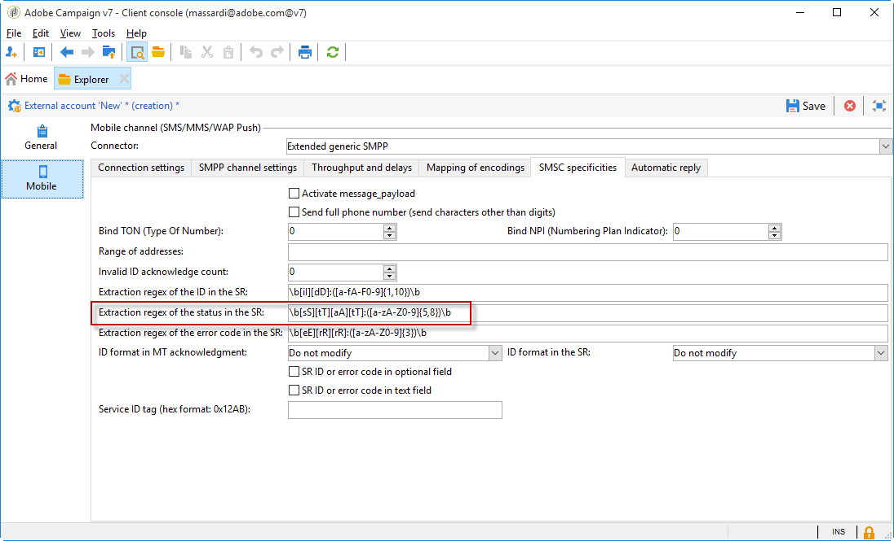

# Om karantänhantering{#understanding-quarantine-management}

## Om karantäner {#about-quarantines}

Adobe Campaign hanterar en lista med adresser i karantän. Mottagare vars adress sätts i karantän exkluderas som standard vid leveransanalys och anges inte som mål. En e-postadress kan sättas i karantän, till exempel när postlådan är full eller om adressen inte finns. Under alla omständigheter uppfyller karantänförfarandet de särskilda regler som beskrivs nedan.

>[!NOTE]
>
>Detta avsnitt gäller för onlinekanaler: e-post, SMS, push-meddelanden.

### Optimera leveransen genom karantän {#optimizing-your-delivery-through-quarantines}

De profiler vars e-postadresser eller telefonnummer är i karantän exkluderas automatiskt vid meddelandeförberedelsen (se [Identifiera karantänadresser för en leverans](#identifying-quarantined-addresses-for-a-delivery)). Detta snabbar upp leveranserna eftersom felfrekvensen påverkar leveranshastigheten avsevärt.

Vissa leverantörer av internetåtkomst betraktar automatiskt e-post som skräppost om antalet ogiltiga adresser är för högt. Karantän gör att ni kan undvika att dessa leverantörer blir svarta.

Dessutom bidrar karantäner till att minska SMS-sändningskostnaderna genom att utesluta felaktiga telefonnummer från leveranser. Mer information om de bästa sätten att skydda och optimera leveranser finns på [den här sidan](https://docs.campaign.adobe.com/doc/AC/getting_started/EN/deliveryBestPractices.html).

### Karantän jämfört med svartlistning {#quarantine-vs-blacklisting}

**Karantän** gäller bara en adress, inte själva profilen. Det innebär att om två profiler har samma e-postadress påverkas båda om adressen sätts i karantän.

På samma sätt kan en profil vars e-postadress sätts i karantän uppdatera profilen och ange en ny adress. Den kan sedan användas av leveransåtgärder igen.

**Svartlistning**&#x200B;å andra sidan resulterar i att profilen inte längre används av någon leverans, t.ex. efter en avanmälan (avanmälan).

>[!NOTE]
>
>När en användare svarar på ett SMS-meddelande med ett nyckelord som&quot;STOP&quot; för att avanmäla sig från SMS-leveranser är profilen inte svartlistad som i processen för avanmälan via e-post. Profilens telefonnummer skickas till karantänen så att användaren fortsätter att ta emot e-postmeddelanden.

## Identifiera adresser i karantän {#identifying-quarantined-addresses}

Adresser i karantän kan listas för en viss leverans eller för hela plattformen.

### Identifiera adresser i karantän för en leverans {#identifying-quarantined-addresses-for-a-delivery}

Adresser i karantän för en viss leverans listas i leveransloggarna på leveransinstrumentpanelen under leveransfasen (se [Leveransloggar och historik](../../delivery/using/monitoring-a-delivery.md#delivery-logs-and-history)).

### Identifiera adresser i karantän för hela plattformen {#identifying-quarantined-addresses-for-the-entire-platform}

Administratörer kan lista adresserna i karantän för hela plattformen från **[!UICONTROL Administration > Campaign Management > Non deliverables Management > Non deliverables and addresses]** noden.

>[!NOTE]
>
>Den här menyn listar element i karantän för **e-post**, **SMS** och **push-meddelanden** .

Följande information finns för varje adress:


>[!NOTE]
>
>Ökningen av antalet karantän är en normal effekt som har samband med databasens slitage. Om en e-postadress till exempel anses ha en livslängd på tre år och mottagartabellen ökar med 50 % varje år, kan ökningen av antalet karantän beräknas enligt följande:
>
>Slutet av år 1: (1*0.33)/(1+0.5)=22 %.
Slutet av år 2: ((1.22*0.33)+0.33)/(1.5+0.75)=32.5 %.

### Identifiera adresser i karantän i leveransrapporter {#identifying-quarantined-addresses-in-delivery-reports}

Följande rapporter innehåller information om adresserna i karantän:

* För varje leverans visas antalet adresser i karantän i leveransmålet i rapporten **[!UICONTROL Delivery summary]** . Den visar:

   * Antalet adresser som placerats i karantän under leveransanalysen.

   * Antalet adresser som placerats i karantän efter leveransåtgärden.

* I **[!UICONTROL Non-deliverables and bounces]** rapporten visas information om adresserna i karantän, typer av fel som uppstått osv. samt felinformation per domän.

Du kan söka efter den här informationen för alla leveranser av plattformen (**Home page>Reports**) eller för en viss leverans. Du kan också skapa anpassade rapporter och välja vilken information som ska visas.

### Identifiera adresser i karantän för en mottagare {#identifying-quarantined-addresses-for-a-recipient}

Du kan slå upp status för e-postadressen för alla mottagare. Det gör du genom att markera mottagarprofilen och klicka på **[!UICONTROL Deliveries]** fliken. För alla leveranser till den mottagaren kan du ta reda på om adressen misslyckades, placerades i karantän under analysen osv. För varje mapp kan du bara visa mottagare vars e-postadress är i karantän. Använd programfiltret om du vill göra det **[!UICONTROL Quarantined email address]** .


### Ta bort en adress i karantän {#removing-a-quarantined-address}

Om du behöver ta bort en adress från karantän ändrar du dess status manuellt till **[!UICONTROL Valid]**.



Om du ändrar statusen till **[!UICONTROL Whitelisted]** anges adressen systematiskt som mål varje gång även om ett fel inträffar.

>[!CAUTION]
Svartlistade adresser berörs inte av karantänsystemet och är inte riktade, även om du ändrar adressens status.

Du kan också ändra antalet fel och tiden mellan felen. Det gör du genom att ändra inställningarna för distributionsguiden (E-postkanal/Avancerade inställningar). Mer information om distributionsguiden finns i [det här avsnittet](../../installation/using/deploying-an-instance.md).

## Villkor för att skicka en adress till karantän {#conditions-for-sending-an-address-to-quarantine}

Adobe Campaign hanterar karantän utifrån typ av leveransfel och orsaken som tilldelats vid kvalificering av felmeddelanden (se [studsbehörighet](../../delivery/using/understanding-delivery-failures.md#bounce-mail-qualification)) och typ av [leveransfel](../../delivery/using/understanding-delivery-failures.md#delivery-failure-types-and-reasons)och orsaker.

* **Ignorerat fel**: ignorerade fel skickar ingen adress till karantän.
* **Hårt fel**: motsvarande e-postadress omedelbart skickas till karantänen.
* **Mjukt fel**: Mjuka fel skickar inte en adress till karantän omedelbart, men de ökar en felräknare. Mer information finns i [Mjuk felhantering](#soft-error-management).

Om en användare kvalificerar ett e-postmeddelande som en skräppost (**Feedback-slinga**) dirigeras meddelandet automatiskt om till en teknisk postlåda som hanteras av Adobe. Användarens e-postadress skickas sedan automatiskt till karantänen.

I listan över adresser i karantän anger **[!UICONTROL Error reason]** fältet varför den valda adressen placerades i karantän. Karantän i Adobe Campaign är skiftlägeskänsligt. Se till att importera e-postadresser i gemener så att de inte återdirigeras senare.


### Mjuk felhantering {#soft-error-management}

I motsats till hårda fel skickar inte mjuka fel en adress direkt till karantän, utan i stället ökar de en felräknare.

* När felräknaren når gränsvärdet sätts adressen i karantän.
* I standardkonfigurationen anges tröskelvärdet till fem fel, där två fel är viktiga om de inträffar med minst 24 timmars mellanrum. Adressen sätts i karantän vid det sjätte felet.
* Tröskelvärdet för felräknare kan ändras. Mer information finns i [Försök igen efter ett tillfälligt leveransfel](../../delivery/using/understanding-delivery-failures.md#retries-after-a-delivery-temporary-failure).

Felräknaren initieras om om det senaste allvarliga felet inträffade för mer än 10 dagar sedan. Adressstatusen ändras sedan till **Giltig** och tas bort från listan över karantäner i **databasrensningsarbetsflödet** .

## Kantlinjer för push-meddelanden {#push-notification-quarantines}

Karantänmekanismen för push-meddelanden är globalt densamma som den allmänna processen. Se [Om karantäner](#about-quarantines). Vissa fel hanteras dock på olika sätt för push-meddelanden. För vissa mjuka fel utförs till exempel inga försök inom samma leverans. Specifikationerna för push-meddelanden anges nedan. Mekanismen för återförsök (antal återförsök, frekvens) är densamma som för e-postmeddelanden.

Objekten som sätts i karantän är enhetstoken.

### iOS-karantän {#ios-quarantine}

**För iOS - binär anslutning**

För varje meddelande får Adobe Campaign synkrona och asynkrona fel från APNS-servern. För följande synkrona fel genererar Adobe Campaign mjuka fel:

* Problem med nyttolastens längd: inga nya försök, felorsaken är **[!UICONTROL Unreachable]**.
* Utgångsdatum för certifikat: inga nya försök, felorsaken är **[!UICONTROL Unreachable]**.
* Förlorad anslutning under leveransen: återförsök utförd, felorsaken är **[!UICONTROL Unreachable]**.
* Problem med tjänstkonfiguration (ogiltigt certifikat, ogiltigt certifikatlösenord, inget certifikat): inga nya försök, felorsaken är **[!UICONTROL Unreachable]**.

APNS-servern meddelar Adobe Campaign asynkront att en enhetstoken har avregistrerats (när mobilprogrammet har avinstallerats av användaren). Arbetsflödet körs var 6:e timme för att kontakta APNS-feedbacktjänster för att uppdatera **[!UICONTROL mobileAppOptOutMgt]** tabellen AppSubscriptionRcp **** . För alla inaktiverade token anges fältet **Inaktiverad** till **Sant** och prenumerationen som är länkad till den enhetstoken exkluderas automatiskt från framtida leveranser.

**För iOS - HTTP/2-anslutning**

Protokollet http/2 tillåter direkt feedback och status för varje push-leverans. Om http/2-protokollkopplingen används anropas inte längre feedbacktjänsten av **[!UICONTROL mobileAppOptOutMgt]** arbetsflödet. De oregistrerade token hanteras på olika sätt mellan binära iOS-anslutningar och http/2-anslutningar i iOS. En token betraktas som oregistrerad när ett mobilprogram avinstalleras eller installeras om.

Synkront, om APNS returnerar status &quot;unregistered&quot; för ett meddelande, sätts måltoken omedelbart i karantän.

<table> 
 <tbody> 
  <tr> 
   <td> <strong>Scenario</strong><br /> </td> 
   <td> <strong>Status</strong><br /> </td> 
   <td> <strong>Felmeddelande</strong><br /> </td> 
   <td> <strong>Feltyp</strong><br /> </td> 
   <td> <strong>Felorsak</strong><br /> </td> 
   <td> <strong>Försök igen</strong><br /> </td> 
  </tr> 
  <tr> 
   <td> Målenhet aktiverad<br /> </td> 
   <td> OK<br /> </td> 
   <td> </td> 
   <td> </td> 
   <td> </td> 
   <td> </td> 
  </tr> 
  <tr> 
   <td> Målenhet avstängd<br /> </td> 
   <td> OK<br /> </td> 
   <td> </td> 
   <td> </td> 
   <td> </td> 
   <td> </td> 
  </tr> 
  <tr> 
   <td> Användaren inaktiverar meddelanden för programmet<br /> </td> 
   <td> OK<br /> </td> 
   <td> </td> 
   <td> </td> 
   <td> </td> 
   <td> </td> 
  </tr> 
  <tr> 
   <td> Skapande/analys av meddelande - nyttolasten är för stor<br /> </td> 
   <td> Fel<br /> </td> 
   <td> Nyttolasten är för lång<br /> </td> 
   <td> Mjuk<br /> </td> 
   <td> Avvisad<br /> </td> 
   <td> Nej<br /> </td> 
  </tr> 
  <tr> 
   <td> Fas för att skapa/analysera meddelanden - oväntat problem med innehållsformat<br /> </td> 
   <td> Fel<br /> </td> 
   <td> Olika felmeddelanden enligt felet<br /> </td> 
   <td> Mjuk<br /> </td> 
   <td> Odefinierad<br /> </td> 
   <td> Nej<br /> </td> 
  </tr> 
  <tr> 
   <td> Certifikatproblem (lösenord, fel osv.) och testa anslutningen till APNS-problemet<br /> </td> 
   <td> Fel<br /> </td> 
   <td> Olika felmeddelanden enligt felet<br /> </td> 
   <td> Mjuk<br /> </td> 
   <td> Avvisad<br /> </td> 
   <td> Nej<br /> </td> 
  </tr> 
  <tr> 
   <td> Nätverksanslutningen bröts under sändning<br /> </td> 
   <td> Fel<br /> </td> 
   <td> Anslutningsfel<br /> </td> 
   <td> Odefinierad<br /> </td> 
   <td> Onåbar<br /> </td> 
   <td> Ja<br /> </td> 
  </tr> 
  <tr> 
   <td> Avvisning av APNS-meddelande: Avregistrering<br /> av användaren har tagit bort programmet eller så har token gått ut<br /> </td> 
   <td> Fel<br /> </td> 
   <td> Oregistrerad<br /> </td> 
   <td> Hård<br /> </td> 
   <td> Okänd användare<br /> </td> 
   <td> Nej<br /> </td> 
  </tr> 
  <tr> 
   <td> Avvisning av APNS-meddelande: alla andra fel<br /> </td> 
   <td> Fel<br /> </td> 
   <td> Felavvisande orsak kommer att finnas i felmeddelandet<br /> </td> 
   <td> Mjuk<br /> </td> 
   <td> Avvisad<br /> </td> 
   <td> Nej<br /> </td> 
  </tr> 
 </tbody> 
</table>

### Android-karantän {#android-quarantine}

**För Android V1**

För varje meddelande får Adobe Campaign synkrona fel direkt från FCM-servern. Adobes kampanj hanterar dem i farten och genererar hårda eller mjuka fel beroende på hur allvarligt felet är och försök kan göras på nytt:

* Nyttolastlängden har överskridits, anslutningsproblem, problem med tjänsttillgänglighet: återförsök utförd, mjukt fel, felorsak **[!UICONTROL Refused]**.
* Enhetskvoten har överskridits: inga nya försök, mjuka fel, felorsaken är **[!UICONTROL Refused]**.
* Ogiltig eller oregistrerad token, oväntat fel, problem med avsändarkontot: inget nytt försök, hårt fel, felorsaken är **[!UICONTROL Refused]**.

Arbetsflödet körs var sjätte timme för att uppdatera **[!UICONTROL mobileAppOptOutMgt]** tabellen AppSubscriptionRcp **** . För tokens som deklarerats som oregistrerade eller inte längre giltiga ställs fältet **Inaktiverad** in på **Sant** och prenumerationen som är länkad till enhetstoken exkluderas automatiskt från framtida leveranser.

Under leveransanalysen läggs alla enheter som är undantagna från målet automatiskt till i **registret excludeLogAppSubRcp** .

>[!NOTE]
Här är olika typer av fel för kunder som använder Baidu-kontakten:
* Anslutningsproblem i början av leveransen: feltyp **[!UICONTROL Undefined]**, felorsak **[!UICONTROL Unreachable]**, nytt försök utförs.
* Förlorad anslutning under leverans: mjukt fel, felorsak **[!UICONTROL Refused]**, nytt försök utförs.
* Synkront fel returnerades av Baidu under sändning: hårt fel, felorsak **[!UICONTROL Refused]**, inga nya försök utförs.

Adobe Campaign kontaktar Baidu-servern var 10:e minut för att hämta det skickade meddelandets status och uppdaterar utsändningarna. Om ett meddelande deklareras som skickat anges meddelandets status i utsändningsloggarna till **[!UICONTROL Received]**. Om Baidu deklarerar ett fel ställs statusen in på **[!UICONTROL Failed]**.

**För Android V2**

Android V2-karantänmekanismen använder samma process som Android V1, samma gäller för prenumerations- och exkluderingsuppdateringen. Mer information finns i avsnittet [Android V1](#android-quarantine) .

<table> 
 <tbody> 
  <tr> 
   <td> <strong>Scenario</strong><br /> </td> 
   <td> <strong>Status</strong><br /> </td> 
   <td> <strong>Felmeddelande</strong><br /> </td> 
   <td> <strong>Feltyp</strong><br /> </td> 
   <td> <strong>Felorsak</strong><br /> </td> 
   <td> <strong>Försök igen</strong><br /> </td> 
  </tr> 
  <tr> 
   <td> Fas för skapande/analys av meddelanden: ogiltiga nyckelord som används i anpassade fält<br /> </td> 
   <td> Fel<br /> </td> 
   <td> Följande nyckelord kan inte användas: {1}<br /> </td> 
   <td> Mjuk<br /> </td> 
   <td> </td> 
   <td> Nej<br /> </td> 
  </tr> 
  <tr> 
   <td> Fas för skapande/analys av meddelanden: nyttolasten är för stor<br /> </td> 
   <td> Fel<br /> </td> 
   <td> Meddelandet är för stort: {1} bitar, medan endast {2} är behöriga<br /> </td> 
   <td> Mjuk<br /> </td> 
   <td> Avvisad<br /> </td> 
   <td> Nej<br /> </td> 
  </tr> 
  <tr> 
   <td> Nätverksanslutningen bröts under sändning<br /> </td> 
   <td> Fel<br /> </td> 
   <td> Inget svar från tjänsten Firebase Cloud Messaging på adressen: {1}<br /> </td> 
   <td> Mjuk<br /> </td> 
   <td> Onåbar<br /> </td> 
   <td> Ja<br /> </td> 
  </tr> 
  <tr> 
   <td> Avvisning av FCM-meddelande: FCM-servern är inte tillgänglig för tillfället (till exempel med timeout). <br /> </td> 
   <td> Fel<br /> </td> 
   <td> Tjänsten Firebase Cloud Messaging är inte tillgänglig för tillfället<br /> </td> 
   <td> Mjuk<br /> </td> 
   <td> Onåbar<br /> </td> 
   <td> Ja<br /> </td> 
  </tr> 
  <tr> 
   <td> Avvisning av FCM-meddelande: Fel vid autentisering av avsändarkontot<br /> </td> 
   <td> Fel<br /> </td> 
   <td> Det gick inte att identifiera utvecklarkontot. Kontrollera ditt ID och lösenord<br /> </td> 
   <td> Mjuk<br /> </td> 
   <td> Avvisad<br /> </td> 
   <td> Nej<br /> </td> 
  </tr> 
  <tr> 
   <td> Avvisning av FCM-meddelande: Enhetskvoten har överskridits<br /> </td> 
   <td> Fel<br /> </td> 
   <td> </td> 
   <td> Mjuk<br /> </td> 
   <td> Avvisad<br /> </td> 
   <td> Ja<br /> </td> 
  </tr> 
  <tr> 
   <td> Avvisning av FCM-meddelande: Ogiltig registrering/är inte registrerad<br /> </td> 
   <td> Fel<br /> </td> 
   <td> </td> 
   <td> Hård<br /> </td> 
   <td> Okänd användare<br /> </td> 
   <td> Nej<br /> </td> 
  </tr> 
  <tr> 
   <td> Avvisning av FCM-meddelande: Alla andra fel<br /> </td> 
   <td> Fel<br /> </td> 
   <td> Felkoden har returnerats från Firebase Cloud Messaging-servern: {1} </td> 
   <td> </td> 
   <td> Avvisad<br /> </td> 
   <td> Nej<br /> </td> 
  </tr> 
 </tbody> 
</table>

## SMS-karantän {#sms-quarantines}

**För standardanslutningar**

Karantänmekanismen för SMS-meddelanden är globalt densamma som den allmänna processen. Se [Om karantäner](#about-quarantines). Specifikationerna för SMS anges nedan.

>[!NOTE]
Tabellen **[!UICONTROL Delivery log qualification]** gäller inte för den **utökade generiska SMPP** -anslutningen.

<table> 
 <tbody> 
  <tr> 
   <td> <strong>Scenario</strong><br /> </td> 
   <td> <strong>Status</strong><br /> </td> 
   <td> <strong>Felmeddelande</strong><br /> </td> 
   <td> <strong>Feltyp</strong><br /> </td> 
   <td> <strong>Felorsak</strong><br /> </td> 
  </tr> 
  <tr> 
   <td> Skickat till providern<br /> </td> 
   <td> Skickat<br /> </td> 
   <td> </td> 
   <td> </td> 
   <td> </td> 
  </tr> 
  <tr> 
   <td> Mottaget på mobilen<br /> </td> 
   <td> Mottaget<br /> </td> 
   <td> </td> 
   <td> </td> 
   <td> </td> 
  </tr> 
  <tr> 
   <td> Ett fel returnerades av providern<br /> </td> 
   <td> Fel<br /> </td> 
   <td> Fel vid mottagning av data (SR eller MO)<br /> </td> 
   <td> Mjuk<br /> </td> 
   <td> Onåbar<br /> </td> 
  </tr> 
  <tr> 
   <td> Ogiltig MT-bekräftelse<br /> </td> 
   <td> Fel<br /> </td> 
   <td> Felet {1} uppstod när bekräftelseramen för sändningsfrågan bearbetades<br /> </td> 
   <td> Mjuk<br /> </td> 
   <td> Onåbar<br /> </td> 
  </tr> 
  <tr> 
   <td> Fel när MT skickades<br /> </td> 
   <td> Fel<br /> </td> 
   <td> Fel när meddelanden skickades<br /> </td> 
   <td> Mjuk<br /> </td> 
   <td> Onåbar<br /> </td> 
  </tr> 
 </tbody> 
</table>

**För den utökade generiska SMPP-anslutningen**

När SMPP-protokollet används för att skicka SMS-meddelanden hanteras felhanteringen på ett annat sätt. Mer information om den utökade allmänna SMPP-anslutningen finns på [den här sidan](../../delivery/using/sms-channel.md#creating-an-smpp-external-account).

SMPP-kopplingen hämtar data från SR-meddelandet (statusrapport) som returneras med reguljära uttryck (regex) för att filtrera innehållet. Dessa data matchas sedan mot informationen i **[!UICONTROL Delivery log qualification]** tabellen (som är tillgänglig via **[!UICONTROL Administration]** > **[!UICONTROL Campaign Management]** > **[!UICONTROL Non deliverables Management]** -menyn).

Innan en ny typ av fel har kvalificerats anges felorsaken alltid som **standard till Avvisat** .

>[!NOTE]
Feltyperna och orsakerna till felet är desamma som för e-postmeddelanden. Se [Typ av leveransfel och orsaker](../../delivery/using/understanding-delivery-failures.md#delivery-failure-types-and-reasons).
Be leverantören om en lista över status- och felkoder för att ange korrekta feltyper och orsaker till felet i tabellen för leveransloggens kvalificeringsregister.

Exempel på ett genererat meddelande:

```
SR Generic DELIVRD 000|#MESSAGE#
```

* Alla felmeddelanden börjar med **SR** för att skilja mellan SMS-felkoder och e-postfelkoder.
* Den andra delen (**Allmänt** i det här exemplet) av felmeddelandet hänvisar till namnet på SMSC-implementeringen, t.ex. definierad i **[!UICONTROL SMSC implementation name]** fältet för det externa SMS-kontot. Se [den här sidan](../../delivery/using/sms-channel.md#creating-an-smpp-external-account).

   Eftersom samma felkod kan ha olika innebörd för varje provider kan du med det här fältet veta vilken provider som genererade felkoden. Du kan sedan hitta felet i den aktuella providerns dokumentation.

* Den tredje delen (**DELIVRD** i det här exemplet) av felmeddelandet motsvarar statuskoden som hämtats från SR med statusextraheringsregex som definierats i det externa SMS-kontot.

   Det här området anges på fliken **[!UICONTROL SMSC specificities]** för det externa kontot. Se [den här sidan](../../delivery/using/sms-channel.md#creating-an-smpp-external-account).

   

   **Som standard extraherar regex** tillståndet: enligt definitionen i **tillägg B** i **SMPP 3.4-specifikationen**.

* Den fjärde delen (**000** i det här exemplet) av felmeddelandet motsvarar den felkod som extraheras från SR med den felkodsextraheringsregex som definieras i det externa SMS-kontot.

   Det här området anges på fliken **[!UICONTROL SMSC specificities]** för det externa kontot. Se [den här sidan](../../delivery/using/sms-channel.md#creating-an-smpp-external-account).

   **Regex extraherar som standard** felet: enligt definitionen i **tillägg B** i **SMPP 3.4-specifikationen**.

* Allt som kommer efter rörsymbolen (|) visas bara i **[!UICONTROL First text]** kolumnen i **[!UICONTROL Delivery log qualification]** tabellen. Det här innehållet ersätts alltid av **#MESSAGE#** när meddelandet har normaliserats. Med den här processen undviker du att ha flera poster för liknande fel och den är samma som för e-postmeddelanden. Mer information finns i [Studsa-e-postkvalifikationer](../../delivery/using/understanding-delivery-failures.md#bounce-mail-qualification).

Den utökade generiska SMPP-anslutningen använder en heuristisk metod för att hitta rimliga standardvärden: om statusen börjar med **DELIV** betraktas den som en framgång eftersom den matchar de vanliga statusarna **DELIVRD** eller **DELIVERED** som används av de flesta leverantörer. All annan status leder till ett allvarligt fel.
