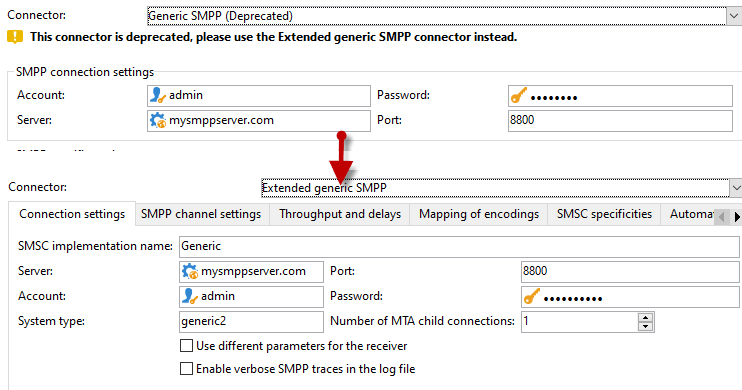

# Migrera en SMS-koppling som inte stöds till den utökade allmänna SMPP-anslutningen{#unsupported-connector-migration}

Från och med version 20.2 har äldre anslutningar tagits bort. Det här dokumentet hjälper dig att migrera anslutningar som fortfarande körs på det gamla systemet till den rekommenderade SMPP-anslutningen.

>[!CAUTION]
>
>Migreringen är inte obligatorisk, men rekommenderas av Adobe och säkerställer att du kör den senaste versionen av programmet som stöds.

## Om SMS-anslutningar {#about-sms-connectors}

Följande kopplingar är borttagna från och med version 20.2:

* **[!UICONTROL Generic SMPP]** (SMPP version 3.4 har stöd för binärt läge)
* **[!UICONTROL Sybase365]** (SAP SMS 365)
* **[!UICONTROL CLX Communications]**
* **[!UICONTROL Tele2]**
* **[!UICONTROL O2]**
* **[!UICONTROL iOS]**

Funktioner som inte används är fortfarande tillgängliga och stöds, men de kommer inte att förbättras ytterligare. Vi rekommenderar att du använder **[!UICONTROL Extended generic SMPP]**-anslutningen.

Mer information om borttagna och borttagna funktioner finns på [sidan](../../rn/using/deprecated-features.md).

Gamla SMS-anslutningar använder Java SMS-kopplingen som överför webbprocessen. Om du migrerar till den nya **[!UICONTROL Extended Generic SMPP]**-anslutningen flyttas den här inläsningen till MTA, som kan stödja den.

## Migrera till den utökade allmänna SMPP-anslutningen {#migrating-extended-generic-smpp}

>[!CAUTION]
>
>Även om du kan transponera parametrarna kräver konfigurering av **[!UICONTROL Extended Generic SMPP]**-kopplingen att du pratar med din leverantör som ger dig den information som behövs för att fylla i resten av parametrarna. Se denna [sida](sms-protocol.md) för mer information om detta.

Först måste du skapa ett nytt **[!UICONTROL Extended Generic SMPP]**-externt konto och sedan kanske du kan ta med några parametrar. Du hittar de detaljerade stegen på den här [sidan](sms-set-up.md#creating-an-smpp-external-account).

Du måste nu fylla i parametrarna på fliken **[!UICONTROL Mobile]** i det nya **[!UICONTROL Extended Generic SMPP]**-externa kontot beroende på din tidigare koppling.

### Från den allmänna kopplingen {#from-generic-connector}

När du väljer **[!UICONTROL Generic]**-anslutningen bör du ha en anpassad JavaScript-anslutning som anpassar sig efter varje situation.

Om du vet att den här kopplingen redan använder SMPP-protokollet kan du migrera till **[!UICONTROL Extended Generic SMPP]**-anslutningen. Om så inte är fallet, fråga leverantören om de stöder SMPP-protokollet och konfigurera en ny anslutning med hjälp av en konsult.

Från din **[!UICONTROL Generic]**-anslutning kan du överföra till ditt nyligen skapade **[!UICONTROL Extended SMPP]**-konto:

På fliken **[!UICONTROL Connection Settings]**:

* **[!UICONTROL Account]**
* **[!UICONTROL Password]**
* **[!UICONTROL Server]**
* **[!UICONTROL Port]**

### Från den allmänna SMPP-anslutningen {#from-generic-smpp-connector}

Från din **[!UICONTROL Generic SMPP]**-anslutning kan du överföra till ditt nyligen skapade **[!UICONTROL Extended SMPP]**-konto:

På fliken **[!UICONTROL Connection Settings]**:

* **[!UICONTROL Account]**
* **[!UICONTROL Password]**
* **[!UICONTROL Server]**
* **[!UICONTROL Port]**
* **[!UICONTROL System Type]**

På fliken **[!UICONTROL SMPP Channel Settings]**:

* **[!UICONTROL Source number]**
* **[!UICONTROL Source NPI]**
* **[!UICONTROL Destination NPI]**
* **[!UICONTROL Source TON]**
* **[!UICONTROL Destination TON]**

På fliken **[!UICONTROL Mapping of Encoding]**:

* **[!UICONTROL Outbound SMS coding]**

På fliken **[!UICONTROL SMSC specificities]**:

* **[!UICONTROL Coding when sending]** motsvarar **[!UICONTROL ID Format in MT acknowledgement]**
* **[!UICONTROL Coding when receiving]** motsvarar **[!UICONTROL ID Format in the SR]**

### Från Sybase365-kontakten {#from-sybase}

Från din **[!UICONTROL Sybase365]**-anslutning kan du överföra till ditt nyligen skapade **[!UICONTROL Extended SMPP]**-konto:

På fliken **[!UICONTROL Connection Settings]**:

* **[!UICONTROL Account]**
* **[!UICONTROL Password]**
* **[!UICONTROL Server]**
* **[!UICONTROL Port]**
* **[!UICONTROL System Type]**

### Från CLX-koppling {#from-clx}

Från din **[!UICONTROL CLX]**-anslutning kan du överföra till ditt nyligen skapade **[!UICONTROL Extended SMPP]**-konto:

På fliken **[!UICONTROL Connection Settings]**:

* **[!UICONTROL Account]**
* **[!UICONTROL Password]**
* **[!UICONTROL Server]**
* **[!UICONTROL Port]**
* **[!UICONTROL System Type]**

På fliken **[!UICONTROL SMPP Channel Settings]**:

* **[!UICONTROL Source number]**

På fliken **[!UICONTROL SMSC specificities]**:

* **[!UICONTROL Coding when sending]** motsvarar **[!UICONTROL ID Format in MT acknowledgement]**
* **[!UICONTROL Coding when receiving]** motsvarar **[!UICONTROL ID Format in the SR]**

### Från Tele2-kontakten {#from-tele2}

Från din **[!UICONTROL Tele2]**-anslutning kan du överföra till ditt nyligen skapade **[!UICONTROL Extended SMPP]**-konto:

På fliken **[!UICONTROL Connection Settings]**:

* **[!UICONTROL Account]**
* **[!UICONTROL Password]**
* **[!UICONTROL Server]**
* **[!UICONTROL Port]**
* **[!UICONTROL System Type]**

På fliken **[!UICONTROL SMPP Channel Settings]**:

* **[!UICONTROL Source number]**
* **[!UICONTROL Source NPI]**
* **[!UICONTROL Destination NPI]**
* **[!UICONTROL Source TON]**

På fliken **[!UICONTROL Mapping of Encoding]**:

* **[!UICONTROL Outbound SMS coding]**

### Från O2-kontakten {#from-O2}

Från din **[!UICONTROL O2]**-anslutning kan du överföra till ditt nyligen skapade **[!UICONTROL Extended SMPP]**-konto:

På fliken **[!UICONTROL Connection Settings]**:

* **[!UICONTROL Account]**
* **[!UICONTROL Password]**
* **[!UICONTROL Server]**
* **[!UICONTROL Port]**
* **[!UICONTROL System Type]**

På fliken **[!UICONTROL SMPP Channel Settings]**:

* **[!UICONTROL Source number]**
* **[!UICONTROL Source NPI]**
* **[!UICONTROL Destination NPI]**
* **[!UICONTROL Source TON]**
* **[!UICONTROL Destination TON]**
