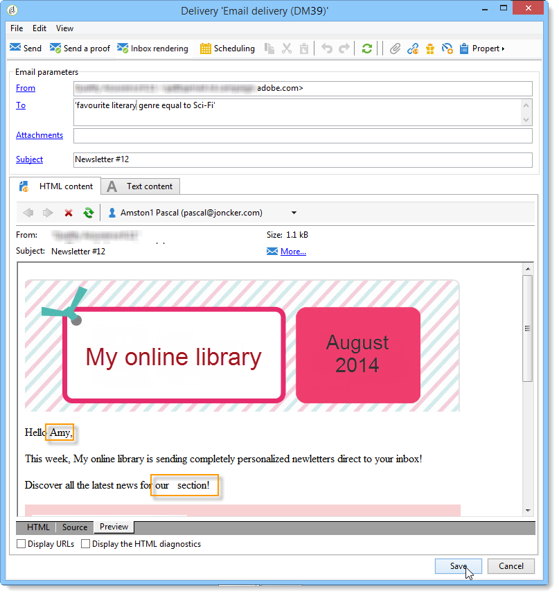

# Användningsfall: konfigurera fältersättning{#use-case-configuring-the-field-substitution}


Med Slumpmässig fältersättning kan du tilldela ett värde från mottagarlistan till de dirigerade adresser som är tomma när användaren använder det här värdet i en leverans (exempel: namn, ort osv.).

Med den här ersättningen sparar du tid när du skapar leveransen: I stället för att manuellt lägga till det önskade värdet till startadresserna, återställer ersättningen det här värdet i listan över mottagare som anges av leveransen och använder det på startadresserna.

## Kontext {#context}

I det här fallet vill webbplatsen **Mitt onlinebibliotek** skicka en rabatt till sina kunder, baserat på deras favoritlitterära genre.

Leveranshanteraren har integrerat ett anpassningsfält som är länkat till en favoritgenre i sitt e-postmeddelande. Målet är att använda vissa dirigerade adresser: Dessa dirigerade adresser har anpassningsfältet i sin tabell, men inget värde sparas där.

Om du vill använda slumpmässig fältersättning måste du ha:

* en leverans med ett eller flera personaliseringsfält,
* dirigerade adresser vars **dataschema** ändras enligt de anpassningsfält som används i leveransen.

## Skapa en leverans {#step-1---creating-a-delivery}

Stegen för att skapa en leverans beskrivs i avsnittet [Skapa en e-postleverans](creating-an-email-delivery.md).

I det här exemplet har leveranshanteraren skapat nyhetsbrevet.


## Redigera dataschemat för dirigerade adresser {#editing-the-seed-addresses-data-schema}

Instruktionerna för hur du ändrar ett dataschema finns i avsnittet.

I det här exemplet får dataschemat för dirigerade adresser ett värde som skapas från mottagarnas dataschema:

```
 <attribute label="Favorite literary genre" length="80" name="favoriteLiteraryGenre"
               type="string" userEnum="favoriteLiteraryGenre"/>
```

Med den här uppräkningen kan användaren ange klienternas favoritlitterära genre.

För att den här datarchemaändringen ska kunna visas i dirigerade adresser **Indataformulär** måste du uppdatera den. Se avsnittet [Uppdatera indataformuläret](use-case--selecting-seed-addresses-on-criteria.md#updating-the-input-form).

## Konfigurera personalisering {#configuring-personalization}

1. Öppna en leverans.

   I det här exemplet har leveransen två anpassningsfält: mottagarens **förnamn** och mottagarens **favoritlitterära genre**.

   

1. Konfigurera leveranslistan och dina dirigerade adresser. Se [Identifiera målpopulationer](steps-defining-the-target-population.md).

   I det här exemplet väljer användaren användare vars **favoritlitterära genre** är Sci-Fi som huvudmålpopulation.

   

   Användaren lägger till dirigerade adresser till leveransen.

   

   >[!NOTE]
   >
   >Mer information om länken **[!UICONTROL Edit the dynamic condition...]** finns i [Användningsfall: välja startadresser på villkor](use-case--selecting-seed-addresses-on-criteria.md).

1. Klicka på fliken **[!UICONTROL Preview]** och välj sedan en startadress för att testa personaliseringen.

   

   Du ser att ett av anpassningsfälten är tomt. Eftersom startadressen inte har data för det här fältet kan inte förhandsvisningen av HTML-innehåll visa ett värde.

   Slumpmässig ersättning av fält utförs **vid leveranstillfället**.

1. Klicka på knappen **[!UICONTROL Send]**.
1. Analysera leveransen och **bekräfta leveransen**.

   dirigerade adresser får leveransen i sin inkorg.

   Fältpersonalisering är effektivt.

   
