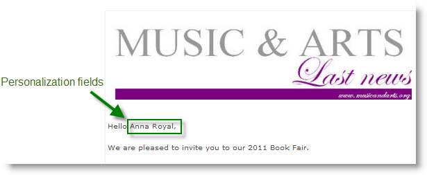

# Användningsfall: skapa innehållshantering{#use-case-creating-content-management}


Följande steg är nödvändiga för att skapa innehållshantering i Adobe Campaign:

* [Steg 1 - Analysera innehållet som ska produceras](#step-1---analyzing-the-content-to-be-produced),
* [Steg 2 - Skapa dataschemat](#step-2---creating-the-data-schema),
* [Steg 3 - Skapa indataformuläret](#step-3---creating-the-input-form),
* [Steg 4 - Skapa byggmallen](#step-4---creating-the-construction-template),
* [Steg 5 - Skapa publikationsmallen](#step-5---creating-the-publication-template),
* [Steg 6 - Skapa innehåll](#step-6---creating-contents).

## Steg 1 - Analysera innehållet som ska produceras {#step-1---analyzing-the-content-to-be-produced}

Innan du börjar måste du göra en exakt analys av innehållet som ska produceras: identifiera de element som ska visas, studera de begränsningar som är kopplade till dem, definiera en typ för varje element osv. Du måste också skilja på statiska element och variabla element.

Om du till exempel vill skapa ett nyhetsbrev i HTML med följande typ av innehåll:


Det här nyhetsbrevet innehåller tre typer av element:

1. Variabelelement vars innehåll anges eller väljs av användaren via ett inmatningsformulär när leveransen skapas.

   

1. Anpassningsfält som anges dynamiskt baserat på den information som sparats i databasen (mottagarens för- och efternamn i det här fallet).

   

1. Statiska element, som är samma för alla nyhetsbrev.

   

De olika elementen i det här nyhetsbrevet sätts samman baserat på reglerna som definieras i en JavaScript-mall som refererar till alla element som ska infogas och skapar en layout för dem.

Dessa element skapas via ett dedikerat schema som anger följande element för varje innehåll: namn, etikett, typ, storlek samt annan information som är relevant för dess bearbetning i Adobe Campaign.

## Steg 2 - Skapa dataschemat {#step-2---creating-the-data-schema}

Ett dataschema är ett XML-dokument som är kopplat till innehållet. Den beskriver XML-strukturen för data i det här innehållet.

>[!NOTE]
>
>Mer information om hur du skapar och konfigurerar datascheman i Adobe Campaign finns i [det här avsnittet](../../configuration/using/about-schema-edition.md).
>
>Konfigurationselement som är specifika för innehållshantering beskrivs i [Datamodeller](data-schemas.md).

Så här skapar du ett dataschema:

1. Öppna Adobe Campaign Explorer och välj **[!UICONTROL Administration > Configuration > Data schemas]** nod.

   Klicka på **[!UICONTROL New]** -ikonen som finns ovanför listan med datamappningar.

1. Välj **[!UICONTROL Create a schema]** alternativ för innehållshantering och klicka sedan på **[!UICONTROL Next]**.

   

1. Ange schemats namn och etikett i fälten. Du kan lägga till en beskrivning och länka en viss bild om det behövs.

   

   Klicka **[!UICONTROL Next]** att validera.

1. Ange innehållet i schemat i **[!UICONTROL Edit schema]** -fönstret.

   Använd **[!UICONTROL Insert]** för att skapa schemainnehållet.

   

   Mer information finns i [Redigera scheman](data-schemas.md#editing-schemas).

   För varje element som innehållet refererar till måste du välja en matchande typ.

   I det här exemplet är det identifierade innehållet, deras format och typ:

<table> 
 <thead> 
  <tr> 
   <th> <strong>Innehåll</strong> <br /> </th> 
   <th> <strong>Format</strong> <br /> </th> 
   <th> <strong>Typ</strong> <br /> </th> 
   <th> <strong>Etikett</strong> <br /> </th> 
  </tr> 
 </thead> 
 <tbody> 
  <tr> 
   <td> Titel<br /> </td> 
   <td> Attribut<br /> </td> 
   <td> Sträng<br /> </td> 
   <td> Titel<br /> </td> 
  </tr> 
  <tr> 
   <td> Underrubrik<br /> </td> 
   <td> Attribut<br /> </td> 
   <td> Sträng<br /> </td> 
   <td> Namn<br /> </td> 
  </tr> 
  <tr> 
   <td> Händelsedatum<br /> </td> 
   <td> Attribut<br /> </td> 
   <td> Datum<br /> </td> 
   <td> Datum<br /> </td> 
  </tr> 
  <tr> 
   <td> Inledande stycke<br /> </td> 
   <td> Element<br /> </td> 
   <td> HTML<br /> </td> 
   <td> Översikt<br /> </td> 
  </tr> 
  <tr> 
   <td> Foto av författaren<br /> </td> 
   <td> Attribut<br /> </td> 
   <td> Sträng<br /> </td> 
   <td> URL<br /> </td> 
  </tr> 
  <tr> 
   <td> Upphovsman<br /> </td> 
   <td> Element<br /> </td> 
   <td> PM<br /> </td> 
   <td> Upphovsman<br /> </td> 
  </tr> 
  <tr> 
   <td> Header logo (stored in Adobe Campaign public resources)<br /> </td> 
   <td> Attribut<br /> </td> 
   <td> Länk<br /> </td> 
   <td> Bild<br /> </td> 
  </tr> 
 </tbody> 
</table>

Schemat kommer att innehålla följande information:

```
<element label="Invitation" name="invitation" template="ncm:content" xmlChildren="true">
    <compute-string expr="@name"/>
    <attribute label="Title" length="40" name="title" type="string"/>
    <element label="Presentation" name="presentation" type="html"/>
    <attribute label="Date" name="date" type="date"/>
    <attribute label="Name" length="10" name="name" type="string"/>
    <attribute label="URL" name="url" type="string"/>
    <element label="Author" name="author" type="memo"/>
    <element label="Image" name="image" target="xtk:fileRes" type="link"/>
  </element>
```

1. Klicka **[!UICONTROL Save]** för att skapa dataschemat.

## Steg 3 - Skapa indataformuläret {#step-3---creating-the-input-form}

Med indataformuläret kan du redigera en innehållsinstans via ett indatagränssnitt från Adobe Campaign klientkonsol.

Beskrivningen av ett formulär är ett strukturerat XML-dokument som observerar grammatiken i xtk:form-formulärschemat.

>[!NOTE]
>
>Mer information om hur du skapar och konfigurerar formulär i Adobe Campaign finns i [det här avsnittet](../../configuration/using/identifying-a-form.md).
>
>Konfigurationselement som är specifika för innehållshantering beskrivs i [Inmatningsformulär](input-forms.md).

Så här skapar du ett indataformulär för innehållshantering:

1. Öppna Adobe Campaign Explorer och välj **[!UICONTROL Administration > Configuration > Input forms]** nod.

   Klicka på **[!UICONTROL New]** -ikonen ovanför listan med formulär.

1. Ange namnet på formuläret och den etikett som är länkad till formuläret och markera sedan **[!UICONTROL Content management]** typ.

   

   >[!NOTE]
   >
   >Om du vill att båda elementen ska matchas automatiskt bör du använda samma namn som för det länkade dataschemat. Använd **[!UICONTROL Insert]** ovanför indatazonen för att lägga till fält från schemat som är länkat till formuläret.

   

1. I mitten av redigeraren anger du de fält som ska visas i indataformuläret.

   I det här exemplet har vi följande typ av information:

   ```
    <input xpath="@title"/>
     <input xpath="@date"/>
     <input xpath="presentation"/>
     <input xpath="@name"/>
     <input xpath="@url"/>
     <input xpath="author"/>
     <input img="nl:sryimage.png" newEntityFormChoice="true" xpath="image">
       <sysFilter>
         <condition expr="@isImage = true"/>
       </sysFilter>
     </input>
   ```

   The **[!UICONTROL Preview]** Med -fliken kan du kontrollera återgivningen av formuläret medan du redigerar det:

   

1. Klicka **[!UICONTROL Save]** för att skapa indataformuläret.

## Steg 4 - Skapa byggmallen {#step-4---creating-the-construction-template}

Med XSLT-språket kan du omvandla ett XML-dokument till ett annat utdatadokument. Den här omformningen beskrivs i XML i ett dokument som kallas formatmall.

I det här exemplet vill vi använda en JavaScript-mall för att definiera datakonstruktions- och layoutläget i det genererade dokumentet.

>[!NOTE]
>
>Begränsningar som är kopplade till dokumentbyggen (JavaScript- eller XSL-mallar) beskrivs i [Formatering](formatting.md).

Om du vill använda en JavaScript-mall i Adobe Campaign gör du så här:

1. Öppna Adobe Campaign Explorer och välj **[!UICONTROL Administration > Configuration > JavaScript Templates]** nod.

   Klicka på **[!UICONTROL New]** -ikonen ovanför listan med mallar.

1. Ange ett mallnamn och välj det schema som du har skapat för innehållshantering.
1. Importera det uppsatta innehåll som du vill visa i meddelandet.

   Lägg till variabelelementen med hänsyn till syntaxen som anges i [JavaScript-mallar](formatting.md#javascript-templates).

   För att visa innehållet som visas i vårt exempel måste JavaScript-mallen innehålla följande element:

   ```
   <html>
   <% eval(xtk.javascript.load("xac:perso").data); %>
   <head>
     <title>Invitation to an exceptional dedication session</title>
   </head>
   <body link="#0E59AE" vlink="#0E59AE" alink="#0E59AE" style="background-color:white;">
       <table width="546" border="0" align="center" cellpadding="0" cellspacing="0" style="border-left: solid 1px gray;border-top: solid 1px gray;border-right: solid 1px gray;">
         <tr>
           <td colspan="3">
             <%= generateImgTag(content.@["image-id"]) %>
           </td>
         </tr>
       </table>
       <table width="546" border="0" align="center" cellpadding="0" cellspacing="0" style="border-left: solid 1px gray;border-right: solid 1px gray;">
         <tr>
           <td>
             <table border="0" cellspacing="0" cellpadding="5">
               <tr>
                 <td width="10"> </td>
                 <td style="padding-top:2em; padding-bottom:2em;" width="730" align="middle">
                   <b>
                     <font style="font-family:Verdana, Arial, Helvetica, sans-serif; font-size:14px; color:#800080;">
                       <span style="FONT-VARIANT: small-caps"><%= content.@title %> - <%= content.@name %></span>
                     </font>
                   </b>
                 </td>
                 <td width="10"> </td>
               </tr>
               <tr>
                 <td width="10"> </td>
                 <td style="padding-top:1em; padding-bottom:1em;" width="730">
                   <font style="font-family:Verdana, Arial, Helvetica, sans-serif; font-size:11px; color:#666666;">
                     Hello <%= perso('recipient.firstName') %> <%= perso('recipient.lastName') %>,
                     <p>
                       <%= content.presentation %>
                     </p>               
                     <center>
                       <b><%= formatDate(content.@date, "%2D %Bl %4Y") %></b> come to our Book Fair and meet our favorite authors and illustrators.<br>
                       <br>
                       <a href="https://www.site.web.com/registration" target="_blank"><b>REGISTER</b></a>
                     </center>
                   </font>
                 </td>
                 <td width="10"> </td>
               </tr>
               <tr>
                 <td width="10"> </td>
                 <td style="padding-top:1em; padding-bottom:1em;" width="730">
                   <font style="font-family:Verdana, Arial, Helvetica, sans-serif; font-size:11px; color:#666666;">
                    " width="70" height="70">
                     <b><%= content.author %></b>, will be signing their book between 2
   and 5:30PM.
                   </font>
                 </td>
                 <td width="10"> </td>
               </tr>            
                   <tr>
                 <td width="10"> </td>
                 <td width="730">
                   <font style="font-family:Verdana, Arial, Helvetica, sans-serif; font-size:11px; color:#666666;">                  
                 </td>
                 <td width="10"> </td>
               </tr>           
               <tr>
                 <td width="10"> </td>
                 <td>
                   <font style="font-family:Verdana, Arial, Helvetica, sans-serif; font-size:11px; color:#666666;">
                     <center>
                       <p>
                         <a href="https://www.site.web.com/program" target="_blank"><span style="FONT-VARIANT: small-caps"><b>Program</b></span></a>
                          | 
                         <a href="https://www.site.web.com/information" target="_blank"><span style="FONT-VARIANT: small-caps"><b>Useful information</b></span></a>
                          | 
                       <a href="https://www.site.web.com/registration" target="_blank"><span style="FONT-VARIANT: small-caps"><b>Register</b></span></a></p>
                       </center>
                     </font>
                   </td>
                   <td width="10"> </td>
                 </tr>
               </table>
               <br>
             </td>
           </tr>
         </table>
   </body>
   </html>
   ```

   Genom att anropa en funktion i början av en mall kan du skapa ett anrop till personaliseringsdata som hämtas från Adobe Campaign-databasen (i det här fallet: mottagare.firstName och mottagare.lastName) så att det kan tolkas när det används i en leverans. Mer information finns i [Inkludera en JavaScript-mall](formatting.md#including-a-javascript-template).

   I det här exemplet innehåller funktionen följande kod:

   ```
   function perso(strPerso)
   {
     var strStart = '<' + '%' + '=';
     var strEnd = '%' + '>';
     return strStart + strPerso + strEnd;
   }
     function bloc(strPerso)
   {
     var strStart = '<' + '%' + '@ include view="';
     var strEnd = '" %' + '>';
     return strStart + strPerso + strEnd;
   }
   ```

   För att JavaScript-mallen ska vara giltig måste den här funktionen skapas i förväg från **[!UICONTROL JavaScript codes]** noden i trädstrukturen enligt nedan:

   

## Steg 5 - Skapa publikationsmallen {#step-5---creating-the-publication-template}

Nästa steg är att skapa en mall för innehållspublikationer som länkar upp schemat, formuläret och mallen för innehållskonstruktion. Den här publiceringsmallen kan ha flera utdataformat.

>[!NOTE]
>
>Mer information om mallar för innehållspublikationer finns i [Publikationsmallar](publication-templates.md).

I det här exemplet är stegen följande:

1. Skapa en ny publiceringsmall via **[!UICONTROL Administration > Configuration > Publication templates]** nod.
1. Ange ett namn och en etikett och välj det schema och det formulär som ska användas.
1. Ange sedan namnet på mallen och välj det återgivningsläge som du vill använda. Här har vi en **[!UICONTROL JavaScript]** typåtergivning baserad på mallen ovan.

   

   >[!NOTE]
   >
   >The **[!UICONTROL DOM interface]** är markerat som standard och det betyder att dokumentet inte är tillgängligt om du använder E4X-syntaxen. DOM-gränssnittet måste användas när det här alternativet är markerat och är den rekommenderade syntaxen.
   >
   >Du kan fortfarande använda E4X-syntaxen. Avmarkera i så fall det här alternativet.

   Använd **[!UICONTROL Add]** för att skapa andra omformningsmallar.

1. Klicka **[!UICONTROL Save]** för att skapa publiceringsmallen.

## Steg 6 - Skapa innehåll {#step-6---creating-contents}

Nu kan du skapa innehåll baserat på den här publiceringsmallen.

>[!NOTE]
>
>Mer information om hur du skapar innehåll finns i [Använda en innehållsmall](using-a-content-template.md).

### Skapa innehåll i leveransguiden {#creating-content-in-the-delivery-wizard}

Så här skapar du innehåll direkt i leveranserna:

1. Börja med att referera till publikationsmallen via **[!UICONTROL Advanced]** -fliken för leveransegenskaperna.

   

   Ytterligare en flik läggs till i leveransguiden för att definiera innehållet via innehållshanteringsformuläret.

1. Ange variabelinformationen i nyhetsbrevet.

   

1. Klicka på **[!UICONTROL HTML preview]** för att visa återgivningen. Du måste välja en mottagare för att testa personaliseringen.

   
