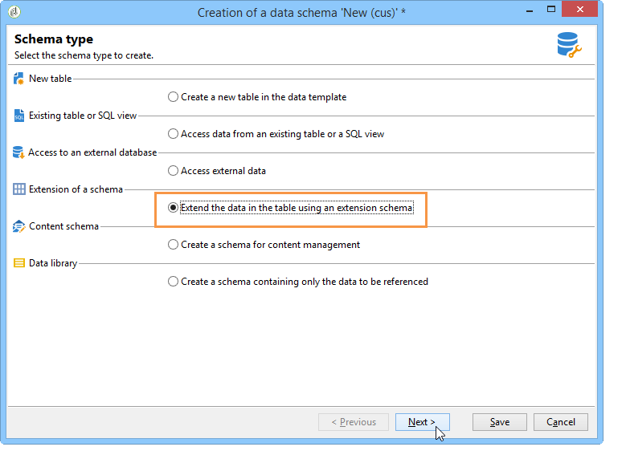
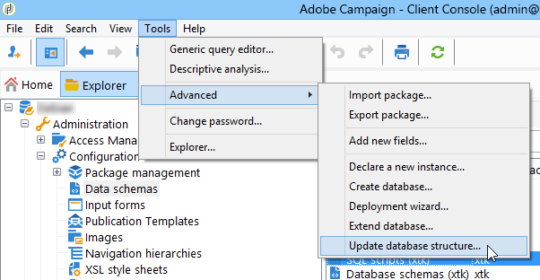
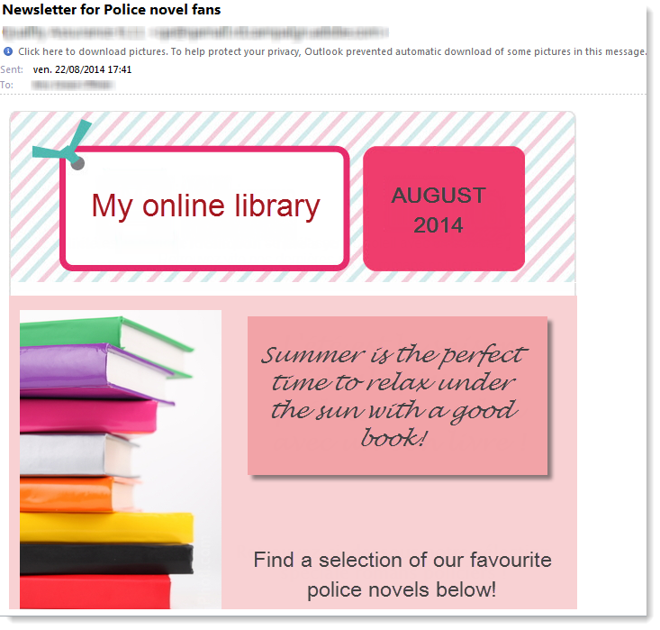

# Användningsfall: välja fröadresser enligt villkor{#use-case-selecting-seed-addresses-on-criteria}

I samband med en leverans eller en kampanj kan du med länken **[!UICONTROL Edit the dynamic condition...]** välja dirigerade adresser baserat på särskilda urvalskriterier.

I det här fallet vill webbplatsen **Mitt onlinebibliotek** anpassa sina nyhetsbrev efter kundernas litterära smak.

Tillsammans med inköpsavdelningen har användaren som ansvarar för leveranser skapat ett nyhetsbrev för prenumeranter som har köpt polisnoveler.

Leveranschefen bestämmer sig för att lägga till sina kollegor från inköpsavdelningen till leveransen som dirigeringsadresser för att dela slutresultatet av samarbetet med dem. Om du använder ett dynamiskt villkor kan du spara tid när du konfigurerar och uppdaterar adresser.

Om du vill använda det dynamiska villkoret måste du ha:

* en leverans som är klar att skickas,
* dirigerade adresser som har ett gemensamt värde. Värdet kan vara ett fält som redan finns i Adobe Campaign. I det här exemplet delar dirigeringsadresserna värdet&quot;Inköp&quot; i fältet&quot;Avdelning&quot;, som inte finns i programmet som standard.

## Steg 1 - Skapa en leverans {#step-1---creating-a-delivery}

Stegen för att skapa en leverans beskrivs i avsnittet [Skapa en e-postleverans](creating-an-email-delivery.md).

I det här exemplet har leveranshanteraren skapat nyhetsbrevet och valt mottagare.


## Steg 2 - Skapa ett gemensamt värde {#step-2---creating-a-common-value}

Om du vill skapa ett gemensamt värde som det i vårt exempel (Inköpsavdelning) måste du först utöka **dataschemat** för dina dirigerade adresser och redigera det associerade indataformuläret.

### Utöka dataschemat {#extending-the-data-schema}

Mer information om schematillägg finns i [Konfigurationsguiden](../../configuration/using/data-schemas.md).

1. Klicka på ikonen **[!UICONTROL New]** i noden **[!UICONTROL Administration > Configuration > Data schemas]**.
1. I fönstret **[!UICONTROL Creation of a data schema]** väljer du alternativet **[!UICONTROL Extension of a schema]** och klickar på **[!UICONTROL Next]**.

   

1. Välj **[!UICONTROL Seed addresses]**-källschemat, ange **doc** som **[!UICONTROL Namespace]** och klicka på **[!UICONTROL Ok]**.

   

1. Klicka på **[!UICONTROL Save]**.
1. I schemaredigeringsfönstret kopierar du raderna nedan och klistrar in dem i det område som visas på skärmbilden.

   ```
     <element name="common">
       <element label="Recipient" name="custom_nms_recipient">
         <attribute label="Department" length="80" name="workField" template="nms:recipient:recipient/@company"
                    type="string" userEnum="workField"/>
       </element>
     </element>
   ```

   

   Kopiera sedan följande rader och klistra in dem under **[!UICONTROL Seed to insert in the export files]**-elementet.

   ```
       <element aggregate="doc:seedMember:common">
     </element>
   ```

   

   I det här fallet anger du att en ny uppräkning med namnet **[!UICONTROL Department]** har skapats i dirigerad adresstabellen, och den är baserad på standarduppräkningsmallen **[!UICONTROL @company]** (med namnet **Company** i dirigerad adressform).

1. Klicka på **[!UICONTROL Save]**.
1. Välj alternativet **[!UICONTROL Update database structure]** på menyn **[!UICONTROL Tools > Advanced]**.

   

1. När uppdateringsguiden visas klickar du på knappen **[!UICONTROL Next]** för att öppna fönstret Redigera tabeller: Ändringar som utförs i schemat för startadressdata kräver en strukturuppdatering.

   

1. Följ guiden tills du kommer till sidan för att köra uppdateringen. Klicka på knappen **[!UICONTROL Start]**.

   

   När uppdateringen är klar kan du stänga guiden.

1. Koppla från och återanslut sedan till Adobe Campaign. Ändringarna i schemat för startadressdata gäller nu. För att de ska kunna visas på startadressens skärm måste du uppdatera den associerade **[!UICONTROL Input form]**. Se avsnittet [Uppdatera indataformuläret](#updating-the-input-form).

#### Utöka dataschemat från en länkad tabell {#extending-the-data-schema-from-a-linked-table}

Startadressernas dataschema kan använda värden från en tabell som är länkad till mottagardataschemat - mottagare (nms).

Användaren vill till exempel integrera **[!UICONTROL Internet Extension]** som finns i tabellen **[!UICONTROL Country]** som är länkad till mottagarschemat.


De måste därför utöka dataschemat för dirigerade adresser så som beskrivs i avsnittet. Följande kodrader ska integreras vid **steg 4**:

```
<element name="country">
      <attribute label="Internet Extension" length="2" name="iana" type="string"/>
      <attribute label="Country ISO" length="2" name="countryIsoA2" type="string"/>
    </element>
```


De anger

* som användaren vill skapa ett nytt element med namnet **[!UICONTROL Internet Extension]**,
* att det här elementet kommer från tabellen **[!UICONTROL Country]**.

>[!CAUTION]
>
>I den länkade tabellens namn måste du ange **xpath-dst** för den länkade tabellen.
>
>Detta finns i **[!UICONTROL Country]**-elementet i mottagartabellen.


Användaren kan sedan följa från **steg 5** i avsnittet och uppdatera **[!UICONTROL Input form]** för startadresserna.

Se avsnittet [Uppdatera indataformuläret](#updating-the-input-form).

#### Uppdaterar indataformuläret {#updating-the-input-form}

1. I noden **[!UICONTROL Administration > Configuration > Input forms]** hittar du indataformuläret för dirigerade adresser.

   

1. Redigera formuläret och infoga följande rad i **[!UICONTROL Recipient]**-behållaren.

   ```
   <input xpath="@workField"/>
   ```

   

1. Spara ändringarna.
1. Öppna en startadress. Fältet **[!UICONTROL Department]** visas i tabellen **[!UICONTROL Recipient]**.

   

1. Redigera de dirigerade adresser som du vill använda för leveransen och ange **Inköp** som värde i fältet **[!UICONTROL Department]**.

## Steg 3 - Definiera villkoret {#step-3---defining-the-condition}

Nu kan du ange det dynamiska villkoret för startadresserna för leveransen. Så här gör du:

1. Öppna en leverans.

   

1. Klicka på länken **[!UICONTROL To]** och sedan på fliken **[!UICONTROL Seed addresses]** för att komma åt länken **[!UICONTROL Edit the dynamic condition...]**.

   

1. Välj det uttryck som gör att du kan välja vilka dirigerade adresser du vill använda. Här väljer användaren uttrycket **[!UICONTROL Department (@workField)]**.

   

1. Välj det värde du vill ha. I det här exemplet väljer användaren avdelningen **Inköp** i listrutan med värden.

   

   >[!NOTE]
   >
   >Schematillägget som skapades tidigare kommer från schemat **mottagare**. Värdena som visas på skärmen ovan kommer från en uppräkning av schemat **mottagare**.

1. Klicka på **[!UICONTROL Ok]**.

   Frågan visas i fönstret **[!UICONTROL Select target]**.

   

1. Klicka på **[!UICONTROL Ok]** för att godkänna frågan.
1. Analysera leveransen och klicka sedan på fliken **[!UICONTROL Delivery]** för att komma åt leveransloggarna.

   Startadresserna för inköpsavdelningen visas som väntande leveranser, precis som för mottagarna eller andra startadresser.

   

1. Klicka på knappen **[!UICONTROL Send]** för att starta leveransen.

   Medlemmarna på inköpsavdelningen utgör en del av de dirigerade adresser som kommer att ta emot leveransen i inkorgen.

   
