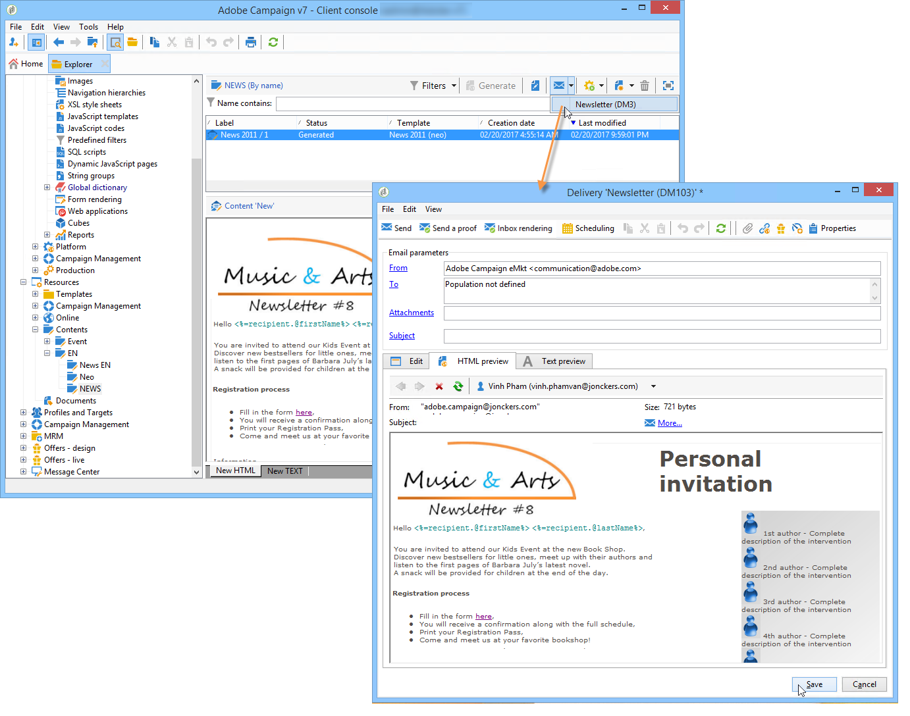

# Använd en innehållsmall{#using-a-content-template}

## Om innehållsmallar {#about-content-templates}

Innehållsmallar kan refereras och användas direkt i leveranser. Se [Skapa en leverans via innehållshantering](#creating-a-delivery-via-content-management)

De kan också användas för att skapa innehållsinstanser. När de har skapats är de här instanserna klara att levereras (se [Leverera en innehållsinstans](#delivering-a-content-instance)) eller exporterat (se [Skapa en innehållsinstans](#creating-a-content-instance)).

## Skapa en leverans via innehållshantering {#creating-a-delivery-via-content-management}

Du kan referera till en innehållsmall i en leverans när du använder inmatningsfält för att ange innehåll. Ytterligare en flik läggs till i leveransguiden för att definiera leveransinnehåll.

Layouten används automatiskt baserat på de valda inställningarna. Klicka på **[!UICONTROL HTML preview]** (eller **[!UICONTROL Text preview]** ) och välj en mottagare som ska testa personaliseringselement.

Mer information finns i det fullständiga implementeringsexemplet: [Skapa innehåll i leveransguiden](use-case-creating-content-management.md#creating-content-in-the-delivery-wizard).

## Skapa en innehållsinstans {#creating-a-content-instance}

Du kan skapa innehåll direkt i Adobe Campaign-trädet som ska användas i arbetsflöden, exporteras eller injiceras direkt i nya leveranser.

Använd följande steg:

1. Välj **[!UICONTROL Resources > Contents]** trädnod, högerklicka och välj **[!UICONTROL Properties]**.

   

1. Välj de publiceringsmallar som ska vara aktiva för den här mappen.

   

1. Nu kan du skapa nytt innehåll med **[!UICONTROL New]** ovanför innehållslistan.

   

1. Ange fälten i formuläret.

   

1. Klicka sedan på **[!UICONTROL HTML preview]** för att visa återgivningen. Här anges inte de anpassningsfält som hämtats från databasen.

   

1. När innehållet har skapats läggs det till i listan med tillgängligt innehåll. Klicka på **[!UICONTROL Properties]** om du vill ändra dess etikett, status eller visa dess historik.

   

1. När innehållet har godkänts kan det vid behov skapas med lämplig knapp i verktygsfältet.

   

   >[!NOTE]
   >
   >Du kan auktorisera generering av icke-godkänt innehåll. Om du vill göra det ändrar du det relevanta alternativet i publiceringsmallen. Mer information finns i [Skapa och konfigurera mallen](publication-templates.md#creating-and-configuring-the-template).

   HTML och textinnehåll genereras som standard i **publicera** Adobe Campaign-instansens mapp. Du kan ändra publikationsmappen med **NcmPublishingDir** alternativ.

## Leverera en innehållsinstans {#delivering-a-content-instance}

Om du vill skapa en innehållsinstans och leverera den måste en leveransmall länkas till den publiceringsmall som används för att generera innehållet. Mer information finns i [Leverans](publication-templates.md#delivery).

Dessutom måste innehållslagringsmappen dedikeras till innehåll som hämtas från den här publiceringsmallen (när en innehållsmapp gör att du kan generera flera typer av innehåll kan leveranser inte skapas automatiskt).

Om du vill skapa leveransen automatiskt baserat på det valda innehållet klickar du på **[!UICONTROL Delivery]** och välj en mall.

Text och HTML anges automatiskt.
