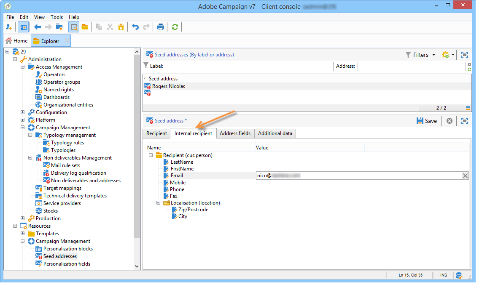

# Använd en extern mottagartabell{#using-an-external-recipient-table}

Om leveranstabellen är en extern tabell måste du göra ytterligare konfigurationer. Schemat **[!UICONTROL nms:seedmember]** måste utökas. En flik läggs till i startadresserna för att definiera fälten enligt nedan:

Om du vill lägga till dirigerade adresser till leveransen anger du lämpliga fält direkt på matchande flik eller importerar adressmallarna:

Schematillägget **nms:seedMember** är [det här avsnittet](../../configuration/using/seed-addresses.md).
