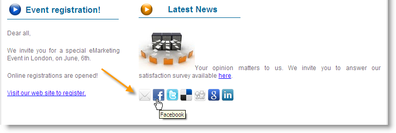
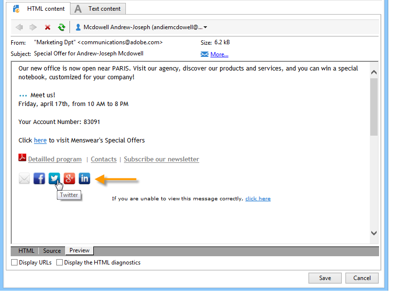

# Virusmarknadsföring och social marknadsföring{#viral-and-social-marketing}

## Om viral marknadsföring {#about-viral-marketing}

Med Adobe Campaign kan ni skapa verktyg för att uppmuntra till viral marknadsföring.

På så sätt kan mottagare eller besökare dela information med sitt nätverk: från att lägga till en länk till sin Facebook- eller Twitter-profil till att skicka ett meddelande till en vän.

>[!CAUTION]
>
>För att nya länkar ska fungera på rätt sätt måste den matchande spegelsidan vara tillgänglig. Det gör du genom att inkludera länken till spegelsidan i leveransen.

## Sociala nätverk: dela en länk {#social-networks--sharing-a-link}

Om du vill att leveransmottagarna ska kunna dela innehållet i meddelandena med medlemmarna i deras nätverk måste du inkludera det matchande personaliseringsblocket.

>[!NOTE]
>
>Som standard visas inte den här länken i listan med block. Du kommer åt den genom att klicka **[!UICONTROL Other...]** och markera **[!UICONTROL Social network sharing links]** blocket.

Återgivningen blir följande:

När mottagaren klickar på ikonen för ett av de sociala nätverk som visas omdirigeras de automatiskt till sitt konto och kan dela meddelandeinnehållet via en länk. Detta gör att medlemmarna i deras nätverk får tillgång till kommunikationen.

>[!NOTE]
>
>Det här anpassningsblocket innehåller alla länkar (för att skicka och dela meddelanden med alla sociala nätverk). Den kan anpassas efter dina behov. Konfigurationen är dock reserverad för avancerade användare. Om du vill redigera det matchande personaliseringsblocket går du till **[!UICONTROL Resources > Campaign management > Personalization blocks]** noden i Adobe Campaign-trädet.

## Viral marketing: vidarebefordra till en vän {#viral-marketing--forward-to-a-friend}

Med en virustjänst kan hänskjutningsåtgärder utföras: Med dessa åtgärder kan du vidarebefordra ett meddelande till en vän. Referenspersonens profil lagras tillfälligt i databasen (i en dedikerad tabell). Vidarebefordrade meddelanden innehåller en länk där mottagaren kan prenumerera: om de gör det läggs de till i Adobe Campaign-databasen.

Vidarebefordran av meddelanden baseras på samma principer som länkar till sociala nätverk.

Använd följande steg:

1. Lägg till **[!UICONTROL Social network sharing links]** personaliseringsblocket i det ursprungliga meddelandets brödtext.
1. Meddelandemottagaren kan klicka på **[!UICONTROL Email]** ikonen för att skicka meddelandet till en eller flera vänner.

   

   I ett hänvisningsformulär kan du ange e-postadresserna till de refererade.

   

   Meddelandet skickas till dem när huvudmottagaren klickar på **[!UICONTROL Next]** knappen.

   >[!NOTE]
   >
   >Innehållet i det här meddelandet kan anpassas efter dina behov. Den skapas baserat på **[!UICONTROL Transfer of original message]** mallen, som lagras i **[!UICONTROL Administration > Campaign management > Technical delivery templates]** noden.
   >
   >Det går också att ändra meddelandets vidarebefordringsformulär som har gjorts tillgängligt för referenten För att göra detta måste du ändra **webbprogrammet för virala formulär** som lagras i **[!UICONTROL Resources > Online > Web applications]** noden.

1. I det vidarebefordrade meddelandet finns en länk som gör att referenten kan spara sin profil i databasen. En tävlingsblankett tillhandahålls för detta ändamål.

   

   >[!NOTE]
   >
   >Denna konfiguration kan anpassas. För att göra detta måste du ändra webbprogrammet för **mottagarprenumerationer** som lagras i **[!UICONTROL Resources > Online > Web applications]** noden.
   >
   >Mer information om webbprogram finns i [det här avsnittet](../../web/using/about-web-applications.md).

   När de har validerat skickas ett bekräftelsemeddelande till dem: de registreras endast för gott när de aktiverar länken i bekräftelsemeddelandet. Det här meddelandet skapas baserat på **[!UICONTROL Registration confirmation]** mallen som lagras i **[!UICONTROL Administration > Campaign management > Technical delivery templates]** noden.

   Referenten läggs till i **mottagarmappen** i databasen och prenumereras (som standard) på informationstjänsten **Newsletter** .

## Spåra delning via sociala nätverk {#tracking-social-network-sharing}

Delning och åtkomst till delad information spåras. Den här informationen som samlas in av Adobe Campaign finns på två platser:

* på fliken **[!UICONTROL Tracking]** för leveransen (eller individuellt för varje mottagare):

   

* i en särskild **[!UICONTROL Sharing to social networks]** rapport:

   

