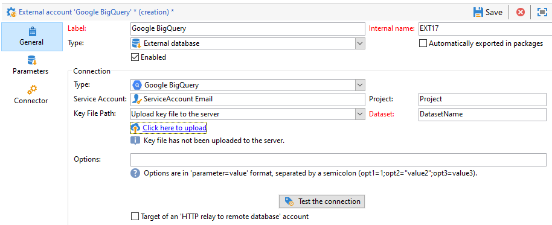

# Konfigurera åtkomst till Google BigQuery {#configure-fda-google-big-query}


Använd Adobe Campaign Classic **Åtkomst till federerade data** (FDA) om du vill bearbeta information som lagras i en extern databas. Följ stegen nedan för att konfigurera åtkomst till [!DNL Google BigQuery].

1. Konfigurera [!DNL Google BigQuery] på [Windows](#google-windows) eller [Linux](#google-linux)
1. Konfigurera [!DNL Google BigQuery] [externt konto](#google-external) i Adobe Campaign Classic
1. Konfigurera [!DNL Google BigQuery] massinläsning av koppling på [Windows](#bulk-load-windows) eller [Linux](#bulk-load-linux)

>[!NOTE]
>
> [!DNL Google BigQuery] anslutning finns för värdbaserade, hybridbaserade och lokala distributioner. Mer information finns på [den här sidan](../../installation/using/capability-matrix.md).


## Google BigQuery i Windows {#google-windows}

### Drivrutinen har konfigurerats i Windows {#driver-window}

1. Ladda ned [ODBC-drivrutin för Windows](https://cloud.google.com/bigquery/docs/reference/odbc-jdbc-drivers).

1. Konfigurera ODBC-drivrutinen i Windows. Mer information finns på [den här sidan](https://storage.googleapis.com/simba-bq-release/jdbc/Simba%20JDBC%20Driver%20for%20Google%20BigQuery%20Install%20and%20Configuration%20Guide.pdf).

1. För [!DNL Google BigQuery] för att Adobe Campaign Classic ska fungera krävs följande parametrar för att ansluta:

   * **[!UICONTROL Project]**: skapa eller använda ett befintligt projekt.

      Mer information finns i [page](https://cloud.google.com/resource-manager/docs/creating-managing-projects).

   * **[!UICONTROL Service account]**: skapa ett tjänstkonto.

      Mer information finns i [page](https://cloud.google.com/iam/docs/creating-managing-service-accounts).

   * **[!UICONTROL Key File Path]**: den **[!UICONTROL Service account]** kräver **[!UICONTROL Key File]** för [!DNL Google BigQuery] anslutning via ODBC.

      Mer information finns i [page](https://cloud.google.com/iam/docs/creating-managing-service-account-keys).

   * **[!UICONTROL Dataset]**: **[!UICONTROL Dataset]** är valfritt för en ODBC-anslutning. Eftersom varje fråga måste ange datauppsättningen där tabellen finns, anger du en **[!UICONTROL Dataset]** är obligatoriskt för [!DNL Google BigQuery] FDA Connector i Adobe Campaign Classic.

      Mer information finns i [page](https://cloud.google.com/bigquery/docs/datasets).

1. I Adobe Campaign Classic kan du sedan konfigurera [!DNL Google BigQuery] externt konto. Mer information om hur du konfigurerar ditt externa konto finns i [det här avsnittet](#google-external).

### Massinläsning har konfigurerats i Windows {#bulk-load-window}

>[!NOTE]
>
>Python måste vara installerat för att Google Cloud SDK ska fungera.
>
>Vi rekommenderar att du använder Python3. [page](https://www.python.org/downloads/).

Med Bulk Load Tool går det snabbare att överföra filer, vilket uppnås med Google Cloud SDK.

1. Hämta 64-bitars Windows-arkiv (x86_64) från detta [page](https://cloud.google.com/sdk/docs/downloads-versioned-archives) och extrahera den i motsvarande katalog.

1. Kör `google-cloud-sdk\install.sh` skript. Du måste acceptera inställningen för variabeln path.

1. Kontrollera att variabeln path finns efter installationen `...\google-cloud-sdk\bin` är inställt. Om inte, lägg till det manuellt.

1. I  `..\google-cloud-sdk\bin\bq.cmd` fil, lägga till `CLOUDSDK_PYTHON` lokal variabel, som kommer att dirigeras om till platsen för Python-installationen.

   Exempel:

   

1. Starta om Adobe Campaign Classic för att ta hänsyn till ändringarna.

## Google BigQuery i Linux {#google-linux}

### Drivrutinen har konfigurerats i Linux {#driver-linux}

Observera att skript och kommandon måste köras av rotanvändaren innan du konfigurerar drivrutinen. Vi rekommenderar även att du använder Google DNS 8.8.8.8 när du kör skriptet.

Konfigurera [!DNL Google BigQuery] i Linux följer du stegen nedan:

1. Kontrollera att följande paket är installerade på din Linux-distribution före ODBC-installationen:

   * För Red Hat/CentOS:

      ```
      yum update
      yum upgrade
      yum install -y grep sed tar wget perl curl
      ```

   * Debian:

      ```
      apt-get update
      apt-get upgrade
      apt-get install -y grep sed tar wget perl curl
      ```

1. Uppdatera systemet före installation:

   * För Red Hat/CentOS:

      ```
      # install unixODBC driver manager
      yum install -y unixODBC
      ```

   * Debian:

      ```
      # install unixODBC driver manager
      apt-get install -y odbcinst1debian2 libodbc1 odbcinst unixodbc
      ```

1. Gå till katalogen där skriptet finns och kör följande skript:

   ```
   cd /usr/local/neolane/nl6/bin/fda-setup-scripts
   ./bigquery_odbc-setup.sh
   ```

### Massinläsning konfigurerad för Linux {#bulk-load-linux}

>[!NOTE]
>
>Python måste vara installerat för att Google Cloud SDK ska fungera.
>
>Vi rekommenderar att du använder Python3. [page](https://www.python.org/downloads/).

Med Bulk Load Tool går det snabbare att överföra filer, vilket uppnås med Google Cloud SDK.

1. Kontrollera att följande paket är installerade på din Linux-distribution före ODBC-installationen:

   * För Red Hat/CentOS:

      ```
      yum update
      yum upgrade
      yum install -y python3
      ```

   * Debian:

      ```
      apt-get update
      apt-get upgrade
      apt-get install -y python3
      ```

1. Gå till katalogen där skriptet finns och kör följande skript:

   ```
   cd /usr/local/neolane/nl6/bin/fda-setup-scripts
   ./bigquery_sdk-setup.sh
   ```

## Externt Google BigQuery-konto {#google-external}

Du måste skapa en [!DNL Google BigQuery] externt konto för att ansluta din Adobe Campaign Classic-instans till [!DNL Google BigQuery] extern databas.

1. Från Adobe Campaign Classic **[!UICONTROL Explorer]**, klicka **[!UICONTROL Administration]** &#39;>&#39; **[!UICONTROL Platform]** &#39;>&#39; **[!UICONTROL External accounts]**.

1. Klicka på **[!UICONTROL New]**.

1. Välj **[!UICONTROL External database]** som ditt externa konto **[!UICONTROL Type]**.

1. Konfigurera [!DNL Google BigQuery] externt konto måste du ange:

   * **[!UICONTROL Type]**: [!DNL Google BigQuery]

   * **[!UICONTROL Service account]**: E-post till **[!UICONTROL Service account]**. Mer information finns i [Google Cloud-dokumentation](https://cloud.google.com/iam/docs/creating-managing-service-accounts).

   * **[!UICONTROL Project]**: Ditt namn **[!UICONTROL Project]**. Mer information finns i [Google Cloud-dokumentation](https://cloud.google.com/resource-manager/docs/creating-managing-projects).

   * **[!UICONTROL Key file Path]**:
      * **[!UICONTROL Upload key file to the server]**: välj **[!UICONTROL Click here to upload]** om du väljer att överföra nyckeln via Adobe Campaign Classic.

      * **[!UICONTROL Enter manually the key file path]**: kopiera/klistra in den absoluta sökvägen i det här fältet om du väljer att använda en befintlig nyckel.
   * **[!UICONTROL Dataset]**: Ditt namn **[!UICONTROL Dataset]**. Mer information finns i [Google Cloud-dokumentation](https://cloud.google.com/bigquery/docs/datasets-intro).

   

Kopplingen stöder följande alternativ:

| Option | Värde | Beskrivning |
|:-:|:-:|:-:|
| ProxyType | string | Typ av proxy som används för att ansluta till BigQuery via ODBC- och SDK-anslutningar. </br>HTTP (standard), http_no_tunnel, sockor4 och sockor5 stöds för närvarande. |
| ProxyHost | string | Värdnamn eller IP-adress dit proxyn kan nås. |
| ProxyPort | tal | Portnummer som proxyn körs på, t.ex. 8080 |
| ProxyUid | string | Användarnamn som används för den autentiserade proxyn |
| ProxyPwd | string | ProxyUid-lösenord |
| bqpath | string | Observera att detta endast gäller för massinläsningsverktyg (Cloud SDK). </br> För att undvika att använda variabeln PATH eller om katalogen google-cloud-sdk måste flyttas till en annan plats, kan du med det här alternativet ange den exakta sökvägen till bin-katalogen i molnet på servern. |
