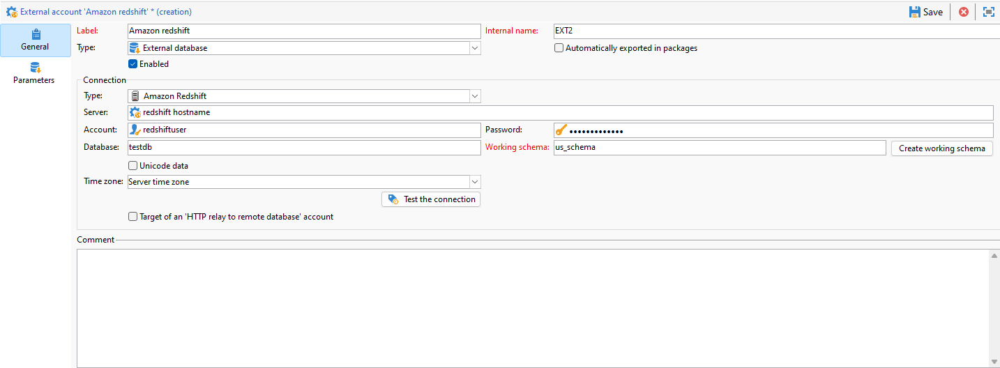

# Konfigurera åtkomst till Amazon Redshift {#configure-access-to-redshift}

Använd alternativet **FDA (Federated Data Access**) i kampanjen om du vill bearbeta information som lagras i en extern databas. Följ stegen nedan för att konfigurera åtkomst till Amazon Redshift.

1. Konfigurera [Amazon Redshift-databasen](#configuring-redshift)
1. Konfigurera det [externa Amazon Redshift-kontot](#redshift-external) i Campaign

## Amazon Redshift i Linux {#redshift-linux}

Så här konfigurerar du [!DNL Amazon Redshift] i Linux:

1. Kontrollera att följande paket är installerade på din Linux-distribution före ODBC-installationen:

   * För Red Hat/CentOS:

     ```
      yum update
      yum upgrade
      yum install -y grep sed tar wget perl curl
     ```

   * Debian:

     ```
      apt-get update
      apt-get upgrade
      apt-get install -y grep sed tar wget perl curl
     ```

1. Innan du kör skriptet har du tillgång till mer information med alternativet `--help`:

   ```
   cd /usr/local/neolane/nl6/bin/fda-setup-scripts/
   ./redshift_odbc-setup.sh --help
   ```

1. Gå till katalogen där skriptet finns och kör följande skript som rotanvändare:

   ```
     cd /usr/local/neolane/nl6/bin/fda-setup-scripts
     ./redshift_odbc-setup.sh
   ```

1. När du har installerat ODBC-drivrutinerna måste du starta om Campaign Classicen. Om du vill göra det kör du följande kommando:

   ```
   systemctl stop nlserver.service
   systemctl start nlserver.service
   ```

1. I Campaign kan du sedan konfigurera ditt [!DNL Amazon Redshift]-externa konto. Mer information om hur du konfigurerar ditt externa konto finns i [det här avsnittet](#redshift-external).

## Externt Amazon Redshift-konto {#redshift-external}

Med det externa [!DNL Amazon Redshift]-kontot kan du ansluta Campaign-instansen till den externa Amazon Redshift-databasen.

1. Konfigurera ditt externa [!DNL Amazon Redshift]-konto i Campaign Classicen. Klicka på **[!UICONTROL Administration]** / **[!UICONTROL Platform]** / **[!UICONTROL External accounts]** i **[!UICONTROL Explorer]**.

1. Klicka på **[!UICONTROL New]**.

1. Välj **[!UICONTROL External database]** som det externa kontots **[!UICONTROL Type]**.

1. Konfigurera det externa **[!UICONTROL Amazon Redshift]**-kontot måste du ange:

   * **[!UICONTROL Type]**: Amazon Redshift

   * **[!UICONTROL Server]**: Namn på DNS

   * **[!UICONTROL Account]**: Användarens namn

   * **[!UICONTROL Password]**: Lösenord för användarkonto

   * **[!UICONTROL Database]**: Namnet på databasen om det inte anges i DSN. Den kan lämnas tom om den anges i DSN

   * **[!UICONTROL Working schema]**: Namnet på ditt arbetsschema. [Läs mer](https://docs.aws.amazon.com/redshift/latest/dg/r_Schemas_and_tables.html)

   * **[!UICONTROL Time zone]**: Serverns tidszon

   

1. Klicka på **[!UICONTROL Save]**.
