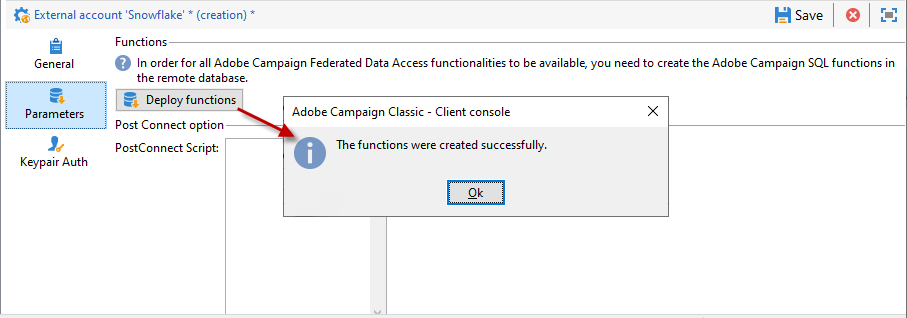

# Konfigurera åtkomst till Snowflake {#configure-access-to-snowflake}

Använd alternativet **FDA (Federated Data Access**) i kampanjen om du vill bearbeta information som lagras i en extern databas. Följ stegen nedan för att konfigurera åtkomst till [!DNL Snowflake].

1. Konfigurera [!DNL Snowflake] på [Linux](#snowflake-linux).
1. Konfigurera det [!DNL Snowflake] [externa kontot](#snowflake-external) i Campaign

>[!CAUTION]
>
>* [!DNL Snowflake]-anslutningen är tillgänglig för värdbaserade och lokala distributioner. Mer information finns på [den här sidan](../../installation/using/capability-matrix.md).
>
>* Den version av [!DNL Snowflake] ODBC-drivrutinen som stöds är **2.24.4** som minimum.
>


## Snowflake i Linux {#snowflake-linux}

Så här konfigurerar du [!DNL Snowflake] i Linux:

1. Kontrollera att följande paket är installerade på din Linux-distribution före ODBC-installationen:

   * För Red Hat/CentOS:

     ```
     yum update
     yum upgrade
     yum install -y grep sed tar wget perl curl
     ```

   * Debian:

     ```
     apt-get update
     apt-get upgrade
     apt-get install -y grep sed tar wget perl curl
     ```

1. Innan du kör skriptet har du tillgång till mer information med alternativet `--help`:

   ```
   cd /usr/local/neolane/nl6/bin/fda-setup-scripts/
   ./snowflake_odbc-setup.sh --help
   ```

1. Gå till katalogen där skriptet finns och kör följande skript som rotanvändare:

   ```
   cd /usr/local/neolane/nl6/bin/fda-setup-scripts
   ./snowflake_odbc-setup.sh
   ```

1. När du har installerat ODBC-drivrutinerna måste du starta om Campaign Classicen. Om du vill göra det kör du följande kommando:

   ```
   systemctl stop nlserver.service
   systemctl start nlserver.service
   ```

1. I Campaign kan du sedan konfigurera ditt [!DNL Snowflake]-externa konto. Mer information om hur du konfigurerar ditt externa konto finns i [det här avsnittet](#snowflake-external).

## Snowflake external account {#snowflake-external}

Du måste skapa ett externt [!DNL Snowflake]-konto för att ansluta Campaign-instansen till din [!DNL Snowflake]-externa databas.

1. Klicka på **[!UICONTROL Administration]** > **[!UICONTROL Platform]** > **[!UICONTROL External accounts]** i Campaign **[!UICONTROL Explorer]**.

1. Klicka på **[!UICONTROL New]**.

1. Välj **[!UICONTROL External database]** som det externa kontots **[!UICONTROL Type]**.

1. Under **[!UICONTROL Configuration]** väljer du [!DNL Snowflake] i listrutan **[!UICONTROL Type]**.

   

1. Lägg till din **[!UICONTROL Server]**-URL och **[!UICONTROL Database]**.

1. Konfigurera autentiseringen av det externa kontot **[!UICONTROL Snowflake]**:

   * För konto-/lösenordsautentisering måste du ange:

      * **[!UICONTROL Account]**: Användarens namn

      * **[!UICONTROL Password]**: Lösenord för användarkonto.

     

   * Klicka på fliken **[!UICONTROL Keypair Auth]** om du vill använda **[!UICONTROL Private key]** för att autentisera och kopiera och klistra in **[!UICONTROL Private key]**.

     

1. Klicka på fliken **[!UICONTROL Parameters]** och sedan på knappen **[!UICONTROL Deploy functions]** för att skapa funktioner.

   >[!NOTE]
   >
   >För att alla funktioner ska vara tillgängliga måste du skapa Adobe Campaign SQL-funktionerna i fjärrdatabasen. Mer information finns på [sidan](../../configuration/using/adding-additional-sql-functions.md).

   

1. Klicka på **[!UICONTROL Save]** när konfigurationen är klar.

Kopplingen stöder följande alternativ:

| Alternativ | Beskrivning |
|---|---|
| arbetsschema | Databasschema som ska användas för arbetsregister |
| lagerställe | Namnet på standardlagerstället som ska användas. Det åsidosätter användarens standardvärde. |
| TimeZoneName | Som standard är den tom, vilket innebär att systemtidszonen för Campaign Classicens programserver används. Alternativet kan användas för att framtvinga TIMEZONE-sessionsparametern. <br>Mer information finns på [den här sidan](https://docs.snowflake.net/manuals/sql-reference/parameters.html#timezone). |
| WeekStart | WEEK_START-sessionsparameter. Standardinställningen är 0. <br>Mer information finns på [den här sidan](https://docs.snowflake.com/en/sql-reference/parameters.html#week-start). |
| AnvändCachedResult | USE_CACHED_RESULTS sessionsparameter. Standardinställningen är TRUE. Det här alternativet kan användas för att inaktivera cachelagrade resultat i Snowflake. <br>Mer information finns på [den här sidan](https://docs.snowflake.net/manuals/user-guide/querying-persisted-results.html). |
| bulkThreads | Antal trådar som ska användas för Snowflake-massinläsare, fler trådar innebär bättre prestanda för större massinläsningar. Standardinställningen är 1. Numret kan justeras beroende på antalet datortrådar. |
| chunkSize | Bestämmer filstorleken för gruppinläsarsegmentet. Standardinställningen är 128 MB. Kan ändras för att få optimala prestanda när de används med bulkThreads. Fler samtidiga aktiva trådar innebär bättre prestanda. <br>Mer information finns i [Snowflake-dokumentationen](https://docs.snowflake.net/manuals/sql-reference/sql/put.html). |
| StageName | Namnet på den förallokerade interna scenen. Den används i massinläsning i stället för att skapa en ny tillfällig fas. |
