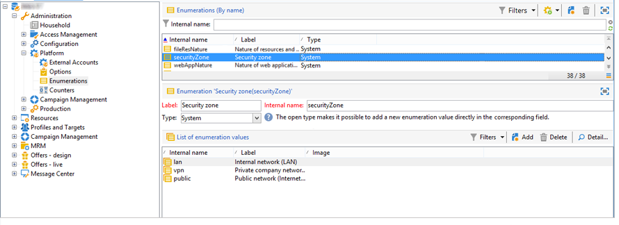
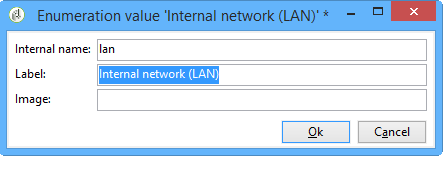
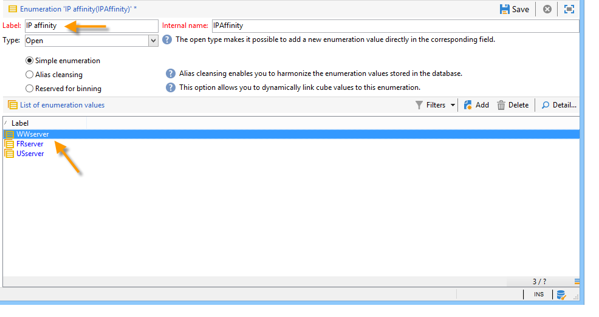

# Konfigurerar Campaign-server{#configuring-campaign-server}

I avsnittet nedan beskrivs serverkonfigurationer som kan utföras för att passa dina behov och dina miljöegenskaper.

>[!IMPORTANT]
>
>Dessa konfigurationer måste utföras av administratörer och endast för **lokala** värdmodeller.
>
>För **värdbaserade** distributioner kan inställningarna på serversidan endast konfigureras av Adobe. Vissa inställningar kan dock ställas in på Kontrollpanelen (till exempel vitlista för IP eller URL-behörigheter).

Mer information finns i följande avsnitt:

* [Dokumentation för kontrollpanelen](https://docs.adobe.com/content/help/en/control-panel/using/control-panel-home.html)
* [Värdmodeller](../../installation/using/hosting-models.md)
* [Funktionsmatris för Campaign Classic On-lokalt &amp; på värdplats](https://helpx.adobe.com/campaign/kb/acc-on-prem-vs-hosted.html)
* [Konfigurationssteg för hybridmodeller och värdbaserade modeller](https://docs.campaign.adobe.com/doc/AC/en/INS_Hybrid_and_Hosted_models_About_hybrid_and_hosted_models.html)

Konfigurationsfiler för Campaign Classic lagras i mappen **conf** i installationsmappen för Adobe Campaign. Konfigurationen sprids över två filer:

* **serverConf.xml**: allmän konfiguration för alla instanser. Den här filen innehåller de tekniska parametrarna för Adobe Campaign-servern: dessa delas av alla instanser. Beskrivningen av några av dessa parametrar beskrivs nedan. De olika noderna och parametrarna som visas i det här [avsnittet](../../installation/using/the-server-configuration-file.md).
* **config-`<instance>`.xml** (där **instansen** är namnet på instansen): specifik konfiguration för instansen. Om du delar servern mellan flera instanser anger du parametrarna som är specifika för varje instans i den aktuella filen.

## Definiera säkerhetszoner {#defining-security-zones}

### Om säkerhetszoner {#about-security-zones}

Varje operator måste länkas till en zon för att kunna logga in på en instans och operatörens IP-adress måste inkluderas i adresserna eller adressuppsättningarna som definieras i säkerhetszonen. Konfigurationen av säkerhetszonen utförs i konfigurationsfilen för Adobe Campaign-servern.

Operatorer är länkade till en säkerhetszon från sin profil i konsolen ( **[!UICONTROL Administration > Access management > Operators]** nod). Lär dig hur du länkar zoner till Campaign-operatorer i [det här avsnittet](#linking-a-security-zone-to-an-operator).

### Skapa säkerhetszoner {#creating-security-zones}

En zon definieras av:

* ett eller flera intervall med IP-adresser (IPv4 och IPv6)
* ett tekniskt namn länkat till varje IP-adressintervall

Säkerhetszoner är låsta, vilket innebär att om du definierar en ny zon inom en annan zon minskar antalet operatorer som kan logga in på den samtidigt som de rättigheter som tilldelats varje operator ökas.

Zoner måste definieras under serverkonfigurationen i filen **serverConf.xml** . Alla parametrar som finns i **serverConf.xml** listas i det här [avsnittet](../../installation/using/the-server-configuration-file.md).

Varje zon definierar rättigheter, till exempel:

* HTTP-anslutning i stället för HTTPS
* Felvisning (Java-fel, JavaScript, C++ osv.)
* Report and webApp preview
* Autentisering via inloggning/lösenord
* Osäkert anslutningsläge

>[!NOTE]
>
>**Varje operator måste länkas till en zon**. Om operatorns IP-adress tillhör det intervall som definieras av zonen kan operatorn logga in på instansen.\
>Operatorns IP-adress kan definieras i flera zoner. I det här fallet får operatören **uppsättningen** tillgängliga rättigheter för varje zon.

Filen **serverConf.xml** finns i tre zoner: public, **VPN och LAN**.

>[!NOTE]
>
>**Körklar konfiguration är säker**. Innan du migrerar från en tidigare version av Adobe Campaign kan det dock vara nödvändigt att tillfälligt minska säkerheten för att migrera och godkänna de nya reglerna.

Exempel på hur du definierar en zon i **filen serverConf.xml** :

```
<securityZone allowDebug="false" allowHTTP="false" label="Public Network" name="public">
<subNetwork label="All addresses" mask="*" name="all"/>

<securityZone allowDebug="true" allowHTTP="false" label="Private Network (VPN)"
              name="vpn" showErrors="true">

  <securityZone allowDebug="true" allowEmptyPassword="true" allowHTTP="true"
                allowUserPassword="false" label="Private Network (LAN)" name="lan"
                sessionTokenOnly="true" showErrors="true">
    <subNetwork label="Lan 1" mask="192.168.0.0/16" name="lan1"/>
    <subNetwork label="Lan 2" mask="172.16.0.0/12" name="lan2"/>
    <subNetwork label="Lan 3" mask="10.0.0.0/8" name="lan3"/>
    <subNetwork label="Localhost" mask="127.0.0.1/16" name="locahost"/>
    <subNetwork label="Lan (IPv6)" mask="fc00::/7" name="lan6"/>
    <subNetwork label="Localhost (IPv6)" mask="::1/128" name="localhost6"/>
  </securityZone>

</securityZone>
</securityZone>
```

Alla rättigheter som definierar en zon är följande:

* **allowDebug**: aktiverar en webApp som ska köras i felsökningsläge
* **allowEmptyPassword**: godkänner en anslutning till en instans utan lösenord
* **allowHTTP**: en session kan skapas utan att HTTPS-protokollet används
* **allowUserPassword**: sessionstoken kan ha följande format &quot;`<login>/<password>`&quot;
* **sessionTokenOnly**: säkerhetstoken krävs inte i anslutnings-URL
* **showErrors**: fel på serversidan vidarebefordras och visas

>[!IMPORTANT]
>
>I en zondefinition minskar varje attribut med värdet **true** säkerheten.

Om det finns flera körningsinstanser när du använder Message Center måste du skapa en extra säkerhetszon med attributet **sessionTokenOnly** definierat som **true**, där endast de nödvändiga IP-adresserna ska läggas till. Mer information om hur du konfigurerar instanser finns i [det här dokumentet](../../message-center/using/creating-a-shared-connection.md).

### Bästa tillvägagångssätt för säkerhetszoner {#best-practices-for-security-zones}

I definitionen av **säkerhetszonen för plan** är det möjligt att lägga till en IP-adressmask som definierar teknisk åtkomst. Det här tillägget ger åtkomst till alla instanser på servern.

```
<securityZone allowDebug="true" allowEmptyPassword="false" allowHTTP="true"
                    allowUserPassword="false" label="Private Network (LAN)" name="lan"
                    sessionTokenOnly="true" showErrors="true">
        <subNetwork label="Lan 1" mask="192.168.0.0/16" name="lan1"/>
        <subNetwork label="Lan 2" mask="172.16.0.0/12" name="lan2"/>
        <subNetwork label="Lan 3" mask="10.0.0.0/8" name="lan3"/>
        <subNetwork label="Localhost" mask="127.0.0.1/16" name="locahost"/>
        <subNetwork label="Lan (IPv6)" mask="fc00::/7" name="lan6"/>
        <subNetwork label="Localhost (IPv6)" mask="::1/128" name="localhost6"/>
  
        <!-- Customer internal IPs -->
        <subNetwork id="internalNetwork" mask="a.b.c.d/xx"/>

      </securityZone>
```

Vi rekommenderar att du definierar IP-adressintervall direkt i konfigurationsfilen som är dedikerad till instansen för operatorer som bara har åtkomst till en viss instans.

I **`config-<instance>.xml`** filen:

```
  <securityZone name="public">
   ...
    <securityZone name="vpn">
      <subNetwork id="cus1" mask="a.b.c.d/xx"/>
```

### Undernätverk och proxy i en säkerhetszon {#sub-networks-and-proxies-in-a-security-zone}

Parametern **proxy** kan användas i ett **subNetwork** -element för att ange proxyanvändning i en säkerhetszon.

När en proxy refereras och en anslutning matas in via den här proxyn (synlig via HTTP X-Forwarded-For-huvudet), är den verifierade zonen den för proxyns klienter och inte proxyns.

>[!IMPORTANT]
>
>Om en proxy är konfigurerad och det går att åsidosätta den (eller om den inte finns), kommer den IP-adress som testas att kunna förfalskas.
>
>Dessutom genereras nu reläer som proxies. Du kan därför lägga till IP-adressen 127.0.0.1 i listan över proxy i din säkerhetszonskonfiguration.
>
>Exempel: &quot; `<subnetwork label="Lan 1" mask="192.168.0.0/16" name="lan1" proxy="127.0.0.1,10.100.2.135" />`&quot;.

Olika fall kan inträffa:

* Ett undernätverk refereras direkt i säkerhetszonen och ingen proxy har konfigurerats: undernätverkets användare kan ansluta direkt till Adobe Campaign-servern.

   

* En proxy anges för ett undernätverk i säkerhetszonen: -användare från det här undernätverket har åtkomst till Adobe Campaign-servern via den här proxyn.

   

* En proxy ingår i ett undernätverk för säkerhetszoner: användare som har åtkomst via denna proxy, oavsett ursprung, har tillgång till Adobe Campaign-servern.

   

IP-adresserna till de proxies som sannolikt kommer att få åtkomst till Adobe Campaign-servern måste anges både i det **`<subnetwork>`** berörda och i det första delnätverket **`<subnetwork name="all"/>`**. Här gäller till exempel en proxy vars IP-adress är 10.131.146.102:

```
<securityZone allowDebug="false" allowHTTP="false" label="Public Network" 
                      name="public">
    <subNetwork label="All addresses" mask="*" name="all"
                      proxy="10.131.146.102,127.0.0.1, ::1"/>

    <securityZone allowDebug="true" allowHTTP="false" label="Private Network (VPN)" 
                      name="vpn" showErrors="true">
        <securityZone allowDebug="true" allowEmptyPassword="false" allowHTTP="true" 
                      allowUserPassword="false" label="Private Network (LAN)" 
                      name="lan" sessionTokenOnly="true" showErrors="true">
            <subNetwork label="Lan proxy" mask="10.131.193.182" name="lan3" 
                      proxy="10.131.146.102,127.0.0.1, ::1"/>
            <subNetwork label="Lan 1" mask="192.168.0.0/16" name="lan1" 
                      proxy="127.0.0.1, ::1"/>

        </securityZone>
    </securityZone>
</securityZone>
```

### Länka en säkerhetszon till en operatör {#linking-a-security-zone-to-an-operator}

När zoner har definierats måste varje operator länkas till en av dem för att kunna logga in på en instans och operatörens IP-adress måste inkluderas i adresserna eller adressintervallet som refereras i zonen.

Zonernas tekniska konfiguration görs i konfigurationsfilen för Campaign Server: **serverConf.xml**.

Innan detta börjar du med att konfigurera den körklara **[!UICONTROL Security zone]** uppräkningen för att länka en etikett till det interna namnet på zonen som definieras i **filen serverConf.xml** .

Den här konfigurationen görs i Campaign Explorer:

1. Klicka på **[!UICONTROL Administration > Platform > Enumerations]** noden.
1. Välj **[!UICONTROL Security zone (securityZone)]** systemuppräkningen.

   

1. Klicka på **[!UICONTROL Add]** knappen för varje säkerhetszon som definieras i serverns konfigurationsfil.
1. I **[!UICONTROL Internal name]** fältet anger du namnet på zonen som definierats i filen **serverConf.xml** . Det motsvarar attributet **@name** för `<securityzone>` elementet. Ange den etikett som är länkad till det interna namnet i fältet **** Etikett.

   

1. Klicka på OK och spara ändringarna.

När zonerna har definierats och **[!UICONTROL Security zone]** uppräkningen har konfigurerats måste du länka varje operator till en säkerhetszon:

1. Klicka på **[!UICONTROL Administration > Access management > Operators]** noden.
1. Markera den operator som du vill länka en säkerhetszon till och klicka på **[!UICONTROL Edit]** fliken.
1. Gå till **[!UICONTROL Access rights]** fliken och klicka på **[!UICONTROL Edit access parameters...]** länken.

   

1. Välj en zon i **[!UICONTROL Authorized connection zone]** listrutan

   

1. Klicka på **[!UICONTROL OK]** och spara ändringarna för att tillämpa ändringarna.

## Konfigurerar Tomcat {#configuring-tomcat}

### Standardport för Tomcat {#default-port-for-tomcat}

När Tomcat-serverns 8080-lyssningsport redan är upptagen med ett annat program som krävs för din konfiguration, måste du ersätta 8080-porten med en kostnadsfri port (till exempel 8090). Om du vill ändra den redigerar du filen **server.xml** som sparats i katalogen **/tomcat-7/conf** i installationsmappen för Adobe Campaign.

Ändra sedan porten för JSP-reläsidorna. Det gör du genom att ändra filen **serverConf.xml** som sparats i katalogen **/conf** i installationskatalogen för Adobe Campaign. Alla parametrar som finns i **serverConf.xml** listas i det här [avsnittet](../../installation/using/the-server-configuration-file.md).

```
<serverConf>
   ...
   <web controlPort="8005" httpPort="8090"...
   <url ... targetUrl="http://localhost:8090"...
```

### Mappa en mapp i Tomcat {#mapping-a-folder-in-tomcat}

Om du vill definiera kundspecifika inställningar kan du skapa en **user_contexts.xml** -fil i mappen **/tomcat-7/conf** , som även innehåller **filen contexts.xml** .

Filen kommer att innehålla följande typ av information:

```
 <Context path='/foo' docBase='../customers/foo'   crossContext='true' debug='0' reloadable='true' trusted='false'/>
```

Om det behövs kan den här åtgärden reproduceras på serversidan.

## Anpassa leveransparametrar {#personalizing-delivery-parameters}

Leveransparametrarna definieras i **konfigurationsfilen serverConf.xml** . Alla parametrar som finns i **serverConf.xml** listas i det här [avsnittet](../../installation/using/the-server-configuration-file.md).

Allmän serverkonfiguration och allmänna kommandon finns i [Campaign-serverkonfigurationen](../../installation/using/campaign-server-configuration.md).

Du kan även göra följande konfigurationer beroende på dina behov och inställningar.

### SMTP-relä {#smtp-relay}

MTA-modulen fungerar som en intern e-postöverföringsagent för SMTP-sändning (port 25).

Det är dock möjligt att ersätta den med en reläserver om säkerhetsprincipen kräver det. I så fall blir den globala genomströmningen relä (förutsatt att reläservergenomströmningen är lägre än i Adobe Campaign 1).

I det här fallet ställs dessa parametrar in genom att SMTP-servern konfigureras i **`<relay>`** -avsnittet. Du måste ange IP-adressen (eller värddatorn) för den SMTP-server som används för att överföra post och dess associerade port (25 som standard).

```
<relay address="192.0.0.3" port="25"/>
```

>[!IMPORTANT]
>
>Det här operativläget innebär allvarliga leveransbegränsningar eftersom det kan minska genomströmningen avsevärt på grund av reläserverns inneboende prestanda (latens, bandwith...). Dessutom kommer kapaciteten att kvalificera synkrona leveransfel (som upptäcks genom analys av SMTP-trafik) att vara begränsad och det går inte att skicka om reläservern inte är tillgänglig.

### MTA-underprocesser {#mta-child-processes}

Det är möjligt att kontrollera populationen av underordnade processer (maxSpareServers som standard 2) för att optimera sändningsprestanda enligt serverns processorkraft och tillgängliga nätverksresurser. Den här konfigurationen görs i avsnittet **`<master>`** MTA-konfiguration på varje enskild dator.

```
<master dataBasePoolPeriodSec="30" dataBaseRetryDelaySec="60" maxSpareServers="2" minSpareServers="0" startSpareServers="0">
```

Se även [E-postoptimering](../../installation/using/email-deliverability.md#email-sending-optimization).

### Hantera utgående SMTP-trafik med tillhörigheter {#managing-outbound-smtp-traffic-with-affinities}

>[!IMPORTANT]
>
>Tillhörighetskonfigurationen måste vara konsekvent från en server till en annan. Vi rekommenderar att du kontaktar Adobe för tillhörighetskonfiguration eftersom konfigurationsändringar bör replikeras på alla programservrar som kör MTA.

Du kan förbättra utgående SMTP-trafik genom tillhörigheter med IP-adresser.

Gör så här:

1. Ange tillhörigheterna i avsnittet **`<ipaffinity>`** i **filen serverConf.xml** .

   En tillhörighet kan ha flera olika namn: för att skilja dem åt, använda **** tecken.

   Exempel:

   ```
    IPAffinity name="mid.Server;WWserver;local.Server">
             <IP address="XX.XXX.XX.XX" heloHost="myserver.us.campaign.net" publicId="123" excludeDomains="neo.*" weight="5"/
   ```

   Om du vill visa de relevanta parametrarna läser du i **filen serverConf.xml** .

1. Om du vill aktivera tillhörighetsval i listrutorna måste du lägga till tillhörighetsnamn i **IPAfinity** -uppräkningen.

   

   >[!NOTE]
   >
   >Uppräkningar finns i [det här dokumentet](../../platform/using/managing-enumerations.md).

   Du kan sedan välja den tillhörighet som ska användas, som visas nedan för typologier:

   

   >[!NOTE]
   >
   >Du kan även se [Leveransserverkonfiguration](../../installation/using/email-deliverability.md#delivery-server-configuration).

## URL-behörigheter {#url-permissions}

Standardlistan med URL:er som kan anropas av JavaScript-koder (arbetsflöden osv.) antalet Campaign Classic-instanser är begränsat. Det här är URL:er som gör att dina instanser fungerar som de ska.

Som standard tillåts inte instanser att ansluta till externa URL:er. Det är dock möjligt att lägga till vissa externa URL:er i listan över auktoriserade URL:er, så att instansen kan ansluta till dem. På så sätt kan ni koppla era Campaign-instanser till externa system, som till exempel SFTP-servrar eller webbplatser, för att möjliggöra fil- och/eller dataöverföring.

När en URL har lagts till refereras den till i instansens konfigurationsfil (serverConf.xml).

Hur du hanterar URL-behörigheter beror på din värdmodell:

* **Hybrid** eller **lokal**: lägg till de URL:er som ska tillåtas i **filen** serverConf.xml. Detaljerad information finns i avsnittet nedan.
* **Värdbaserad**: lägg till de URL:er som ska tillåtas via **Kontrollpanelen**. Mer information finns i den [dedikerade dokumentationen](https://docs.adobe.com/content/help/en/control-panel/using/instances-settings/url-permissions.html).

Med **hybridvärdmodeller** och **lokala** värdmodeller måste administratören referera till en ny **urlPermission** i **filen serverConf.xml** . Alla parametrar som finns i **serverConf.xml** listas i det här [avsnittet](../../installation/using/the-server-configuration-file.md).

Det finns tre lägen för anslutningsskydd:

* **Blockering**: alla URL:er som inte tillhör vitlistan blockeras, med ett felmeddelande. Det här är standardläget efter en efteruppgradering.
* **Tillstånd**: Alla URL:er som inte hör till vitlistan tillåts.
* **Varning**: alla URL:er som inte är vita tillåts, men JS-tolken genererar en varning så att administratören kan samla in dem. I det här läget läggs JST-310027-varningsmeddelanden till.

```
<urlPermission action="warn" debugTrace="true">
  <url dnsSuffix="abc.company1.com" urlRegEx=".*" />
  <url dnsSuffix="def.partnerA_company1.com" urlRegEx=".*" />
  <url dnsSuffix="xyz.partnerB_company1.com" urlRegEx=".*" />
</urlPermission>
```

>[!IMPORTANT]
>
>Som standard använder nya kunders kunder **blockeringsläget**. Om de behöver tillåta en ny URL bör de kontakta sin administratör för att vitlista den.
>
>Befintliga kunder som kommer från en migrering kan använda **varningsläget** en stund. Samtidigt måste de analysera utgående trafik innan de godkänner URL:erna. När listan över auktoriserade URL:er har definierats bör administratören vitlista URL:erna och aktivera **blockeringsläget**.

## Dynamisk sidsäkerhet och vidarebefordran {#dynamic-page-security-and-relays}

Som standard är alla dynamiska sidor automatiskt relaterade till den **lokala** Tomcat-servern på datorn vars webbmodul har startats. Den här konfigurationen anges i avsnittet **`<url>`** i frågereläkonfigurationen för **filen ServerConf.xml** . Alla parametrar som finns i **serverConf.xml** listas i det här [avsnittet](../../installation/using/the-server-configuration-file.md).

för att vidarebefordra körning av den dynamiska sidan på en **fjärrserver** , om webbmodulen inte är aktiverad på datorn. För att göra detta måste du ersätta **localhost** med namnet på fjärrdatorn för JSP och JSSP, webbprogram, rapporter och strängar.

Mer information om de olika tillgängliga parametrarna finns i konfigurationsfilen **serverConf.xml** .

För JSP-sidor är standardkonfigurationen:

```
<url relayHost="true" relayPath="true" targetUrl="http://localhost:8080" urlPath="*.jsp"/>
```

Adobe Campaign använder följande JSP-sidor:

* /nl/jsp/**soaprouter.jsp**: klientkonsol och Web services-anslutningar (SOAP API:er),
* /nl/jsp/**m.jsp**: spegelsidor,
* /nl/jsp/**logon.jsp**: Webbaserad åtkomst till rapporter och driftsättning av klientkonsolen,
* /nl/jsp/**s.jsp** : Använda viral marknadsföring (sponsring och sociala nätverk).

De JSSP som används för Mobile App Channel är följande:

* nms/mobile/1/registerIOS.jssp
* nms/mobile/1/registerAndroid.jssp

**Exempel:**

Det går att förhindra klientdatoranslutningar från utsidan. För att göra detta begränsar du helt enkelt utförandet av **soaprouter.jsp** och godkänner endast exekvering av spegelsidor, virala länkar, webbformulär och offentliga resurser.

Parametrarna är följande:

```
<url IPMask="<IP_addresses>" deny=""     hostMask="" relayHost="true"  relayPath="true"  targetUrl="http://localhost:8080" timeout="" urlPath="*.jsp"/>
<url IPMask="<IP_addresses>" deny=""     hostMask="" relayHost="true"  relayPath="true"  targetUrl="http://localhost:8080" timeout="" urlPath="*.jssp"/> 
<url IPMask=""               deny=""     hostMask="" relayHost="true" relayPath="true" targetUrl="http://localhost:8080" timeout="" urlPath="m.jsp"/>
<url IPMask=""               deny=""     hostMask="" relayHost="true" relayPath="true" targetUrl="http://localhost:8080" timeout="" urlPath="s.jsp"/>
<url IPMask=""               deny=""     hostMask="" relayHost="true" relayPath="true" targetUrl="http://localhost:8080" timeout="" urlPath="webForm.jsp"/>
<url IPMask=""               deny=""     hostMask="" relayHost="true"  relayPath="true"  targetUrl="http://localhost:8080" timeout="" urlPath="/webApp/pub*"/>
<url IPMask=""               deny=""     hostMask="" relayHost="true"  relayPath="true"  targetUrl="http://localhost:8080" timeout="" urlPath="/jssp/pub*"/>
<url IPMask=""               deny=""     hostMask="" relayHost="true"  relayPath="true"  targetUrl="http://localhost:8080" timeout="" urlPath="/strings/pub*"/>
<url IPMask=""               deny=""     hostMask="" relayHost="true"  relayPath="true"  targetUrl="http://localhost:8080" timeout="" urlPath="/interaction/pub*"/>
<url IPMask=""               deny="true" hostMask="" relayHost="false" relayPath="false" targetUrl="http://localhost:8080" timeout="" urlPath="*.jsp"/>
<url IPMask=""               deny="true" hostMask="" relayHost="false" relayPath="false" targetUrl="http://localhost:8080" timeout="" urlPath="*.jssp"/>
```

I det här exemplet sammanfaller **`<IP_addresses>`** värdet med listan över IP-adresser (avgränsade med kommatecken) som har behörighet att använda relämodulen för den här masken.

>[!NOTE]
>
>Värdena ska anpassas efter din konfiguration och dina nätverksbegränsningar, särskilt om specifika konfigurationer har utvecklats för din installation.

## Begränsa tillåtna externa kommandon {#restricting-authorized-external-commands}

>[!NOTE]
>
>Följande konfiguration krävs bara för lokala installationer.

Från och med bygge 8780 kan teknikadministratörer begränsa listan över auktoriserade externa kommandon som kan användas i Adobe Campaign.

Om du vill göra det måste du skapa en textfil med en lista över kommandon som du inte kan använda, till exempel:

```
ln
dd
openssl
curl
wget
python
python3
perl
ruby
sh
```

>[!IMPORTANT]
>
>Denna lista är inte uttömmande.

I noden **exec** i serverkonfigurationsfilen måste du referera till den tidigare skapade filen i attributet **svartlistFile** .

**Endast** för Linux: i serverkonfigurationsfilen rekommenderar vi att du anger en användare som ska köra externa kommandon för att förbättra säkerhetskonfigurationen. Den här användaren anges i **exec** -noden i konfigurationsfilen. Alla parametrar som finns i **serverConf.xml** listas i det här [avsnittet](../../installation/using/the-server-configuration-file.md).

>[!NOTE]
>
>Om ingen användare anges körs alla kommandon i användarkontexten för Adobe Campaign-instansen. Användaren måste vara en annan än användaren som kör Adobe Campaign.

Exempel:

```
<serverConf>
 <exec user="theUnixUser" blacklistFile="/pathtothefile/blacklist"/>
</serverConf>
```

Den här användaren måste läggas till i användarlistan för Adobe Campaign-operatorn neolane.

>[!IMPORTANT]
>
>Du bör inte använda en anpassad sudo. En standardsudo måste installeras på datorn.

## Hantera HTTP-huvuden {#managing-http-headers}

Som standard skickas inga HTTP-huvuden vidare. Du kan lägga till specifika rubriker i svar som skickas via relä. Så här gör du:

1. Gå till **filen serverConf.xml** . Alla parametrar som finns i **serverConf.xml** listas i det här [avsnittet](../../installation/using/the-server-configuration-file.md).
1. Gå till listan med vidarebefordrade HTTP-rubriker i noden. **`<relay>`** .
1. Lägg till ett **`<responseheader>`** element med följande attribut:

   * **namn**: rubriknamn
   * **värde**: värdenamn.
   Exempel:

   ```
   <responseHeader name="Strict-Transport-Security" value="max-age=16070400; includeSubDomains"/>
   ```

## Spårning av överflödiga {#redundant-tracking}

När flera servrar används för omdirigering måste de kunna kommunicera med varandra via SOAP-anrop för att kunna dela information från de URL:er som ska omdirigeras. När leveransen påbörjas är det möjligt att inte alla omdirigeringsservrar är tillgängliga. därför kanske de inte har samma informationsnivå.

>[!NOTE]
>
>När du använder standardarkitekturen eller företagsarkitekturen måste huvudprogramservern ha behörighet att överföra spårningsinformation på varje dator.

De redundanta servrarnas URL måste anges i omdirigeringskonfigurationen via filen **serverConf.xml** . Alla parametrar som finns i **serverConf.xml** listas i det här [avsnittet](../../installation/using/the-server-configuration-file.md).

**Exempel:**

```
<spareserver enabledIf="$(hostname)!='front_srv1'" id="1" url="http://front_srv1:8080" />
<spareserver enabledIf="$(hostname)!='front_srv2'" id="2" url="http://front_srv2:8080" />
```

Egenskapen **enableIf** är valfri (tom som standard) och gör att du bara kan aktivera anslutningen om resultatet är true; På så sätt kan du få en identisk konfiguration på alla omdirigeringsservrar.

Om du vill hämta datorns värdnamn kör du följande kommando: **värdnamn -s**.

## Hantera offentliga resurser {#managing-public-resources}

Offentliga medel används för att [förvalta offentliga medel](../../installation/using/deploying-an-instance.md#managing-public-resources).

De lagras i katalogen **/var/res/instance** i installationskatalogen för Adobe Campaign.

Den matchande URL:en är: **http://server/res/instance** där **instansen** är namnet på spårningsinstansen.

Du kan ange en annan katalog genom att lägga till en nod i filen **conf-`<instance>`.xml** för att konfigurera lagring på servern. Det innebär att följande rader läggs till:

```
<serverconf>
  <shared>
    <dataStore hosts="media*" lang="fra">
      <virtualDir name="images" path="/var/www/images"/>
     <virtualDir name="publicFileRes" path="$(XTK_INSTALL_DIR)/var/res/$(INSTANCE_NAME)/"/>
    </dataStore>
  </shared>
</serverconf>
```

I det här fallet bör den nya URL:en för de offentliga resurserna som anges i den övre delen av fönstret i distributionsguiden peka på den här mappen.

## Arbetsflöden och tillhörighet med hög tillgänglighet {#high-availability-workflows-and-affinities}

Du kan konfigurera flera arbetsflödesservrar (wfserver) och distribuera dem på två eller flera datorer. Om du väljer den här typen av arkitektur konfigurerar du anslutningsläget för belastningsutjämnarna enligt åtkomsten till Adobe Campaign.

Om du vill få åtkomst från webben väljer du **belastningsutjämnarläget** för att begränsa anslutningstiderna.

Om du öppnar via Adobe Campaign-konsolen väljer du **hash** - eller **sticky** -läge. Detta gör att du kan upprätthålla anslutningen mellan klienten och servern och förhindra att en användarsession avbryts under en import- eller exportåtgärd, till exempel.

Du kan välja att framtvinga körningen av ett arbetsflöde eller en arbetsflödesaktivitet på en viss dator. För att kunna göra detta måste du definiera en eller flera tillhörigheter för arbetsflödet eller aktiviteten.

1. Skapa tillhörigheterna för arbetsflödet eller aktiviteten genom att ange dem i **[!UICONTROL Affinity]** fältet.

   Du kan fritt välja tillhörighetsnamn. Se dock till att du inte använder blanksteg eller skiljetecken. Om du använder olika servrar anger du olika namn.

   

   

   Listrutan innehåller tillhörigheter som tidigare använts. Den slutförs över tiden med de olika angivna värdena.

1. Öppna **filen nl6/conf/config-`<instance>.xml`**.
1. Ändra raden som matchar **[!UICONTROL wfserver]** modulen enligt följande:

   ```
   <wfserver autoStart="true" affinity="XXX,"/>
   ```

   Om du definierar flera tillhörigheter måste de avgränsas med kommatecken utan mellanslag:

   ```
   <wfserver autoStart="true" affinity="XXX,YYY,"/>
   ```

   Kommatecknet efter tillhörighetens namn är nödvändigt för körning av arbetsflöden där ingen tillhörighet har definierats.

   Om du bara vill köra arbetsflöden för vilka en tillhörighet har definierats, ska du inte lägga till ett kommatecken i slutet av listan med dina tillhörigheter. Ändra till exempel raden enligt följande:

   ```
   <wfserver autoStart="true" affinity="XXX"/>
   ```

## Automatisk processomstart {#automatic-process-restart}

Som standard startar de olika Adobe Campaign-processerna om automatiskt kl. 6.00 (servertid) varje dag.

Du kan dock ändra den här konfigurationen.

Det gör du genom att gå till **filen serverConf.xml** som finns i **conf** -databasen för din installation. Alla parametrar som finns i **serverConf.xml** listas i det här [avsnittet](../../installation/using/the-server-configuration-file.md).

Varje process som konfigureras i den här filen har ett **processRestartTime** -attribut. Du kan ändra värdet för det här attributet för att anpassa starttiden för varje process efter dina behov.

>[!IMPORTANT]
>
>Ta inte bort det här attributet. Alla processer måste startas om varje dag.

## Begränsa överförbara filer {#limiting-uploadable-files}

Med ett nytt attribut **uploadWhiteList** kan du begränsa vilka filtyper som är tillgängliga för överföring på Adobe Campaign-servern.

Det här attributet är tillgängligt i **dataStore** -elementet i **filen serverConf.xml** . Alla parametrar som finns i **serverConf.xml** listas i det här [avsnittet](../../installation/using/the-server-configuration-file.md).

Standardvärdet för det här attributet är **.+** så kan du ladda upp alla filtyper.

Om du vill begränsa antalet möjliga format måste du ersätta attributvärdet med ett giltigt reguljärt java-uttryck. Du kan ange flera värden genom att separera dem med kommatecken.

Till exempel: upload **WhiteList=&quot;&quot;.*.png,*.jpg&quot;** gör att du kan överföra PNG- och JPG-format till servern. Inga andra format godtas.

>[!IMPORTANT]
>
>I Internet Explorer måste den fullständiga filsökvägen verifieras av det reguljära uttrycket.

## Konfiguration för proxyanslutning {#proxy-connection-configuration}

Om du behöver ansluta Campaign-servern till utsidan via en proxy (till exempel med hjälp av en arbetsflödesaktivitet för filöverföring) måste du konfigurera avsnittet proxyConfig i serverConf via ett kommando. Följande proxyanslutningar är möjliga: HTTP, HTTPS, FTP, SFTP. Alla parametrar som finns i **serverConf.xml** listas i det här [avsnittet](../../installation/using/the-server-configuration-file.md).

>[!NOTE]
>
>SOCKS-proxies stöds inte.

Använd följande kommando:

```
nlserver config -setproxy:[protocol]/[serverIP]:[port]/[login][:‘https’|'http’]
```

protokollparametrar kan vara&quot;http&quot;,&quot;https&quot; eller&quot;ftp&quot;.

Om du anger FTP på samma port som HTTP/HTTPS-trafik kan du använda följande:

```
nlserver config -setproxy:http/198.51.100.0:8080/user
```

Alternativen http och https används bara när protokollparametern är ftp och anger om tunnlingen på den angivna porten ska utföras via HTTPS eller via HTTP.

Om du använder olika portar för FTP-/SFTP- och HTTP/HTTPS-trafik över proxyservern bör du ange protokollparametern ftp.


Exempel:

```
nlserver config -setproxy:ftp/198.51.100.0:8080/user:’http’
```

Ange sedan lösenordet.

HTTP-anslutningar definieras i parametern proxyHTTP:

```
<proxyConfig enabled=“1” override=“localhost*” useSingleProxy=“0”>
<proxyHTTP address=“198.51.100.0" login=“user” password=“*******” port=“8080”/>
</proxyConfig>
```

HTTPS-anslutningar definieras i parametern proxyHTTPS:

```
<proxyConfig enabled=“1" override=“localhost*” useSingleProxy=“0">
<proxyHTTPS address=“198.51.100.0” login=“user” password=“******” port=“8080"/>
</proxyConfig>
```

FTP-/FTPS-anslutningar definieras i parametern proxyFTP:

```
<proxyConfig enabled=“1" override=“localhost*” useSingleProxy=“0">
<proxyFTP address=“198.51.100.0” login=“user” password=“******” port=“5555" https=”true”/>
</proxyConfig>
```

Om du använder samma proxy för flera anslutningstyper definieras bara proxyHTTP med useSingleProxy inställt på &quot;1&quot; eller &quot;true&quot;.

Om du har interna anslutningar som ska gå igenom proxyn lägger du till dem i parametern override.

Om du tillfälligt vill inaktivera proxyanslutningen anger du parametern enabled till &quot;false&quot; eller &quot;0&quot;.
