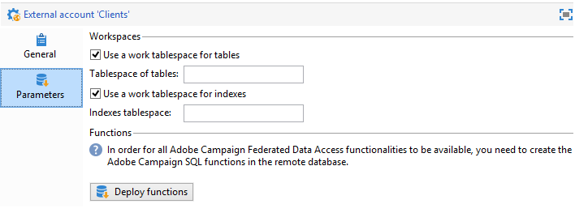

# Ansluta till databasen {#connecting-to-the-database}

Om du vill aktivera en anslutning till den externa databasen måste du ange anslutningsparametrarna, dvs. måldatakällan och namnet på tabellen med data som behöver läsas in.

>[!CAUTION]
>
>Adobe Campaign-användaren behöver specifika rättigheter för den externa databasen och Adobe Campaign-programservern för att kunna bearbeta data från en extern databas. Mer information finns i [Åtkomsträttigheter till fjärrdatabas](../../installation/using/remote-database-access-rights.md) -avsnitt.
>
>För att undvika felfunktioner måste operatorer som har åtkomst till delade fjärrdata arbeta från separata blanksteg.

## Skapa en delad anslutning {#creating-a-shared-connection}

Om du vill aktivera en anslutning till en delad extern databas kan du komma åt databasen via Adobe Campaign så länge den här anslutningen är aktiv.

1. Konfigurationen måste definieras i förväg via **[!UICONTROL Administration > Platform > External accounts]** nod.
1. Klicka på **[!UICONTROL New]** och väljer **[!UICONTROL External database]** typ.
1. Definiera **[!UICONTROL Connection]** den externa databasens parametrar.

   För anslutningar till **ODBC** skriver databasen **[!UICONTROL Server]** -fältet måste innehålla namnet på ODBC-datakällan och inte servernamnet. Dessutom kan vissa ytterligare konfigurationer vara nödvändiga beroende på vilka databaser som används. Se [Specifika konfigurationer efter databastyp](../../installation/using/configure-fda.md) -avsnitt.

1. När parametrarna har angetts klickar du på **[!UICONTROL Test the connection]** för att godkänna dem.

   

1. Om det behövs avmarkerar du **[!UICONTROL Enabled]** om du vill inaktivera åtkomst till den här databasen utan att ta bort dess konfiguration.
1. Om du vill att Adobe Campaign ska kunna komma åt den här databasen måste du distribuera SQL-funktionerna. Klicka på **[!UICONTROL Parameters]** tabben **[!UICONTROL Deploy functions]** -knappen.

   

Du kan definiera särskilda arbetskatalogutrymmen för tabellerna och för indexvärdena i **[!UICONTROL Parameters]** -fliken.

## Skapa en tillfällig anslutning {#creating-a-temporary-connection}

Du kan definiera en anslutning till en extern databas direkt från arbetsflödesaktiviteter. I det här fallet kommer den att finnas i en lokal extern databas som är reserverad för att användas i ett aktuellt arbetsflöde: den sparas inte på externa konton. Den här typen av punktanslutning kan skapas för olika aktiviteter i arbetsflödet, särskilt **[!UICONTROL Query]**, **[!UICONTROL Data loading (RDBMS)]**, **[!UICONTROL Enrichment]** aktivitet eller **[!UICONTROL Split]** aktivitet.

>[!CAUTION]
>
>Den här typen av konfiguration rekommenderas inte, men kan användas regelbundet för att samla in data. Du bör ändå skapa ett externt konto enligt beskrivningen i [Skapa en delad anslutning](#creating-a-shared-connection) -avsnitt.

I frågeaktiviteten är till exempel stegen för att skapa en periodisk anslutning till en extern databas följande:

1. Klicka på **[!UICONTROL Add data...]** och väljer **[!UICONTROL External data]** alternativ.
1. Välj **[!UICONTROL Locally defining the data source]** alternativ.

   

1. Välj måldatabasmotorn i listrutan. Ange namnet på servern och ange autentiseringsparametrarna.

   Ange också namnet på den externa databasen.

   

   Klicka på knappen **[!UICONTROL Next]**.

1. Markera tabellen där data lagras.

   Du kan ange namnet på tabellen direkt i motsvarande fält eller klicka på redigeringsikonen för att öppna listan med databastabeller.

   

1. Klicka på **[!UICONTROL Add]** för att definiera ett eller flera avstämningsfält mellan externa databasdata och data i Adobe Campaign-databasen. The **[!UICONTROL Edit expression]** ikoner för **[!UICONTROL Remote field]** och **[!UICONTROL Local field]** ger dig tillgång till listan med fält i varje tabell.

   

1. Om det behövs anger du ett filtreringsvillkor och datasorteringsläget.
1. Välj de ytterligare data som ska samlas in i den externa databasen. Det gör du genom att dubbelklicka på de fält som du vill lägga till för att visa dem i **[!UICONTROL Output columns]**.

   

   Klicka **[!UICONTROL Finish]** för att bekräfta konfigurationen.

## Säker anslutning {#secure-connection}

>[!NOTE]
>
>Säker anslutning är bara tillgänglig för PostgreSQL.

Du kan skydda åtkomsten till en extern databas när du konfigurerar ett externt FDA-konto.

Lägg till &quot;**:ssl**&quot; efter serveradressen och adressen till den port som används. Till exempel: **192.168.0.52:4501:ssl**.

Data skickas sedan via det säkra SSL-protokollet.

## Ytterligare konfigurationer {#additional-configurations}

Om det behövs kan du skapa schemat för databearbetning i en extern databas. På samma sätt kan du i Adobe Campaign definiera mappning av data i en extern tabell. Dessa konfigurationer är allmänna och gäller inte enbart arbetsflöden.

>[!NOTE]
>
>Mer information om hur du skapar scheman i Adobe Campaign och definierar en ny datamappning finns i [den här sidan](../../configuration/using/about-schema-edition.md).
