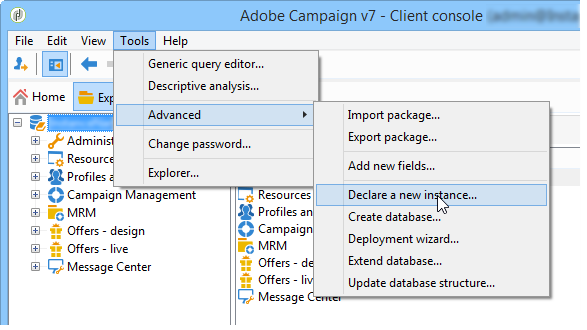

# Skapa nya instanser{#creating-new-instances}

När Adobe Campaign är installerat och instansen har skapats kan du lägga till en ny instans från konsolen. I det här läget kan du skapa spårningsinstanser utan att komma åt konsolen.

Om du vill göra det loggar du in på en befintlig databas och utför följande steg:

1. Deklarera en ny instans

   Gå till **[!UICONTROL Tools > Advanced > Declare a new instance...]** för att starta guiden.

   

   Ange parametrarna för den nya instansen. Mer information finns i [Skapa en instans och logga in](../../installation/using/creating-an-instance-and-logging-on.md).
