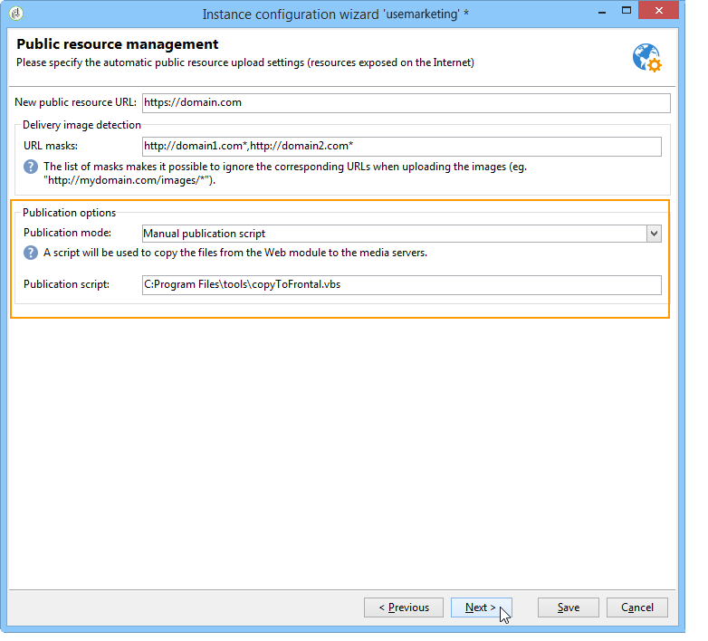

# Driftsätta en instans{#deploying-an-instance}

>[!NOTE]
>
>Konfigurationer på serversidan kan bara utföras av Adobe för distributioner som hanteras av Adobe. Mer information om de olika distributionerna finns i [Värdmodeller](../../installation/using/hosting-models.md) avsnitt eller till [den här sidan](../../installation/using/capability-matrix.md).

## Distributionsguide {#deployment-wizard}

Adobe Campaign tillhandahåller en grafisk assistent, som finns i Adobe Campaign klientkonsol, för att definiera parametrarna för den instans som du ska ansluta till.

Om du vill starta distributionsguiden väljer du **Verktyg > Avancerat > Distributionsguiden**.


Konfigurationsstegen är följande:

1. [Allmänna parametrar](#general-parameters)
1. [E-postkanalsparametrar](#email-channel-parameters)
1. [Hantera studsade e-postmeddelanden](#managing-bounced-emails)
1. [Spårningskonfiguration](#tracking-configuration)
1. [Parametrar för mobilkanal](#mobile-channel-parameters)
1. [Nationella inställningar](#regional-settings)
1. [Åtkomst från Internet](#access-from-the-internet)
1. [Hantera offentliga resurser](#managing-public-resources)
1. [Rensar data](#purging-data)

## Allmänna parametrar {#general-parameters}

I det första steget i distributionsguiden kan du ange allmän information om instansen.


### Allmän information {#general-information}

I fönstrets nedre del kan du välja vilka alternativ som ska aktiveras.

* **[!UICONTROL Customer identifier used in billing]** : detta kan vara namnet på instansen och versionsnumret.
* **[!UICONTROL Common name of the customer]** : Ange en teckensträng med företagets namn. Den här informationen kan användas i avprenumerationslänkarna.
* **[!UICONTROL Namespace]** : Ange en kort identifierare i gemener. Målet är att skilja mellan din specifika konfiguration och fabrikskonfigurationen om du uppgraderar. Standardnamnutrymmet är **kus** - för kunden.

### Tekniska alternativ {#technical-options}

I fönstrets nedre del kan du välja vilka alternativ som ska aktiveras.

Följande alternativ är tillgängliga:

* **[!UICONTROL Email channel]** : för att aktivera e-postleverans. Se [E-postkanalsparametrar](#email-channel-parameters).
* **[!UICONTROL Tracking]** : Om du vill aktivera spårning av målpopulationen (öppnar och klickar). Se [Spårningskonfiguration](#tracking-configuration).
* **[!UICONTROL Managing bounced emails]** : För att definiera det POP-konto som används för att hämta inkommande e-post. Se [Hantera studsade e-postmeddelanden](#managing-bounced-emails).
* **[!UICONTROL LDAP integration]** : Konfigurera användarautentisering via en LDAP-katalog. Se [Ansluta via LDAP](../../installation/using/connecting-through-ldap.md).

## E-postkanalsparametrar {#email-channel-parameters}

I följande steg definierar du vilken information som ska visas i meddelanderubriker.

Dessa parametrar kan överlagras i leveransmallar, och individuellt för varje leverans (om användarna har de rättigheter som krävs).

### Parametrar för levererade e-postmeddelanden {#parameters-for-delivered-emails}


Ange följande parametrar:

* **[!UICONTROL Sender name]** : Ange avsändarens namn.
* **[!UICONTROL Sender address]** : Ange avsändarens e-postadress.

  >[!NOTE]
  >
  > När du skickar e-post från Adobe Campaign **Avsändaradress** postlådan övervakas inte och marknadsföringsanvändare kan inte komma åt den här postlådan. Adobe Campaign erbjuder inte heller möjlighet att svara automatiskt eller vidarebefordra e-postmeddelanden som tas emot i den här postlådan. Läs mer om god praxis för slutprodukter [i den här dokumentationen](https://experienceleague.adobe.com/docs/deliverability-learn/deliverability-best-practice-guide/additional-resources/campaign/ac-starting-new-platform.html){_blank}.

* **[!UICONTROL Reply address text]** : Ange det namn som ska användas när mottagaren klickar på **[!UICONTROL Reply]** -knappen.
* **[!UICONTROL Reply address]** : Ange den e-postadress som ska användas när mottagaren klickar på **[!UICONTROL Reply]** i klientprogramvaran för e-post.

  >[!NOTE]
  >
  >Syftet med **Svarsadress** fältet är när du vill att mottagaren ska svara på en annan adress än **Avsändaradress**.  Den här adressen måste vara en giltig e-postadress, länkad till en övervakad postlåda och värd av kunden.  Det kan vara en supportpostlåda, till exempel customer-care@customer.com, där e-postmeddelanden läses och besvaras.

* **[!UICONTROL Error address]** : Ange e-postadressen för meddelanden med fel. Detta är den tekniska adress som används för att hantera studsmeddelanden, inklusive e-post som tas emot av Adobe Campaign-servern på grund av att måladresserna inte finns.

  >[!NOTE]
  >
  > Den här adressen måste vara en giltig e-postadress, länkad till en övervakad postlåda och värd av kunden. Det kan vara en studspostlåda, till exempel errors@customer.com.


Förutom detta kan du ange **masker** som är behöriga för avsändaradressen och feladressen. Om det behövs kan dessa masker separeras med kommatecken. Den här konfigurationen är valfri. När fält anges kontrollerar Adobe Campaign vid leveranstillfället (under analysen om adressen inte innehåller några variabler) att adresserna är giltiga. Det här operativläget ser till att inga adresser används som kan utlösa leveransproblem. Leveransadresserna måste konfigureras på leveransservern.

>[!NOTE]
>
>* De här inställningarna sparas i alternativen för Campaign-plattformen. [Läs mer](../../installation/using/configuring-campaign-options.md).
> 
>* För konfigurationer med flera varumärken kan du anpassa feladressen och åsidosätta den här konfigurationen från det externa kontot för e-postroutning. [Läs mer](../../installation/using/external-accounts.md#email-routing-external-account).
>


### Tecken som är godkända i adresser {#characters-authorized-in-addresses}

<!--This window enables you to define, for all email campaigns, the delivery and address-quality management options.-->

I Adobe Campaign-databasen måste alla e-postadresser skapas enligt följande: `x@y.z`. The **x**, **y** och **z** får inte vara tomma och får inte innehålla otillåtna tecken.

Här definierar du vilka tecken som är tillåtna (&#39;datapolicy&#39;) i databasens e-postfält. Tecken som inte finns med i listan kommer att förbjudas och nekas därför när information matas in i databasen via gränssnittet, via ett webbformulär eller när data importeras.

Två listor är tillgängliga: **Endast europeisk** eller **Endast USA**. Andra tecken kan läggas till om det behövs.

### Leveransparametrar {#delivery-parameters}

The **Avancerade parametrar..** Med hjälp av länken kan du komma åt leveransalternativ, parametrar som är länkade till återförsök och karantän.


I det här fönstret kan ni definiera alternativ för hantering av leverans och adresskvalitet för alla e-postkampanjer.

Följande alternativ är tillgängliga:

* **[!UICONTROL Delivery duration of messages]** : Efter denna tid stoppas leveransen (som standard 5 dagar).
* **[!UICONTROL Online resources validity duration]** : Tidpunkt för vilken information från mottagarprofilen sparas för att generera spegelsidor.
* **[!UICONTROL Exclude recipients who no longer wish to be contacted]** : När det här alternativet är markerat kommer mottagare i blockeringslista inte att kontaktas.
* **[!UICONTROL Automatically ignore doubles]** : När det här alternativet är markerat kommer leveransen inte att göras till dubblettadresser.

>[!NOTE]
>
>För värdbaserade eller hybridinstallationer, om du har uppgraderat till [Förbättrad MTA](../../delivery/using/sending-with-enhanced-mta.md), **[!UICONTROL Delivery duration of the messages]** kommer endast att användas om det är inställt på **3,5 dagar eller mindre**. Om du anger ett värde som är högre än 3,5 dagar kommer det inte att tas med i beräkningen.

### Försök igen med parametrar {#retry-parameters}

Information om återvinning finns i **Återställningsperioder** och **Antal återställningar** fält: när en mottagare inte kan nås, till exempel om inkorgen är full, försöker programmet som standard kontakta mottagaren fem gånger, med ett timmars intervall mellan varje försök (under den maximala leveranstiden). Dessa värden kan ändras efter behov.

>[!NOTE]
>
>För värdbaserade eller hybridinstallationer, om du har uppgraderat till [Förbättrad MTA](../../delivery/using/sending-with-enhanced-mta.md)används inte längre parametrarna för kampanjåterförsök. Mjuka avhoppsförsök och hur lång tid det tar mellan dem bestäms av den förbättrade MTA-metoden baserat på typ och allvarlighetsgrad för de avhoppssvar som kommer tillbaka från meddelandets e-postdomän.

### Karantänparametrar {#quarantine-parameters}

Konfigurationsalternativen för karantän är följande:

* **[!UICONTROL Duration between two significant errors]** : ange ett värde (&quot;1d&quot; som standard: 1 dag) för att definiera tiden programmet väntar innan felräknaren ökas om fel uppstår,
* **[!UICONTROL Maximum number of errors before quarantine]** : När det här värdet har nåtts sätts e-postadressen i karantän (som standard&quot;5&quot;: adressen sätts i karantän på det sjätte felet). Detta innebär att kontakten automatiskt utesluts från efterföljande leveranser.

## Hantera studsade e-postmeddelanden {#managing-bounced-emails}

För att kvalificera leveransfel är det mycket viktigt med studentpost. Felen kategoriseras i mappen NP@I när reglerna har fastställt orsaken.

Det här steget är bara tillgängligt om **E-postkanal** och **Studsa e-post** hanteringsalternativ väljs i det första steget i distributionsguiden. Se [Allmänna parametrar](#general-parameters).

I det här steget kan du definiera inställningar för hantering av studsmeddelanden.


### POP-konto som används för att hämta inkommande e-post {#pop-account-used-to-retrieve-incoming-mails}

Ange de parametrar som ska anslutas till kontot för att hämta inkommande e-post.

* **[!UICONTROL Label]** : Namn som innehåller alla parametrar som anges nedan.
* **[!UICONTROL Server]** : Server som används för att hämta studentpost (inkommande e-post),
* **[!UICONTROL Security]** : Välj vid behov **[!UICONTROL SSL]** från listrutan,
* **[!UICONTROL Port]** : serverport (vanligtvis 110),
* **[!UICONTROL Account]** : Namn på det konto som används för studsmeddelanden.
* **[!UICONTROL Password]** : Lösenord som är kopplat till kontot.

När du har angett POP-inställningarna klickar du på **Testa** för att säkerställa att de är korrekta.

### Obearbetade studsmeddelanden {#unprocessed-bounce-mails}

Satserna hanteras automatiskt av Adobe Campaign och de regler som anges i **Administration > Campaign Management > Non deliverables Management > Delivery log eligibility** nod. Mer information finns i [E-posthantering](../../delivery/using/understanding-delivery-failures.md#bounce-mail-management).

Obearbetade studsar visas inte i Adobe Campaign-gränssnittet. De tas automatiskt bort om de inte överförs till en tredje parts postlåda med följande fält:

* **[!UICONTROL Forwarding address]** : Fyll i det här fältet om du vill överföra alla felmeddelanden (bearbetade eller obearbetade) som samlas in av Adobe Campaign-plattformen till en tredje part.
* **[!UICONTROL Address for errors]** : Fyll i det här fältet om du bara vill överföra felmeddelanden till en tredje partsadress som det inte gick att kvalificera inMail-processen för.
* **[!UICONTROL SMTP server]** : Servern som används för att skicka obearbetade studsmeddelanden.

>[!IMPORTANT]
>
>Om du vill vidarebefordra obearbetade studsmeddelanden rekommenderar Adobe att du bara fyller i **[!UICONTROL Address for errors]** fält. Kontrollera dock att adressen som används kontrolleras regelbundet eftersom det kan medföra en stor belastning på e-postservern. Kontakta er kontoansvarige om du vill ha mer information.

## Spårningskonfiguration {#tracking-configuration}

I nästa steg kan du konfigurera spårning för instansen. Instansen måste deklareras och registreras hos spårningsservern(arna).

Det här steget erbjuds endast när **E-postkanal** och **Spårning** alternativ väljs på den första sidan i distributionsguiden. Se [Allmänna parametrar](#general-parameters).

Mer detaljerad information om webbspårning (spårningsläge, skapa och infoga taggar...) finns i [det här dokumentet](../../configuration/using/about-web-tracking.md).

### Verksamhetsprincip {#operating-principle}

När du aktiverar spårning för en instans ändras URL:erna i leveranserna under sändningen för att aktivera spårning.

* Informationen om externa URL:er (oavsett om de är säkra eller inte) som anges på den här sidan i distributionsguiden används för att skapa den nya URL:en. Förutom den här informationen innehåller den ändrade länken: Identifierare för leveransen, mottagaren och URL:en.

  Spårningsinformation samlas in av Adobe Campaign på spårningsservrar för att berika mottagarprofiler och data som är länkade till leveransen ( **[!UICONTROL Tracking]** tabbar).

  Information om interna URL:er används endast av Adobe Campaign-programservern för att kontakta spårningsservern/-servrarna.

  Mer information finns i [Spårningsserver](#tracking-server).

* När URL-adresserna har konfigurerats måste du aktivera spårning. För att göra detta måste instansen registreras på spårningsservern(arna).

  Mer information finns i [Spårning sparas](#saving-tracking).

### Spårningsserver {#tracking-server}


För att säkerställa effektiviteten i spårningen för den här instansen måste följande information visas:
<!--With Mid-sourcing architecture, you can externalize tracking management. To do this:-->

* **[!UICONTROL External URL]** och/eller **[!UICONTROL Secure external URL]** : Ange den omdirigerings-URL som ska användas i det e-postmeddelande som ska skickas.
* **[!UICONTROL Internal URL(s)]** : URL:er som bara används av Adobe Campaign-servern för att kontakta spårningsservern/-servrarna för att samla in loggar och överföra URL:erna. Du behöver inte associera den med instansen.

  Om du inte anger någon URL används spårnings-URL som standard.

Med en arkitektur som bygger på flera källor kan ni externalisera spårningshanteringen. Så här gör du:

1. Välj alternativet **[!UICONTROL Externalize tracking management]** : Detta gör att du kan använda en server för mellanlagring som spårningsserver.
1. Fyll i **[!UICONTROL External account]** och **[!UICONTROL Instance name]** fält för att kunna ansluta till servern.

   Mer information finns i [Server för mellanleverantörer](../../installation/using/mid-sourcing-server.md).

1. Klicka på **[!UICONTROL Enable the tracking instance]** för att godkänna anslutningen till servern.

   

### Spårning sparas {#saving-tracking}

När URL-adresserna har fyllts i måste du registrera spårningsservern.

Klicka på länken **Registrering på spårningsservrar** och välj sedan ett av de tillgängliga alternativen.


Det finns tre möjliga typer av arkitektur för implementering av spårning:

1. **Lägga till stöd för spårning i en befintlig instans**

   Det här alternativet gäller om instansen redan har skapats för andra behov (MTA-server osv.) på servrar som ska användas som spårningsservrar.

   

   Ange lösenordet för **internal** konto på omdirigeringsservrar för att konfigurera spårningsinstansen.

   >[!NOTE]
   >
   >Om flera spårningsservrar används måste alla ha samma namn och lösenord.

   Ange namnet på instansen och lösenordet.

1. **Skapa en ny instans som är dedikerad till spårning**

   Det här alternativet är användbart när du spårar instanser som är reserverade för spårning och inte har några andra programmoduler.

   

   Ange lösenordet för **internal** konto på omdirigeringsservrar för att konfigurera spårningsinstansen.

   >[!NOTE]
   >
   >Om flera spårningsservrar har konfigurerats måste alla använda samma lösenord.

   Ange namnet på instansen, lösenordet och eventuella associerade DNS-masker, till exempel **[!UICONTROL Campaign*]**.

1. **Validera en spårningsinstans som redan är förkonfigurerad för dig**

   Det här alternativet används när du inte har något lösenord för **internal** Konto. I det här fallet är ett spårningskonto förkonfigurerat för dig på spårningsservrarna. Ange lösenordet för spårningskontot för omdirigeringsservrarna för att validera spårningsinstansen.

   

   Ange namnet på den instans som ska valideras.

Klicka **Godkänn** för att starta inspelningsprocessen med spårningsservern.

I föregående fönster bekräftar ett meddelande registreringen på spårningsservernivå:


Parametrarna som är länkade till URL-sökningar **får inte ändras** för en standardinstallation. Kontakta Adobe för alla andra parametrar.

## Parametrar för mobilkanal {#mobile-channel-parameters}

I nästa steg kan du definiera standardinställningar för leveranser till mobiler (SMS och WAP Push).

>[!NOTE]
>
>Mobilkanalen är valfri: den här fasen visas endast om den har köpts. Kontrollera licensavtalet.


### Standardkonto för SMS-leverans {#default-account-for-sms-delivery}

Ange följande information:

* **[!UICONTROL Label]** : Ange ett namn för det här SMS-/Wap-push-kontot. Du kanske vill använda namnet på routern.
* För **[!UICONTROL Server]**, **[!UICONTROL Port]**, **[!UICONTROL Account]**, **[!UICONTROL Password]**, **[!UICONTROL Connector]**, **[!UICONTROL Send Endpoint]**, **[!UICONTROL Reception Endpoint]**, **[!UICONTROL Notification Endpoint]** fält: Kontakta tjänsteleverantören för att få de inställningar som krävs.

### Parametrar för SMS har skickats {#parameters-of-sms-sent}

I **Prioritet** nedrullningsbar lista: Välj &quot;Normal&quot;, &quot;Hög&quot; eller &quot;Urgent&quot; för att använda det på de meddelanden som ska skickas.

### Avancerade parametrar {#advanced-parameters}

The **Avancerade parametrar..** -länken gör att du kan komma åt alternativen för återförsök och karantän.


Information om återförsök finns i **Period för återförsök** och **Antal återförsök** fält: När det inte går att nå en mobil försöker programmet som standard igen fem gånger med intervall på minst 15 minuter (under den maximala leveransperioden). Dessa värden kan anpassas efter dina behov.

Konfigurationsalternativen för karantän är följande:

* **[!UICONTROL Time between two significant errors]** : Ange ett standardvärde (som standard &quot;1d&quot;: dag) för att definiera tiden som programmet väntar innan räknaren ökas för ett fel.
* **[!UICONTROL Maximum number of errors before quarantine]** : När det här värdet har nåtts sätts mobilnumret i karantän (som standard&quot;5&quot;: talet sätts i karantän vid det sjätte felet). Det innebär att kontakten automatiskt utesluts från framtida leveranser.

## Nationella inställningar {#regional-settings}

I det här steget kan du ange inställningar för dataprofiler.


* **[!UICONTROL Consider all phone numbers as international ones]** : När det här alternativet är markerat används det internationella formatet på telefonnummer (landsprefixet är då obligatoriskt eftersom antalet siffror inte kontrolleras innan formateringen används). Om du inte väljer det här alternativet måste du själv ange &quot;+&quot; eller &quot;00&quot; som prefix för det internationella telefonnumret.
* **[!UICONTROL Store all phone numbers using the international format]** : Detta alternativ gäller endast **inhemsk** telefonnummer som importeras eller redigeras. Ange om du vill använda ett nationellt format (till exempel 425 555 0150) eller det internationella formatet (till exempel +1 425 555 0150)

## Åtkomst från Internet {#access-from-the-internet}

>[!IMPORTANT]
>
>Av sekretesskäl rekommenderar vi att du använder HTTPS för alla externa resurser.

I det här steget kan du definiera åtkomst-URL:er för Adobe Campaign-sidor som visas på Internet.

Här måste du även ange vilka publiceringsalternativ som är länkade till webbformulär.


### Servrar som exponeras på webben {#servers-exposed-on-the-web}

Använd den här sidan om du vill fylla i server-URL:er till:

1. Åtkomst till programservern som visas på Internet: prenumerations-/avprenumerationsformulär, extranät osv.
1. Använd programservern för resurser som inte visas på webben: formulär, intranät, bekräftelsesidor.
1. Få åtkomst till leveranssidornas spegelsidor.

   En spegelsida är en dynamisk sida som visar innehållet i e-postmeddelandet. Den öppnas via en länk som infogas i meddelandet som skickas till mottagaren och kan innehålla anpassade element. Spegelsidan ger mottagaren möjlighet att läsa meddelandet i en webbläsare i stället för i e-postprogrammet, oavsett leveransformat (text eller HTML). Spegelsidor genereras dock bara för en viss leverans om det obligatoriska HTML-innehållet har definierats.

Med Adobe Campaign kan du differentiera dessa tre URL-adresser för att sprida belastningen över flera plattformar.


>[!NOTE]
>
>* De här inställningarna sparas i alternativen för Campaign-plattformen. [Läs mer](../../installation/using/configuring-campaign-options.md).
>* För konfigurationer med flera varumärken kan du anpassa URL:en för speglingssidan och åsidosätta den här konfigurationen från det externa e-postroutningskontot. [Läs mer](../../installation/using/configuring-campaign-options.md).


## Hantera offentliga resurser {#managing-public-resources}

>[!IMPORTANT]
>
>Av sekretesskäl rekommenderar vi att du använder HTTPS för alla externa resurser.

För att kunna ses utifrån måste de bilder som används i e-postmeddelanden och offentliga resurser som är kopplade till kampanjer finnas på en externt tillgänglig server. De kan sedan vara tillgängliga för externa mottagare eller operatorer.


I det här steget måste du ange:

1. Den nya URL:en för den offentliga resursen. Mer information finns i [URL för offentliga resurser](#public-resources-url) -avsnitt.
1. Bildidentifieringsläget i en leverans. Mer information finns i [Avbildningsidentifiering](#delivery-image-detection) -avsnitt.
1. Publiceringsalternativ. Mer information finns i [Publiceringslägen](#publication-modes) -avsnitt.

Offentliga resurser är tillgängliga via **Administration > Resurser > Online > Offentliga resurser** noden i Adobe Campaign-trädet. De samlas in i ett bibliotek och kan inkluderas i e-postmeddelanden men också användas i kampanjer eller uppgifter, samt i innehållshantering.


### URL för offentliga resurser {#public-resources-url}

I det första fältet kan du ange början på den URL som används för resurserna när de har överförts. När resurserna överförs är de tillgängliga via den nya URL:en.

I en leverans kan du använda bilder som lagras i resursbiblioteket eller någon annan lokal bild eller bild som lagras på en server.

* För e-postbilder är **https://** server **/res/img** URL.

  Det här värdet kan åsidosättas för varje leverans.

* För offentliga resurser finns URL:en **https://** server **/res/** instance ****där **instance**är namnet på spårningsinstansen.

### Avbildningsidentifiering {#delivery-image-detection}

I en leverans kan du använda bilder som lagras i resursbiblioteket eller någon annan lokal bild eller bild som lagras på en server.

Fältet **URL-masker** I kan du ange en lista med URL-masker som ska hoppas över när bilder överförs automatiskt. Om du till exempel använder bilder som lagras på en plats som är tillgänglig från utsidan, särskilt på en webbplats, kan du ange webbplatsens URL i det här fältet.


Du kan ange flera URL-masker genom att använda kommatecken för att skilja på dem.

* Information om hur du använder och hanterar bilder i e-postmeddelanden finns i [det här avsnittet](../../delivery/using/defining-the-email-content.md#adding-images).
* I leveransguiden har bilderna som anropas från dessa URL:er statusen&quot;Ignorerad&quot;.

### Publiceringslägen {#publication-modes}

I det nedre avsnittet av guiden kan du välja publiceringsalternativ för offentliga resurser och bilder.

Följande publiceringslägen är tillgängliga:

* Spårningsservrar

  Resurserna kopieras automatiskt till de olika spårningsservrarna. De konfigureras i steget [Spårningskonfiguration](#tracking-configuration).

* Andra Adobe Campaign-servrar

  Du kan använda ytterligare en Adobe Campaign-server där resurserna kopieras.

  På serversidan måste du skapa en ny instans med följande kommando för att kunna använda en dedikerad Adobe Campaign-server:

  ```
  nlserver config -addtrackinginstance:<trackingA>/<trackingA*>
  ```

  Ange sedan lösenordet.

  Parametrarna för de dedikerade servrarna anges i **[!UICONTROL Media URL(s)]**, **[!UICONTROL Password]** och **[!UICONTROL Instance name]** fält.

  

* Manuellt publiceringsskript (endast för offentliga medel)

  

  Du kan publicera bilderna med hjälp av ett skript:

   * Du måste skapa det här skriptet: Innehållet beror på din konfiguration.
   * Skriptet anropas av följande kommando:

     ```
     [INSTALL]/copyToFrontal.vbs "$(XTK_INSTALL_DIR)\var\<instance>\upload\" "img1,img2,img3"
     ```

     där `[INSTALL]` är åtkomstsökvägen till Adobe Campaign installationsmapp.

   * Kontrollera att skriptet är körbart i Unix.

För bilder måste de kopieras från mappen &quot;images&quot; som anges via **NmsDelivery_ImageSubDirectory** till en eller flera frontservrar. Dessa servrar lagrar bilderna så att de blir tillgängliga via den nya konfigurerade URL:en.

Vid publicering på en Adobe Campaign-server utan ett manuellt skript lagras som standard bilderna i `$(XTK_INSTALL_DIR)/var/res/img/ directory`. Motsvarande URL är följande: **`https://server/res/img`**.

`XTK_INSTALL_DIR)/var/res/$(INSTANCE_NAME)`. Motsvarande URL är följande: **`https://server/res/instance`** där instansen är namnet på spårningsinstansen.

>[!NOTE]
>
>Det går att ändra lagringskatalogen för offentliga resurser. Mer information finns i [Hantera offentliga resurser](#managing-public-resources).

### Synkroniserar offentliga resurser {#synchronizing-public-resources}

Med den här funktionen kan du **synkronisera offentliga resurser** på flera reservservrar.

Om det inte finns någon offentlig resurs på spårningsservern eller om resursen returnerar ett 404-fel, kommer spårningsservern att försöka hitta resursen på någon av de extra servrarna.

Deklarering och konfigurering av reservservrar måste göras i marknadsföringsserverns **serverConf.xml** -fil. Alla parametrar som är tillgängliga i **serverConf.xml** finns listade i [section](../../installation/using/the-server-configuration-file.md).

**Deklaration**

```
<redirection>
<spareServer enabledIf="" id="" url=""/>
</redirection>
```

**Konfiguration**

För varje offentlig resurs som måste synkroniseras måste du lägga till ett statusattribut i `<url>` -elementet i `<relay>` del:

Statusattributet kan vara ett av tre värden:

* reserv: Den offentliga resursen är synkroniserad

* normal: Befintligt beteende (utan synkronisering)

* svartlista: URL:en läggs till i blockeringslista om den returnerar ett 404-fel. Längden (i sekunder) på den URL som finns i blockeringslista definieras av en **timeout** attribut vars standardvärde är 60s.

Synkroniseringens färdiga konfiguration är:

```
(extracted from the serverConf.xml file)

<redirection P3PCompactPolicy="CAO DSP COR CURa DEVa TAIa OUR BUS IND UNI COM NAV"
databaseId="" defLogCount="30" expirationURL="" maxJobsInCache="100"
startRedirection="true" startRedirectionInModule="true" trackWebVisitors="false" trackingPassword="">
<spareServer enabledIf="" id="1" url=""/>
</redirection>

....


<relay debugRelay="false" forbiddenCharsInAuthority="?#.@/:" forbiddenCharsInPath="?#/"
           modDir="index.html" startRelay="false" startRelayInModule="true" timeout="60">
   <url IPMask="" deny="" hostMask="" relayHost="true" relayPath="true" status="normal" targetUrl="https://localhost:8080" timeout="" urlPath="/view/*"/>
      <url IPMask="" deny="" hostMask="" relayHost="true" relayPath="true" status="blacklist" targetUrl="https://localhost:8080" timeout="" urlPath="*.jsp"/>
      <url IPMask="" deny="" hostMask="" relayHost="true" relayPath="true" status="blacklist" targetUrl="https://localhost:8080" timeout="" urlPath="*.jssp"/>
      <url IPMask="" deny="" hostMask="" relayHost="true" relayPath="true" status="blacklist" targetUrl="https://localhost:8080" timeout="" urlPath="/webApp/*"/>
      <url IPMask="" deny="" hostMask="" relayHost="true" relayPath="true" status="blacklist" targetUrl="https://localhost:8080" timeout="" urlPath="/report/*"/>
      <url IPMask="" deny="" hostMask="" relayHost="true" relayPath="true" status="blacklist" targetUrl="https://localhost:8080" timeout="" urlPath="/jssp/*"/>
      <url IPMask="" deny="" hostMask="" relayHost="true" relayPath="true" status="normal" targetUrl="https://localhost:8080" timeout="" urlPath="/strings/*"/>
      <url IPMask="" deny="" hostMask="" relayHost="true" relayPath="true" status="normal" targetUrl="https://localhost:8080" timeout="" urlPath="/interaction/*"/>
      <url IPMask="" deny="" hostMask="" relayHost="true" relayPath="true" status="normal" targetUrl="https://localhost:8080" timeout="" urlPath="/barcode/*"/>

      <url IPMask="" deny="" hostMask="" relayHost="false" relayPath="false" status="spare" targetUrl="" timeout="" urlPath="/favicon.*"/>
      <url IPMask="" deny="" hostMask="" relayHost="false" relayPath="false" status="spare" targetUrl="" timeout="" urlPath="/*.html"/>
      <url IPMask="" deny="" hostMask="" relayHost="false" relayPath="false" status="spare" targetUrl="" timeout="" urlPath="/*.png"/>
      <url IPMask="" deny="" hostMask="" relayHost="false" relayPath="false" status="spare" targetUrl="" timeout="" urlPath="/*.jpg"/>

 </relay>
```

## Rensar data {#purging-data}

I det sista steget i distributionsguiden kan du konfigurera automatisk rensning av föråldrade data. Värdena uttrycks i dagar.


Data tas automatiskt bort via arbetsflödet för databasrensning. Mer information om hur du konfigurerar och använder arbetsflödet samt information om borttagna objekt finns i [dokument](../../production/using/database-cleanup-workflow.md).
