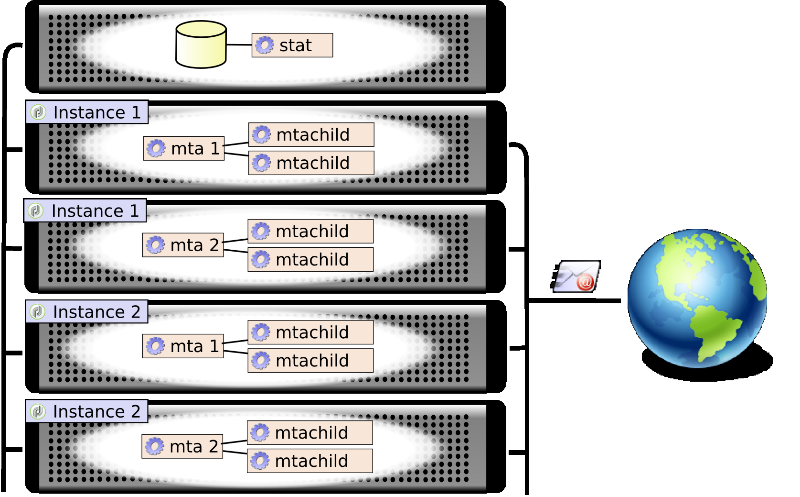

# E-postleverans{#email-deliverability}

## Översikt {#overview}

I följande avsnitt ges en översikt över konfigurationen som krävs för att styra utdata från Adobe Campaign-instanser när meddelanden skickas.

>[!NOTE]
>
>Vissa konfigurationer kan bara utföras av Adobe för distributioner som hanteras av Adobe. Om du till exempel vill komma åt server- och instanskonfigurationsfilerna. Mer information om de olika distributionerna finns i avsnittet [Värdmodeller](../../installation/using/hosting-models.md) eller i [den här artikeln](https://helpx.adobe.com/campaign/kb/acc-on-prem-vs-hosted.html).\
>Se guiden [](https://docs.campaign.adobe.com/doc/AC/getting_started/EN/deliverability.html) Komma igång som beskriver koncept och bästa praxis för slutbarhet.

Mer information om koncept och bästa metoder för att leverera finns i det här [avsnittet](../../delivery/using/about-deliverability.md).

Alla tekniska rekommendationer om hur man effektivt skickar och tar emot meddelanden från en Adobe Campaign-plattform finns i det här [avsnittet](../../delivery/using/technical-recommendations.md).

## Verksamhetsprincip {#operating-principle}

Det går att styra utdata från en eller flera Adobe Campaign-instanser för att begränsa antalet e-postmeddelanden som skickas beroende på en domän. Du kan till exempel begränsa utdata till 20 000 per timme för **yahoo.com** -adresser, och konfigurera 100 000 meddelanden per timme för alla andra domäner.

Meddelandeutdata måste kontrolleras för varje IP-adress som används av leveransservrarna (**mta**). Flera **data** som har delats upp på flera datorer och som tillhör olika instanser av Adobe Campaign kan dela samma IP-adress för e-postleverans: En process måste skapas för att koordinera användningen av dessa IP-adresser.

Detta är vad **statusmodulen** gör: den vidarebefordrar alla anslutningsbegäranden och meddelanden som ska skickas till e-postservrarna för en uppsättning IP-adresser. Statistikservern håller reda på leveranser och kan aktivera eller inaktivera sändning baserat på angivna kvoter.



* Statistikservern (**stat**) är länkad till en Adobe Campaign-bas för att läsa in dess konfiguration.
* Leveransservrarna (**mta**) använder en UDP för att kontakta en statistikserver som inte alltid tillhör sin egen instans.

### Leveransservrar {#delivery-servers}

Modulen **MTA** distribuerar meddelanden till dess **underordnade** moduler. Varje **dator** förbereder meddelanden innan den begär ett tillstånd från statistikservern och skickar dem.

Stegen är följande:

1. De **kan** välja ut berättigade meddelanden och tilldela dem en tillgänglig **dator**.
1. I **mallen** läses all information in som krävs för att skapa meddelandet (innehåll, anpassningselement, bilagor, bilder osv.) och vidarebefordrar meddelandet till **Email Traffic Shaper**.
1. Så snart som e-posttrafikbladet tar emot statistikserverns auktorisering (**smtp stat**) skickas meddelandet till mottagaren.


### E-postserverstatistik och begränsningar {#email-server-statistics-and-limitations}

Statistikservern underhåller följande statistik för varje e-postserver som tar emot meddelanden:

* Antal öppna anslutningar vid tidpunkt,
* Antal meddelanden som skickats under den senaste timmen,
* Frekvens för lyckade/avvisade anslutningar.
* Antal anslutningar till servrar som inte kan nås.

Samtidigt läser modulen in en lista med begränsningar för vissa e-postservrar:

* Maximalt antal samtidiga anslutningar.
* Maximalt antal meddelanden per timme.
* Maximalt antal meddelanden per anslutning.

### Hantera IP-adresser {#managing-ip-addresses}

Statistikservern kan kombinera flera instanser eller flera datorer med samma offentliga IP-adress. Den är därför inte länkad till en viss instans, men den måste kontakta en instans för att återställa begränsningar per domän.

Leveransstatistik finns för varje mål-MX och för varje käll-IP. Om måldomänen till exempel har 5 MX och plattformen kan använda tre olika IP-adresser, kan servern hantera upp till 15 serier med indikatorer för den här domänen.

Källans IP-adress matchar den offentliga IP-adressen, dvs. adressen som den visas av fjärre-postservern. Den här IP-adressen kan skilja sig från adressen till datorn som är värd för **informationen**, om en NAT-router anges. Det är därför statistikservern använder en identifierare som matchar den offentliga IP-adressen (**publicId**). Associationen mellan den lokala adressen och den här identifieraren deklareras i **konfigurationsfilen serverConf.xml** . Alla parametrar som finns i **serverConf.xml** listas i det här [avsnittet](../../installation/using/the-server-configuration-file.md).

## Leveransstyrning {#delivery-output-controlling}

För att kunna leverera meddelanden till e-postservrar begär komponenten **Email Traffic Shaper** en anslutning från statistikservern. När begäran har godkänts öppnas anslutningen.

Innan meddelanden skickas begär modulen &#39;tokens&#39; från servern. Dessa består vanligtvis av minst 10 tokens, vilket minskar antalet frågor till servern.

Servern sparar all statistik som hör till anslutningar och leveranser. Om du startar om går informationen tillfälligt förlorad: varje kund sparar en lokal kopia av sin sändningsstatistik och returnerar dem till servern regelbundet (varannan minut). Servern kan sedan samla in data på nytt.

I följande avsnitt beskrivs hur ett meddelande behandlas av komponenten **Email Traffic Shaper** .

### Meddelandeleverans {#message-delivery}

När ett meddelande skickas kan du få tre möjliga resultat:

1. **Slutfört**: meddelandet har skickats Meddelandet uppdateras.
1. **Meddelandet misslyckades**: den kontaktade servern avvisade meddelandet för den valda mottagaren. Resultatet matchar returkoderna 550 till 599, men undantag kan definieras.
1. **Sessionen misslyckades** (för 5.11 uppåt): Om **informationen** får ett svar på meddelandet överges meddelandet (se [Meddelande överges](#message-abandonment)). Meddelandet skickas till en annan sökväg eller anges till väntande om inga andra sökvägar är tillgängliga (se [Meddelande väntar](#message-pending)).

   >[!NOTE]
   >
   >En **sökväg** är en anslutning mellan Adobe Campaign- **data** och **måldata**. Adobe Campaign- **data** kan välja mellan flera IP-startadresser och flera IP-måldomäner.

### Avbrutet meddelande {#message-abandonment}

Övergivna meddelanden returneras till **mta** och hanteras inte längre av **mtachild**.

De **viktigaste** besluten om förfarandet för detta meddelande (återkrav, övergivande, karantän osv.) beroende på svarskoden och reglerna.

### Meddelande väntar {#message-pending}

Ett meddelande visas när det kommer till den aktiva kön och det inte finns några tillgängliga sökvägar.

En sökväg är vanligtvis markerad som otillgänglig under en varierande tidsperiod efter ett anslutningsfel. Otillgänglighetsperioden beror på felens frekvens och ålder.

## Statistisk serverkonfiguration {#statistics-server-configuration}

Statistikservern kan användas av flera instanser: den måste konfigureras oberoende av de instanser som ska använda den.

Börja med att definiera den Adobe Campaign-databas som ska vara värd för konfigurationen.

### Starta konfiguration {#start-configuration}

Som standard startas **lägesmodulen** för varje instans. När instanser mutualiseras på samma dator, eller när instanser delar samma IP-adress, används en enskild statistikserver: de andra måste inaktiveras.

### Definition av serverporten {#definition-of-the-server-port}

Som standard avlyssnar statistikservern port 7777. Den här porten kan ändras i **filen serverConf.xml** . Alla parametrar som finns i **serverConf.xml** listas i det här [avsnittet](../../installation/using/the-server-configuration-file.md).

```
<stat port="1234"/>
```

## MX-konfiguration {#mx-configuration}

### Om MX-regler {#about-mx-rules}

MX-regler (Mail eXchanger) är de regler som hanterar kommunikation mellan en sändande server och en mottagande server.

>[!IMPORTANT]
>
>Om du har uppgraderat till Förbättrat MTA används inte längre leveransregler för värdbaserade eller hybridinstallationer. **[!UICONTROL MX management]** Den utökade MTA-servern använder sina egna MX-regler som gör att den kan anpassa din genomströmning efter domän baserat på ditt eget historiska e-postrykte och på realtidsfeedback som kommer från de domäner där du skickar e-post.
>
>Mer information om Adobe Campaign Enhanced MTA finns i det här [dokumentet](https://helpx.adobe.com/campaign/kb/campaign-enhanced-mta.html).

Dessa regler läses in automatiskt varje morgon kl. 6.00 (servertid) för att klientinstansen ska kunna levereras regelbundet.

Beroende på materialkapaciteten och den interna policyn kommer en Internet-leverantör att acceptera ett fördefinierat antal anslutningar och meddelanden per timme. Dessa variabler kan ändras automatiskt av Internet-leverantörssystemet beroende på IP-adressens och den sändande domänens anseende. Via sin leveransplattform hanterar Adobe Campaign över 150 specifika regler av Internet-leverantören och dessutom en allmän regel för andra domäner.

Det maximala antalet anslutningar beror inte enbart på antalet offentliga IP-adresser som används av MTA.

Om du till exempel har tillåtit 5 anslutningar i MX-reglerna och har konfigurerat 2 offentliga IP:n kan du tro att du inte kan ha fler än 10 anslutningar samtidigt öppna till den här domänen. Detta är inte sant, det maximala antalet anslutningar avser en sökväg och en sökväg som är en kombination av en av våra offentliga MTA-IP:n och en offentlig IP-adress till kundens MTA.

I exemplet nedan har användaren två konfigurerade publika IP-adresser och domänen är yahoo.com.

```
user:~ user$ host -t mx yahoo.com
                yahoo.com mail is handled by 1 mta5.am0.yahoodns.net.
                yahoo.com mail is handled by 1 mta6.am0.yahoodns.net.
                yahoo.com mail is handled by 1 mta7.am0.yahoodns.net.
```

MX-poster för yahoo.com talar om för oss att yahoo.com har 3 Mail Exchangers. För att ansluta till Peer Mail Exchanger kommer MTA att begära dess IP-adress från DNS.

```
user:~ user$ host -t a mta5.am0.yahoodns.net
                mta5.am0.yahoodns.net has address 98.136.216.26
                mta5.am0.yahoodns.net has address 98.136.217.202
                mta5.am0.yahoodns.net has address 98.138.112.38
                mta5.am0.yahoodns.net has address 66.196.118.37
                mta5.am0.yahoodns.net has address 63.250.192.46
                mta5.am0.yahoodns.net has address 66.196.118.240
                mta5.am0.yahoodns.net has address 98.136.217.203
                mta5.am0.yahoodns.net has address 98.138.112.35
```

För den här posten kan användaren kontakta 8 peer-IP-adresser. Eftersom han har 2 offentliga IP-adresser ger det honom 8 * 2 = 16 kombinationer för att nå e-postservrarna på yahoo.com. Var och en av dessa kombinationer kallas en bana.

Den andra MX-posten visas som:

```
user:~ user$ host -t a mta6.am0.yahoodns.net
                mta6.am0.yahoodns.net has address 98.138.112.38
                mta6.am0.yahoodns.net has address 98.136.216.26
                mta6.am0.yahoodns.net has address 63.250.192.46
                mta6.am0.yahoodns.net has address 66.196.118.35
                mta6.am0.yahoodns.net has address 98.136.217.203
                mta6.am0.yahoodns.net has address 98.138.112.32
                mta6.am0.yahoodns.net has address 98.138.112.37
                mta6.am0.yahoodns.net has address 66.196.118.33
```

4 av dessa 8 IP-adresser används redan i mta5 (98.136.216.26, 98.138.112.38, 63.250.192.46 och 98.136.217.203). Med den här posten kan användaren använda fyra nya IP-adresser. Den tredje MX-posten gör detsamma.

Totalt har vi 16 fjärr-IP-adresser. I kombination med våra två lokala offentliga IP-adresser har vi 32 sökvägar för att nå e-postservrarna på yahoo.com.

>[!NOTE]
>
>Om 2 MX-poster refererar till samma IP-adress räknas den här som en sökväg och inte två.

Nedan följer några exempel på hur du använder MX-regler:


I exemplet nedan har användaren en gräns på 10 000 meddelanden per timme för en viss domän, men MTA-flödeskapaciteten är högre än denna gräns.

I det här fallet är trafiken uppdelad i 12 perioder på 5 minuter för varje timme och den verkliga gränsen är 833 meddelanden per period.

Dessa meddelanden kommer att levereras så snabbt som möjligt.


### Konfigurera MX-hantering {#configuring-mx-management}

De regler som ska följas för MX definieras i **[!UICONTROL MX management]** dokumentet för **[!UICONTROL Administration > Campaign Management > Non deliverables Management > Mail rule sets]** noden i trädet.

Om **[!UICONTROL MX management]** dokumentet inte finns i noden kan du skapa det manuellt. Så här gör du:

1. Skapa en ny uppsättning e-postregler.
1. Välj **[!UICONTROL MX management]** läge.

   

1. Ange **defaultMXRules** i **[!UICONTROL Internal name]** fältet.

För att ändringarna ska kunna beaktas måste du starta om statistikservern.

Om du vill läsa in konfigurationen på nytt utan att starta om statistikservern använder du följande kommando på den dator som är värd för servern: `nlserver stat -reload`

>[!NOTE]
>
>Den här kommandoraden är att föredra framför **omstart** av servern. Den förhindrar att statistik som samlats in innan omstarten går förlorad och undviker toppar som kan gå mot kvoter som definieras i MX-reglerna.

### Konfigurera MX-regler {#configuring-mx-rules}

I **[!UICONTROL MX management]** dokumentet visas alla domäner som är länkade till en MX-regel.

Dessa regler tillämpas i sekvens: den första regeln vars MX-mask är kompatibel med MX-målfilen används.

Följande parametrar är tillgängliga för varje regel:

* **[!UICONTROL MX mask]**: den domän som regeln tillämpas på. Varje regel definierar en adressmask för MX. Alla MX vars namn matchar masken är därför giltiga. Masken kan innehålla &quot;*&quot; och &quot;?&quot; generiska tecken.

   Följande adresser:

   * a.mx.yahoo.com
   * b.mx.yahoo.com
   * c.mx.yahoo.com
   är kompatibla med följande masker:

   * *.yahoo.com
   * ?.mx.yahoo.com
   För e-postadressen foobar@gmail.com är domänen gmail.com och MX-posten är:

   ```
   gmail.com mail exchanger = 20 alt2.gmail-smtp-in.l.google.com.
   gmail.com mail exchanger = 10 alt1.gmail-smtp-in.l.google.com.
   gmail.com mail exchanger = 40 alt4.gmail-smtp-in.l.google.com.
   gmail.com mail exchanger = 5  gmail-smtp-in.l.google.com.
   gmail.com mail exchanger = 30 alt3.gmail-smtp-in.l.google.com.
   ```

   I det här fallet `*.google.com` används MX-regeln. Som du ser matchar MX-regelmasken inte nödvändigtvis domänen i e-postmeddelandet. De MX-regler som används för e-postadresser på gmail.com är de som används med masken `*.google.com`.

* **[!UICONTROL Range of identifiers]**: Med det här alternativet kan du ange intervallet för identifierare (publicID) som regeln gäller för. Du kan ange:

   * Ett tal: regeln endast gäller för detta publicId,
   * Ett nummerintervall (**tal1-tal2**): regeln gäller för alla publika ID:n mellan dessa två tal.
   >[!NOTE]
   >
   >Om fältet är tomt gäller regeln alla identifierare.

   Ett offentligt ID är en intern identifierare för en offentlig IP som används av en eller flera MTA. Dessa ID:n definieras i MTA-servrarna i filen **config-instance.xml** .

   

* **[!UICONTROL Shared]**: definierar omfånget för egenskaperna för den här MX-regeln. När det här alternativet är markerat delas alla parametrar på alla IP-adresser som är tillgängliga för instansen. När alternativet är avmarkerat definieras MX-reglerna för varje IP. Det maximala antalet meddelanden multipliceras med antalet tillgängliga IP-adresser.
* **[!UICONTROL Maximum number of connections]**: maximalt antal samtidiga anslutningar till avsändarens domän.
* **[!UICONTROL Maximum number of messages]**: maximalt antal meddelanden som kan skickas på en anslutning. När meddelandena överskrider det här antalet stängs anslutningen och en ny öppnas.
* **[!UICONTROL Messages per hour]**: maximalt antal meddelanden som kan skickas på en timme till avsändarens domän.
* **[!UICONTROL Connection time out]**: tidströskel för anslutning till en domän.

   >[!NOTE]
   >
   >Windows kan skicka ut en **timeout** före detta tröskelvärde, som beror på vilken version av Windows du har.

* **[!UICONTROL Timeout Data]**: maximal väntetid efter att meddelandeinnehållet har skickats (DATA-avsnittet i SMTP-protokollet).
* **[!UICONTROL Timeout]**: maximal väntetid för andra utbyten med SMTP-servern.
* **[!UICONTROL TLS]**: TLS-protokollet, som gör att du kan kryptera e-postleveranser, kan aktiveras selektivt. För varje MX-mask finns följande alternativ:

   * **[!UICONTROL Default configuration]**: Detta är den allmänna konfigurationen som anges i konfigurationsfilen serverConf.xml som används.

      >[!CAUTION]
      >
      >Vi rekommenderar inte att du ändrar standardkonfigurationen.

   * **[!UICONTROL Disabled]** : Meddelandena skickas systematiskt utan kryptering.
   * **[!UICONTROL Opportunistic]** : Meddelandeleveransen krypteras om den mottagande servern (SMTP) kan generera TLS-protokollet.

Konfigurationsexempel:


### Hantera e-postformat {#managing-email-formats}

Du kan definiera formatet för skickade meddelanden så att innehållet som visas automatiskt anpassas efter domänen för varje mottagares adress.

Det gör du genom att gå till **[!UICONTROL Management of email formats]** dokumentet som finns i **[!UICONTROL Administration]** > **[!UICONTROL Campaign management]** > **[!UICONTROL Non deliverables management]** > **[!UICONTROL Mail rule sets]**.

Det här dokumentet innehåller en lista över alla fördefinierade domäner som motsvarar de japanska format som hanteras av Adobe Campaign. Mer information finns i [det här dokumentet](../../delivery/using/defining-the-email-content.md#sending-emails-on-japanese-mobiles).


Med parametern **MIME-struktur** (Multipurpose Internet Mail Extensions) kan du definiera den meddelandestruktur som ska skickas till de olika e-postklienterna. Det finns tre alternativ:

* **Multipart**: Meddelandet skickas i text- eller HTML-format. Om HTML-formatet inte godkänns kan meddelandet fortfarande visas i textformat.

   Som standard är multipart-strukturen **multipart/alternative**, men den blir automatiskt **multipart/related** när en bild läggs till i meddelandet. Vissa leverantörer förväntar sig det **multipart/relaterade** formatet som standard, men det **[!UICONTROL Force multipart/related]** här formatet används även om ingen bild är bifogad.

* **HTML**: Ett meddelande som bara innehåller HTML skickas. Om HTML-formatet inte godkänns visas inte meddelandet.
* **Text**: Ett meddelande i textformat skickas. Fördelen med textformatmeddelanden är att de är mycket små.

Om **[!UICONTROL Image inclusion]** alternativet är aktiverat visas dessa direkt i e-postmeddelandet. Bilderna överförs sedan och URL-länkarna ersätts av innehållet.

Det här alternativet används särskilt av den japanska marknaden för **Deco-mail**, **Decore Mail** eller **Decoration Mail**. Mer information finns i [det här dokumentet](../../delivery/using/defining-the-email-content.md#sending-emails-on-japanese-mobiles).

>[!CAUTION]
>
>När du infogar bilder i ett e-postmeddelande ökar storleken avsevärt.

## Leveransserverkonfiguration {#delivery-server-configuration}

### Klocksynkronisering {#clock-synchronization}

Klockorna för alla servrar som utgör Adobe Campaign-plattformen (inklusive databasen) måste synkroniseras och deras system måste vara inställda på samma tidszon.

### Statistikserverns koordinater {#coordinates-of-the-statistics-server}

Statistikserverns adress måste anges i **informationen**.

Med egenskapen **statServerAddress** för **dataelementet** i konfigurationen kan du ange adressen och numret för den port som ska användas.

```
<mta statServerAddress="emailStatServer:7777">
   [...]
 </mta>
```

Om du vill använda statistikservern på samma dator måste du ange åtminstone namnet på datorn med **localhost** -värdet:

```
 <mta statServerAddress="localhost">
```

>[!CAUTION]
>
>Om det här fältet inte fylls i kommer **datainformationen** inte att starta.

### Lista över IP-adresser som ska användas {#list-of-ip-addresses-to-use}

Konfigurationen för trafikhantering finns i **elementet mta/child/smtp** i konfigurationsfilen.

För varje **IPAfinity** -element måste du deklarera IP-adresserna som kan användas för datorn.

Exempel:

```
<IPAffinity localDomain="<domain>" name="default">
  <IP address="192.168.0.11" publicId="1" weight="5"/>
  <IP address="192.168.0.12" heloHost="revdns1.campaign.com" publicId="2" weight="5"/>
  <IP address="192.168.0.13" publicId="3" weight="1"/>
</IPAffinity>
```

Parametrarna är följande:

* **adress**: Detta är IP-adressen till den MTA-värddator som ska användas.
* **heloHost**: den här identifieraren representerar IP-adressen så som den kommer att ses av SMTP-servern.

* **publicId**: Den här informationen är användbar när en IP-adress delas av flera Adobe Campaign- **datorer** bakom en NAT-router. Statistikservern använder den här identifieraren för att memorera anslutningen och skicka statistik mellan den här startpunkten och målservern.
* **vikt**: Här kan du definiera den relativa användningsfrekvensen för adressen. Som standard har alla adresser en vikt som är lika med 1.

>[!NOTE]
>
>I filen serverConf.xml måste du verifiera att en IP-adress motsvarar en enda hjälpvärd med en unik identifierare (public_id). Den kan inte mappas till flera olika värddatorer, vilket kan leda till leveransproblem.

I det föregående exemplet, med normala villkor, distribueras adresserna enligt följande:

    * &quot;1&quot;: 5 / (5+5+1) = 45%
    * &quot;2&quot;: 5 / (5+5+1) = 45%
    * &quot;3&quot;: 1 / (5+5+1) = 10%

Om till exempel den första adressen inte kan användas för ett givet MX, skickas meddelanden enligt följande:

    * &quot;2&quot;: 5 / (5+1) = 83%
    * &quot;3&quot;: 1 / (5+1) = 17%

* **includeDomains**: Med kan du reservera den här IP-adressen för e-post som tillhör en viss domän. Det här är en lista med masker som kan innehålla ett eller flera jokertecken (&#39;*&#39;). Om attributet inte anges kan alla domäner använda den här IP-adressen.

   Exempel: **includeDomains=&quot;wanadoo.com,orange.com,yahoo.*&quot;**

* **excludeDomains**: utelämnar en lista över domäner för den här IP-adressen. Det här filtret används efter **filtret includeDomains** .

   

## Optimering av e-postutskick {#email-sending-optimization}

Den interna arkitekturen för Adobe Campaign- **data** påverkar konfigurationen för optimering av e-postleverans. Här är några tips om hur du kan förbättra dina leveranser.

### Justera parametern maxWaitMessages {#adjust-the-maxwaitingmessages-parameter}

Parametern **maxWaitMessages** anger det högsta antalet meddelanden som har förberetts i förväg av **mtachild**. Meddelanden tas bara bort från den här listan när de har skickats eller övergetts.

Den här parametern är mycket viktig och särskilt viktig om meddelanden inte sorteras efter domän.

När tröskelvärdet för **maxWorkingSetMb** (256) har uppnåtts slutar leveransservern att skicka meddelanden. Prestandan minskar avsevärt tills **datorn** startas igen. Om du vill kringgå det här problemet kan du antingen öka tröskelvärdet för parametern **maxWorkingSetMb** eller minska tröskelvärdet för parametern **maxWaitMessages** .

Parametern **maxWorkingSetMb** beräknas empiriskt genom att det maximala antalet meddelanden multipliceras med den genomsnittliga meddelandestorleken och resultatet multipliceras med 2,5. Om ett meddelande till exempel har en genomsnittlig storlek på 50 kB och parametern **maxWaitMessages** är lika med 1 000, kommer det använda minnet att bli i genomsnitt 125 MB.

### Justera antalet datorer {#adjust-the-number-of-mtachild}

Antalet underordnade bör inte överstiga antalet processorer i datorn (ca. 1000 sessioner). Vi rekommenderar att du inte överskrider 8 **mtachild**. Du kan sedan öka antalet meddelanden per **underordnad** (**maxMsgPerChild**) för att uppnå en tillräcklig livslängd.
