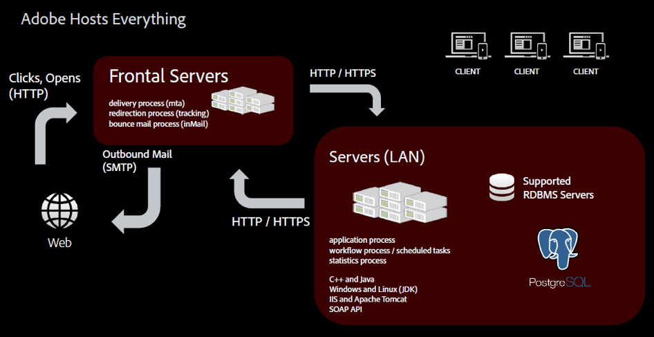
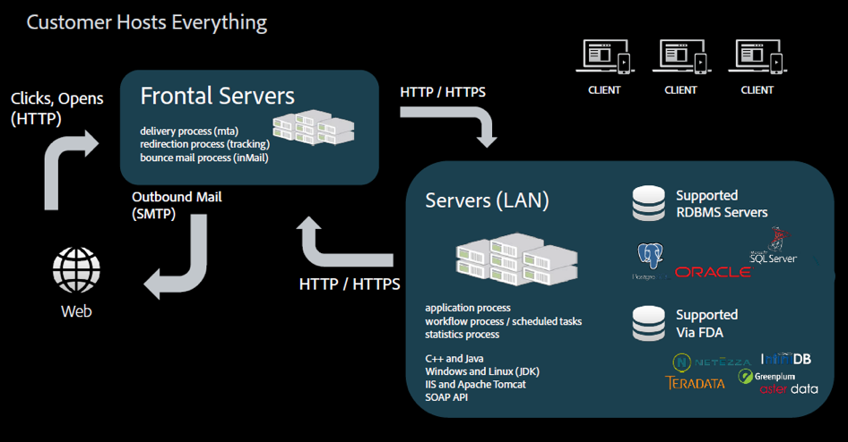

# Värdmodeller{#hosting-models}

Adobe Campaign erbjuder ett urval av tre värdmodeller som ger flexibilitet och frihet att välja den bästa modellen, eller modeller som passar företagets behov.

>[!NOTE]
>
>För värdmiljöer i Adobe kan huvudinstallations- och konfigurationssteg bara utföras av Adobe, som att konfigurera servern och anpassa instanskonfigurationsfiler. Mer information om de viktigaste skillnaderna mellan distributionslägen finns i [den här sidan](../../installation/using/capability-matrix.md).

## Managed Services / Hosted

Adobe Campaign kan driftsättas as a Managed Service: alla komponenter i Adobe Campaign, inklusive användargränssnittet, körningsmotorn och kundens Campaign-databas är fullt värdar för Adobe, inklusive e-postkörning, spegelsidor, spårningsserver och externt riktade webbkomponenter som sidan/inställningscentret och landningssidorna.

Som värdkund utförs de flesta installations- och konfigurationsstegen av Adobe. Du kan anpassa implementeringen i följande avsnitt:

* Konfigurera spårning och spegling av sidadresser per varumärke. För transaktionsmeddelanden, se [till detta avsnitt](../../message-center/using/additional-configurations.md#configuring-multibranding).
* Installera klientkonsolen: se [till detta avsnitt](../../installation/using/installing-the-client-console.md).
* Läs mer om verktygen för slutprodukter och bästa praxis i [detaljerad dokumentation](../../delivery/using/about-deliverability.md).
* Konfigurera kampanjalternativ: se [till detta avsnitt](../../installation/using/configuring-campaign-options.md).
* Konfigurera CRM-anslutningar: se [till detta avsnitt](../../platform/using/crm-connectors.md).

## Lokalt

Adobe Campaign kan driftsättas lokalt: alla komponenter i Adobe Campaign, inklusive användargränssnittet, exekveringsmotorn och databasen finns på plats i kundens datacenter. I den här distributionsmodellen hanterar kunden alla uppdateringar och uppgraderingar av programvara och maskinvara, och en dedikerad databasadministratör måste utföra underhålls- och optimeringsuppgifter för att säkerställa instanshanteringen i Campaign.

Som en lokal kund ska du, innan du börjar distribuera Campaign Classic, ta hand om följande krav och rekommendationer:

* Läs mer om [Kompatibilitetsmatris](../../rn/using/compatibility-matrix.md) som innehåller alla versioner av de system och komponenter som stöds för Adobe Campaign.
* Läs mer om [krav för Windows](../../installation/using/prerequisites-of-campaign-installation-in-windows.md) och [krav för Linux](../../installation/using/prerequisites-of-campaign-installation-in-linux.md).
* Läs rekommendationer om databasmotorer [i det här avsnittet](../../installation/using/database.md).
* Kontrollera att de nödvändiga lagren för databasåtkomst är installerade på servern och tillgängliga från Adobe Campaign-kontot. [Läs mer](../../installation/using/application-server.md).
* Konfigurera dina nätverk eftersom vissa processer behöver kommunicera med andra eller för att få åtkomst till nätverket och Internet. Detta innebär att vissa TCP-portar måste vara öppna för dessa processer. [Läs mer](../../installation/using/network-configuration.md) om krav på nätverkskonfiguration.
* Läs [Checklista för kampanjsäkerhet och sekretess](https://experienceleague.adobe.com/docs/campaign-classic/using/installing-campaign-classic/security-privacy/get-started-security-privacy.html?lang=sv).
* Kontrollera allmänna riktlinjer för beräkning av maskinvarukrav för lokal driftsättning [i den här artikeln](https://helpx.adobe.com/se/campaign/kb/hardware-sizing-guide.html).

## Hybrid

När Adobe Campaign-lösningen driftsätts som en hybridmodell finns den på plats hos kunden och körningshanteringen levereras som en molntjänst av Adobe. Adobe Campaign marknadsinstans installeras inuti en kunds brandvägg, så personligt identifierbar information (PII) finns kvar internt och endast data som krävs för att personalisera e-post skickas till molnet för e-postkörning. Körningsinstansen, som finns i molnet, tar emot förfrågningar från instansen On-Premise om att leverera e-postmeddelanden. Den här instansen personaliserar alla e-postmeddelanden och levererar dem. Inga data av något slag lagras permanent i molnet.

Som hybrid-kund utförs de flesta installations- och konfigurationsstegen av Adobe. Du kan anpassa implementeringen i följande avsnitt:

* Konfigurera transaktionsmeddelanden: se [till detta avsnitt](../../message-center/using/transactional-messaging-architecture.md).
* Konfigurera spårning och spegling av sidadresser per varumärke. För transaktionsmeddelanden, se [till detta avsnitt](../../message-center/using/additional-configurations.md#configuring-multibranding).
* Installera klientkonsolen: se [till detta avsnitt](../../installation/using/installing-the-client-console.md).
* Installera inbyggda paket: se [till detta avsnitt](../../installation/using/installing-campaign-standard-packages.md).
* Leverans: konfigurera [MX-regler](../../installation/using/email-deliverability.md#mx-configuration) och [e-postformat](../../installation/using/email-deliverability.md#managing-email-formats). Läs mer om verktygen för slutprodukter och bästa praxis i [detaljerad dokumentation](../../delivery/using/about-deliverability.md).
* Konfigurera kampanjalternativ: se [till detta avsnitt](../../installation/using/configuring-campaign-options.md).
* Konfigurera en extern databas (Federated Data Access): se [till detta avsnitt](../../installation/using/about-fda.md).
* Konfigurera CRM-anslutningar: se [till detta avsnitt](../../platform/using/crm-connectors.md).
* Om du vill veta mer om principer för användning på mellanleverantörer kan du läsa [till detta avsnitt](../../installation/using/mid-sourcing-deployment.md).
