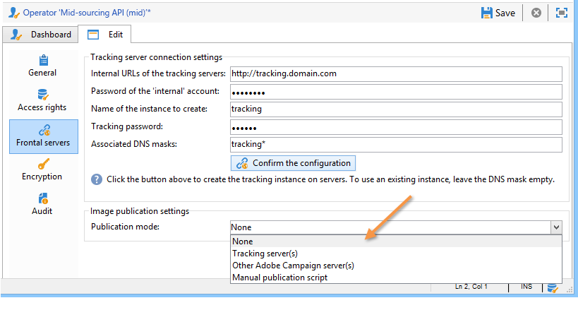
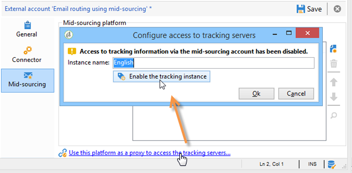

# Server för mellanleverantörer{#mid-sourcing-server}


I det här avsnittet beskrivs installation och konfiguration av en server med mellanlagring samt distributionen av en instans som gör det möjligt för tredje part att skicka meddelanden i läget **med mellanlagring**.

Arkitekturen för&quot;mellanleverantörer&quot; presenteras i [Distributionen ](../../installation/using/mid-sourcing-deployment.md) med mellanleverantörer.

När du installerar en server med mellanlagring utförs samma process som när du installerar en server på det vanliga sättet (se standardkonfigurationen). Det är en oberoende instans med en egen databas som kan användas för att köra leveranser. Kort och gott: den innehåller en extra konfiguration som tillåter att fjärrinstanser kör leveranser via den i läget mitt i källkoden.

>[!CAUTION]
>
>När servern för mellanlagring har konfigurerats och [synkroniseringsarbetsflödena](../../workflow/using/about-technical-workflows.md) har körts för första gången, ska du inte uppdatera det interna namnet för de externa konton som mellanlagras.

## Steg för att installera och konfigurera en instans {#steps-for-installing-and-configuring-an-instance}

### Krav för att installera och konfigurera en instans {#prerequisites-for-installing-and-configuring-an-instance}

* JDK på programservern.
* Åtkomst till en databasserver på programservern.
* Brandväggen är konfigurerad att öppna HTTP- (80) eller HTTPS-portar (443) till mittkällservern.

I proceduren nedan beskrivs en konfiguration som använder en enda server för mellanlagring. Det går också att använda flera servrar. Det går också att skicka vissa meddelanden (till exempel arbetsflödesmeddelanden) från en intern konfiguration.

### Installera och konfigurera programservern för installation på mellannivå {#installing-and-configuring-the-application-server-for-mid-sourcing-deployment}

Installationsproceduren är identisk med den för en fristående instans. Se [Installera och konfigurera (en dator)](../../installation/using/standalone-deployment.md#installing-and-configuring--single-machine-).

Du måste dock göra följande:

* I steg **5** måste du inaktivera modulerna **mta** (leverans) och **inMail** (studsmeddelanden). **wfserver** (arbetsflöde)-modulen måste dock fortfarande vara aktiverad.

  ```
  <?xml version='1.0'?>
  <serverconf>  
    <shared>    
      <!-- add lang="eng" to dataStore to force English for the instance -->    
      <dataStore hosts="console.campaign.net*">      
        <mapping logical="*" physical="default"/>    
      </dataStore>  </shared>  
      <mta autoStart="false"/>  
      <wfserver autoStart="true"/>  
      <inMail autoStart="false"/>  
      <sms autoStart="false"/>  
      <listProtect autoStart="false"/>
  </serverconf>
  ```

  Mer information om detta finns i [det här avsnittet](../../installation/using/configuring-campaign-server.md#enabling-processes).

* Steg **6**, **9** och **10** behövs inte.
* Under steg **12** och **13** måste du ange porten 8080 i anslutnings-URL:en (eftersom konsolen kommunicerar direkt med Tomcat, inte via webbservern). URL:en blir `http://console.campaign.net:8080`. Under steg **13** väljer du paketet **[!UICONTROL Issue towards Mid-sourcing]** samt de som ska installeras.

  

  >[!CAUTION]
  >
  >Standardroutningen för tekniska leveranser ersätts automatiskt med e-postroutning via Mid-sourcing.

### Installera och konfigurera servern för mellanlagring {#installing-and-configuring-the-mid-sourcing-server}

Gå till klientkonsolen och leta upp **e-postroutningen med mellankällkonto** (i mappen **/Administration/Externa konton/**). Fyll i URL:en **för server**, **konto**, **password** och **Spegelvänd sidadress** med informationen som tillhandahålls av serverprovidern som är värd för mittkällservern. Testa anslutningen.

>[!NOTE]
>
>Alternativet **midsourcingEmitter** skapar två **Mid-sourcing**-arbetsflöden. Det är en process som körs som standard var 1 timme och 20:e minut och som samlar in leveransinformation på servern med mellanlagring.

## Distribuera en server med mellanleverantörer {#deploying-a-mid-sourcing-server}

1. Installerar programservern:

   >[!CAUTION]
   >
   >Om du installerar servern för mellanlagring och vill installera extra Adobe Campaign-moduler rekommenderar vi att du använder modulen Leverans och inte Campaign.

   Följ samma procedur som för standarddistributionen och välj bara alternativet **[!UICONTROL Mid-sourcing platform]**.

   

1. Konfiguration för att ta emot i läget mitt i källkoden

   Ange lösenord för inskickningskonto: I mappen **/Mid-sourcing/Access Management/Operators/** används operatorn **mid** av fjärrinstansen för inskickning i mellankälläge. Du måste ange ett lösenord för den här operatorn och ge det till administratören för inskickningsinstansen.

   Alternativet **Plattform för mellanlagring** skapar standardmapparna för lagring av skickade leveranser och standardoperatorn som utför skickade leveranser.

## Multiplexing av servern med mellanlagring {#multiplexing-the-mid-sourcing-server}

>[!CAUTION]
>
>Multiplexing stöds endast i lokala miljöer.

Det är möjligt att dela en instans med mellanleverantörer genom att skicka in flera instanser. Var och en av de här instanserna måste kopplas till en operator i databasen för mellanleverantörer. Så här skapar du ett andra konto på servern:

1. Skapa en mapp i noden **[!UICONTROL Mid-sourcing > Deliveries]** som ska associeras med standardkontot för mellanlagring (till exempel: prod).
1. Skapa en mapp i noden **[!UICONTROL Mid-sourcing > Deliveries]** med samma namn som kontot (till exempel: accept_test).

   

1. Skapa ett nytt konto i **[!UICONTROL Mid-sourcing > Access Management > Operators]**.

   

1. På fliken **[!UICONTROL Access rights]** ger du den här operatorn behörighet för gruppen **Mid-sourcing-överföringar**. Den här åtkomsträttigheten är tillgänglig i **[!UICONTROL Mid-sourcing > Access Management > Operator groups]**.

   

1. Välj alternativet **[!UICONTROL Restrict to data in the sub-folders of]** och markera mappen Leveranser för att begränsa den här operatorn till mappen för leveranser på mellannivå.

   

1. Starta om webbmodulen med följande kommando: **&#x200B; web**.

Du måste ändra serverinställningen för mellanlagring i filen serverConf.xml. Följande rad måste läggas till i avsnittet &quot;Hantering av tillhörigheter med IP-adresser&quot;, under den befintliga raden:

```
<IPAffinity IPMask="" localDomain="" name=""/>
```

Attributet &#39;@name&#39; måste följa följande regler:

**&#39;marketing_account_operator_name&#39;.&#39;affinity_name&#39;.&#39;affinity_group&#39;**

&#39;marketing_account_operator_name&#39; relaterar till det interna namnet på mittkällkontot som deklarerats i mittkällinstansen.

&#39;affinity_name&#39; relaterar till det godtyckliga namn som ges till tillhörigheten. Namnet måste vara unikt. Godkända tecken är `[a-z]` `[A-Z]` `[0-9]`. Syftet är att deklarera en grupp offentliga IP-adresser.

&#39;affinity_group&#39; relaterar den subaffinitet som deklarerats i målmappningen som används i var och en av leveranserna. Den sista delen som innehåller &quot;.&quot; ignoreras om det inte finns någon undertillhörighet. Godkända tecken är `[a-z]` `[A-Z]` `[0-9]`.

Du måste stoppa och sedan starta om servern för att ändringen ska kunna beaktas.

## Konfigurera spårning på en server med flera källor {#configuring-tracking-on-a-mid-sourcing-server}

**Konfigurerar servern** från mellanleverantörer

1. Gå till operatorer och välj operatorn **[!UICONTROL mid]**.
1. Ange spårningsserveranslutningsparametrarna på fliken **[!UICONTROL Frontal servers]**.

   Om du vill skapa en spårningsinstans anger du URL:en för spårningsservern, det interna kontolösenordet för spårningsservern och namnet på instansen, dess lösenord och de DNS-masker som är associerade med den.

   

1. När du har angett anslutningsparametrarna klickar du på **[!UICONTROL Confirm the configuration]**.
1. Ange vid behov var bilderna i leveranserna ska lagras. Det gör du genom att välja ett av publikationslägena i listrutan.

   

   Om du väljer alternativet **[!UICONTROL Tracking server(s)]** kopieras bilderna till servern med mellanlagring.

**Konfigurerar kundplattformen**

1. Gå till det externa kontot för leverans mot mellanleverantörer.
1. På fliken **[!UICONTROL Mid-Sourcing]** anger du anslutningsparametrarna för serveranslutning från mitten.

   

1. Bekräfta konfigurationen genom att klicka på **[!UICONTROL Test the connection]**.
1. Deklarera spårningsinstansen som refereras på mellankällservern:

   Klicka på länken **[!UICONTROL Use this platform as a proxy to access the tracking servers]**,

   Ange namnet på spårningsinstansen och bekräfta sedan anslutningen till spårningsservern.

   

Om leveransen av meddelanden ska hanteras av flera servrar med mellankällor väljer du alternativet **[!UICONTROL Routing with alternating mid-sourcing accounts]** och anger de olika servrarna.


