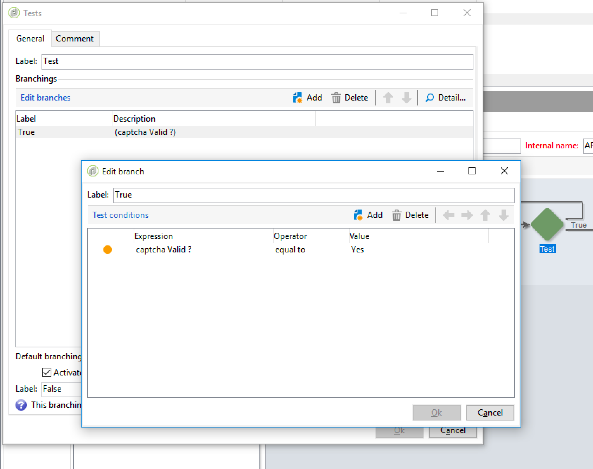

# Riktlinjer för skript och kodning {#scripting-coding-guidelines}


## Skript

Mer information finns i [Kampanj-JSAPI-dokumentation](https://experienceleague.adobe.com/developer/campaign-api/api/index.html?lang=sv).

Om du skriptar med arbetsflöde, webbprogram, jssp, ska du följa dessa rutiner:

* Försök att undvika SQL-satser så mycket du kan.

* Om du behöver det använder du parametriserade funktioner (förbered-sats) i stället för strängsammanfogning.

  Felaktig praxis:

  ```
  sqlGetInt( "select iRecipientId from NmsRecipient where sEmail ='" + request.getParameter('email') +  "'  limit 1" )
  ```

  God praxis:

  ```
  sqlGetInt( "select iRecipientId from NmsRecipient where sEmail = $(sz) limit 1", request.getParameter('email'));
  ```

  >[!IMPORTANT]
  >
  >sqlSelect stöder inte den här funktionen, så du måste använda frågefunktionen i klassen DBEngine:

  ```
  var cnx = application.getConnection()
  var stmt = cnx.query("SELECT sFirstName, sLastName FROM NmsRecipient where sEmail = $(sz)", request.getParameter('email'))
  for each(var row in stmt) logInfo(row[0] + " : " + row[1])
  cnx.dispose()
  ```

För att undvika SQL-injektioner måste SQL-funktioner läggas till i tillåtelselista som ska användas i Adobe Campaign. När de har lagts till i tillåtelselista blir de synliga för dina operatorer i uttrycksredigeraren. Se [den här sidan](../../configuration/using/adding-additional-sql-functions.md).

>[!IMPORTANT]
>
>Om du använder en version som är äldre än 8 140 är **XtkPassUnknownSQLFunactionsToRDBMS** kan anges till &quot;1&quot;. Om du vill skydda databasen tar du bort det här alternativet (eller anger värdet 0).

Om du använder användarindata för att skapa filter i frågor eller SQL-satser måste du alltid undvika dem (se [Kampanj-JSAPI-dokumentation](https://experienceleague.adobe.com/developer/campaign-api/api/index.html?lang=sv) - Dataskydd: funktioner för flytning). De här funktionerna är:

* NL.XML.escape(data)
* NL.SQL.escape(data)
* NL.JS.escape(data)
* NL.XML.escapeAttribute(data)

## Skydda din nya datamodell

### Mappbas

Se följande sidor:

* [Egenskaper för mappåtkomst](../../platform/using/access-management.md)
* [Länkad mapp](../../configuration/using/configuration.md#linked-folder)

### Namngivna rättigheter

Förutom den mappbaserade säkerhetsmodellen kan du använda namngivna rättigheter för att begränsa operatoråtgärder:

* Du kan lägga till vissa systemfilter (sysFilter) för att förhindra att data läses/skrivs (se [den här sidan](../../configuration/using/filtering-schemas.md)).

  ```
  <sysFilter name="writeAccess">    
      <condition enabledIf="hasNamedRight('myNewRole')=false" expr="FALSE"/>  
  </sysFilter>
  ```

* Du kan även skydda vissa åtgärder (SOAP-metod) som definieras i scheman. Ange bara åtkomstattributet med motsvarande namngiven rättighet som värde.

  ```
  <method name="grantVIPAccess" access="myNewRole">
      <parameters>
  ...
      </parameters>
  </method>
  ```

  Mer information finns på [den här sidan](../../configuration/using/implementing-soap-methods.md).

>[!IMPORTANT]
>
>Du kan använda namngivna rättigheter i kommandonoden i ett navigeringsträd. Det ger en bättre användarupplevelse men ger inget skydd (använd bara klientsidan för att dölja/inaktivera dem). Du måste använda åtkomstattributet.

### Överflödestabell

Om du behöver skydda konfidentiella data (del av ett schema) beroende på operatörens åtkomstnivå, ska du inte dölja dem i formulärdefinitionen (enabledIf/visibleIf-villkor).

Den fullständiga enheten läses in av skärmen och du kan även visa dem i kolumndefinitionen. För att göra detta måste du skapa en flödestabell. Referens [den här sidan](../../configuration/using/examples-of-schemas-edition.md#overflow-table).

## Lägga till bildtexter i webbprogram

Det är en god vana att lägga till en captcha på offentliga landningssidor/prenumerationssidor. Tyvärr är det inte så enkelt att lägga till en captcha på DCE-sidor (Digital Content Editor). Vi visar hur du lägger till en v5-captcha eller en Google reCAPTCHA.

Det allmänna sättet att lägga till en captcha i DCE är att skapa ett personaliseringsblock som enkelt kan inkluderas i sidinnehållet. Du måste lägga till en **Skript** aktivitet och **Testa**.

### Personaliseringsblock

1. Gå till **[!UICONTROL Resources]** > **[!UICONTROL Campaign Management]** > **[!UICONTROL Personalization blocks]** och skapa en ny.

1. Använd **[!UICONTROL Web application]** innehållstyp och kontroll **[!UICONTROL Visible in the customization menus]**.

   För mer information om detta hittar du i [det här avsnittet](../../delivery/using/personalization-blocks.md).

   Här är ett exempel på en **Campaign captcha**:

   ```javascript
   <%
   var captchaID = CaptchaIDGen();
   %>
   &width=200&height=50&minWordSize=8&maxWordSize=8"/>
   <input id="captchaValue" name="captchaValue" <%= String(ctx.vars.captchaValid) === "false" ? class="ui-state-error" : "" %>>
   <input type="hidden" name="captchaID" value="<%=captchaID%>"/>
   <%
   if( serverForm.isInputErroneous("captchaValue") ) {
   %>
   <script type="text/javascript"> 
   $("#captchaValue").addClass("ui-state-error")
   </script>
   <%
   }
   %>
   ```

   * Rader 1 till 6 genererar alla indata som behövs.
   * Rader 7 till slutet hanterar fel.
   * Med rad 4 kan du ändra storleken på den inmatade gråa rutan (bredd/höjd) och längden på det genererade ordet (minWordSize/maxWordSize).
   * Innan du använder Google reCAPTCHA måste du registrera dig på Google och skapa en ny reCAPTCHA-webbplats.

     `<div class="g-recaptcha" data-sitekey="YOUR_SITE_KEY"></div>`

   Du bör kunna inaktivera valideringsknappen, men eftersom vi inte har någon standardknapp/länk är det bättre att göra det i själva HTML. Om du vill veta hur du gör det kan du läsa [den här sidan](https://developers.google.com/recaptcha/).

### Uppdatera ditt webbprogram

1. Gå till egenskaperna för webbprogrammet och lägg till en boolesk variabel med namnet **captchaValid**.

   

1. Mellan den sista sidan och **[!UICONTROL Storage]** aktivitet, lägga till **[!UICONTROL Script]** och **[!UICONTROL Test]**.

   Anslut grenen **[!UICONTROL True]** till **[!UICONTROL Storage]** och den andra till sidan som ska ha captcha.

   

1. Redigera villkoret för grenen True med `"[vars/captchaValid]"` är lika med True.

   

1. Redigera **[!UICONTROL Script]** aktivitet. Innehållet beror på den valda captcha-motorn.

1. Slutligen kan du lägga till ditt personliga block på sidan: se [den här sidan](../../web/using/editing-content.md).

   

   

>[!IMPORTANT]
>
>För reCAPTCHA-integrering måste du lägga till JavaScript på klientsidan i HTML (i `<head>...</head>`):
>
>`<script src="https://www.google.com/recaptcha/api.js" async defer></script>`

### Campaign captcha

```javascript
var captchaID = request.getParameter("captchaID");
var captchaValue = request.getParameter("captchaValue");
  
if( !CaptchaValidate(captchaID, captchaValue) ) {
  serverForm.logInputError("captchaValue",
                           "The characters you typed for the captcha must match the image ones.",
                           "captchaValue")
  ctx.vars.captchaValid = false
}
else
  ctx.vars.captchaValid = true
```

Rad 6: du kan skicka vilket felmeddelande som helst.

### Google recaptcha

Läs mer i [officiell dokumentation](https://developers.google.com/recaptcha/docs/verify).

```javascript
ctx.vars.captchaValid = false
var gReCaptchaResponse = request.getParameter("g-recaptcha-response");
  
// Call reCaptcha API to validate it
var req = new HttpClientRequest("https://www.google.com/recaptcha/api/siteverify")
req.method = "POST"
req.header["Content-Type"] = "application/x-www-form-urlencoded"
req.body = "secret=YOUR_SECRET_HERE&response=" + encodeURIComponent(gReCaptchaResponse)
req.execute()
var response = req.response
if( response.code == 200 ) {
  captchaRes = JSON.parse(response.body.toString(response.codePage));
  ctx.vars.captchaValid = captchaRes.success
}
  
if( ctx.vars.captchaValid == false ) {
  serverForm.logInputError("reCaptcha",
                           "Please validate the captcha",
                           "reCaptcha")
  logInfo("reCaptcha not validated")
}
```

Om du vill använda JSON.parse måste du inkludera&quot;shared/json2.js&quot; i din webApp:


Sedan build 8797 måste du lägga till den i tillåtelselista i filen serverConf för att kunna använda URL:en för verifierings-API:t genom att lägga till den i noden urlPermission:

`<url dnsSuffix="www.google.com" urlRegEx="https://www.google.com/recaptcha/api/siteverify"/>`
