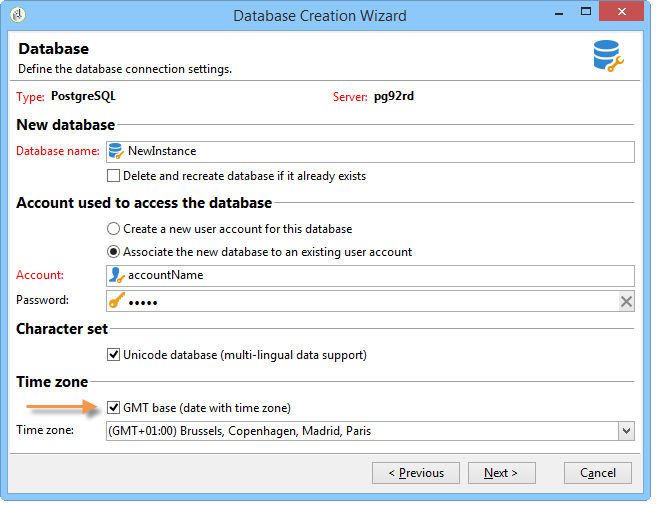

# Hantering av tidszoner{#time-zone-management}

## Verksamhetsprincip {#operating-principle}

Med Adobe Campaign kan du uttrycka datum som en funktion av deras tidszon: detta gör att internationella användare kan arbeta över hela världen i olika tidszoner. Varje land som använder samma instans kan hantera kampanjer, spårning, arkivering osv. beroende på lokal tid.

För att Adobe Campaign-plattformen ska kunna användas internationellt måste alla datum som används av systemen kunna länkas till en tidszon. Ett datum vars tidszon är känd kan alltså importeras till vilken annan tidszon som helst, eller oavsett tidszon.

I Adobe Campaign kan du lagra datum/tid i UTC-format (Coordinated Universal Time). När data exponeras konverteras de till operatorns lokala datum/tid. Konverteringen utförs automatiskt när databasen är konfigurerad i UTC (se [Konfiguration](#configuration)). Om databasen inte är konfigurerad i UTC lagras information om tidszonen för datum på plattformen i ett alternativ.

De viktigaste plattformsfunktionerna när det gäller hantering av tidszoner är import/export av data och operator samt hantering av arbetsflöden. The **arvskoncept** är tillgängligt för import/export eller arbetsflöden. Som standard är de konfigurerade för databasserverns tidszon, men du kan definiera om nya tidszoner för ett arbetsflöde och till och med för en enda aktivitet.

**Operatorer** kan ändra tidszoner under **leveranskonfiguration** och kan ange i vilken tidszon leveransen ska utföras.

>[!IMPORTANT]
>
>Om databasen inte hanterar flera tidszoner måste SQL-frågor köras i databasserverns tidszon för alla datafiltreringsändringar.

Varje Adobe Campaign-operator är länkad till en tidszon: den här informationen har konfigurerats i deras profil. Mer information finns i [det här dokumentet](../../platform/using/access-management.md).

Om Adobe Campaign-plattformen inte kräver tidszonshantering kan du behålla ett lagringsläge i lokalt format med en viss länkad tidszon.

## Rekommendationer {#recommendations}

Tidszoner kombinerar flera olika realiteter: uttrycket kan beskriva en konstant tidsfördröjning med UTC-datumet eller tidpunkterna för en region som kan ändra tider två gånger per år (sommartid).

I postgreSQL, till exempel **ANGE TIDSZON &quot;Europa/Paris&quot;;** kommandot tar hänsyn till sommar- och vintertider: datumet anges i UTC+1 eller UTC+2 beroende på tidpunkten på året.

Om du använder **ANGE TIDSZON 0200;** kommer tidsfördröjningen alltid att vara UTC+2.

## Konfiguration {#configuration}

Lagringsläget för datum och tidpunkter väljs när databasen skapas (se [Skapa en ny instans](#creating-a-new-instance)). Vid migrering konverteras de timmar som är länkade till datum till lokala datum och timmar (se [Migrering](#migration)).

Ur teknisk synvinkel finns det två sätt att lagra **Datum+tid** typinformation i databasen:

1. TIMESTAMP MED TIMEZONE-format: databasmotorn lagrar datum i UTC. Varje session som öppnas har en tidszon och datumen konverteras enligt den.
1. Lokalt format + lokal tidszon: alla datum lagras i det lokala formatet (ingen hantering av tidsfördröjning) och en enda tidszon tilldelas dem. Tidszonen lagras i **WdbcTimeZone** Adobe Campaign-instansen och kan ändras via **[!UICONTROL Administration > Platform > Options]** trädmenyn.

>[!IMPORTANT]
>
>Observera att den här ändringen kan leda till problem med datakonsekvens och synkronisering.

### Skapa en ny instans {#creating-a-new-instance}

För att flera internationella användare ska kunna arbeta med samma instans måste du konfigurera tidszoner när du skapar instansen för att hantera tidsförskjutningar mellan länder. När du skapar en instans väljer du datum- och tidshanteringsläget i **[!UICONTROL Time zone]** -avsnittet på databaskonfigurationssteget.

Kontrollera **[!UICONTROL UTC database (date fields with time zone)]** för att lagra alla data med datum och tidpunkter i UTC-format (SQL-fält och XML-fält).

>[!IMPORTANT]
>
>Om du använder **Oracle** måste tidszonsfilerna (.dat) för Oraclets klientlager vara kompatibla med de tidszonsfiler som är installerade på servern.

Om databasen inte är UTC kan du välja en av de tidszoner som finns i listrutan. Du kan också använda serverns tidszon eller välja alternativet UTC (Coordinated Universal Time).

När **[!UICONTROL UTC Database (date fields with time zone)]** Om du väljer det här alternativet sparas SQL-fälten i TIMESTAMP WITH TIMEZONE-format.

Annars lagras de i det lokala formatet och du måste välja vilken tidszon som ska användas för databasen.

### Migrering {#migration}

När du migrerar till en tidigare version (utan tidszonshantering) måste du definiera lagringsläget för datum i databasen.

För att garantera kompatibilitet med externa verktyg som använder Adobe Campaign-databasen **Datum+tid** SQL-fält av typen sparas som standard i lokalt format.

XML-fält som innehåller datum lagras nu i UTC. Vid inläsning konverteras fält som inte är i UTC-format automatiskt med serverns tidszon. Det innebär att alla XML-fält konverteras stegvis till UTC-format.

Om du vill använda en befintlig instans lägger du till **WdbcTimeZone** och ange instansens tidszon.

>[!IMPORTANT]
>
>Kontrollera att rätt värde har konfigurerats för alternativet WdbcTimeZone: ändringar som görs senare kan leda till inkonsekvenser.

Exempel på möjliga värden:

* Europa/Paris,
* Europa/London,
* America/New_York, osv.

  Dessa värden hämtas från tz-databasen (Olson). Mer information finns i [https://en.wikipedia.org/wiki/List_of_tz_database_time_zones](https://en.wikipedia.org/wiki/List_of_tz_database_time_zones).

## Oraclets databas- och servertidszon

För huvuddatabasen använder Campaign serverns tidszon för att ange sessionens tidszon för databasanslutningen. Alternativet WdbcTimeZone har ingen effekt. Serverns tidszon ska därför matcha tidszonen för huvuddatabasen som används av Campaign. Om du inte kan ändra serverns tidszon kan tidszonen som används av Campaign åsidosättas genom att TZ-miljövariabeln anges i customer.sh.