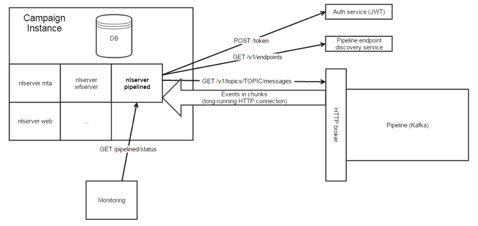

# Arbeta med Campaign och Experience Cloud Triggers{#about-adobe-experience-triggers}

[!DNL Triggers] är en integrering mellan Adobe Campaign och Adobe Analytics med pipeline. Pipelinen hämtar användarens åtgärder eller utlösare från din webbplats. En kundvagnsöverläggning är ett exempel på utlösare. Utlösare bearbetas i Adobe Campaign för att skicka e-post i nära realtid.

>[!CAUTION]
>
>Den här funktionen är inte tillgänglig som en del av produkten. För den här implementeringen kan du samarbeta med din Adobe-representant/kundtjänst. Du kan sedan följa de steg som beskrivs på [sidan](../../integrations/using/configuring-pipeline.md#prerequisites).

[!DNL Triggers] kör marknadsföringsåtgärder inom ett kort tidsintervall efter en användaråtgärd. Den typiska svarstiden är mindre än en timme.

Det ger smidigare integrering eftersom konfigurationen är minimal och en tredje part inte berörs.
Det stöder också stora trafikvolymer utan att påverka marknadsföringsaktiviteternas resultat. Integrationen kan till exempel behandla en miljon utlösare per timme.

 Upptäck hur du [skapar en Experience Cloud-utlösare](https://experienceleague.adobe.com/docs/experience-cloud/triggers/create.html) och identifierar, definierar och övervakar viktiga konsumentbeteenden.

## [!DNL Triggers]-arkitektur {#triggers-architecture}

Processen [!DNL pipelined] körs alltid på Adobe Campaign marknadsföringsserver. Den ansluter till pipeline, hämtar händelserna och bearbetar dem direkt.



Processen [!DNL pipelined] loggar in på Experience Cloud med en autentiseringstjänst och skickar en privat nyckel. Autentiseringstjänsten returnerar en token. Token används för att autentisera vid hämtning av händelser.

## Förhandskrav {#adobe-io-prerequisites}

Kontrollera att du har:

* en giltig **organisationsidentifierare**: Organisations-ID är den unika identifieraren inom Adobe Experience Cloud, som används t.ex. för VisitorID-tjänsten och IMS Single-Sign On (SSO). [Läs mer](https://experienceleague.adobe.com/docs/core-services/interface/administration/organizations.html?lang=sv)
* en **utvecklaråtkomst** till din organisation. Organisationens systemadministratör måste följa proceduren **Lägg till utvecklare i en enskild produktprofil** som beskrivs [ på den här sidan](https://helpx.adobe.com/enterprise/using/manage-developers.html) för att ge utvecklare åtkomst till produktprofilen `Analytics - {tenantID}` för den Adobe Analytics-produkt som är associerad med utlösare.

## Implementeringssteg {#implement}

Följ stegen nedan för att implementera Campaign och Experience Cloud Triggers:

1. Skapa ett OAuth-projekt. [Läs mer](oauth-technical-account.md#oauth-service)

1. Lägg till dina OAuth-projektbehörigheter i Adobe Campaign. [Läs mer](oauth-technical-account.md#add-credentials)

1. Uppdatera autentiseringstypen till utvecklarkonsolprojektet i konfigurationsfilen **config-&lt; instance-name >.xml** enligt följande:

   ```
   <pipelined ... authType="imsJwtToken"  ... />
   ```

   Kör sedan en `config -reload` och en omstart av [!DNL pipelined] för att ta hänsyn till ändringarna.

