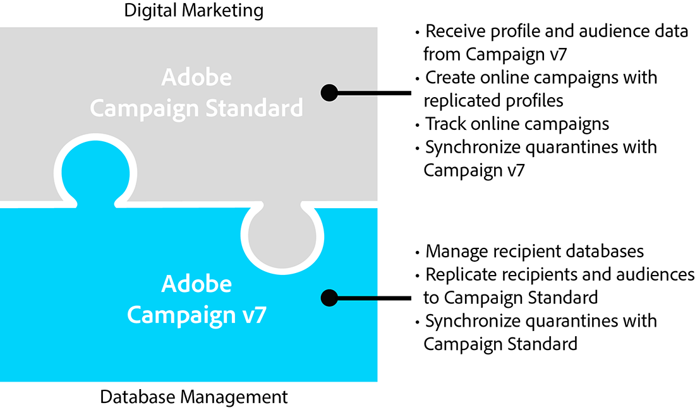

# ACS Connector-principer och datasecykel{#acs-connector-principles-and-data-cycle}

## Introduktion {#introduction}

ACS Connector överbryggar Adobe Campaign v7 och Adobe Campaign Standard. Det är en integrerad funktion i Campaign v7 som automatiskt återger data till Campaign Standard och kombinerar det bästa av båda programmen. Campaign v7 har avancerade verktyg för att hantera den primära marknadsföringsdatabasen. Datareplikeringen från Campaign v7 gör att Campaign Standard kan utnyttja omfattande data i en användarvänlig miljö.

Med ACS Connector används Campaign Standard även fortsättningsvis av digitala marknadsförare för att utforma, målinrikta och köra kampanjer, medan Campaign v7 är skräddarsytt för dataorienterade användare som t.ex. databasmarknadsförare.

>[!CAUTION]
>
>ACS Connector är endast tillgängligt som en del av Adobe Campaign Prime-erbjudandet. Kontakta din kontoansvarige om du vill ha mer information om hur du licensierar Adobe Campaign Prime.
>
>ACS Connector är endast tillgängligt för hostingarkitekturer och hybridarkitekturer. Den finns inte för kompletta installationer på plats.
>
>Om du vill använda den här funktionen måste du ansluta till Campaign med ett Adobe ID (IMS). Se [Ansluta via ett Adobe-ID](../../integrations/using/about-adobe-id.md).

I det här dokumentet visas ACS Connector-funktionerna. Avsnitten nedan innehåller information om hur funktionen replikerar data och anvisningar om hur du arbetar med replikerade profiler.

* [Process](#process): Översikt över ACS Connector och hur datareplikering hanteras.
* [Implementering](#implementation): Översikt över hur du kommer igång med ACS Connector samt anvisningar om hur du replikerar grundläggande och avancerade data.
* [Synkroniserar profiler](../../integrations/using/synchronizing-profiles.md): Instruktioner om hur du replikerar profiler och hur du skapar leveranser med dem.
* [Synkronisera målgrupper](../../integrations/using/synchronizing-audiences.md): Instruktioner om hur du skapar en mållista för mottagare i Campaign v7 och sedan replikerar listan till Campaign Standard som målgrupp.
* [Synkroniserar webbprogram](../../integrations/using/synchronizing-web-applications.md): Instruktioner om hur du länkar webbprogram i Campaign v7 till Campaign Standard.
* [Felsöka ACS Connector](../../integrations/using/troubleshooting-the-acs-connector.md): Se svaren på vanliga problem.

>[!NOTE]
>
>ACS Connector ingår i Campaign v7 under licensavtal. Om du vill använda ACS Connector måste du se till att du kan växla mellan Campaign v7 och Campaign Standard. Kontakta administratören om du är osäker på vilken version och vilka funktioner som ingår.

## Process {#process}

### Datareplikering {#data-replication}

ACS Connector replikerar följande objekt regelbundet från Campaign v7 till Campaign Standard:

* **Mottagare**
* **Prenumerationer**
* **Tjänster**
* **Landningssidor**

Som standard är den periodiska replikeringen för ACS Connector en gång var 15:e minut. Intervallet för den periodiska replikeringen kan anpassas efter dina behov. Kontakta din konsult om ändringar krävs.

Datareplikering för mottagare, prenumerationer, tjänster och landningssidor är stegvis, vilket innebär att endast nya mottagare och ändringar av befintliga mottagare replikeras från Campaign v7 till Campaign Standard. Replikering för en viss målgrupp sker dock i en enda instans. Du kan skapa en målgrupp i Campaign v7 och sedan replikera den en gång till Campaign Standard. Replikeringen är omedelbar och kan inte konfigureras för regelbundna uppdateringar. Instruktioner finns i [Synkronisera målgrupper](../../integrations/using/synchronizing-audiences.md).

>[!NOTE]
>
>Ha tålamod med inledande replikering av en stor databas eftersom det kan ta flera timmar. Efterföljande replikeringar är dock stegvis och mycket snabbare.

ACS Connector replikerar följande objekt regelbundet från Campaign Standard till Campaign v7:

* **[!UICONTROL Delivery IDs]**
* **[!UICONTROL Email broad logs]**
* **[!UICONTROL Email tracking logs]**

Genom att replikera leverans-ID:n och e-postloggar får du åtkomst till leveranshistoriken och spårningsdata för dina v7-mottagare från Campaign v7.

>[!CAUTION]
>
>Endast e-postutsändningsloggar och spårningsloggar replikeras från Campaign Standard till Campaign v7.

### Datasynkronisering {#data-synchronization}

ACS Connector synkroniserar karantän mellan Campaign v7 och Campaign Standard.

En profil som har replikerats från Campaign v7 till Campaign Standard innehåller till exempel en e-postadress. Om e-postadressen sätts i karantän av Campaign Standard skickas data till Campaign v7 under nästa synkronisering. Mer information om karantäner finns i [Karantänhantering](../../delivery/using/understanding-quarantine-management.md) och [Campaign Standard Quarantines](https://docs.adobe.com/content/help/en/campaign-standard/using/testing-and-sending/monitoring-messages/understanding-quarantine-management.html).

### Använda replikerade profiler {#using-replicated-profiles}

Replikerade profiler kan användas av Campaign Standard och Campaign v7 för riktade arbetsflöden i marknadsföringskampanjer.

Instruktioner om hur du skickar en leverans i Campaign Standard med replikerade profiler finns i [Synkronisera profiler](../../integrations/using/synchronizing-profiles.md). Det finns ytterligare instruktioner för att dela avprenumerationsdata mellan Campaign v7 och Campaign Standard.

### Begränsningar {#limitations}

Replikerade profiler är tillgängliga för leveranser men har vissa begränsningar i Campaign Standard. Granska objekten nedan för att lära dig hur du bäst hanterar dem.

* **Skrivskyddade profiler för Campaign Standard**: Replikerade profiler är skrivskyddade i Campaign Standard. Du kan dock redigera mottagare i Campaign v7 och ändringarna uppdateras automatiskt i Campaign Standard av ACS Connector.
* **Profiler skapade i Campaign Standard**: ACS Connector replikerar mottagardata i en riktning, från Campaign v7 till Campaign Standard. Därför replikeras inte profiler som kommer från Campaign Standard till Campaign v7.
* **Grundläggande mottagardata för Campaign Standard**: ACS Connector replikerar mottagardata som är lämpliga för Campaign Standard. Det innehåller mottagarnas namn, adresser, e-postadresser, mobiltelefonnummer, hemtelefonnummer och annan relevant kontaktinformation. Om fler mottagarfält och anpassade måltabeller som finns i Campaign v7 är viktiga för ditt arbetsflöde, ska du kontakta din konsult.
* **Importera profiler** i karantän: Listor med profiler som inte vill bli kontaktade kan importeras till Campaign v7 eller Campaign Standard som profiler i karantän. Statusen för profilerna ingår i karantänsynkroniseringen mellan programmen och används inte i leveranser.
* **Avbeställ en tjänst i Campaign Standard**: Alternativet att avbryta prenumerationen på en leverans synkroniseras inte från Campaign Standard till Campaign v7. Du kan dock konfigurera en Campaign Standard-leverans så att den dirigerar sin länk för att avbryta prenumerationen till Campaign v7. Profilen för en mottagare som klickar på länken för att avbryta prenumerationen uppdateras i Campaign v7 och data replikeras till Campaign Standard. Se [Ändra avprenumerationslänken](../../integrations/using/synchronizing-profiles.md#changing-the-unsubscription-link).
* Endast e-postutsändningsloggar och spårningsloggar replikeras från Campaign Standard till Campaign v7.

### Fakturering {#billing}

Faktureringen påverkas inte av ditt val av program för att skicka leveranser, Campaign v7 eller Campaign Standard. Faktureringsinformationen är avstämd mellan Campaign v7 och Campaign Standard. Om du skickar leveranser till samma mottagare med båda programmen räknas det därför fortfarande som en aktiv profil.

## Implementering {#implementation}

Det finns två typer av implementering för ACS Connector. Båda genomförs alltid av Adobe Campaign Consulting-teamet.

>[!CAUTION]
>
>Det här avsnittet är endast avsett för expertanvändare, så att de får en global bild av implementeringsprocessen och dess huvudsteg.
>
>Försök inte på något sätt själv att utföra någon av dessa implementeringar. Det är förbehållet Adobe Campaign-konsulterna.

Med den **grundläggande implementeringen** kan du replikera mottagare (färdiga fält), tjänster och prenumerationer, webbprogram och målgrupper. Detta är en envägsreplikering från Campaign v7 till Campaign Standard.

Den **avancerade implementeringen** gör att du kan utföra mer komplexa användningsfall, till exempel om du har ytterligare mottagarfält eller anpassade mottagartabeller (t.ex. transaktionstabell). Se [Avancerad implementering](#advanced-implementation).

### Installera paketet {#installing-the-package}

Paketet måste vara installerat för att du ska kunna använda funktionen **[!UICONTROL ACS Connector]** . Detta görs alltid av Adobes tekniska administratör eller konsult.

Alla tekniska element som är relaterade till ACS Connector är tillgängliga i utforskarens **[!UICONTROL Administration > ACS Connector]** nod.

### Tekniska arbetsflöden och arbetsflöden för replikering {#technical-and-replication-workflows}

Efter installationen av paketet finns två tekniska arbetsflöden under **[!UICONTROL Administration > ACS Connector > Process]**.

>[!CAUTION]
>
>Försök aldrig att ändra dessa arbetsflöden. De får aldrig befinna sig i fel eller ha pausats. Kontakta Adobe Campaign-konsulten om detta händer.

* **[!UICONTROL `[ACS] Quarantine synchronization`]** (karantänSync): det här arbetsflödet synkroniserar all karantäninformation. Alla nya karantän i Campaign v7 replikeras till Campaign Standard. Alla nya karantän från Campaign Standard replikeras till Campaign v7. Detta garanterar att alla exkluderingsregler är synkroniserade mellan Campaign v7 och Campaign Standard.
* **[!UICONTROL `[ACS] Security group synchronization`]** (securityGroupSync): det här arbetsflödet används för rättighetskonvertering. Se [Rättighetskonvertering](#rights-conversion).

Följande replikeringsarbetsflöden är tillgängliga som mallar som kan användas. De måste implementeras av er Adobe Campaign-konsult.

* **[!UICONTROL `[ACS] Profile replication`]** (newProfileReplication): det här inkrementella arbetsflödet replikerar mottagare till Campaign Standard. Som standard replikeras alla färdiga mottagarfält. Se [Standardmottagarfält](#default-recipient-fields).
* **[!UICONTROL `[ACS] Service replication`]** (newServiceReplication): detta inkrementella arbetsflöde replikerar de valda tjänsterna till Campaign Standard. Se användningsfallet [Synkronisera webbprogram](../../integrations/using/synchronizing-web-applications.md).
* **[!UICONTROL `[ACS] Landing pages replication`]** (newLandingPageReplication): detta inkrementella arbetsflöde replikerar de valda webbprogrammen till Campaign Standard. Webbprogrammen för Campaign v7 visas som landningssidor i Campaign Standard. Se användningsfallet [Synkronisera webbprogram](../../integrations/using/synchronizing-web-applications.md).
* **[!UICONTROL `[ACS] New replication`]** (newReplication): det här stegvisa arbetsflödet är ett exempel som kan användas för att replikera en anpassad tabell. Se [Avancerad implementering](#advanced-implementation).
* **[!UICONTROL `[ACS] Delivery-mesage replication`]** (newDlvMsgQualification): detta inkrementella arbetsflöde replikerar leveransmeddelanden från Campaign Standard till Campaign v7.
* **[!UICONTROL `[ACS] Profile delivery log replication`]** (newRcpDeliveryLogReplication): Detta inkrementella arbetsflöde replikerar leverans-ID:n, breda e-postloggar och loggar för e-postspårning från Campaign Standard till Campaign v7. Det tar endast hänsyn till leveranser som skickas från Campaign Standard till profiler som ingår i tabellen nms:templates i Campaign v7.
* **[!UICONTROL `[ACS] New delivery log replication`]** (newRcpDeliveryLogReplication): Detta inkrementella arbetsflöde replikerar leverans-ID:n, breda e-postloggar och loggar för e-postspårning från Campaign Standard till Campaign v7. Det tar endast hänsyn till leveranser som skickas från Campaign Standard till profiler som ingår i en viss tabell (för att definiera, utom nms:templates) i Campaign v7.

### Standardmottagarfält {#default-recipient-fields}

Om du har ytterligare fält eller anpassade tabeller (t.ex. transaktionstabeller) kommer de inte att replikeras som standard. Avancerad konfiguration måste utföras. Se [Avancerad implementering](#advanced-implementation).

Nedan finns en lista över mottagarfält som replikeras med den grundläggande implementeringen. Det här är färdiga fält:

<table> 
 <tbody> 
  <tr> 
   <td> <strong>Etikett</strong>  </td> 
   <td> <strong>Internt namn</strong>  </td> 
  </tr> 
  <tr> 
   <td> Käll-ID  </td> 
   <td> @sourceId  </td> 
  </tr> 
  <tr> 
   <td> Skapad den  </td> 
   <td> @created  </td> 
  </tr> 
  <tr> 
   <td> Ändringsdatum  </td> 
   <td> @lastModified  </td> 
  </tr> 
  <tr> 
   <td> E-post  </td> 
   <td> @email  </td> 
  </tr> 
  <tr> 
   <td> Efternamn  </td> 
   <td> @lastName  </td> 
  </tr> 
  <tr> 
   <td> Förnamn  </td> 
   <td> @firstName  </td> 
  </tr> 
  <tr> 
   <td> Mellannamn  </td> 
   <td> @middleName  </td> 
  </tr> 
  <tr> 
   <td> Mobil  </td> 
   <td> @mobilePhone  </td> 
  </tr> 
  <tr> 
   <td> Födelsedatum  </td> 
   <td> @bornDate  </td> 
  </tr> 
  <tr> 
   <td> Kön  </td> 
   <td> @kön  </td> 
  </tr> 
  <tr> 
   <td> Hälsning  </td> 
   <td> @hälsning  </td> 
  </tr> 
  <tr> 
   <td> Inte längre kontakt (via någon kanal)  </td> 
   <td> @blackList  </td> 
  </tr> 
  <tr> 
   <td> Kontakta inte längre via e-post  </td> 
   <td> @blackListEmail  </td> 
  </tr> 
  <tr> 
   <td> Kontakta inte längre SMS  </td> 
   <td> @blackListMobile  </td> 
  </tr> 
  <tr> 
   <td> Telefon  </td> 
   <td> @phone  </td> 
  </tr> 
  <tr> 
   <td> Fax  </td> 
   <td> @fax  </td> 
  </tr> 
  <tr> 
   <td> Adress 1 (lägenhet)  </td> 
   <td> [location/@address1]  </td> 
  </tr> 
  <tr> 
   <td> Adress 2  </td> 
   <td> [location/@address2]  </td> 
  </tr> 
  <tr> 
   <td> Adress 3 (nummer och gata)  </td> 
   <td> [location/@address3]  </td> 
  </tr> 
  <tr> 
   <td> Adress 4 (land)  </td> 
   <td> [location/@address4]  </td> 
  </tr> 
  <tr> 
   <td> Postnummer  </td> 
   <td> [location/@zipCode]  </td> 
  </tr> 
  <tr> 
   <td> Ort  </td> 
   <td> [location/@city]  </td> 
  </tr> 
  <tr> 
   <td> Landskod  </td> 
   <td> [location/@stateCode]  </td> 
  </tr> 
  <tr> 
   <td> Landskod  </td> 
   <td> [location/@countryCode]  </td> 
  </tr> 
 </tbody> 
</table>

### Rättighetskonvertering {#rights-conversion}

Rättigheterna hanteras annorlunda i Campaign v7 och Campaign Standard. I Campaign v7 är rättighetshanteringen mappbaserad, medan den i Campaign Standard är baserad på enhetsåtkomst (organisatoriska/geografiska enheter). En Campaign Standard-användare tillhör en säkerhetsgrupp som innehåller begränsningssammanhanget. Därför måste rättighetssystemet Campaign v7 konverteras för att matcha Campaign Standard. Det finns flera sätt att utföra rättighetskonverteringen. Nedan finns ett exempel på implementering.

1. Under **[!UICONTROL Administration > ACS Connector > Rights management > Security groups]** kan du använda **[!UICONTROL Synchronize]** knappen för att hämta alla säkerhetsgrupper för Campaign Standard. Körklara Campaign Standard-grupper ingår inte.

   

1. Om din behörighetshantering är mappbaserad går du till **[!UICONTROL Administration > ACS Connector > Rights management > Folder mapping]** och mappar varje mapp som behövs med en säkerhetsgrupp.

   

1. Replikeringsarbetsflödena kommer sedan att använda den här informationen och lägga till motsvarande organisatoriska/geografiska enheter till varje objekt som ska replikeras.

### Avancerad implementering {#advanced-implementation}

I det här avsnittet beskrivs några av möjligheterna när det gäller avancerad implementering.

>[!CAUTION]
>
>Den här informationen kan bara användas som allmänna riktlinjer. Kontakta er Adobe Campaign-konsult för implementeringen.

Den avancerade implementeringen lägger till anpassade replikeringsarbetsflöden, beroende på kundens behov. Här är några exempel:

* Leveransreplikering
* Kampanjreplikering
* Programreplikering
* Replikering av dirigerade medlemmar
* Transaktionsreplikering
* osv.

**Replikera utökade fält på mottagare**

Med den grundläggande implementeringen replikeras de körklara mottagarfälten. Om du vill replikera anpassade fält som du har lagt till i mottagarschemat måste du identifiera dem.

1. Under **[!UICONTROL Administration > ACS Connector > Data mapping]** skapar du en målmappning i **[!UICONTROL nms:recipient]** tabellen.

   

1. Markera de ytterligare fält som du vill replikera och annan nödvändig information (index, länkar, identifieringsnycklar).

   

1. Öppna arbetsflödet för dedikerad profilreplikering (inte mallen, utan själva arbetsflödesinstansen). Ändra fälten **[!UICONTROL Query]** och **[!UICONTROL Update data]** aktiviteterna så att de inkluderas. Se [Tekniska arbetsflöden och replikeringsarbetsflöden](#technical-and-replication-workflows).

   

   

**Replikerar anpassade profiltabeller**

Med den grundläggande implementeringen replikeras tabellen med färdiga mottagare. Om du har lagt till anpassade mottagartabeller, så här identifierar du dem.

1. Under **[!UICONTROL Administration > ACS Connector > Data mapping]** skapar du en målmappning i din anpassade profiltabell.

   

1. Definiera ID-data, index, länkar och fält som du vill replikera.

   

1. Om din behörighetshantering är mappbaserad går du till **[!UICONTROL Administration > ACS Connector > Rights management > Folder mapping]** och definierar en säkerhetsgrupp för de mappar som är länkade till dina anpassade tabeller. Se [Rättighetskonvertering](#rights-conversion).
1. Använd arbetsflödet (inte mallen, utan själva arbetsflödesinstansen) för att inkludera den anpassade tabellen och de fält som ska replikeras. **[!UICONTROL New replication]** Se [Tekniska arbetsflöden och replikeringsarbetsflöden](#technical-and-replication-workflows).

