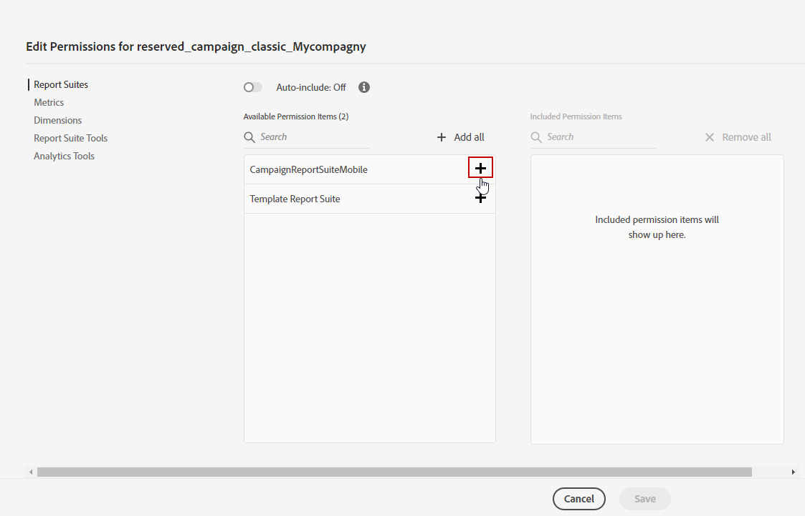

# Etablering av Adobe Analytics Connector {#adobe-analytics-connector-provisioning}

>[!CAUTION]
>
> Dessa åtgärder bör endast utföras av Hybrid och lokalt implementerade implementeringar.
>
>För implementeringar av Hosted och Campaign Managed Services kontaktar du [Adobe kundtjänst](https://helpx.adobe.com/se/enterprise/admin-guide.html/enterprise/using/support-for-experience-cloud.ug.html) team.

Integrationen mellan Adobe Campaign Classic och Adobe Analytics autentisering stöder Adobe Identity Management Service (IMS):

* Om du hanterar ett migrerat externt konto måste du implementera Adobe IMS och ansluta till Adobe Campaign via en Adobe ID.

  Observera att den användare som är inloggad via Adobe ID IMS måste vara ägare till **Dataanslutning** i Adobe Analytics och har behörigheter för **Produktprofil** nämnd [nedan](#analytics-product-profile).

Problemet var att ägaren till dataanslutningen var en annan användare än användaren som loggade in på Campaign och testade integreringen med Analytics.

* Om du implementerar en ny koppling är det valfritt att implementera Adobe IMS. Utan en Adobe ID-användare använder Adobe Campaign en teknisk användare för att synkronisera med Adobe Analytics.

För att den här integreringen ska fungera måste du skapa en Adobe Analytics-produktprofil som används exklusivt för Analytics-kontakten. Sedan måste du skapa ett Developer Console-projekt.

>[!AVAILABILITY]
>
> JWT-autentiseringsuppgifterna (Service Account) har tagits bort av Adobe, och Campaign-integreringar med Adobe-lösningar och appar måste nu förlita sig på autentiseringsuppgifter för OAuth Server-till-Server.  
>
> * Om du har implementerat inkommande integreringar med Campaign måste du migrera ditt tekniska konto enligt informationen i [den här dokumentationen](https://developer.adobe.com/developer-console/docs/guides/authentication/ServerToServerAuthentication/migration/#_blank). Befintliga JWT-referenser (Service Account) kommer att fortsätta att fungera fram till 27 januari 2025. 
>
> * Om ni har implementerat utgående integreringar, som integrering med Campaign-Analytics eller integrering med Experience Cloud-utlösare, fortsätter de att fungera fram till 27 januari 2025. Innan detta datum måste du dock uppgradera din Campaign-miljö till v7.4.1 och migrera ditt tekniska konto till OAuth.

## Skapa en Adobe Analytics-produktprofil {#analytics-product-profile}

Produktprofilen avgör vilken åtkomstnivå en användare har till dina olika Analytics-komponenter.

Om du redan har en Analytics-produktprofil bör du ändå skapa en ny Adobe Analytics-produktprofil som används exklusivt för Analytics-kontakten. Detta säkerställer att din produktprofil är inställd med rätt behörigheter för den här integreringen.

Mer information om produktprofiler finns i [Dokumentation till Admin Console](https://helpx.adobe.com/mt/enterprise/admin-guide.html).

1. Från [Admin Console](https://adminconsole.adobe.com/)väljer du Adobe Analytics **[!UICONTROL Product]**.

   

1. Klicka på **[!UICONTROL New Profile]**.

   

1. Lägg till en **[!UICONTROL Product profile name]** föreslår vi att du använder följande syntax: `reserved_campaign_classic_<Company Name>`. Klicka sedan på **[!UICONTROL Next]**.

   Detta **[!UICONTROL Product profile]** ska endast användas för Analytics Connector för att förhindra felkonfigurationsfel.

1. Öppna dina nyskapade **[!UICONTROL Product profile]** och väljer **[!UICONTROL Permissions]** -fliken.

   

1. Konfigurera de olika funktionerna genom att klicka **[!UICONTROL Edit]** och väljer behörigheter att tilldela **[!UICONTROL Product profile]** genom att klicka på plusikonen (+).

   Mer information om hur du hanterar behörigheter finns i [Dokumentation till Admin Console](https://helpx.adobe.com/mt/enterprise/using/manage-permissions-and-roles.html).

1. För **[!UICONTROL Report Suites]** funktioner, lägga till **[!UICONTROL Report Suites]** du måste använda senare.

   Om du inte har några rapportsviter kan du skapa dem enligt följande [dessa steg](../../integrations/using/gs-aa.md).

   

1. För **[!UICONTROL Metrics]** funktioner, lägga till **[!UICONTROL Metrics]** måste du konfigurera senare.

   Om det behövs kan du aktivera alternativet Inkludera automatiskt som lägger till alla behörighetsobjekt i den inkluderade listan och automatiskt lägger till nya behörighetsobjekt.

   

1. För **[!UICONTROL Dimensions]** funktioner, lägga till **[!UICONTROL Dimensions]** behövs för framtida konfiguration.

   Kontrollera att de valda Dimensionerna överensstämmer med de som ska konfigureras i det externa kontot och att de är anpassade till motsvarande eVars-nummer från Adobe Analytics.

1. För **[!UICONTROL Report Suite Tools]** lägger du till följande behörigheter:

   * **[!UICONTROL Report suite Mgmt]**
   * **[!UICONTROL Conversion variables]**
   * **[!UICONTROL Success events]**
   * **[!UICONTROL Custom data Warehouse report]**
   * **[!UICONTROL Data sources manager]**
   * **[!UICONTROL Classifications]**

1. För **[!UICONTROL Analytics Tools]** lägger du till följande behörigheter:

   * **[!UICONTROL Code Manager - Web services]**
   * **[!UICONTROL Logs - Web services]**
   * **[!UICONTROL Web services]**
   * **[!UICONTROL Web service access]**
   * **[!UICONTROL Calculated metric creation]**
   * **[!UICONTROL Segment creation]**

Din produktprofil är nu konfigurerad. Sedan måste du skapa OAuth-projektet.

## Skapa OAuth-projekt {#create-adobe-io}

Om du vill fortsätta konfigurera din Adobe Analytics-anslutning öppnar du Adobe Developer-konsolen och skapar ett OAuth Server-till-Server-projekt.

Se [den här sidan](oauth-technical-account.md#oauth-service) för detaljerad dokumentation.

## Konfiguration och användning {#adobe-analytics-connector-usage}

Lär dig hur du arbetar med Adobe Campaign och Adobe Analytics i [Adobe Campaign v8-dokumentation](https://experienceleague.adobe.com/en/docs/campaign/campaign-v8/connect/ac-aa){target="_blank"}.