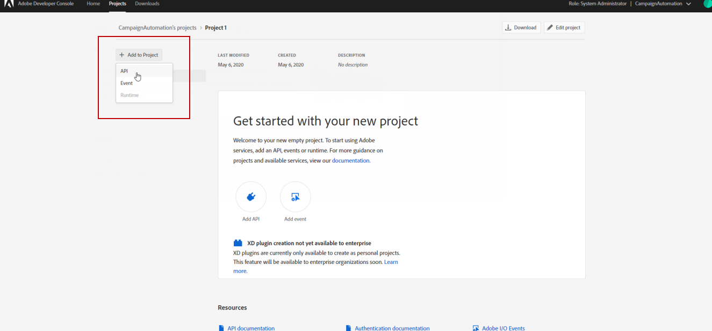

# Konfigurera Adobe I/O för utlösare i Adobe Experience Cloud {#configuring-adobe-io}


>[!CAUTION]
>
>Om du använder en äldre version av integreringen av utlösare via autentisering, **du måste flytta till Adobe I/O enligt beskrivningen nedan**.
>Observera att under den här flyttningen till [!DNL Adobe I/O]kan vissa inkommande utlösare gå förlorade.
>
>Det gamla autentiseringsläget Autentisering med Campaign har tagits bort den **20 oktober 2021**. Värdmiljöer drar nytta av ett tillägg fram till **25 maj 2022**. Kontakta Adobe kundtjänst om du är en lokal kund eller hybridkund för att utöka supporten till **Maj 2022**. Du måste [ange AppID för OAuth-programmet](../../integrations/using/configuring-pipeline.md?lang=en#step-optional) till Adobe.

## Förhandskrav {#adobe-io-prerequisites}

Den här integreringen gäller endast från **Campaign Classic 20.2.4 och senare, 19.1.8 och Gold Standard 11**.

Kontrollera att du har:

* en giltig **Organisationsidentifierare**: Organisations-ID är den unika identifieraren inom Adobe Experience Cloud, som används t.ex. för VisitorID-tjänsten och IMS Single-Sign On (SSO). [Läs mer](https://experienceleague.adobe.com/docs/core-services/interface/administration/organizations.html?lang=sv)
* a **Åtkomst för utvecklare** till din organisation. Organisationens systemadministratör måste följa **Lägga till utvecklare i en enda produktprofil** detaljerad [på den här sidan](https://helpx.adobe.com/enterprise/using/manage-developers.html) för att ge utvecklare åtkomst till `Analytics - {tenantID}` Produktprofil för den Adobe Analytics-produkt som är kopplad till utlösare.

## Steg 1: Skapa/uppdatera Adobe I/O-projekt {#creating-adobe-io-project}

1. Åtkomst [!DNL Adobe I/O] och logga in med utvecklaråtkomst i din organisation.

   >[!NOTE]
   >
   > Se till att du är inloggad på rätt organisationsportal.

1. Extrahera befintlig integrationsklientidentifierare (klient-ID) från instanskonfigurationsfilen ims/authIMSTAClientId. Ett attribut som inte finns eller är tomt anger att Klient-ID inte har konfigurerats.

   >[!NOTE]
   >
   >Om din klient-ID är tom kan du **[!UICONTROL Create a New project]** i Adobe I/O.

1. Identifiera det befintliga projektet med hjälp av den extraherade klientidentifieraren. Sök efter befintliga projekt med samma klient-ID som det som extraherades i föregående steg.

   

1. Välj **[!UICONTROL + Add to Project]** och välja **[!UICONTROL API]**.

   

1. I **[!UICONTROL Add an API]** fönster, markera **[!UICONTROL Adobe Analytics]**.

   

1. Välj **[!UICONTROL Service Account (JWT)]** som autentiseringstyp.

   

1. Om ditt klient-ID var tomt väljer du **[!UICONTROL Generate a key pair]** för att skapa ett nyckelpar för offentlig och privat nyckel.

   Nycklarna laddas sedan ned automatiskt med ett standardutgångsdatum på 365 dagar. När det har gått ut måste du skapa ett nytt nyckelpar och uppdatera integreringen i konfigurationsfilen. Med alternativ 2 kan du välja att manuellt skapa och överföra **[!UICONTROL Public key]** med ett längre utgångsdatum.

   En steg-för-steg-guide om hur du ersätter utgångsdatum för certifikatnyckelpar finns i [den här sidan](https://developer.adobe.com/developer-console/docs/guides/email-alerts/cert-expiry/#a-step-by-step-guide-to-replacing-expiring-certificate-key-pairs).


   >[!CAUTION]
   >
   >Du bör spara filen config.zip när nedladdningsprompten visas eftersom du inte kan ladda ned den igen.

   

1. Klicka på **[!UICONTROL Next]**.

   

1. Välj en befintlig **[!UICONTROL Product profile]** eller skapa en ny vid behov. Ingen behörighet krävs för detta **[!UICONTROL Product profile]**. Mer information om [!DNL Analytics] **[!UICONTROL Product Profiles]**, se [Adobe Analytics-dokumentation](https://experienceleague.adobe.com/docs/analytics/admin/admin-console/home.html#admin-console).

   Klicka sedan på **[!UICONTROL Save configured API]**.

   

1. Välj **[!UICONTROL Adobe Analytics]** och kopiera följande information under **[!UICONTROL Service Account (JWT)]**:

   * **[!UICONTROL Client ID]**
   * **[!UICONTROL Client Secret]**
   * **[!UICONTROL Technical account ID]**
   * **[!UICONTROL Organization ID]**

   

>[!CAUTION]
>
>Adobe I/O certifikat upphör att gälla efter 12 månader. Du måste generera ett nytt nyckelpar varje år.

## Steg 2: Lägg till projektautentiseringsuppgifter i Adobe Campaign {#add-credentials-campaign}

>[!NOTE]
>
>Det här steget krävs inte om din klient-ID inte är tom i [Steg 1: Skapa/uppdatera Adobe I/O-projekt](#creating-adobe-io-project).

Den privata nyckeln ska kodas i base64 UTF-8-format. För att göra detta:

1. Använd den privata nyckeln som genereras i [Steg 1: Skapa/uppdatera projektavsnittet i Adobe I/O](#creating-adobe-io-project). Den privata nyckeln måste vara samma som den som används för att skapa integreringen.

1. Koda den privata nyckeln med följande kommando: `base64 ./private.key > private.key.base64`. Detta sparar base64-innehållet i en ny fil `private.key.base64`.

   >[!NOTE]
   >
   >Extra rader kan ibland läggas till automatiskt när du kopierar/klistrar in den privata nyckeln. Kom ihåg att ta bort den innan du kodar din privata nyckel.

1. Kopiera innehållet från filen `private.key.base64`.

1. Logga in via SSH i varje behållare där Adobe Campaign-instansen är installerad och lägg till projektinloggningsuppgifterna i Adobe Campaign genom att köra följande kommando som `neolane` användare. Detta infogar **[!UICONTROL Technical Account]** autentiseringsuppgifter i instanskonfigurationsfilen.

   ```
   nlserver config -instance:<instance name> -setimsjwtauth:Organization_Id/Client_Id/Technical_Account_ID/<Client_Secret>/<Base64_encoded_Private_Key>
   ```

## Steg 3: Uppdatera tagg för pipeline {#update-pipelined-tag}

>[!NOTE]
>
>Det här steget krävs inte om din klient-ID inte är tom i [Steg 1: Skapa/uppdatera Adobe I/O-projekt](#creating-adobe-io-project).

Uppdatera [!DNL pipelined] -taggen måste du uppdatera autentiseringstypen till Adobe I/O-projektet i konfigurationsfilen **config-&lt; instance-name >.xml** enligt följande:

```
<pipelined ... authType="imsJwtToken"  ... />
```

Kör sedan en `config -reload` och en omstart av [!DNL pipelined] för de ändringar som ska beaktas.
