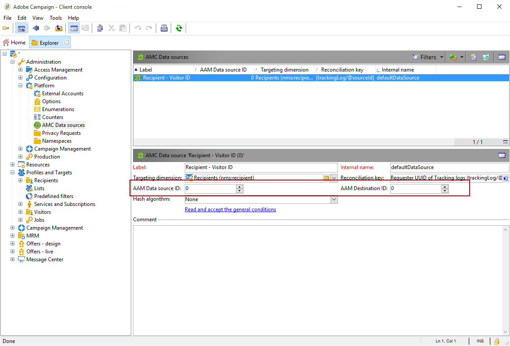

# Konfigurera integrering av delade målgrupper i Adobe Campaign{#configuring-shared-audiences-integration-in-adobe-campaign}


När du har skickat in den här begäran fortsätter Adobe till att tillhandahålla integreringen åt dig och kontaktar dig för att ange information och information som du måste slutföra konfigurationen:

1. [Steg 1: Konfigurera eller kontrollera externa konton i Adobe Campaign](#step-1--configure-or-check-the-external-accounts-in-adobe-campaign)
1. [Steg 2: Konfigurera datakällan](#step-2--configure-the-data-source)
1. [Steg 3: Konfigurera kampanjspårningsserver](#step-3--configure-campaign-tracking-server)
1. [Steg 4: Konfigurera besökar-ID-tjänsten](#step-4--configure-the-visitor-id-service)

>[!IMPORTANT]
>
>Om du använder demodomänen och följer syntaxen **ftp-out.demdex.com** för det externa importkontot och **ftp-in.demdex.com** för det externa exportkontot, måste du anpassa implementeringen och gå till Amazon Simple Storage Service (S3)-anslutningen för att importera eller exportera data. Mer information om hur du konfigurerar externa konton med Amazon S3 finns i [avsnittet](../../integrations/using/configuring-shared-audiences-integration-in-adobe-campaign.md#step-1--configure-or-check-the-external-accounts-in-adobe-campaign).

## Steg 1: Konfigurera eller kontrollera externa konton i Adobe Campaign {#step-1--configure-or-check-the-external-accounts-in-adobe-campaign}

Först måste vi konfigurera eller kontrollera externa konton i Adobe Campaign enligt följande:

1. Klicka på ikonen **[!UICONTROL Explorer]**.
1. Gå till **[!UICONTROL Administration > Platform > External accounts]**. Adobe borde ha konfigurerat SFTP-kontona och du borde ha fått den information som behövs.

   * **[!UICONTROL importSharedAudience]**: konto för att importera målgrupper.
   * **[!UICONTROL exportSharedAudience]**: konto som används för att exportera målgrupper.

   

1. Välj det externa **[!UICONTROL Export audiences to the Adobe Marketing Cloud]**-kontot.

1. Välj **[!UICONTROL AWS S3]** i listrutan **[!UICONTROL Type]**.

1. Ange följande information:

   * **[!UICONTROL AWS S3 Account Server]**
URL-adressen till servern ska fyllas i enligt följande:

      ```
      <S3bucket name>.s3.amazonaws.com/<s3object path>
      ```

   * **[!UICONTROL AWS access key ID]**
Information om var du hittar ditt ID för AWS-åtkomstnyckel finns på den här  [sidan](https://docs.aws.amazon.com/general/latest/gr/aws-sec-cred-types.html#access-keys-and-secret-access-keys) .

   * **[!UICONTROL Secret access key to AWS]**
Om du vill veta var du hittar din hemliga åtkomstnyckel till AWS kan du läsa den här  [sidan](https://aws.amazon.com/fr/blogs/security/wheres-my-secret-access-key/).

   * **[!UICONTROL AWS Region]**
Mer information om AWS finns på den här  [sidan](https://aws.amazon.com/about-aws/global-infrastructure/regions_az/).
   

1. Klicka på **[!UICONTROL Save]** och konfigurera det externa **[!UICONTROL Import audiences from the Adobe Marketing Cloud]**-kontot enligt anvisningarna i föregående steg.

Dina externa konton har nu konfigurerats.

## Steg 2: Konfigurera datakällan {#step-2--configure-the-data-source}

**Mottagaren - besökar-ID** skapas i Audience Manager. Detta är en användbar datakälla som konfigurerats som standard för besökar-ID. Segment som skapas från Campaign kommer att ingå i den här datakällan.

Så här konfigurerar du datakällan **[!UICONTROL Recipient - Visitor ID]**:

1. Välj **[!UICONTROL Administration > Platform > AMC Data sources]** i noden **[!UICONTROL Explorer]**.
1. Välj **[!UICONTROL Recipient - Visitor ID]**.
1. Ange **[!UICONTROL Data Source ID]** och **[!UICONTROL AAM Destination ID]** från Adobe.

   

## Steg 3: Konfigurera kampanjspårningsserver {#step-3--configure-campaign-tracking-server}

För konfigurationen av integreringen med tjänsten People Core eller Audience Manager måste vi även konfigurera Campaign Tracking-servern.

Du måste kontrollera att Campaign Tracking Server är registrerad på domänen (CNAME). Mer information om delegering av domännamn finns i [den här artikeln](https://experienceleague.adobe.com/docs/control-panel/using/subdomains-and-certificates/setting-up-new-subdomain.html).

## Steg 4: Konfigurera besökar-ID-tjänsten {#step-4--configure-the-visitor-id-service}

Om din Visitor ID-tjänst aldrig har konfigurerats på dina webbegenskaper eller webbplatser kan du läsa följande [dokument](https://experienceleague.adobe.com/docs/id-service/using/implementation/setup-aam-analytics.html) och lära dig hur du konfigurerar tjänsten eller följande [video](https://helpx.adobe.com/marketing-cloud/how-to/email-marketing.html#step-two).

Din konfiguration och etablering är färdiga, och integreringen kan nu användas för att importera och exportera målgrupper eller segment.
