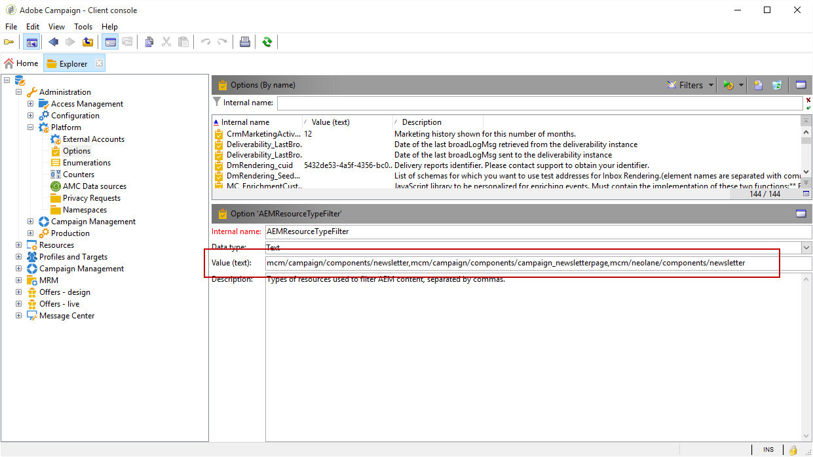

# Konfigurera integreringen{#configuring-the-integration}

## Konfigurera i Adobe Campaign {#configuring-in-adobe-campaign}

Om du vill använda dessa två lösningar tillsammans måste du konfigurera dem så att de ansluter till varandra.

Följ stegen nedan för att starta konfigurationen i Adobe Campaign:

1. [Installera AEM-integreringspaketet i Adobe Campaign](#install-the-aem-integration-package-in-adobe-campaign)
1. [Konfigurera det externa kontot](#configure-the-external-account)
1. [Konfigurera AEM-resursfiltrering](#configure-aem-resources-filtering)

För avancerade konfigurationer som hantering av personaliseringsfält och -block. Läs Adobe Experience Manager- [dokumentationen](https://helpx.adobe.com/experience-manager/6-5/sites/administering/using/campaignonpremise.html).

### Installera AEM-integreringspaketet i Adobe Campaign {#install-the-aem-integration-package-in-adobe-campaign}

Du måste först installera **[!UICONTROL AEM integration]** paketet.

1. I Adobe Campaign-instansen väljer du **[!UICONTROL Tools]** i det övre verktygsfältet.
1. Välj **[!UICONTROL Tools > Advanced > Import package...]**.

   

1. Välj **[!UICONTROL Install a standard package]**.
1. Markera **[!UICONTROL AEM integration]** och klicka sedan på **[!UICONTROL Next]** knappen.

   

1. I nästa fönster klickar du på **[!UICONTROL Start]** knappen för att starta installationen av paketet. Stäng fönstret när installationen är klar.

### Konfigurera säkerhetszonen för AEM-operatorn {#configure-the-security-zone-for-aem-operator}

Paketet **[!UICONTROL AEM integration]** anger **[!UICONTROL aemserver]** operatorn i Campaign. Den här operatorn används för att ansluta Adobe Experience Manager-servern till Adobe Campaign.

Du måste konfigurera en säkerhetszon så att den här operatorn kan ansluta till Adobe Campaign via Adobe Experience Manager.

>[!CAUTION]
>
>Vi rekommenderar starkt att du skapar en säkerhetszon som är dedikerad till AEM för att undvika säkerhetsproblem. Mer information finns i [installationshandboken](../../installation/using/configuring-campaign-server.md#defining-security-zones).

Om Adobe är värd för din Campaign-instans kontaktar du Adobes supportteam. Om du använder Campaign lokalt följer du stegen nedan:

1. Öppna konfigurationsfilen **serverConf.xml** .
1. Få åtkomst till attributet **allowUserPassword** i den markerade säkerhetszonen och ange det till **true**.

   På så sätt kan Adobe Experience Manager ansluta Adobe Campaign via inloggning/lösenord.

### Konfigurera det externa kontot {#configure-the-external-account}

Paketet skapade det externa kontot för Adobe Experience Cloud **[!UICONTROL AEM integration]** . Nu måste du konfigurera den för att ansluta till din Adobe Experience Manager-instans.

Följ stegen nedan för att konfigurera det externa AEM-kontot:

1. Klicka på **[!UICONTROL Explorer]** knappen.

   

1. Välj **[!UICONTROL Administration > Platform > External accounts]**.
1. Välj i **[!UICONTROL External account]** listan **[!UICONTROL AEM instance]**.
1. Ange parametrarna för AEM-redigeringsinstansen:

   * **[!UICONTROL Server]**
   * **[!UICONTROL Account]**
   * **[!UICONTROL Password]**
   >[!NOTE]
   >
   >Se till att din **[!UICONTROL Server]** adress inte avslutas med ett avslutande snedstreck.

   

1. Markera **[!UICONTROL Enabled]** rutan.
1. Klicka på **[!UICONTROL Save]** knappen.

### Konfigurera AEM-resursfiltrering {#configure-aem-resources-filtering}

Alternativet **AEMResourceTypeFilter **används för att filtrera typer av Experience Manager-resurser som kan användas i Adobe Campaign. Detta gör att Adobe Campaign kan hämta Experience Manager-innehåll som är specifikt utformat för att endast användas i Adobe Campaign.

Så här kontrollerar du om **[!UICONTROL AEMResourceTypeFilter]** alternativet är konfigurerat:

1. Klicka på **[!UICONTROL Explorer]** knappen.
1. Välj **[!UICONTROL Administration > Platform > Options]**.
1. Välj i **[!UICONTROL Options]** listan **[!UICONTROL AEMResourceTypeFilter]**.
1. I **[!UICONTROL Value (text)]** fältet ska sökvägen vara följande:

   ```
   mcm/campaign/components/newsletter,mcm/campaign/components/campaign_newsletterpage,mcm/neolane/components/newsletter
   ```

   Eller i vissa fall:

   ```
   mcm/campaign/components/newsletter
   ```

   

## Konfigurera i Adobe Experience Manager {#configuring-in-adobe-experience-manager}

Så här startar du konfigurationen i Adobe Experience Manager:

1. Konfigurera **replikeringen** som ska replikeras från AEM-redigeringsinstansen till AEM-publiceringsinstansen.

   Mer information om hur du konfigurerar replikering finns i Adobe Experience Manager- [dokumentationen](https://helpx.adobe.com/experience-manager/6-4/sites/deploying/using/replication.html).

1. Installera integreringen **FeaturePack** på redigeringsinstansen och replikera sedan installationen på publiceringsinstansen. (Endast för AEM-versionerna 5.6.1 och 6.0).

   Mer information om hur du installerar FeaturePack finns i Adobe Experience Manager- [dokumentationen](https://helpx.adobe.com/experience-manager/aem-previous-versions.html).

1. Koppla Adobe Experience Manager till Adobe Campaign genom att konfigurera en dedikerad **molntjänst**.

   Om du vill veta hur du ansluter båda lösningarna via molntjänster kan du läsa [dokumentationen](https://helpx.adobe.com/experience-manager/6-4/sites/administering/using/campaignonpremise.html#ConfiguringAdobeExperienceManager) för Adobe Experience Manager.

1. Konfigurera **tjänsten** Externalizer.

   Mer information om hur du konfigurerar programmet finns i Adobe Experience Manager- [dokumentationen](https://helpx.adobe.com/experience-manager/6-4/sites/developing/using/externalizer.html).

