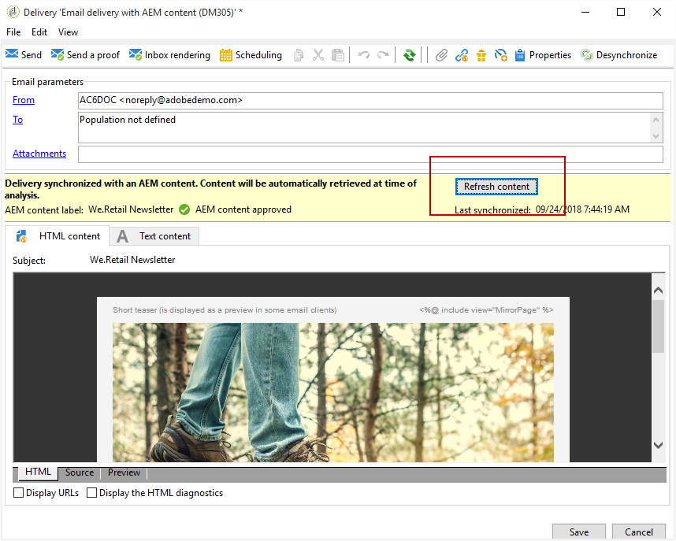

# Creating an Experience Manager newsletter{#creating-an-experience-manager-newsletter}

Den här integreringen kan till exempel användas för att skapa ett nyhetsbrev i Adobe Experience Manager som sedan används i Adobe Campaign som en del av en e-postkampanj.

Ett mer detaljerat exempel på hur du använder den här integreringen finns i den här [steg-för-steg-guiden](https://helpx.adobe.com/campaign/kb/acc-aem.html).

**Från Adobe Experience Manager:**

1. Klicka på **Adobe Experience** -logotypen i det övre vänstra hörnet av AEM författare och välj **[!UICONTROL Sites]**.

   

1. Välj **[!UICONTROL Campaigns > Name of your brand (here We.Retail) > Main Area > Email campaigns]**.
1. Klicka på **[!UICONTROL Create]** knappen längst upp till höger på sidan och välj sedan **[!UICONTROL Page]**.

   

1. Välj **[!UICONTROL Adobe Campaign Email (AC 6.1)]** mall och ge nyhetsbrevet ett namn.
1. När sidan har skapats öppnar du **[!UICONTROL Page information]** menyn och klickar på **[!UICONTROL Open Properties]**.

   

1. På **[!UICONTROL Cloud Services]** fliken väljer du **[!UICONTROL Adobe Campaign]** som **[!UICONTROL Cloud service configuration]** och din Adobe Campaign-instans i den andra listrutan.

   

1. Redigera ditt e-postinnehåll genom att lägga till komponenter, t.ex. anpassningsfält från Adobe Campaign.
1. När e-postmeddelandet är klart går du till **[!UICONTROL Page information]** menyn och klickar **[!UICONTROL Start workflow]**.

   

1. I den första listrutan väljer du **[!UICONTROL Publish to Adobe Campaign]** som arbetsflödesmodell och klickar på **[!UICONTROL Start workflow]**.

   

1. Starta sedan arbetsflödet som föregående steg **[!UICONTROL Approve for Campaign]** .
1. En ansvarsfriskrivning visas ovanpå sidan. Klicka **[!UICONTROL Complete]** för att bekräfta granskningen och klicka på **[!UICONTROL Ok]**.

   

1. Klicka igen **[!UICONTROL Complete]** och välj **[!UICONTROL Newsletter approval]** i **[!UICONTROL Next Step]** listrutan.

   

Nyhetsbrevet är nu klart och synkroniserat i Adobe Campaign.

**Från Adobe Campaign:**

1. From the **[!UICONTROL Campaigns]** tab, click **[!UICONTROL Deliveries]** then **[!UICONTROL Create]**.

   

1. Välj **[!UICONTROL Delivery template]** mallen i **[!UICONTROL Email delivery with AEM content (mailAEMContent)]** listrutan.

   

1. Lägg till en **[!UICONTROL Label]** till leveransen och klicka på **[!UICONTROL Continue]**.
1. Klicka på knappen **[!UICONTROL Synchronize]**.

   Om den här knappen inte visas i gränssnittet klickar du på **[!UICONTROL Properties]** -knappen och väljer **[!UICONTROL Advanced]** -fliken. Fältet **[!UICONTROL Content editing mode]** ska ställas in på **[!UICONTROL AEM]** med din AEM i **[!UICONTROL AEM account]** fältet.

   

1. Markera leveransen som du skapat tidigare i Adobe Experience Manager och klicka på **[!UICONTROL Ok]**.
1. Klicka på **[!UICONTROL Refresh content]** knappen så snart några ändringar har gjorts i AEM.

   

Din e-post kan nu skickas till din målgrupp.
