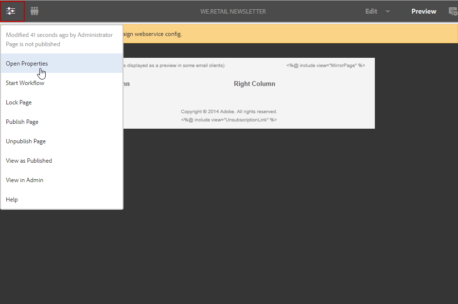

# Skapa ett Experience Manager-nyhetsbrev{#creating-an-experience-manager-newsletter}

Den här integreringen kan till exempel användas för att skapa ett nyhetsbrev i Adobe Experience Manager som sedan används i Adobe Campaign som en del av en e-postkampanj.

**Från Adobe Experience Manager:**

1. Klicka på AEM **Adobe Experience** logotypen längst upp till vänster på sidan och välj **[!UICONTROL Sites]**.

   

1. Välj **[!UICONTROL Campaigns > Name of your brand (here We.Retail) > Main Area > Email campaigns]**.
1. Klicka på **[!UICONTROL Create]** knappen längst upp till höger på sidan och välj **[!UICONTROL Page]**.

   

1. Välj **[!UICONTROL Adobe Campaign Email (AC 6.1)]** mall och ge nyhetsbrevet ett namn.
1. När sidan har skapats går du till **[!UICONTROL Page information]** meny och klicka **[!UICONTROL Open Properties]**.

   

1. I **[!UICONTROL Cloud Services]** flik, välja **[!UICONTROL Adobe Campaign]** as **[!UICONTROL Cloud service configuration]** och din Adobe Campaign-instans i den andra listrutan.

   

1. Redigera ditt e-postinnehåll genom att lägga till komponenter, t.ex. anpassningsfält från Adobe Campaign.
1. När din e-postadress är klar kan du gå till **[!UICONTROL Page information]** meny och klicka **[!UICONTROL Start workflow]**.

   

1. I den första listrutan väljer du **[!UICONTROL Publish to Adobe Campaign]** som arbetsflödesmodell och klicka **[!UICONTROL Start workflow]**.

   

1. Som föregående steg startar du sedan **[!UICONTROL Approve for Campaign]** arbetsflöde.
1. En ansvarsfriskrivning visas ovanpå sidan. Klicka **[!UICONTROL Complete]** för att bekräfta granskningen och klicka på **[!UICONTROL Ok]**.

   

1. Klicka igen **[!UICONTROL Complete]** och markera **[!UICONTROL Newsletter approval]** i **[!UICONTROL Next Step]** nedrullningsbar meny.

   

Nyhetsbrevet är nu klart och synkroniserat i Adobe Campaign.

**Från Adobe Campaign:**

1. Från **[!UICONTROL Campaigns]** flik, klicka **[!UICONTROL Deliveries]** sedan **[!UICONTROL Create]**.

   

1. I **[!UICONTROL Delivery template]** väljer du **[!UICONTROL Email delivery with AEM content (mailAEMContent)]** mall.

   

1. Lägg till en **[!UICONTROL Label]** till leveransen och klicka **[!UICONTROL Continue]**.
1. Klicka på knappen **[!UICONTROL Synchronize]**.

   Om knappen inte visas i gränssnittet klickar du på **[!UICONTROL Properties]** och väljer **[!UICONTROL Advanced]** -fliken. The **[!UICONTROL Content editing mode]** ska anges till **[!UICONTROL AEM]** med AEM i **[!UICONTROL AEM account]** fält.

   

1. Markera leveransen som skapats i Adobe Experience Manager och klicka på **[!UICONTROL Ok]**.
1. Klicka på **[!UICONTROL Refresh content]** så snart du har ändrat AEM.

   

Din e-post kan nu skickas till din målgrupp.
