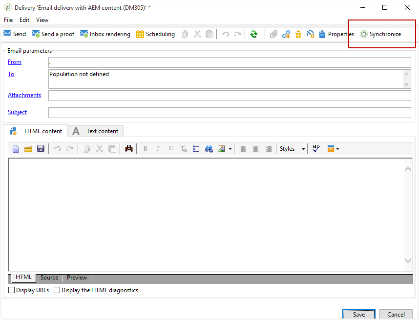

# Skapa ett Experience Manager-nyhetsbrev{#creating-an-experience-manager-newsletter}

Den här integreringen kan till exempel användas för att skapa ett nyhetsbrev i Adobe Experience Manager som sedan används i Adobe Campaign som en del av en e-postkampanj.

**Från Adobe Experience Manager:**

1. Klicka på logotypen **Adobe Experience** i den övre vänstra delen av AEM författarinstans och välj **[!UICONTROL Sites]**.

   

1. Välj **[!UICONTROL Campaigns > Name of your brand (here We.Retail) > Main Area > Email campaigns]**.
1. Klicka på knappen **[!UICONTROL Create]** i det övre högra hörnet på sidan och välj sedan **[!UICONTROL Page]**.

   

1. Välj mallen **[!UICONTROL Adobe Campaign Email (AC 6.1)]** och ge nyhetsbrevet ett namn.
1. När sidan har skapats går du till menyn **[!UICONTROL Page information]** och klickar på **[!UICONTROL Open Properties]**.

   

1. På fliken **[!UICONTROL Cloud Services]** väljer du **[!UICONTROL Adobe Campaign]** som **[!UICONTROL Cloud service configuration]** och din Adobe Campaign-instans i den andra listrutan.

   

1. Redigera ditt e-postinnehåll genom att lägga till komponenter, t.ex. anpassningsfält från Adobe Campaign.
1. När e-postmeddelandet är klart går du till menyn **[!UICONTROL Page information]** och klickar på **[!UICONTROL Start workflow]**.

   

1. I den första listrutan väljer du **[!UICONTROL Publish to Adobe Campaign]** som arbetsflödesmodell och klickar på **[!UICONTROL Start workflow]**.

   

1. Starta sedan arbetsflödet **[!UICONTROL Approve for Campaign]** som föregående steg.
1. En ansvarsfriskrivning visas ovanpå sidan. Klicka på **[!UICONTROL Complete]** för att bekräfta granskningen och klicka på **[!UICONTROL Ok]**.

   

1. Klicka igen **[!UICONTROL Complete]** och välj **[!UICONTROL Newsletter approval]** i listrutan **[!UICONTROL Next Step]**.

   

Nyhetsbrevet är nu klart och synkroniserat i Adobe Campaign.

**Från Adobe Campaign:**

1. Klicka på **[!UICONTROL Deliveries]** och sedan **[!UICONTROL Create]** på fliken **[!UICONTROL Campaigns]**.

   

1. Välj mallen **[!UICONTROL Email delivery with AEM content (mailAEMContent)]** i listrutan **[!UICONTROL Delivery template]**.

   

1. Lägg till en **[!UICONTROL Label]** i leveransen och klicka på **[!UICONTROL Continue]**.
1. Klicka på knappen **[!UICONTROL Synchronize]**.

   Om den här knappen inte visas i gränssnittet klickar du på knappen **[!UICONTROL Properties]** och väljer fliken **[!UICONTROL Advanced]**. Fältet **[!UICONTROL Content editing mode]** ska anges till **[!UICONTROL AEM]** med din AEM i fältet **[!UICONTROL AEM account]**.

   

1. Markera leveransen som tidigare skapats i Adobe Experience Manager och klicka på **[!UICONTROL Ok]**.
1. Klicka på knappen **[!UICONTROL Refresh content]** så snart några ändringar har gjorts i AEM.

   

Din e-post kan nu skickas till din målgrupp.
