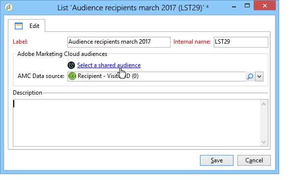

# Importera och exportera målgrupper{#importing-and-exporting-audiences}

## Importera en målgrupp {#importing-an-audience}

Du kan importera målgrupper/segment från Audience Manager till Adobe Campaign via mottagarlistorna.

1. Gå till noden **[!UICONTROL Profiles and Targets]** > **[!UICONTROL Lists]** i Adobe Campaign Utforskaren.
1. Välj **[!UICONTROL New]** > **[!UICONTROL Create a shared audience...]** i åtgärdsfältet.

   

1. I det fönster som öppnas klickar du på **[!UICONTROL Select a shared audience]** för att gå till listan över delade målgrupper/segment som är tillgängliga från andra Adobe Experience Cloud-lösningar.
1. Välj en målgrupp och bekräfta. Publiken fylls i automatiskt.

   Observera att för att kunna importera delade målgrupper bör du tilldelas produkten **[!UICONTROL Audience library]** i Admin Console och vara administratör i Audience Manager. Mer information finns i [Admin Console-dokumentationen](https://helpx.adobe.com/se/enterprise/managing/user-guide.html).

   

1. Välj AMC-datakällan i fältet **[!UICONTROL AMC Data source]** för att definiera den typ av data som förväntas.

   

1. Spara publiken.

Publiken importeras via ett tekniskt arbetsflöde. Den importerade listan innehåller element som kan förenas med hjälp av AMC-datakällan. Elementen som inte känns igen av Adobe Campaign importeras inte.

Det tar 24-36 timmar att synkronisera importprocessen när segment importeras direkt från Audience Manager. Efter den här perioden kan du hitta och använda din nya målgrupp i Adobe Campaign.

>[!NOTE]
>
>Om du importerar målgrupper från Adobe Analytics till Adobe Campaign måste dessa målgrupper först delas i Audience Manager. Den här processen tar 12-24 timmar, vilket måste läggas till i synkroniseringen av 24-36 timmar med Campaign.
>
>I det specifika fallet kan tidsramen för målgruppsdelning vara upp till 60 timmar. Mer information om Adobe Analytics målgruppsdelning i Audience Manager finns i [Adobe Analytics-dokumentationen](https://experienceleague.adobe.com/docs/analytics/components/segmentation/segmentation-workflow/seg-publish.html?lang=sv-SE){target="_blank"}.

Publiken ersätts helt och hållet varje gång den synkroniseras. Endast segment kan importeras. Detaljerade data som nyckelvärdepar, egenskaper och regler stöds inte.

## Exportera en målgrupp {#exporting-an-audience}

Du kan exportera en målgrupp från Adobe Campaign till Audience Manager med hjälp av ett arbetsflöde. Processerna för att skapa och använda ett arbetsflöde beskrivs i [det här dokumentet](../../workflow/using/building-a-workflow.md). De exporterade målgrupperna sparas som segment:

1. Skapa ett nytt arbetsflöde för målinriktning.
1. Använd olika aktiviteter för att ange en uppsättning mottagare som mål.
1. Dra och släpp en **[!UICONTROL Update shared audience]**-aktivitet efter målplatsen och öppna den.

   

1. Definiera målgruppen som du vill exportera med alternativet **[!UICONTROL Select a shared audience]**. I det fönster som öppnas kan du välja en befintlig målgrupp eller skapa en ny.

   Om du väljer en befintlig målgrupp läggs endast de nya posterna till i målgruppen.

   Om du vill exportera mottagarlistan till en ny målgrupp fyller du i fältet **[!UICONTROL Segment name]** och klickar sedan på **[!UICONTROL Create]** innan du väljer den nya målgruppen.

   Slutför åtgärden genom att klicka på bocksymbolen längst upp till höger i fönstret och sedan på knappen **[!UICONTROL OK]**.

1. Välj **[!UICONTROL AMC Data source]** för att ange den förväntade datatypen. Schemat bestäms automatiskt.

   

1. Spara publiken.

Publiken exporteras sedan. Det finns två utgående övergångar för aktiviteten Spara målgrupp. Huvudövergången innehåller de mottagare som exporterades. Den extra övergången innehåller de mottagare som inte kunde mappas med ett besökar-ID eller deklarerat ID.

Synkronisering mellan lösningar tar 24-36 timmar. Efter denna period kan ni hitta er nya målgrupp och återanvända den i andra Adobe Experience Cloud-lösningar. Mer information om hur du använder en delad målgrupp från Adobe Campaign finns i [dokumentationen](https://experienceleague.adobe.com/sv/docs/core-services/interface/services/audiences/create){target="_blank"}.

>[!NOTE]
>
>För att posterna ska kunna stämmas av måste de ha ett Adobe Experience Cloud-ID (&quot;besökar-ID&quot; eller&quot;deklarerat ID&quot;). Posterna som inte har något Adobe Experience Cloud-ID ignoreras vid export och import av målgrupper.
