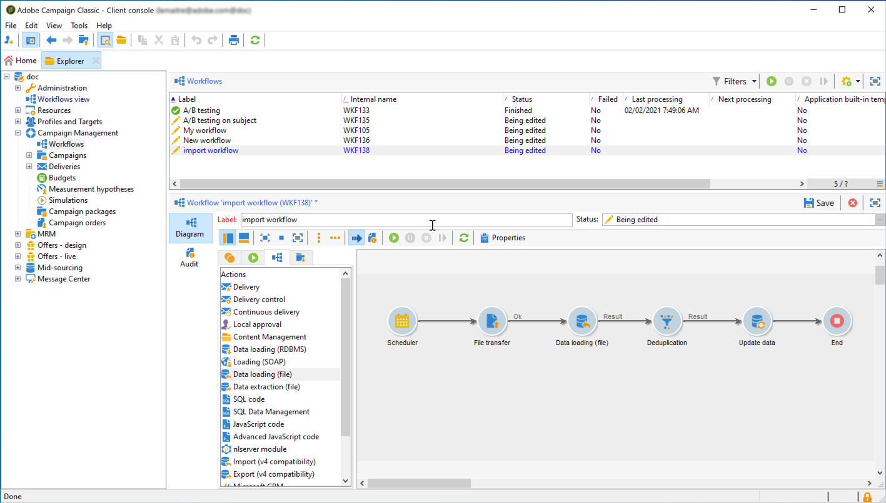

# Infoga Adobe Experience Platform-segment i Campaign {#destinations}

Om du vill importera Adobe Experience Platform-målgrupper till Campaign och använda dem i dina arbetsflöden måste du först ansluta Adobe Campaign som Adobe Experience Platform **mål** och konfigurera det med segmentet som ska exporteras.

När målet har konfigurerats exporteras data till lagringsplatsen och du måste skapa ett dedikerat arbetsflöde i Campaign Classic för att kunna importera det.

## Anslut Adobe Campaign som mål

Konfigurera en anslutning till Adobe Campaign på Adobe Experience-plattformen genom att välja en lagringsplats för de exporterade segmenten. I det här steget kan du även välja vilka segment som ska exporteras och ange ytterligare XDM-fält som ska inkluderas.

Mer information finns i [Måldokumentationen](https://experienceleague.adobe.com/docs/experience-platform/destinations/catalog/email-marketing/adobe-campaign.html?lang=sv-SE).

När målet har konfigurerats skapar Adobe Experience Platform en tabbavgränsad tabbavgränsad txt- eller CSV-fil på den angivna lagringsplatsen. Den här åtgärden schemaläggs och utförs en gång per 24 timmar.

Nu kan du konfigurera ett Campaign Classic-arbetsflöde för att importera segmentet till Campaign.

## Skapa ett importarbetsflöde i Campaign Classic

När Campaign Classic har konfigurerats som mål måste du skapa ett dedikerat arbetsflöde för att importera filen som har exporterats av Adobe Experience Platform.

För att göra detta måste du lägga till och konfigurera en **[!UICONTROL File transfer]**-aktivitet. Mer information om hur du konfigurerar den här aktiviteten finns i [dokumentationen för Campaign v8](https://experienceleague.adobe.com/docs/campaign/automation/workflows/wf-activities/event-activities/file-transfer.html?lang=sv-SE){target="_blank"}.

Du kan sedan skapa arbetsflödet utifrån dina behov (uppdatera databasen med segmentdata, skicka en flerkanalsleverans till segmentet osv.)

Som ett exempel hämtar arbetsflödet nedan filen från din lagringsplats dagligen och uppdaterar sedan Campaign-databasen med segmentdata.

