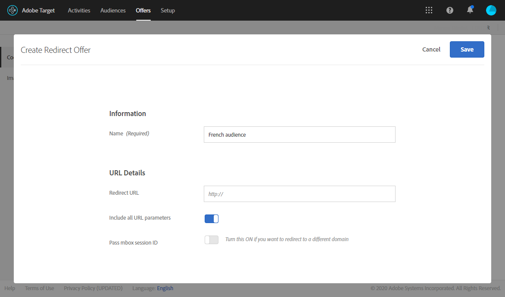

# Infoga dynamiskt innehåll för mål {#inserting-a-dynamic-image}

På den här sidan får du lära dig att integrera ett dynamiskt erbjudande från Adobe Target i ett e-postmeddelande i Adobe Campaign.

Målet är att skapa en leverans med ett bildblock som dynamiskt ändras beroende på mottagarens land: informationen skickas med varje mbox-begäran och beror på mottagarens IP-adress.

I det här meddelandet kan bilderna variera dynamiskt beroende på följande användarupplevelser:

* E-postmeddelandet öppnas i Frankrike.
* E-postmeddelandet öppnas i USA.
* Om inget av dessa villkor är uppfyllda visas en standardbild.

Gör så här:

1. [Infoga det dynamiska erbjudandet i ett e-postmeddelande](../../integrations/using/inserting-a-dynamic-image.md#inserting-dynamic-offer)
1. [Skapa omdirigeringserbjudanden](../../integrations/using/inserting-a-dynamic-image.md#create-redirect-offers)
1. [Skapa målgrupper](../../integrations/using/inserting-a-dynamic-image.md#audiences-target)
1. [Skapa en upplevelseinriktad aktivitet](../../integrations/using/inserting-a-dynamic-image.md#creating-targeting-activity)
1. [Förhandsgranska och skicka e-postmeddelandet](../../integrations/using/inserting-a-dynamic-image.md#preview-send-email)

## Infoga det dynamiska erbjudandet i ett e-postmeddelande {#inserting-dynamic-offer}

När du har definierat mål och innehåll för ditt e-postmeddelande i Adobe Campaign kan du infoga en dynamisk bild från Target.

Det gör du genom att ange standardbildens URL-adress, platsnamnet och fälten som du vill överföra till Mål.

I Adobe Campaign finns det två sätt att infoga en dynamisk bild från Target i ett e-postmeddelande:

* Om du använder redigeraren för digitalt innehåll väljer du en befintlig bild och väljer **[!UICONTROL Insert]** > **[!UICONTROL Dynamic image served by Adobe Target]** i verktygsfältet.

  

* Om du använder standardredigeraren placerar du markören där du vill infoga bilden och väljer **[!UICONTROL Include]** > **[!UICONTROL Dynamic image served by Adobe Target...]** i listrutan för anpassning.

  

### Definiera bildparametrarna {#defining-image-parameters}

* URL:en för **[!UICONTROL Default image]**: Bilden som visas när inget av villkoren uppfylls. Du kan också välja en bild i ditt Assets-bibliotek.
* **[!UICONTROL Target location]**: Ange ett namn för platsen för ditt dynamiska erbjudande. Du måste välja den här platsen i din Target-aktivitet.
* **[!UICONTROL Landing Page]**: Om du vill att standardbilden ska dirigeras om till en standardstartsida. Den här URL:en är endast till för de fall då standardbilden visas i det slutliga e-postmeddelandet och är valfri.
* **[!UICONTROL Additional decision parameters]**: Ange mappningen mellan fälten som definieras i Adobe Target-segmenten och Adobe Campaign-fälten. De Adobe Campaign-fält som används måste ha angetts i rutan. I vårt exempel har vi lagt till fältet Land.

Om du använder Enterprise-behörigheter i inställningarna för Adobe Target lägger du till motsvarande egenskap i det här fältet. Läs mer om behörigheter för målföretag på [den här sidan](https://experienceleague.adobe.com/docs/target/using/administer/manage-users/enterprise/properties-overview.html?lang=sv-SE).

## Skapa omdirigeringserbjudanden {#create-redirect-offers}

I Target kan ni skapa olika versioner av ert erbjudande. Beroende på användarupplevelsen kan ett omdirigeringserbjudande skapas och du kan ange vilken bild som ska visas.

I vårt fall behöver vi två omdirigeringserbjudanden, det tredje (standarderbjudandet) ska definieras i Adobe Campaign.

1. Om du vill skapa ett nytt omdirigeringserbjudande i Target Standard går du till fliken **[!UICONTROL Content]** och klickar på **[!UICONTROL Code offers]**.

1. Klicka **[!UICONTROL Create]** och sen **[!UICONTROL Redirect Offer]**.

   

1. Ange ett namn för erbjudandet och URL:en för bilden.

   

1. Följ samma procedur för det återstående omdirigeringserbjudandet. Se denna [sida](https://experienceleague.adobe.com/docs/target/using/experiences/offers/offer-redirect.html?lang=sv-SE) för mer information om detta.

## Skapa målgrupper {#audiences-target}

I Target måste ni skapa de två målgrupper som de personer som besöker ert erbjudande kategoriseras efter det innehåll som ska levereras. För varje målgrupp lägger du till en regel som definierar vilka som ska kunna se erbjudandet.

1. Om du vill skapa en ny målgrupp i Target går du till fliken **[!UICONTROL Audiences]** och klickar på **[!UICONTROL Create Audience]**.

   

1. Ge er målgrupp ett namn.

   

1. Klicka på **[!UICONTROL Add a rule]** och välj en kategori. Regeln använder särskilda kriterier för att rikta in sig på besökarna. Du kan förfina reglerna genom att lägga till villkor eller genom att skapa nya regler i andra kategorier.

1. Följ samma procedur för de återstående målgrupperna.

## Skapa en upplevelseinriktad aktivitet {#creating-targeting-activity}

I Target måste vi skapa en Experience Targeting-aktivitet, definiera olika upplevelser och koppla dem till motsvarande erbjudanden.

### Definiera målgruppen {#defining-the-audience}

1. Om du vill skapa en Experience Targeting-aktivitet går du till fliken **[!UICONTROL Activities]** och klickar på **[!UICONTROL Create Activity]** och sedan **[!UICONTROL Experience Targeting]**.

   

1. Välj **[!UICONTROL Form]** som **[!UICONTROL Experience Composer]**.

1. Välj en målgrupp genom att klicka på knappen **[!UICONTROL Change audience]**.

   

1. Välj målgruppen som skapades i föregående steg.

   

1. Skapa en ny upplevelse genom att klicka på **[!UICONTROL Add Experience Targeting]**.

### Definiera plats och innehåll {#defining-location-content}

Lägg till innehåll för varje målgrupp:

1. Välj det platsnamn du valde när du infogade det dynamiska erbjudandet i Adobe Campaign.

   

1. Klicka på listruteknappen och välj **[!UICONTROL Change Redirect Offer]**.

   

1. Välj det omdirigeringserbjudande som du tidigare har skapat.

   

1. Följ samma steg för den andra upplevelsen.

### Definiera aktiviteten {#defining-activity}

Fönstret **[!UICONTROL Target]** sammanfattar din aktivitet. Om det behövs kan ni lägga till andra upplevelser.

I fönstret **[!UICONTROL Goal & Settings]** kan du anpassa din aktivitet genom att ange en prioritet, ett mål eller en varaktighet.

I avsnittet **[!UICONTROL Reporting Settings]** kan du välja en åtgärd och redigera parametrarna som avgör när ditt mål uppnås.

## Förhandsgranska och skicka e-postmeddelandet {#preview-send-email}

I Adobe Campaign kan du nu förhandsgranska ditt e-postmeddelande och testa återgivningen i olika mottagare. Du kommer att märka att bilden ändras beroende på de olika upplevelser som skapas. Mer information om hur du skapar e-postmeddelanden finns på [sidan](../../delivery/using/defining-the-email-content.md).

Du kan nu skicka ditt e-postmeddelande med ett dynamiskt erbjudande från Target.

