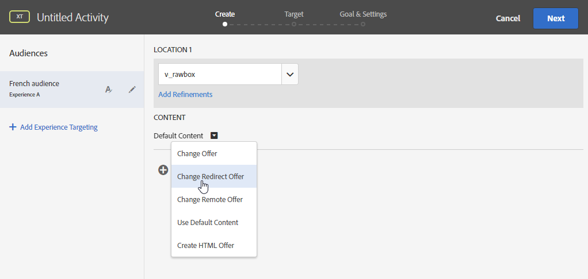

# Infoga dynamiskt innehåll för mål {#inserting-a-dynamic-image}

I den här guiden kommer vi att visa hur man integrerar ett dynamiskt erbjudande från Target i ett e-postmeddelande i Adobe Campaign.

Vi vill skapa en leverans som innehåller ett bildblock som ändras dynamiskt beroende på mottagarens land. Data skickas med varje mbox-begäran och beror på besökarens IP-adress.

I det här e-postmeddelandet vill vi att en av bilderna ska variera dynamiskt enligt följande användarupplevelser:

* E-postmeddelandet öppnas i Frankrike.
* E-postmeddelandet öppnas i USA.
* Om inget av dessa villkor gäller visas en standardbild.

För att detta ska fungera måste vi utföra följande steg både i Adobe Campaign och Target:

1. [Infoga det dynamiska erbjudandet i ett e-postmeddelande](../../integrations/using/inserting-a-dynamic-image.md#inserting-dynamic-offer)
1. [Skapa omdirigeringserbjudanden](../../integrations/using/inserting-a-dynamic-image.md#create-redirect-offers)
1. [Skapa målgrupper](../../integrations/using/inserting-a-dynamic-image.md#audiences-target)
1. [Skapa en upplevelseinriktad aktivitet](../../integrations/using/inserting-a-dynamic-image.md#creating-targeting-activity)
1. [Förhandsgranska och skicka e-postmeddelandet](../../integrations/using/inserting-a-dynamic-image.md#preview-send-email)

## Infoga det dynamiska erbjudandet i ett e-postmeddelande {#inserting-dynamic-offer}

När du har definierat mål och innehåll för ditt e-postmeddelande i Adobe Campaign kan du infoga en dynamisk bild från Target.

Det gör du genom att ange standardbildens URL-adress, platsnamnet och fälten som du vill överföra till Mål.

I Adobe Campaign finns det två sätt att infoga en dynamisk bild från Target i ett e-postmeddelande:

* Om du använder redigeraren för digitalt innehåll väljer du en befintlig bild och väljer **[!UICONTROL Insert]** > **[!UICONTROL Dynamic image served by Adobe Target]** i verktygsfältet.

   

* Om du använder standardredigeraren placerar du markören där du vill infoga bilden och väljer **[!UICONTROL Include]** > **[!UICONTROL Dynamic image served by Adobe Target...]** i listrutan Anpassning.

   

### Definiera bildparametrar {#defining-image-parameters}

* URL **[!UICONTROL Default image]** till programmet: Bilden som visas när inget av villkoren är uppfyllt. Du kan också välja en bild från ditt resursbibliotek.
* The **[!UICONTROL Target location]**: Ange ett namn för platsen för ditt dynamiska erbjudande. Du måste välja den här platsen i din Target-aktivitet.
* The **[!UICONTROL Landing Page]**: Om du vill att standardbilden ska dirigeras om till en standardstartsida. Den här URL:en är endast till för de fall då standardbilden visas i det slutliga e-postmeddelandet och är valfri.
* The **[!UICONTROL Additional decision parameters]**: Ange mappningen mellan fälten som definieras i Adobe Target-segmenten och fälten i Adobe Campaign. De Adobe Campaign-fält som används måste ha angetts i rutan. I vårt exempel har vi lagt till fältet Land.

Om du använder Enterprise-behörigheter i inställningarna för Adobe Target lägger du till motsvarande egenskap i det här fältet. Läs mer om behörigheter för Target Enterprise på [den här sidan](https://marketing.adobe.com/resources/help/en_US/target/target/properties-overview.html).

## Skapa omdirigeringserbjudanden {#create-redirect-offers}

I Target kan ni skapa olika versioner av ert erbjudande. Beroende på användarupplevelsen kan ett omdirigeringserbjudande skapas och du kan ange vilken bild som ska visas.

I vårt fall behöver vi två omdirigeringserbjudanden, det tredje (standarderbjudandet) ska definieras i Adobe Campaign.

1. Om du vill skapa ett nytt omdirigeringserbjudande i Target Standard går du till **[!UICONTROL Content]** fliken och klickar på **[!UICONTROL Code offers]**.

1. Klicka **[!UICONTROL Create]** då **[!UICONTROL Redirect Offer]**.

   

1. Ange ett namn för erbjudandet och URL:en för bilden.

   

1. Följ samma procedur för det återstående omdirigeringserbjudandet. Mer information finns på den här [sidan](https://docs.adobe.com/help/en/target/using/experiences/offers/offer-redirect.html).

## Skapa målgrupper {#audiences-target}

I Target måste ni skapa de två målgrupper som de personer som besöker ert erbjudande kategoriseras efter det innehåll som ska levereras. För varje målgrupp lägger du till en regel som definierar vilka som ska kunna se erbjudandet.

1. Om du vill skapa en ny målgrupp i Target går du till **[!UICONTROL Audiences]** fliken och klickar på **[!UICONTROL Create Audience]**.

   

1. Ge er målgrupp ett namn.

   

1. Klicka **[!UICONTROL Add a rule]** och välj en kategori. Regeln använder särskilda kriterier för att rikta in sig på besökarna. Du kan förfina reglerna genom att lägga till villkor eller genom att skapa nya regler i andra kategorier.

1. Följ samma procedur för de återstående målgrupperna.

## Skapa en upplevelseinriktad aktivitet {#creating-targeting-activity}

I Target måste vi skapa en Experience Targeting-aktivitet, definiera olika upplevelser och koppla dem till motsvarande erbjudanden.

### Definiera målgruppen {#defining-the-audience}

1. Om du vill skapa en Experience Targeting-aktivitet går du till **[!UICONTROL Activities]** fliken och klickar **[!UICONTROL Create Activity]** sedan **[!UICONTROL Experience Targeting]**.

   

1. Välj **[!UICONTROL Form]** som **[!UICONTROL Experience Composer]**.

1. Välj en målgrupp genom att klicka på **[!UICONTROL Change audience]** knappen.

   

1. Välj målgruppen som skapades i föregående steg.

   

1. Skapa en ny upplevelse genom att klicka **[!UICONTROL Add Experience Targeting]**.

### Definiera plats och innehåll {#defining-location-content}

Lägg till innehåll för varje målgrupp:

1. Välj det platsnamn du valde när du infogade det dynamiska erbjudandet i Adobe Campaign.

   

1. Klicka på listruteknappen och välj **[!UICONTROL Change Redirect Offer]**.

   

1. Välj det omdirigeringserbjudande som du tidigare har skapat.

   

1. Följ samma steg för den andra upplevelsen.

### Definiera aktiviteten {#defining-activity}

I **[!UICONTROL Target]** fönstret sammanfattas din aktivitet. Om det behövs kan ni lägga till andra upplevelser.

I **[!UICONTROL Goal & Settings]** fönstret kan du anpassa din aktivitet genom att ange en prioritet, ett mål eller en varaktighet.

I det här **[!UICONTROL Reporting Settings]** avsnittet kan du välja en åtgärd och redigera parametrarna som avgör när målet uppnås.

## Förhandsgranska och skicka e-postmeddelandet i Campaign Classic {#preview-send-email}

I Adobe Campaign kan du nu förhandsgranska ditt e-postmeddelande och testa återgivningen på olika mottagare. Du kommer att märka att bilden ändras beroende på de olika upplevelser som skapas. Mer information om hur du skapar e-postmeddelanden finns på den här [sidan](../../delivery/using/defining-the-email-content.md).

Du kan nu skicka ditt e-postmeddelande med ett dynamiskt erbjudande från Target.

