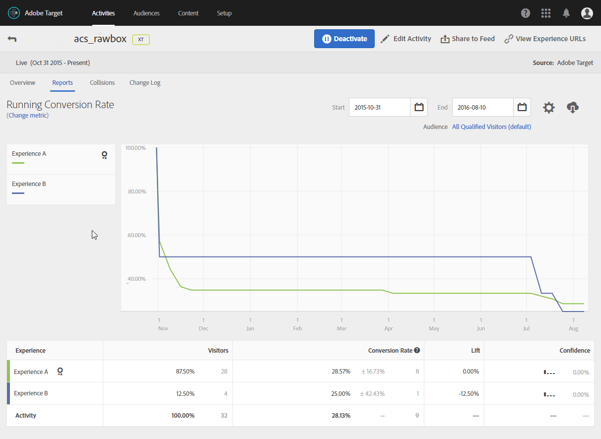

# Infoga en dynamisk bild{#inserting-a-dynamic-image}

I det här avsnittet beskrivs stegen som ska utföras i Adobe Campaign för att integrera en bild från Adobe Target i ett e-postmeddelande.

Du måste utföra följande åtgärder i Adobe Target i förväg:

* Skapa ett eller flera [omdirigeringserbjudanden](https://docs.adobe.com/help/en/target/using/experiences/offers/offer-redirect.html), där du måste ange webbadressen till bilden som du vill använda.
* Skapa en eller flera [målgrupper](https://marketing.adobe.com/resources/help/en_US/target/target/t_create-audience.html)för att definiera målet för din aktivitet.
* Skapa en [formulärbaserad upplevelsedispositionsaktivitet](https://docs.adobe.com/content/help/en/target/using/activities/abtest/create/test-create-ab.html) , där du måste välja en ruta och ange flera upplevelser, beroende på hur många omdirigeringserbjudanden som skapas. För varje upplevelse måste du välja ett av de omdirigeringserbjudanden som skapas.

   För att specificera dessa upplevelser kan ni skapa segment med hjälp av information från Adobe Campaign. Om du vill använda data från Adobe Campaign i erbjudandets urvalsregler måste du ange data i rutan i Adobe Target.

Så här infogar du en Adobe Target-bild i en Adobe Campaign-leverans:

1. Skapa en e-postleverans.
1. I de tillgängliga personaliseringsfälten väljer du **[!UICONTROL Include > Dynamic image served by Adobe Target]**.

   

1. I det fönster som öppnas väljer du den bild som ska visas som standard i e-postmeddelandet. Du kan ange bildens URL eller använda en [delad bild](../../integrations/using/sharing-assets-with-adobe-experience-cloud.md).
1. Ange namnet på radrutan som anges i Adobe Target.
1. Ange en URL i **[!UICONTROL Landing Page]** fältet om du vill att standardbilden ska dirigeras om till en standardstartsida. Den här URL:en är endast till för de fall då standardbilden visas i det slutliga e-postmeddelandet och är valfri.
1. Om du använder Enterprise-behörigheter i inställningarna för Adobe Target lägger du till motsvarande egenskap i det här fältet. Läs mer om behörigheter för Target Enterprise på [den här sidan](https://marketing.adobe.com/resources/help/en_US/target/target/properties-overview.html). Det här fältet är valfritt och inte obligatoriskt om du inte använder företagsbehörigheter i Target.
1. I **[!UICONTROL Additional decision parameters]** anger du mappningen mellan fälten som definieras i Adobe Target-segmenten och fälten i Adobe Campaign. De Adobe Campaign-fält som används måste ha angetts i rutan.

   

   Definitionen av en parameter i Adobe Target görs via den radruta som skapas när Target-bilden integreras i Adobe Campaign och alternativet **Förfiningar** .

   

   Exemplet som visas här visar hur man definierar olika upplevelser för män och kvinnor.

Du kan också definiera flera ärenden baserat på användarens e-postdomän och adress. Informationen återställs automatiskt från användarens webbläsare när e-postmeddelandet öppnas.

När du förhandsgranskar ditt e-postmeddelande kan du se, när du väljer olika profiler, att bilden har infogats ändras beroende på de parametrar som har angetts i Adobe Target-aktiviteten och i Adobe Campaign.

Du kan mäta resultatet av dina utskick i Adobe Target.

